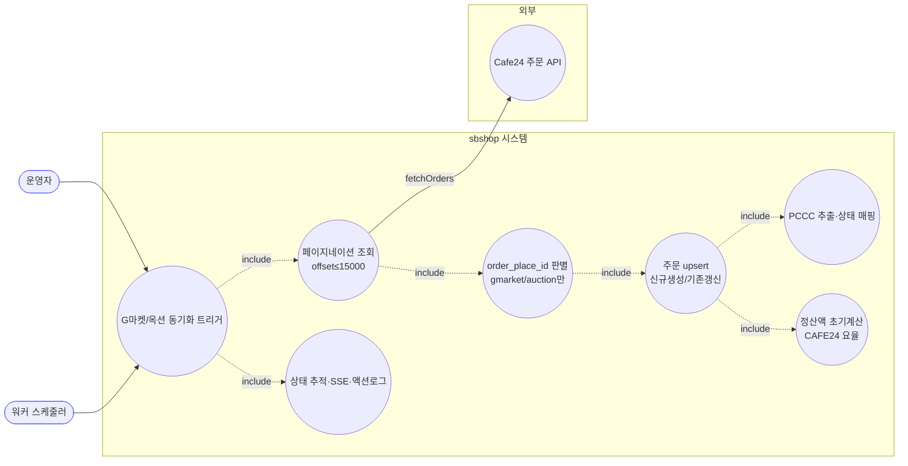
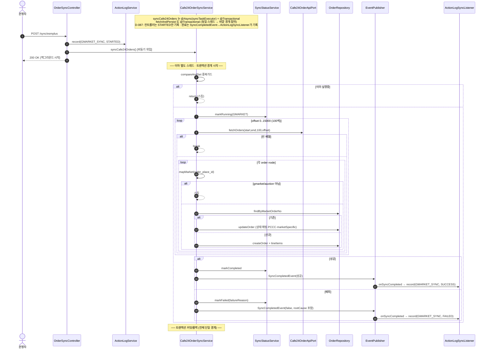
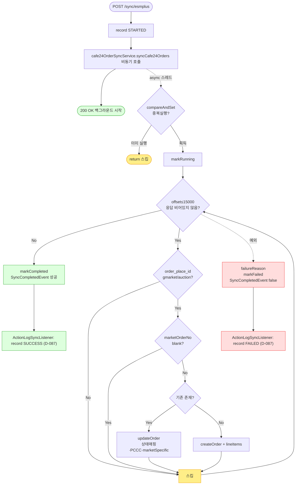

# POST /api/v1/orders/sync/esmplus — G마켓/옥션(Cafe24 주문 API) 동기화 시작

## 1. 개요

이 API는 "G마켓·옥션에 들어온 주문을 우리 시스템으로 가져오는 작업을 시작해줘"라고 요청하는 버튼입니다. 예전엔 화면 자동조작(Selenium) 방식으로 ESM+에서 긁어왔지만, 지금은 **Cafe24 주문 API**로 G마켓·옥션 주문을 조회합니다. 응답에 딸려오는 `order_place_id`(gmarket/auction) 값을 보고 어느 마켓 주문인지 구분해 저장합니다.

| 항목 | 쉬운 설명 |
|------|------|
| **부르는 방법 / 주소** | `POST /api/v1/orders/sync/esmplus` — 함께 보낼 내용(바디)은 없습니다. |
| **무엇을 하나** | ESM+(화면조작) 대신 Cafe24 주문 API로 G마켓·옥션 주문을 가져와 저장합니다(upsert). `order_place_id`(gmarket/auction)로 어느 마켓인지 구분합니다. |
| **주문 상태가 어떻게 바뀌나** | Cafe24가 주는 주문상태 코드(`order_status`: N/C/R/E)를 우리 배송상태(`ShippingStatus`)로 번역해 각 주문 상품에 반영합니다. |
| **덤으로 벌어지는 일(부수효과)** | Cafe24 API를 여러 페이지로 나눠 호출하고(한 번에 다 못 받으니 offset을 늘려가며, 최대 15000건), DB에 저장하고, 통관번호(PCCC)를 뽑아내고, 마켓 고유정보(`marketSpecificData`, cafe24 주문 id 포함)를 채우고, 정산액을 CAFE24 요율로 초기계산하고, 실시간 알림(SSE)·진행상태 표·운영 기록을 남깁니다. **단, 취소감지는 없습니다.** |
| **어떻게 돌아가나(실행 방식)** | `syncCafe24Orders`가 "별도 스레드(`@Async`)" + "하나의 저장 묶음(`@Transactional`)"이고, 그 안의 `fetchAndPersist`도 같은 저장 묶음에 속합니다. 입구 코드는 "시작했다(STARTED)"만 기록합니다. 진짜 성공/실패는 백그라운드가 끝날 때 이벤트(`SyncCompletedEvent`, GMARKET)를 통해 `ActionLogSyncListener`가 기록합니다(예전의 무조건 성공 기록은 D-087에서 제거). |
| **돌려주는 답** | `200 OK` 와 `{success:true, message:"...백그라운드에서 시작..."}`. 시작조차 못 하면 `500`. |

## 2. 호출 체인

아래는 이 버튼을 눌렀을 때 코드가 어떤 순서로 서로를 불러가며 일하는지를 위에서 아래로 늘어놓은 것입니다. 각 줄 끝의 `파일.java:줄번호`는 실제 코드 위치입니다.

```
OrderSyncController.syncEsmplusOrders()                       api/.../controller/OrderSyncController.java:140-163
  ├─ ActionLogService.record(GMARKET_SYNC, STARTED)           OrderSyncController.java:143 → core/.../actionlog/ActionLogService.java:29
  ├─ Cafe24OrderSyncService.syncCafe24Orders()  @Async @Transactional   OrderSyncController.java:147 → core/.../order/service/Cafe24OrderSyncService.java:59-85
  │    ├─ isSyncing.compareAndSet(false,true) 중복 가드        Cafe24OrderSyncService.java:62-65
  │    ├─ syncStatusService.markRunning(GMARKET)              :67 → sync/SyncStatusService.java:28
  │    ├─ fetchAndPersist(now-30, now)  @Transactional         :70 / :101-123
  │    │    └─ while offset≤15000:                            :107-121
  │    │         ├─ cafe24OrderApiPort.fetchOrders(start,end,100,offset)  :108 (외부 Cafe24 API)
  │    │         └─ for each order node → persistOrder(o)     :112-116 / :126-142
  │    │              ├─ mapMarket(order_place_id) → null이면 스킵  :127-130 / :297-306
  │    │              ├─ resolveMarketOrderNo → blank면 스킵    :131-134 / :365-368
  │    │              ├─ findByMarketOrderNo 존재 → updateOrder  :135-137 / :171-215
  │    │              │     ├─ progressed 시 주소보호(:177-187)
  │    │              │     ├─ extractPccc → non-blank만 반영(:189-192)
  │    │              │     ├─ refreshMarketSpecific (cafe24_order_id 보정 :194)
  │    │              │     └─ items 개수 일치→개별 매핑 / 불일치→첫상태 전체적용  :199-214
  │    │              └─ 없음 → createOrder                    :138-139 / :144-169
  │    │                    ├─ extractPccc / mapStatus         :147 / :231
  │    │                    ├─ buildLineItem (marketFeeService.settlementAmount, CAFE24)  :217-238 → fee/MarketFeeService.java:43
  │    │                    └─ resolveProductId (CAFE24 marketRegistration)  :241-255
  │    ├─ (성공) markCompleted + SyncCompletedEvent           :73 / :81-83
  │    └─ (실패) catch → failureReason + markFailed + SyncCompletedEvent(false)  :74-78 / :91-98
  │         └─ (완료 기록) ActionLogSyncListener.onSyncCompleted → record(GMARKET_SYNC, SUCCESS/FAILED)  core/.../actionlog/ActionLogSyncListener.java:22-34
  └─ (D-087) 컨트롤러는 STARTED만 기록 — 트리거 직후 SUCCESS 기록은 제거됨(:143 주석). 완료는 SyncCompletedEvent→ActionLogSyncListener가 기록.
       (동기 디스패치 실패 시에만 catch → record(FAILED))     OrderSyncController.java:147-155
```

→ 쉽게 말하면 이런 흐름입니다: ① 입구 코드가 "시작했다"고 먼저 기록한다 → ② 실제 동기화를 백그라운드로 떠넘긴다 → ③ 백그라운드는 "이미 도는 중인가?"를 확인한 뒤 → ④ Cafe24 API를 100건씩 페이지를 넘겨가며(최대 15000건) 계속 받아온다 → ⑤ 받아온 주문마다 "G마켓·옥션 주문이 맞나(`order_place_id`)"를 보고 아니면 건너뛰고, 주문번호가 비어있어도 건너뛴다 → ⑥ "있으면 갱신, 없으면 새로 생성" → ⑦ 끝나면 성공/실패를 기록한다.

**요청 바디:** 없음. 조회할 기간은 코드가 "오늘로부터 30일 전 ~ 오늘"로 고정하고(`Cafe24OrderSyncService.java:70`), Cafe24 API에는 날짜(yyyy-MM-dd) 단위로 넘깁니다(:46).

## 3. 유스케이스 다이어그램

👉 이 그림은 "누가 이 동기화를 시작시키고, 페이지를 넘겨가며 받아온 주문 중 G마켓·옥션 것만 골라 저장하기까지 어떤 일들이 벌어지며, 어디서 Cafe24 API를 부르는지"를 한눈에 보여줍니다.



## 4. 시퀀스 다이어그램

👉 이 그림은 "시간 순서대로" 누가 누구에게 무엇을 요청하는지를 보여줍니다. 입구 코드는 곧바로 200을 돌려주고, 백그라운드는 페이지를 넘겨가며 받아온 각 주문에서 "G마켓·옥션인지" 걸러 저장하고, 마지막에 성공/실패(실패 시 근본 원인 포함)를 기록한다는 점을 담고 있습니다.



## 5. 순서도 (플로우차트)

👉 이 그림은 "어떤 갈림길에서 어떻게 갈라지는지"를 보여줍니다. 페이지가 빌 때까지 계속 받아오면서, 각 주문마다 "G마켓·옥션인지 → 주문번호가 있는지 → 이미 있는 주문인지"를 순서대로 확인해 갱신하거나 새로 만드는 길입니다.



## 6. 상태 전이표

이 표는 "주문 상품이 어떤 상태로 들어왔을 때, 어떤 조건이면, 어떤 상태로 바뀌는지"를 정리한 것입니다. 특히 "우리 쪽 상품 줄 개수와 마켓이 준 개수가 안 맞으면 첫 상품 상태를 전체에 덮어씌운다"는 점, 그리고 취소감지가 없다는 점을 눈여겨보세요.

| 들어올 때 상태 | 조건 | 바뀐 뒤 상태 | 마켓에 뭔가 보내나 | 쉬운 설명 |
|-----------|------|-----------|-----------|------|
| (아예 새 주문) | order_place_id=gmarket/auction | 번역된 상태로 새로 만듦 | 조회만(안 보냄) | Cafe24 상태코드(N/C/R/E)를 우리 상태로 번역합니다(`mapStatus`, :231). |
| 기존 · 상품 개수 일치 | 마켓 응답에 있음 | 상품별로 각각 번역된 상태로 갱신 | 조회만 | 개수가 맞으면 상품 하나하나 정확히 짝지어 갱신합니다(:199-206). |
| 기존 · 상품 개수 불일치 | 마켓 응답에 있음 | **첫 상품 상태를 모든 줄에 똑같이 적용** | 조회만 | 정확히 짝지을 수 없어 어쩔 수 없이 쓰는 대비책(:207-214) — 실제 각 줄 상태가 왜곡될 수 있음. |
| order_place_id가 gmarket/옥션이 아님 | — | 처리 안 함(건너뜀) | — | G마켓·옥션이 아니면 넘어갑니다(`mapMarket`이 null, :127-130) — 직접몰·타마켓 중복 방지. |
| 번역할 수 없는 상태코드 | — | `NEW`로 대체 | — | 알 수 없는 코드는 경고를 남기고 신규(NEW)로 둡니다(:328-331). |
| 기존 · 마켓 응답에서 사라짐 | — | **그대로 둠(안 바뀜)** | — | 취소감지 경로가 없습니다. |

## 7. 🔎 발견사항

### SYNCA-13 · 🟠 GAP — 입구 코드의 성공/실패 기록이 백그라운드 예외를 못 잡아, 실제 실패해도 늘 "성공"으로 남던 문제
> ✅ **해결됨** (D-087, 커밋 c4c7faa) — 컨트롤러의 트리거 직후 `record(SUCCESS)`(구 :149)를 제거해 컨트롤러는 STARTED만 남기고, 완료(SUCCESS/FAILED)는 기존 `SyncCompletedEvent`(GMARKET)→`ActionLogSyncListener`가 기록하도록 위임했다.
- **근거:** `Cafe24OrderSyncService.syncCafe24Orders`는 별도 스레드에서 돌고 아무것도 돌려주지 않는(`@Async("syncTaskExecutor")` + `void`) 함수입니다(`Cafe24OrderSyncService.java:59-61`). 입구 코드(`OrderSyncController.java:141-155`)의 감싸기(try/catch)는 "떠넘기는 호출"만 감싸므로, 실제 동기화 도중 터진 오류는 다른 스레드에서 발생해 이 감싸기에 닿지 못합니다. 예전에는 그래서 언제나 성공(구 :149)이 기록됐습니다.
- **영향:** 실제 실패가 운영 기록에 실패로 남지 않았습니다. 실패를 적는 `record(FAILED)`(:150)는 시작 자체가 즉시 실패할 때만 실행되는 사실상 죽은 코드였습니다. 진짜 결과는 진행상태 표(`/status`)나 이벤트(`SyncCompletedEvent`)로만 알 수 있었습니다(이 서비스는 그나마 `failureReason`으로 근본 원인을 이벤트에 담습니다 :91-98 — 이제 이 값이 `ActionLogSyncListener`의 실패 메시지에도 남습니다).
- **제안:** 기록을 백그라운드 작업의 끝나는 지점(markCompleted/markFailed, `Cafe24OrderSyncService.java:73`·`:77`)으로 옮기거나, 입구 코드 메시지를 "접수됨"으로 바로잡습니다. (4개 동기화 버튼 공통 결함 — 한꺼번에 처리 권장.) (반영됨 — 4개 동기화 입구의 가짜 성공을 한꺼번에 없애고, 완료는 `ActionLogSyncListener`가 기록.)

### SYNCA-14 · 🟠 GAP — 한 주문 안의 상품 개수가 안 맞으면 첫 상품 상태를 모든 줄에 덮어씌워 각 줄 상태가 실제와 달라짐
- **근거:** `Cafe24OrderSyncService.updateOrder`(:207-214)는 마켓이 준 상품 목록(`items`) 개수와 우리 DB의 상품 줄 개수가 다르면, 목록의 첫 상품(`firstOf(itemsArr)`) 상태를 모든 줄에 똑같이 적용합니다. 우리 상품 줄에 정확히 짝지을 식별키(`order_item_code`)를 저장해두지 않아 정확 매핑이 불가능하다는 주석(:208)이 근거입니다.
- **영향:** 한 주문에 상태가 서로 다른 여러 상품(예: 하나는 배송중, 하나는 취소)이 있고 개수가 어긋나면, 모든 줄이 첫 상품 상태로 덮여 실제와 달라집니다. 이후 발송·정산·취소 판단이 틀어질 수 있습니다.
- **제안:** 상품별 식별키(`order_item_code`나 상품코드)를 저장·활용해 개수가 달라도 정확히 짝짓습니다. 그게 어려우면 최소한 개수 불일치 시 경고 로그를 남기고 상태 덮어쓰기를 보수적으로 제한합니다.

### SYNCA-15 · 🟠 GAP — G마켓/옥션에 "취소감지"가 없어, 취소된 주문이 옛 상태로 계속 남음
- **근거:** `Cafe24OrderSyncService`에는 11번가의 `detectCancellations`(`ElevenstOrderSyncService.java:222-267`)나 쿠팡 어댑터의 취소감지 같은 경로가 없습니다. `syncCafe24Orders`는 저장만 하고 끝냅니다(:70-73). Cafe24 상태코드에 C(취소)/R(반품)/E(교환) 번역은 있지만(:314-322), 이는 **API가 그 상태를 응답에 실어줄 때만** 반영되고, 응답에서 아예 빠진 주문은 감지하지 못합니다.
- **영향:** G마켓·옥션에서 취소되어 Cafe24 API 응답에서 사라진 주문이 우리 DB에 예전 상태(신규/준비중)로 영원히 남습니다. 쿠팡·11번가는 이 위험을 명시적으로 막았는데 이 경로만 "응답 코드에 취소가 실려오길" 기대하고 있습니다.
- **제안:** Cafe24가 취소·삭제 주문을 응답에 계속 포함하는지 실제로 확인합니다. 포함하지 않으면 "응답에서 사라진 안 끝난 주문을 취소로 처리"하는 11번가 방식을 옮겨 적용하는 걸 검토합니다.

### SYNCA-16 · 🟡 SMELL — 여러 페이지 전부(최대 15000건) 받아오기와 외부 API 왕복이 하나의 저장 묶음에 통째로 묶여 있음
- **근거:** `syncCafe24Orders`(:60)와 `fetchAndPersist`(:101)가 둘 다 `@Transactional`이고 같은 스레드에서 하나의 저장 묶음을 이룹니다. 이 안에서 `while offset≤15000`(:107) 반복이 페이지마다 Cafe24 API 호출(:108)과 저장(:112-116)을 되풀이합니다.
- **영향:** 최대 150페이지의 외부 API 왕복 시간 내내 저장 묶음·DB 연결이 열려 있고, 뒤쪽 페이지에서 오류가 나면 앞서 저장한 모든 페이지가 함께 취소(롤백)됩니다(중간 성공을 확정 못함). 다른 동기화보다 반복이 길어 위험이 더 큽니다.
- **제안:** 페이지(또는 주문) 단위로 저장 묶음을 쪼개 성공분을 확정하고, 외부 호출은 저장 묶음 밖으로 빼냅니다.

### SYNCA-17 · 🔵 NOTE — 중복 실행 방지 장치가 한 프로그램 안에서만 유효해, 워커 스케줄러와 동시 실행을 못 막음
- **근거:** 중복 방지가 메모리 상의 스위치(`isSyncing` `AtomicBoolean`, `Cafe24OrderSyncService.java:57,62`)에 의존합니다. 워커 스케줄러(`OrderSyncScheduler.java:57-61`)와 API 버튼은 서로 다른 프로그램(JVM)입니다.
- **영향:** 스케줄러 실행과 수동 버튼이 겹치면 같은 동기화가 두 프로그램에서 2번 돌 수 있습니다(SYNCA-16의 긴 반복과 겹치면 부하·중복 저장 위험이 더 커짐).
- **제안:** 정산 경로(`syncCoupangSettlement`의 DB 찜하기)처럼 두 프로그램을 아우르는 중복 방지로 통일하는 걸 검토합니다.

## 8. 테스트 커버리지 메모

- **서비스:** `Cafe24OrderSyncServiceTest`가 꽤 두껍게 검증합니다 — G마켓 저장·타마켓 건너뜀(`mapsGmarketAndSkipsOthers`), 통관번호(PCCC) 대체 추출, 통관번호가 없으면 null 유지, 실패 시 근본 원인을 이벤트에 담는지(D-075 `surfacesRootCauseInFailureEvent`), 갱신 시 통관번호는 비어있지 않을 때만 반영, 상태 번역(N10→준비중, N20→준비중, N30→발송됨, N40→배송완료, N00→신규).
- **입구 코드(컨트롤러):** `OrderSyncControllerActionLogTest`가 D-087에서 새 약속(시작 시 STARTED만·성공은 입구가 남기지 않음·시작 자체가 즉시 실패할 때만 FAILED)에 맞게 다시 작성됐습니다. 완료 GMARKET_SYNC 성공/실패는 `ActionLogSyncListener`가 `SyncCompletedEvent(GMARKET)`로 기록하므로 입구 코드 단위 테스트 범위 밖입니다(SYNCA-13 해결로 입구의 가짜 성공 자체가 사라짐).
- **아직 테스트가 없는 부분:** ① 상품 개수 불일치 시 대비책(SYNCA-14) — 서로 다른 상태의 줄이 왜곡되는 걸 검증 없음, ② 취소감지 부재(SYNCA-15), ③ 여러 페이지가 하나의 저장 묶음이라 부분 실패 시 전부 롤백(SYNCA-16), ④ 진행된 주문의 주소 보호(:177) 검증, ⑤ 번역 불가 상태코드를 신규(NEW)로 대체(:328).

---
*(쉬운 설명판 · 2026-07-17 재작성)*
*생성: 2026-07-17 · 근거: 현재 워킹트리*
