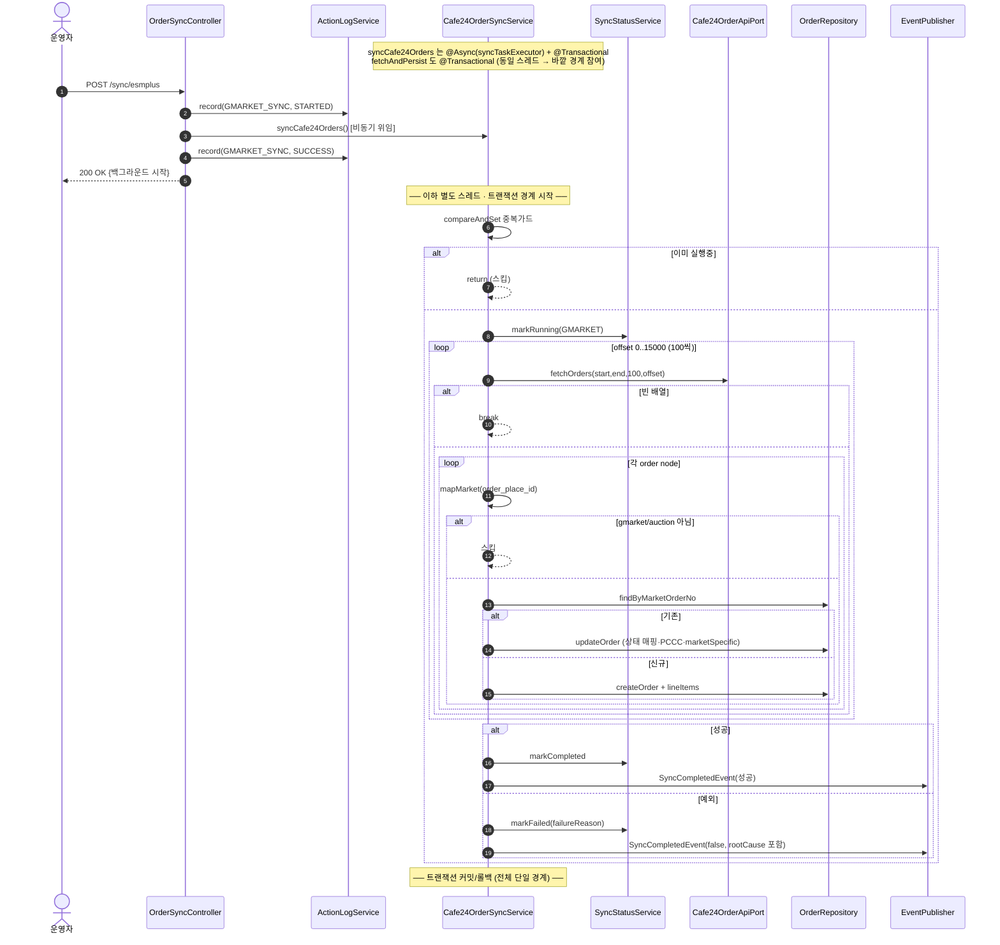
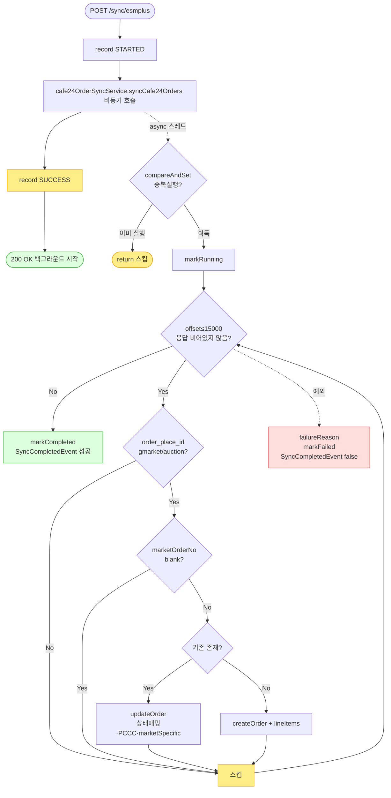

# POST /api/v1/orders/sync/esmplus — G마켓/옥션(Cafe24 주문 API) 동기화 트리거

## 1. 개요

| 항목 | 내용 |
|------|------|
| **Method / URL** | `POST /api/v1/orders/sync/esmplus` (바디 없음) |
| **목적** | ESM+(Selenium) 대신 **Cafe24 주문 API**로 G마켓/옥션 주문을 조회해 upsert한다. `order_place_id`(gmarket/auction)로 마켓을 구분 저장. |
| **핵심 상태전이** | Cafe24 `order_status`(N/C/R/E 코드)를 도메인 `ShippingStatus`로 매핑해 라인아이템에 반영. |
| **부수효과** | Cafe24 API 페이지네이션 호출(offset≤15000), DB upsert, PCCC 추출, `marketSpecificData`(cafe24_order_id 포함) 세팅, 정산액 초기계산(CAFE24 요율), SSE(`SyncCompletedEvent`), 동기화 상태 갱신, 액션로그. **취소감지 없음.** |
| **실행 모델** | `syncCafe24Orders`가 `@Async("syncTaskExecutor")` + `@Transactional`, 내부 `fetchAndPersist`도 `@Transactional` → 컨트롤러는 트리거만. |
| **응답** | `200 OK` `{success:true, message:"...백그라운드에서 시작..."}`. 트리거 실패 시 `500`. |

## 2. 호출 체인

```
OrderSyncController.syncEsmplusOrders()                       api/.../controller/OrderSyncController.java:140-163
  ├─ ActionLogService.record(GMARKET_SYNC, STARTED)           OrderSyncController.java:143 → core/.../actionlog/ActionLogService.java:29
  ├─ Cafe24OrderSyncService.syncCafe24Orders()  @Async @Transactional   OrderSyncController.java:147 → core/.../order/service/Cafe24OrderSyncService.java:59-85
  │    ├─ isSyncing.compareAndSet(false,true) 중복 가드        Cafe24OrderSyncService.java:62-65
  │    ├─ syncStatusService.markRunning(GMARKET)              :67 → sync/SyncStatusService.java:28
  │    ├─ fetchAndPersist(now-30, now)  @Transactional         :70 / :101-123
  │    │    └─ while offset≤15000:                            :107-121
  │    │         ├─ cafe24OrderApiPort.fetchOrders(start,end,100,offset)  :108 (외부 Cafe24 API)
  │    │         └─ for each order node → persistOrder(o)     :112-116 / :126-142
  │    │              ├─ mapMarket(order_place_id) → null이면 스킵  :127-130 / :297-306
  │    │              ├─ resolveMarketOrderNo → blank면 스킵    :131-134 / :365-368
  │    │              ├─ findByMarketOrderNo 존재 → updateOrder  :135-137 / :171-215
  │    │              │     ├─ progressed 시 주소보호(:177-187)
  │    │              │     ├─ extractPccc → non-blank만 반영(:189-192)
  │    │              │     ├─ refreshMarketSpecific (cafe24_order_id 보정 :194)
  │    │              │     └─ items 개수 일치→개별 매핑 / 불일치→첫상태 전체적용  :199-214
  │    │              └─ 없음 → createOrder                    :138-139 / :144-169
  │    │                    ├─ extractPccc / mapStatus         :147 / :231
  │    │                    ├─ buildLineItem (marketFeeService.settlementAmount, CAFE24)  :217-238 → fee/MarketFeeService.java:43
  │    │                    └─ resolveProductId (CAFE24 marketRegistration)  :241-255
  │    ├─ (성공) markCompleted + SyncCompletedEvent           :73 / :81-83
  │    └─ (실패) catch → failureReason + markFailed + SyncCompletedEvent(false)  :74-78 / :91-98
  └─ ActionLogService.record(GMARKET_SYNC, SUCCESS)           OrderSyncController.java:149
       (예외 시 catch → record(FAILED))                       OrderSyncController.java:154-161
```

**요청 바디:** 없음. 조회 범위는 서비스가 `now-30 ~ now` 고정(`Cafe24OrderSyncService.java:70`), Cafe24 API는 날짜(yyyy-MM-dd) 단위(:46).

## 3. 유스케이스 다이어그램


## 4. 시퀀스 다이어그램



## 5. 순서도 (플로우차트)



## 6. 상태 전이표

| 진입 라인상태 | 조건 | 결과 상태 | 마켓 전송 | 비고 |
|-----------|------|-----------|-----------|------|
| (신규 주문) | order_place_id=gmarket/auction | 매핑상태로 생성 | 조회만 | `mapStatus(order_status)`(:231) — N/C/R/E 코드 매핑 |
| 기존 · items 개수 일치 | 마켓 응답 존재 | 아이템별 매핑상태로 갱신 | 조회만 | `updateOrder` 개별 매핑(:199-206) |
| 기존 · items 개수 불일치 | 마켓 응답 존재 | **첫 아이템 상태를 전체 적용** | 조회만 | 방어적 폴백(:207-214) — 라인별 실제 상태 왜곡 가능 |
| order_place_id ≠ gmarket/auction | — | 미처리(스킵) | — | `mapMarket` null(:127-130) — 직접몰·타마켓 중복 방지 |
| 미매핑 order_status 코드 | — | `NEW`로 폴백 | — | 경고 로그 후 NEW(:328-331) |
| 기존 · API 응답에 부재 | — | **미변경** | — | 취소감지 경로 없음 |

## 7. 🔎 발견사항

### SYNCA-13 · 🟠 GAP — 컨트롤러 try/catch·FAILED 기록이 async 예외를 포착하지 못함(항상 SUCCESS 기록)
- **근거:** `Cafe24OrderSyncService.syncCafe24Orders`는 `@Async("syncTaskExecutor")` + `void`(`Cafe24OrderSyncService.java:59-61`). 컨트롤러(`OrderSyncController.java:146-161`)의 try/catch는 비동기 위임 호출만 감싸므로 동기화 본문 예외는 별도 스레드에서 발생, catch 미도달. 항상 `record(GMARKET_SYNC, SUCCESS)`(:149)가 기록된다.
- **영향:** 실제 실패가 액션로그에 FAILED로 남지 않음. `record(FAILED)`(:157)는 트리거 즉시 실패 시에만 도달하는 사실상 데드코드. 실제 결과는 `/status`·`SyncCompletedEvent`에만 반영(서비스는 그나마 `failureReason`으로 root cause를 이벤트에 담음 :91-98).
- **제안:** 액션로그 기록을 서비스 본문(markCompleted/markFailed, `Cafe24OrderSyncService.java:73`·`:77`)으로 이동하거나 컨트롤러 메시지를 "트리거 접수"로 정정. (4개 sync 엔드포인트 공통 결함 — 일괄 처리 권장.)

### SYNCA-14 · 🟠 GAP — items 개수 불일치 시 첫 아이템 상태를 전체 라인에 적용해 라인별 상태 왜곡
- **근거:** `Cafe24OrderSyncService.updateOrder`(:207-214)는 API `items` 배열과 로컬 lineItems 개수가 다르면 `firstOf(itemsArr)`의 상태를 모든 라인에 동일 적용한다. sbshop 라인아이템이 `order_item_code`를 보존하지 않아 정확 매핑이 불가하다는 주석(:208)이 근거.
- **영향:** 한 주문에 상태가 서로 다른 여러 아이템(예: 1건 배송중·1건 취소)이 있고 개수가 어긋나면, 모든 라인이 첫 아이템 상태로 덮어써져 배송/취소 상태가 실제와 달라진다. 발송·정산·취소 후속 판단이 왜곡될 수 있다.
- **제안:** `order_item_code`(또는 상품코드) 기반 라인 매핑 키를 저장·활용해 개수 불일치 시에도 정확 매핑. 불가 시 최소한 불일치 케이스를 경고 로깅하고 상태 덮어쓰기를 보수적으로 제한.

### SYNCA-15 · 🟠 GAP — G마켓/옥션에 취소감지 경로 없음(API 부재 주문이 이전 상태로 잔류)
- **근거:** `Cafe24OrderSyncService`에는 11번가 `detectCancellations`(`ElevenstOrderSyncService.java:222-267`)나 쿠팡 어댑터 취소감지 같은 경로가 없다. `syncCafe24Orders`는 upsert만 하고 종료(:70-73). Cafe24 `order_status` 코드에 C(취소)/R(반품)/E(교환) 매핑은 있으나(:314-322), 이는 **API가 그 상태를 응답할 때만** 반영되며 응답에서 아예 빠진 주문은 감지 못한다.
- **영향:** G마켓/옥션에서 취소되어 Cafe24 API 응답에서 사라진 주문이 DB에 이전 상태(NEW/PREPARING)로 영구 잔류. 다른 마켓(쿠팡·11번가)은 이 위험을 명시 처리했으나 이 경로는 응답 코드에 취소가 실려 오는지에 의존.
- **제안:** Cafe24가 취소/삭제 주문을 응답에 계속 포함하는지 라이브 확인. 미포함이면 non-terminal 부재 → CANCELED 감지 경로 추가 검토(11번가 정본 패턴 이식).

### SYNCA-16 · 🟡 SMELL — 전체 페이지네이션(최대 15000건 조회) + 외부 API 왕복이 단일 `@Transactional` 경계
- **근거:** `syncCafe24Orders`(:60)와 `fetchAndPersist`(:101)가 모두 `@Transactional`이고 동일 스레드/전파로 하나의 경계를 형성. 이 안에서 `while offset≤15000`(:107) 루프가 페이지당 Cafe24 API 호출(:108)과 저장(:112-116)을 반복.
- **영향:** 최대 150페이지의 외부 API 왕복 시간 내내 트랜잭션·DB 커넥션이 열려 있고, 후반 페이지 예외 시 앞서 저장한 전 페이지 upsert가 전부 롤백된다(부분 성공 확정 불가). 다른 sync 서비스보다 루프가 길어 위험이 크다.
- **제안:** 페이지(또는 주문) 단위 트랜잭션 분리로 성공분 확정, 외부 호출을 트랜잭션 밖으로 분리.

### SYNCA-17 · 🔵 NOTE — in-JVM `AtomicBoolean` 중복가드는 워커 스케줄러와 교차 JVM 동시실행을 막지 못함
- **근거:** 중복가드가 `isSyncing` `AtomicBoolean`(`Cafe24OrderSyncService.java:57,62`). 워커 스케줄러(`OrderSyncScheduler.java:57-61`)와 API 트리거는 별도 JVM.
- **영향:** 스케줄러 실행과 수동 트리거가 겹치면 동일 동기화가 교차 JVM으로 2회 실행될 수 있다(SYNCA-16의 긴 루프와 겹치면 부하·중복 upsert 위험 확대).
- **제안:** 정산 경로(`syncCoupangSettlement`의 DB 클레임)와 동일하게 교차 JVM 가드로 통일 검토.

## 8. 테스트 커버리지 메모

- **서비스:** `Cafe24OrderSyncServiceTest`가 상당히 두껍게 검증 — gmarket 저장/타마켓 스킵(`mapsGmarketAndSkipsOthers`), PCCC receiver 폴백 추출, PCCC 부재 시 null 유지, 실패 이벤트 root cause 노출(D-075 `surfacesRootCauseInFailureEvent`), update 시 PCCC non-blank만 반영, 상태 매핑(N10→PREPARING, N20→PREPARING, N30→SHIPPED, N40→DELIVERED, N00→NEW).
- **컨트롤러:** `OrderSyncControllerActionLogTest`에는 esmplus/GMARKET 케이스가 별도로 확인되지 않음(coupang/smartstore/elevenstreet만 명시적 케이스). GMARKET_SYNC 기록 계약은 미검증 가능성.
- **비어있는 케이스:** ① items 개수 불일치 폴백(SYNCA-14) — 서로 다른 상태 라인 왜곡 검증 없음, ② 취소감지 부재(SYNCA-15), ③ 페이지네이션 단일 트랜잭션 부분실패 롤백(SYNCA-16), ④ progressed 주소 보호(:177) 검증, ⑤ 미매핑 order_status → NEW 폴백(:328).

---
*생성: 2026-07-17 · 근거: 현재 워킹트리*
