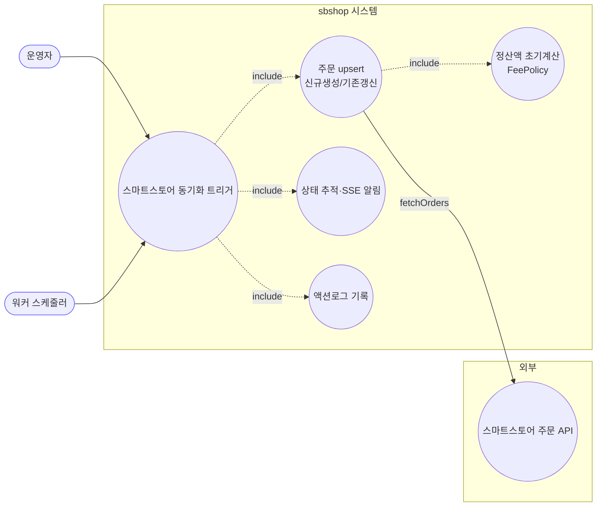
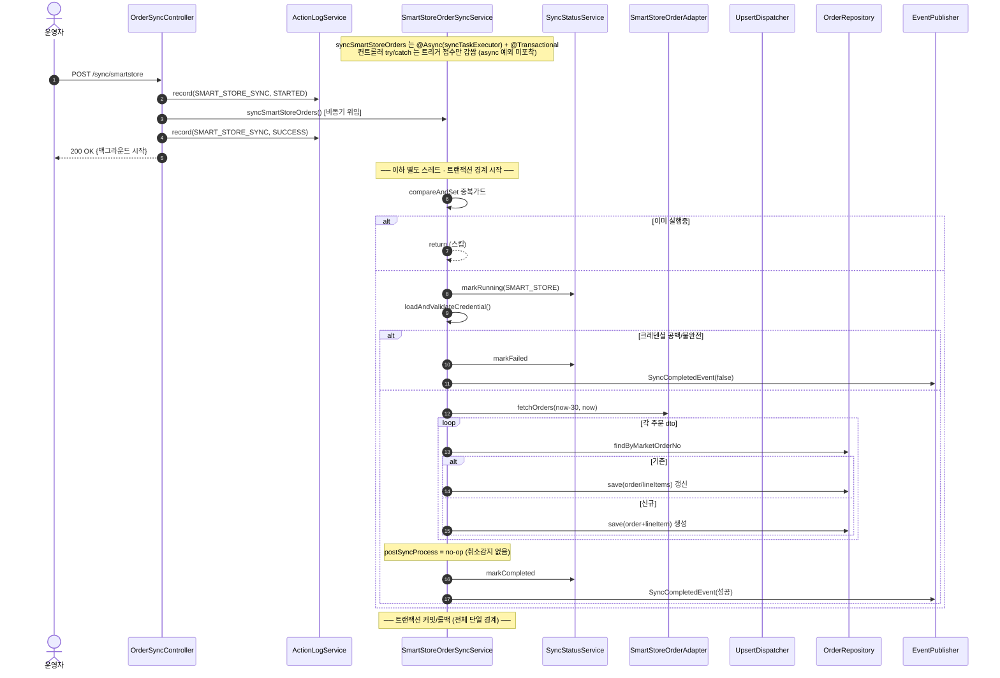
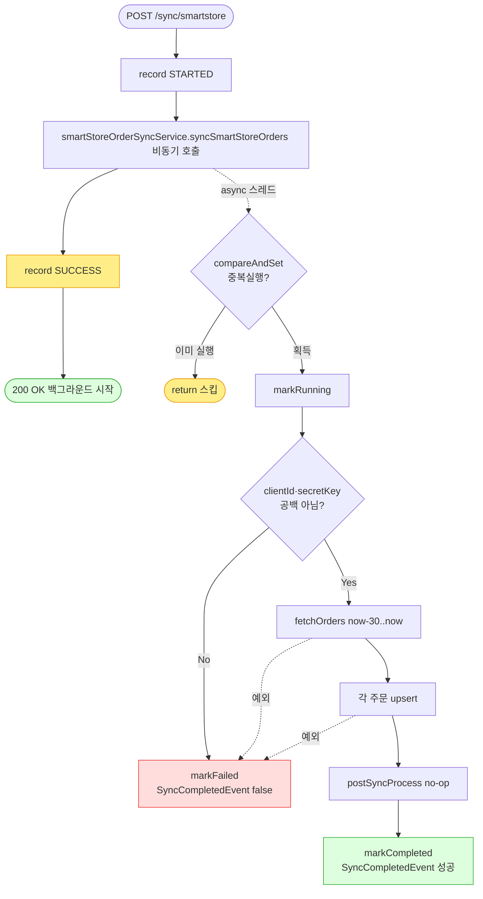

# POST /api/v1/orders/sync/smartstore — 스마트스토어 주문 동기화 트리거

## 1. 개요

| 항목 | 내용 |
|------|------|
| **Method / URL** | `POST /api/v1/orders/sync/smartstore` (바디 없음) |
| **목적** | 스마트스토어 주문을 최근 30일 범위로 조회해 upsert(신규 생성/기존 갱신)한다. |
| **핵심 상태전이** | 주문 라인아이템 `shippingStatus`를 마켓 응답값으로 갱신(신규는 마켓상태로 생성). |
| **부수효과** | 외부 스마트스토어 API 호출, DB upsert, 정산액 초기계산(FeePolicy), SSE(`SyncCompletedEvent`), 동기화 상태 테이블 갱신, 액션로그 기록. **취소감지 없음(`postSyncProcess`가 no-op).** |
| **실행 모델** | 서비스 진입점 `@Async("syncTaskExecutor")` + `@Transactional` → 컨트롤러는 트리거만 하고 즉시 200 반환. |
| **응답** | `200 OK` `{success:true, message:"...백그라운드에서 시작..."}`. 트리거 실패 시 `500`. |

## 2. 호출 체인

```
OrderSyncController.syncSmartStoreOrders()                    api/.../controller/OrderSyncController.java:83-111
  ├─ ActionLogService.record(SMART_STORE_SYNC, STARTED)       OrderSyncController.java:87 → core/.../actionlog/ActionLogService.java:29
  ├─ SmartStoreOrderSyncService.syncSmartStoreOrders()  @Async @Transactional   OrderSyncController.java:92 → core/.../order/service/SmartStoreOrderSyncService.java:47-81
  │    ├─ isSyncing.compareAndSet(false,true) 중복 가드        SmartStoreOrderSyncService.java:50-53
  │    ├─ syncStatusService.markRunning(SMART_STORE)          :56 → sync/SyncStatusService.java:28
  │    ├─ loadAndValidateCredential()                         :59 / :83-93 (clientId/secretKey 공백 → IllegalArgumentException, D-043)
  │    ├─ smartStoreOrderAdapter.fetchOrders(cred, now-30, now)  :60-61 (외부 API)
  │    ├─ processOrders(orders, cred)                         :63 / :95-100
  │    │    └─ MarketOrderUpsertDispatcher.dispatch(...)      :98 → order/service/MarketOrderUpsertDispatcher.java:33-52
  │    │         ├─ 존재 → updateExistingOrder                Dispatcher.java:41-46 / SmartStore:102-112
  │    │         │     ├─ updateLineItemFromDto (트래킹 무조건 반영)  :114-125
  │    │         │     └─ updateOrderInfoFromDto (progressed 시 주소보호, marketType 조건부)  :127-138
  │    │         └─ 없음 → createNewOrder                     Dispatcher.java:47-49 / SmartStore:140-147
  │    │               ├─ buildOrderFromDto                   :149-164
  │    │               └─ buildLineItemFromDto (settlementAmount)  :166-183 → fee/MarketFeeService.java:43
  │    ├─ postSyncProcess(orders)  ← 빈 메서드(no-op)          :64 / :204
  │    ├─ (성공) markCompleted + SyncCompletedEvent           :68 / :77-79
  │    └─ (실패) catch → markFailed + SyncCompletedEvent(false)  :69-74
  └─ ActionLogService.record(SMART_STORE_SYNC, SUCCESS)       OrderSyncController.java:94
       (예외 시 catch → record(FAILED))                       OrderSyncController.java:100-109
```

**요청 바디:** 없음. 조회 범위는 서비스가 `now-30 ~ now` 고정(`SmartStoreOrderSyncService.java:61`).

## 3. 유스케이스 다이어그램



## 4. 시퀀스 다이어그램



## 5. 순서도 (플로우차트)



## 6. 상태 전이표

| 진입 라인상태 | 조건 | 결과 상태 | 마켓 전송 | 비고 |
|-----------|------|-----------|-----------|------|
| (신규 주문) | 마켓 응답 | 마켓상태로 생성 | 조회만 | `buildLineItemFromDto`가 `dto.getStatus()` 그대로(:175) |
| 기존 · 임의 상태 | 마켓 응답 존재 | 마켓상태로 갱신 | 조회만 | `updateLineItemFromDto`가 `dto.getStatus()` 무조건 반영(:122) — 진입 상태 가드 없음 |
| 기존 · non-terminal | API 응답에 부재 | **미변경** | — | 취소감지 없음(`postSyncProcess` no-op :204) — 취소 주문이 이전 상태로 영구 잔류 |
| trackingNo/carrier | 항상 | API값으로 갱신 | — | 쿠팡의 `trackingSentToMarket` 보존 가드가 여기엔 없음(:119-124) |

## 7. 🔎 발견사항

### SYNCA-5 · 🟠 GAP — 컨트롤러 try/catch·FAILED 기록이 async 예외를 포착하지 못함(항상 SUCCESS 기록)
- **근거:** `SmartStoreOrderSyncService.syncSmartStoreOrders`는 `@Async("syncTaskExecutor")` + `void`(`SmartStoreOrderSyncService.java:47-49`). 컨트롤러(`OrderSyncController.java:90-110`)의 try/catch는 비동기 위임 호출만 감싸므로 동기화 본문 예외는 별도 스레드에서 발생해 catch에 도달하지 않는다. 항상 `record(SMART_STORE_SYNC, SUCCESS)`(:94)가 기록된다.
- **영향:** 실제 동기화 실패가 액션로그에 FAILED로 남지 않음. `record(FAILED)`(:104)는 트리거 즉시 실패 시에만 도달하는 사실상 데드코드. 실제 결과는 `/status`·`SyncCompletedEvent`에만 반영.
- **제안:** 액션로그 SUCCESS/FAILED 기록을 서비스 본문(markCompleted/markFailed, `SmartStoreOrderSyncService.java:68`·`:71`)으로 이동하거나 컨트롤러 메시지를 "트리거 접수"로 정정.

### SYNCA-6 · 🟠 GAP — 스마트스토어에만 취소감지가 없어 취소 주문이 이전 상태로 잔류
- **근거:** `SmartStoreOrderSyncService.postSyncProcess`는 빈 메서드(`SmartStoreOrderSyncService.java:204`). 쿠팡은 `detectCancellations`(어댑터, `CoupangOrderSyncService.java:354`), 11번가는 자체 `detectCancellations`(`ElevenstOrderSyncService.java:222-267`, D-028)로 API 응답에 사라진 non-terminal 주문을 CANCELED로 전이하지만 스마트스토어는 이 처리가 없다.
- **영향:** 스마트스토어에서 취소/삭제된 주문이 fetchOrders 응답에서 빠져도 DB에는 이전 상태(NEW/PREPARING)로 영구 잔류. 통합주문관리 화면·후속 발주/발송 대상에 유령 주문이 남을 수 있다. 11번가가 이 위험을 D-028로 명시 처리한 것과 비대칭.
- **제안:** 스마트스토어 취소/반품 조회 API 유무 확인 후, 없으면 11번가 정본 패턴(non-terminal 부재 → CANCELED)을 이식하거나 별도 취소 조회 경로 추가.

### SYNCA-7 · 🟡 SMELL — 트래킹번호 마켓전송 보존 가드가 스마트스토어엔 없음(쿠팡과 비대칭)
- **근거:** 쿠팡 `updateLineItemFromDto`는 `trackingSentToMarket != true`면 trackingNo/carrier를 API값으로 덮지 않는다(`CoupangOrderSyncService.java:218-227`). 스마트스토어 동일 메서드는 무조건 `dto.getTrackingNo()`/`dto.getCarrier()`를 반영(`SmartStoreOrderSyncService.java:119-124`).
- **영향:** sbshop에서 먼저 등록했으나 아직 마켓에 전송 전인 송장이 있다면, 동기화가 마켓의 (빈/다른) 송장값으로 덮어써 로컬 송장이 유실될 수 있다. 마켓별 전송 파이프라인 차이에 따라 조건부 위험.
- **제안:** 스마트스토어의 송장 write-path 특성을 확인해 쿠팡과 동일한 보존 가드가 필요한지 판정, 필요 시 정합화.

### SYNCA-8 · 🟡 SMELL — 장시간 외부 동기화 전체가 단일 `@Transactional` 경계 + in-JVM 중복가드
- **근거:** `syncSmartStoreOrders`가 `@Transactional`(`SmartStoreOrderSyncService.java:48`) 하나로 외부 `fetchOrders`(:60)와 전체 upsert(:63)를 감싸고, 중복가드는 in-JVM `AtomicBoolean`(:45,50).
- **영향:** ① 외부 API 왕복 동안 트랜잭션·커넥션 장기 점유. ② 마지막 주문 처리 예외 시 전체 upsert 롤백(부분 성공 확정 불가). ③ 워커 스케줄러(`OrderSyncScheduler.java:65-69`)와 API 트리거는 서로 다른 JVM이라 `AtomicBoolean`이 교차 JVM 동시실행을 막지 못함.
- **제안:** 저장을 배치 단위 트랜잭션으로 분리하고, 중복가드는 정산 경로처럼 DB 기반 교차 JVM 가드로 통일 검토.

## 8. 테스트 커버리지 메모

- **컨트롤러:** `OrderSyncControllerActionLogTest`가 `smartstore_success_recordsSuccess`/`smartstore_failure_recordsFailed`로 기록을 검증하나, 서비스를 목으로 두어 동기 실행하므로 SYNCA-5(실 async 예외 미포착)는 재현되지 않는다.
- **서비스:** `OrderAddressProtectionTest`(`smartStoreProtectsAddressAndZipcodeWhenProgressed`/`...WhenNotProgressed`)로 진행 주문 주소 보호 검증. `MarketCredentialValidationTest`(`smartStore_emptySecret_failsFast`)로 크레덴셜 fast-fail 검증. `OrderSyncEventEmissionTest`(smartStore 실패/성공 이벤트)로 이벤트 계약 검증.
- **비어있는 케이스:** ① 취소감지 부재(SYNCA-6) — 취소 주문 잔류를 검증/방지하는 테스트 없음, ② 트래킹 보존 가드(SYNCA-7), ③ 단일 트랜잭션 부분실패 롤백(SYNCA-8).

---
*생성: 2026-07-17 · 근거: 현재 워킹트리*
