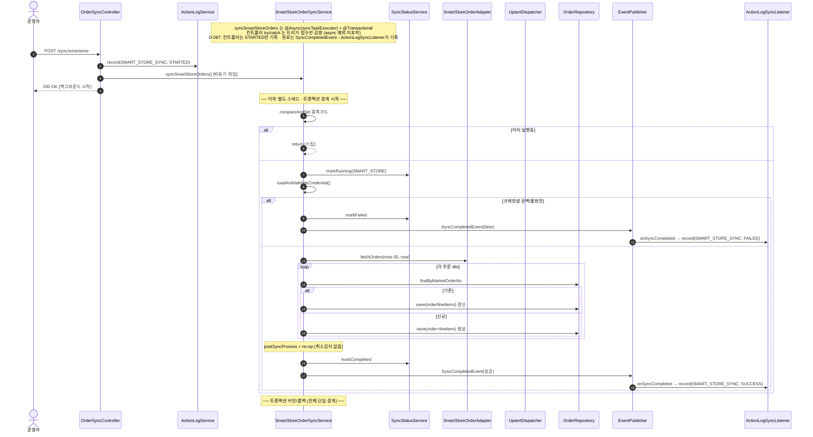
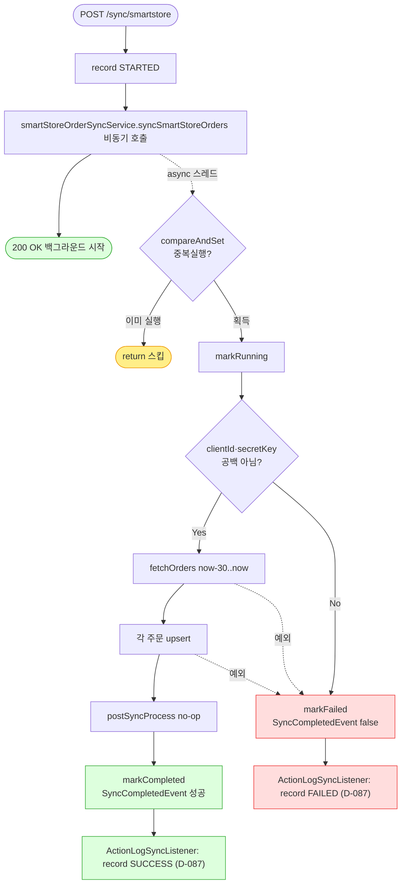

# POST /api/v1/orders/sync/smartstore — 스마트스토어 주문 동기화 시작

## 1. 개요

이 API는 "스마트스토어에 들어온 주문을 우리 시스템으로 가져오는 작업을 시작해줘"라고 요청하는 버튼입니다. 쿠팡과 마찬가지로, 요청을 받으면 "알겠다, 뒤에서 시작할게"라고 먼저 답하고 실제 가져오기·저장은 백그라운드에서 따로 돌립니다. 다만 스마트스토어는 쿠팡과 달리 "취소된 주문 찾기(취소감지)"를 하지 않습니다.

| 항목 | 쉬운 설명 |
|------|------|
| **부르는 방법 / 주소** | `POST /api/v1/orders/sync/smartstore` — 함께 보낼 내용(바디)은 없습니다. |
| **무엇을 하나** | 스마트스토어 주문을 최근 30일치 가져와서, 없던 주문은 새로 만들고 있던 주문은 최신 내용으로 갱신합니다(upsert). |
| **주문 상태가 어떻게 바뀌나** | 각 주문 상품의 배송상태(`shippingStatus`)를 스마트스토어가 알려준 값으로 맞춥니다(새 주문은 마켓 상태 그대로 만듦). |
| **덤으로 벌어지는 일(부수효과)** | 스마트스토어 API를 실제로 호출하고, DB에 저장하고, 정산액을 처음 계산해두고(FeePolicy), 화면에 실시간 알림(SSE)을 보내고, 동기화 진행상태 표를 갱신하고, 운영 기록(액션로그)을 남깁니다. **단, 취소된 주문을 찾아 반영하는 처리는 하지 않습니다(그 자리가 빈 껍데기입니다).** |
| **어떻게 돌아가나(실행 방식)** | 실제 동기화 함수는 "별도 스레드(`@Async`)" + "하나의 저장 묶음(`@Transactional`)"으로 돌고, 입구 코드는 "시작했다(STARTED)"만 기록하고 즉시 200을 돌려줍니다. 진짜 성공/실패는 백그라운드가 끝날 때 이벤트(`SyncCompletedEvent`)를 통해 `ActionLogSyncListener`가 기록합니다(예전의 무조건 성공 기록은 D-087에서 제거). |
| **돌려주는 답** | `200 OK` 와 `{success:true, message:"...백그라운드에서 시작..."}`. 시작조차 못 하면 `500`. |

## 2. 호출 체인

아래는 이 버튼을 눌렀을 때 코드가 어떤 순서로 서로를 불러가며 일하는지를 위에서 아래로 늘어놓은 것입니다. 각 줄 끝의 `파일.java:줄번호`는 실제 코드 위치입니다.

```
OrderSyncController.syncSmartStoreOrders()                    api/.../controller/OrderSyncController.java:83-111
  ├─ ActionLogService.record(SMART_STORE_SYNC, STARTED)       OrderSyncController.java:87 → core/.../actionlog/ActionLogService.java:29
  ├─ SmartStoreOrderSyncService.syncSmartStoreOrders()  @Async @Transactional   OrderSyncController.java:92 → core/.../order/service/SmartStoreOrderSyncService.java:47-81
  │    ├─ isSyncing.compareAndSet(false,true) 중복 가드        SmartStoreOrderSyncService.java:50-53
  │    ├─ syncStatusService.markRunning(SMART_STORE)          :56 → sync/SyncStatusService.java:28
  │    ├─ loadAndValidateCredential()                         :59 / :83-93 (clientId/secretKey 공백 → IllegalArgumentException, D-043)
  │    ├─ smartStoreOrderAdapter.fetchOrders(cred, now-30, now)  :60-61 (외부 API)
  │    ├─ processOrders(orders, cred)                         :63 / :95-100
  │    │    └─ MarketOrderUpsertDispatcher.dispatch(...)      :98 → order/service/MarketOrderUpsertDispatcher.java:33-52
  │    │         ├─ 존재 → updateExistingOrder                Dispatcher.java:41-46 / SmartStore:102-112
  │    │         │     ├─ updateLineItemFromDto (트래킹 무조건 반영)  :114-125
  │    │         │     └─ updateOrderInfoFromDto (progressed 시 주소보호, marketType 조건부)  :127-138
  │    │         └─ 없음 → createNewOrder                     Dispatcher.java:47-49 / SmartStore:140-147
  │    │               ├─ buildOrderFromDto                   :149-164
  │    │               └─ buildLineItemFromDto (settlementAmount)  :166-183 → fee/MarketFeeService.java:43
  │    ├─ postSyncProcess(orders)  ← 빈 메서드(no-op)          :64 / :204
  │    ├─ (성공) markCompleted + SyncCompletedEvent           :68 / :77-79
  │    └─ (실패) catch → markFailed + SyncCompletedEvent(false)  :69-74
  │         └─ (완료 기록) ActionLogSyncListener.onSyncCompleted → record(SMART_STORE_SYNC, SUCCESS/FAILED)  core/.../actionlog/ActionLogSyncListener.java:22-34
  └─ (D-087) 컨트롤러는 STARTED만 기록 — 트리거 직후 SUCCESS 기록은 제거됨(:92 주석). 완료는 SyncCompletedEvent→ActionLogSyncListener가 기록.
       (동기 디스패치 실패 시에만 catch → record(FAILED))     OrderSyncController.java:97-107
```

→ 쉽게 말하면 이런 흐름입니다: ① 입구 코드가 "시작했다"고 먼저 기록한다 → ② 실제 동기화를 백그라운드로 떠넘긴다 → ③ 백그라운드는 "이미 도는 중인가?"를 확인하고, 스마트스토어 접속 열쇠(clientId·secretKey)가 비어있지 않은지 검사한 뒤 → ④ 스마트스토어에서 최근 30일 주문을 받아온다 → ⑤ 하나씩 "있으면 갱신, 없으면 새로 생성" → ⑥ (여기서 취소감지 자리는 빈 껍데기라 아무것도 안 함) → ⑦ 끝나면 성공/실패를 기록한다.

**요청 바디:** 없음. 조회할 기간은 코드가 "오늘로부터 30일 전 ~ 오늘"로 고정합니다(`SmartStoreOrderSyncService.java:61`).

## 3. 유스케이스 다이어그램

👉 이 그림은 "누가 이 동기화를 시작시키고, 그 안에서 어떤 일들이 벌어지며, 어디서 스마트스토어 API를 부르는지"를 한눈에 보여줍니다. (쿠팡과 달리 취소감지 항목이 없다는 점도 보입니다.)


## 4. 시퀀스 다이어그램

👉 이 그림은 "시간 순서대로" 누가 누구에게 무엇을 요청하는지를 보여줍니다. 입구 코드는 곧바로 200을 돌려주고, 실제 일은 별도 스레드에서 이어지며, 중간의 취소감지 단계(postSyncProcess)는 아무 일도 하지 않는다는 점(no-op)을 담고 있습니다.



## 5. 순서도 (플로우차트)

👉 이 그림은 "어떤 갈림길에서 어떻게 갈라지는지"를 보여줍니다. 이미 도는 중이면 건너뛰고, 인증정보가 비었으면 실패로 빠지고, 정상이면 받아오기→저장→(취소감지는 빈 단계)→완료로 이어지는 길입니다.



## 6. 상태 전이표

이 표는 "주문 상품이 어떤 상태로 들어왔을 때, 어떤 조건이면, 어떤 상태로 바뀌는지"를 정리한 것입니다. 특히 스마트스토어는 취소감지가 없어서 사라진 주문이 그대로 남는다는 점을 눈여겨보세요.

| 들어올 때 상태 | 조건 | 바뀐 뒤 상태 | 마켓에 뭔가 보내나 | 쉬운 설명 |
|-----------|------|-----------|-----------|------|
| (아예 새 주문) | 마켓이 알려줌 | 마켓 상태 그대로 새로 만듦 | 조회만(안 보냄) | 새 주문은 마켓이 준 상태값(`dto.getStatus()`)을 그대로 붙입니다(:175). |
| 기존 · 아무 상태나 | 마켓 응답에 있음 | 마켓 상태로 갱신 | 조회만 | 지금 상태가 뭐든 따지지 않고 마켓이 준 상태로 무조건 덮습니다(:122) — 막는 검사가 없습니다. |
| 기존 · 아직 안 끝난 주문 | 마켓 응답에서 사라짐 | **그대로 둠(안 바뀜)** | — | 취소감지 자리가 빈 껍데기라(:204) 취소된 주문이 옛 상태로 영원히 남습니다. |
| 송장번호/택배사 | 항상 | 마켓 값으로 갱신 | — | 쿠팡에 있는 "우리가 먼저 넣은 송장 지키기" 장치가 여기엔 없습니다(:119-124). |

## 7. 🔎 발견사항

### SYNCA-5 · 🟠 GAP — 입구 코드의 성공/실패 기록이 백그라운드 예외를 못 잡아, 실제 실패해도 늘 "성공"으로 남던 문제
> ✅ **해결됨** (D-087, 커밋 c4c7faa) — 컨트롤러의 트리거 직후 `record(SUCCESS)`(구 :94)를 제거해 컨트롤러는 STARTED만 남기고, 완료(SUCCESS/FAILED)는 기존 `SyncCompletedEvent`→`ActionLogSyncListener`가 기록하도록 위임했다.
- **근거:** `SmartStoreOrderSyncService.syncSmartStoreOrders`는 별도 스레드에서 돌고 아무것도 돌려주지 않는(`@Async("syncTaskExecutor")` + `void`) 함수입니다(`SmartStoreOrderSyncService.java:47-49`). 입구 코드(`OrderSyncController.java:89-107`)의 감싸기(try/catch)는 "떠넘기는 호출"만 감싸므로, 실제 동기화 도중 터진 오류는 다른 스레드에서 발생해 이 감싸기에 닿지 못합니다. 예전에는 그래서 언제나 성공(구 :94)이 기록됐습니다.
- **영향:** 실제 실패가 운영 기록에 실패로 남지 않았습니다. 실패를 적는 `record(FAILED)`(:101)는 시작 자체가 즉시 실패할 때만 실행되는 사실상 죽은 코드였습니다. 진짜 결과는 진행상태 표(`/status`)나 이벤트(`SyncCompletedEvent`)로만 알 수 있었습니다.
- **제안:** 성공/실패 기록을 백그라운드 작업의 끝나는 지점(markCompleted/markFailed, `SmartStoreOrderSyncService.java:68`·`:71`)으로 옮기거나, 입구 코드 메시지를 "접수됨"으로 바로잡습니다. (반영됨 — 입구의 가짜 성공 기록을 없애고, 완료는 `ActionLogSyncListener`가 기록.)

### SYNCA-6 · 🟠 GAP — 스마트스토어에만 "취소감지"가 없어, 취소된 주문이 옛 상태로 계속 남음
- **근거:** `SmartStoreOrderSyncService.postSyncProcess`는 빈 함수입니다(`SmartStoreOrderSyncService.java:204`). 쿠팡은 어댑터의 `detectCancellations`(`CoupangOrderSyncService.java:354`)로, 11번가는 자체 `detectCancellations`(`ElevenstOrderSyncService.java:222-267`, D-028)로 "응답에서 사라진 아직 안 끝난 주문"을 취소(CANCELED)로 바꾸지만, 스마트스토어에는 이 처리가 없습니다.
- **영향:** 스마트스토어에서 취소·삭제된 주문이 받아온 목록에서 빠져도 우리 DB에는 예전 상태(신규/준비중)로 영원히 남습니다. 그러면 통합 주문 화면이나 이후 발주·발송 대상에 실제로는 없는 "유령 주문"이 섞일 수 있습니다. 11번가는 같은 위험을 D-028로 명시적으로 막았는데 스마트스토어만 빠져 있어 서로 어긋납니다.
- **제안:** 스마트스토어에 취소·반품을 조회할 방법이 있는지 확인하고, 없으면 11번가에서 검증된 방식("응답에서 사라진 안 끝난 주문을 취소로 처리")을 그대로 옮겨 적용합니다.

### SYNCA-7 · 🟡 SMELL — "우리가 먼저 넣은 송장 지키기" 장치가 스마트스토어에는 없음(쿠팡과 다름)
- **근거:** 쿠팡의 `updateLineItemFromDto`는 "아직 마켓에 안 보낸 송장(`trackingSentToMarket != true`)"이면 송장번호·택배사를 마켓 값으로 덮지 않습니다(`CoupangOrderSyncService.java:218-227`). 스마트스토어의 같은 함수는 무조건 마켓이 준 송장번호·택배사(`dto.getTrackingNo()`/`dto.getCarrier()`)로 덮어씁니다(`SmartStoreOrderSyncService.java:119-124`).
- **영향:** sbshop에서 먼저 등록했지만 아직 마켓에 안 보낸 송장이 있으면, 동기화가 마켓의 (비었거나 다른) 송장값으로 덮어써 우리 쪽 송장이 사라질 수 있습니다. 마켓마다 송장 처리 방식이 달라 상황에 따라 생기는 문제입니다.
- **제안:** 스마트스토어의 송장 전송 방식을 확인해 쿠팡과 같은 보호 장치가 필요한지 판단하고, 필요하면 맞춥니다.

### SYNCA-8 · 🟡 SMELL — 오래 걸리는 외부 동기화 전체가 하나의 저장 묶음 + 한 프로그램 안에서만 중복 방지
- **근거:** `syncSmartStoreOrders`가 `@Transactional`(`SmartStoreOrderSyncService.java:48`) 하나로 외부 호출(`fetchOrders`, :60)과 전체 저장(:63)을 감싸고, 중복 방지는 메모리 상의 스위치(`AtomicBoolean`, :45,50)에만 의존합니다.
- **영향:** ① 외부 API를 오가는 동안 저장 묶음과 DB 연결을 오래 붙잡습니다. ② 마지막 주문 처리에서 오류가 나면 앞서 저장한 전부가 함께 취소(롤백)됩니다(중간 성공을 확정 못함). ③ 워커 스케줄러(`OrderSyncScheduler.java:65-69`)와 API 버튼은 서로 다른 프로그램(JVM)이라, 메모리 스위치로는 두 프로그램 동시 실행을 못 막습니다.
- **제안:** 저장을 묶음 단위 트랜잭션으로 쪼개고, 중복 방지는 정산 경로처럼 DB 기반으로 두 프로그램을 아우르게 통일하는 걸 검토합니다.

## 8. 테스트 커버리지 메모

- **입구 코드(컨트롤러):** `OrderSyncControllerActionLogTest`가 D-087에서 새 약속(시작 시 STARTED만·성공은 입구가 남기지 않음·시작 자체가 즉시 실패할 때만 FAILED)에 맞게 다시 작성됐습니다. 완료 성공/실패는 `ActionLogSyncListener`의 몫이라 입구 코드 단위 테스트 범위 밖입니다(SYNCA-5 해결로 입구의 가짜 성공 자체가 사라짐).
- **서비스:** `OrderAddressProtectionTest`(`smartStoreProtectsAddressAndZipcodeWhenProgressed`/`...WhenNotProgressed`)로 진행된 주문의 주소 보호를 검증. `MarketCredentialValidationTest`(`smartStore_emptySecret_failsFast`)로 인증정보가 비면 빨리 실패하는지 검증. `OrderSyncEventEmissionTest`(smartStore 실패/성공 이벤트)로 이벤트 약속을 검증.
- **아직 테스트가 없는 부분:** ① 취소감지가 없어(SYNCA-6) 취소 주문이 남는 걸 검증·방지하는 테스트가 없음, ② "우리가 먼저 넣은 송장 지키기" 장치(SYNCA-7), ③ 하나의 저장 묶음이라 부분 실패 시 전부 롤백되는 문제(SYNCA-8).

---
*(쉬운 설명판 · 2026-07-17 재작성)*
*생성: 2026-07-17 · 근거: 현재 워킹트리*
