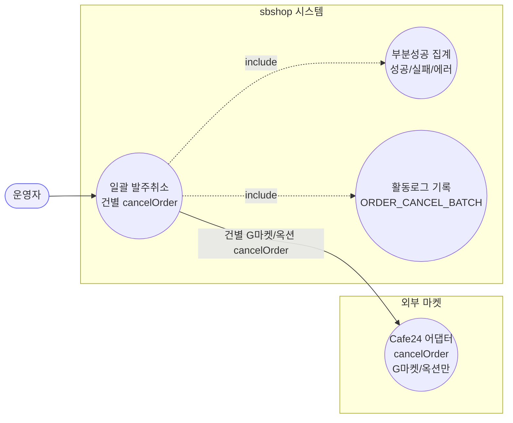
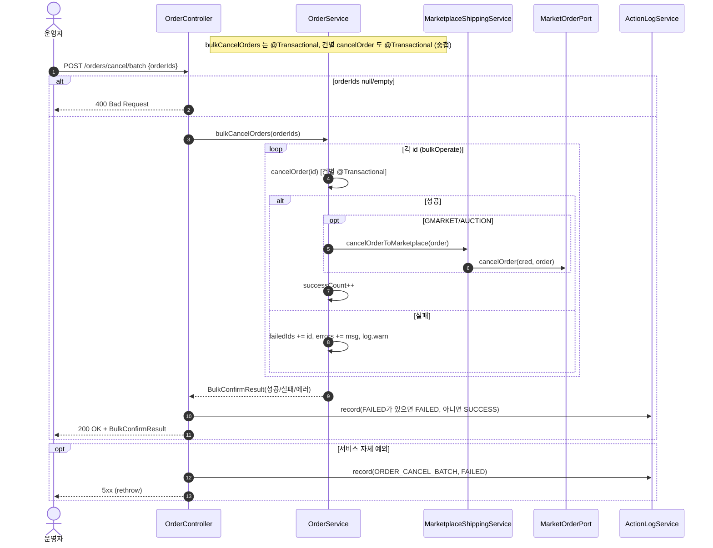

# POST /orders/cancel/batch — 일괄 발주취소

## 1. 개요

| 항목 | 내용 |
|------|------|
| **Method / URL** | `POST /api/v1/orders/cancel/batch` (바디 `OrderIdsRequest {orderIds:[…]}`) |
| **목적** | 여러 주문을 건별로 발주취소(`cancelOrder`)하고, 성공/실패를 집계해 `BulkConfirmResult` 로 반환한다. |
| **핵심 상태전이** | 건별 `NEW` → `CANCELED` (건별 `cancelOrder` 위임) |
| **부수효과** | 건별 (G마켓/옥션) 마켓 취소 API 호출 + 활동로그(`ORDER_CANCEL_BATCH`). 건별 실패는 배치를 중단시키지 않고 집계. |
| **응답** | `200 OK` + `BulkConfirmResult` · `400` (orderIds null/empty) |

## 2. 호출 체인

```
OrderController.bulkCancelOrders(request)                api/.../controller/OrderController.java:162-184
  ├─ request.orderIds()                                  api/.../dto/OrderIdsRequest.java:9
  ├─ null/empty → 400 badRequest                         OrderController.java:167-169
  └─ orderService.bulkCancelOrders(orderIds)             core/.../order/service/OrderService.java:179-182  @Transactional
       └─ bulkOperate(ids, this::cancelOrder, "취소")     :192-216
            └─ for each id: (try) op.accept(id)          :199-208
                 └─ this::cancelOrder(id)                :134-176  @Transactional (건별)
                 └─ (catch) failedIds/errors 집계, log.warn, 계속  :203-207
            └─ BulkConfirmResult.builder()…build()       :210-215
  ├─ statusOf(result.getFailedCount())                   OrderController.java:79-81/176
  └─ actionLogService.record(ORDER_CANCEL_BATCH, null, SUCCESS/FAILED)  :175-177
  └─ (catch) record(ORDER_CANCEL_BATCH, FAILED) + rethrow  :180-182
```

**요청 바디 (`OrderIdsRequest`)**

| 필드 | 타입 | 필수 | 비고 |
|------|------|------|------|
| `orderIds` | List\<Long\> | 필수 | null/empty → `400 Bad Request`(167-169) |

## 3. 유스케이스 다이어그램



## 4. 시퀀스 다이어그램



## 5. 순서도 (플로우차트)


## 6. 상태 전이표

건별 전이는 [cancel-order](cancel-order.md) 와 동일하며, 배치는 그 결과를 집계할 뿐이다.

| 진입(건별) | 허용? | 결과 상태 | 집계 반영 | 비고 |
|-----------|:-----:|-----------|-----------|------|
| 전부 NEW 인 주문 | ✅ | NEW → `CANCELED` | successCount++ | (G마켓/옥션은 마켓 전파) |
| NEW 아닌 라인 포함 주문 | ❌ | 미변경(건별 롤백) | failedIds += id | 예외 집계, 배치 계속(203-207) |
| 라인아이템 없는 주문 | ⚠️ | 미변경(no-op) | successCount++ | 건별 cancelOrder 가 공허참으로 성공(ORDB-5 상속) |
| 마켓 취소 전파 실패(G마켓/옥션) | ❌ | 미변경(건별 롤백) | failedIds += id | RuntimeException 집계, 배치 미중단 |
| orderIds null/empty | — | — | — | 진입 전 400 차단(167-169) |

## 7. 🔎 발견사항

### ORDB-7 · 🟠 GAP — 건별 취소 실패를 삼켜 재던지지 않으므로, 마켓 전파 성공 후 batch 롤백 마킹 상호작용이 불투명
- **근거:** `bulkOperate`(`OrderService.java:199-208`)는 `bulkCancelOrders`(`:180`, `@Transactional`) 안에서 건별 `cancelOrder`(`@Transactional`)를 호출하고 예외를 catch 해 집계만 한다. 스프링 기본 전파(REQUIRED)에서 물리 트랜잭션은 외부 batch 하나이므로, 건별 `cancelOrder` 예외 → `rollback-only` 마킹 → batch 커밋 시 `UnexpectedRollbackException` 위험이 있다. 특히 cancel 경로는 마켓 취소 전파(`:156`) 성공 **후** 로컬 저장 루프에서 예외가 나면, 마켓엔 취소가 반영됐는데 batch 전체가 롤백될 수 있다.
- **영향:** 여러 주문 취소 중 일부가 실패하면 성공 건까지 커밋이 거부돼 부분 성공이 미반영될 수 있고, G마켓/옥션은 이미 마켓 취소가 나간 상태라 DB↔마켓 불일치가 발생할 수 있다. confirm 배치보다 외부 부수효과가 있어 위험이 더 크다.
- **제안:** 건별 취소를 `REQUIRES_NEW` 로 격리하거나 batch 를 read-only + 건별 트랜잭션으로 분리. 마켓 전파가 나간 건의 롤백 시 재동기화 보상 경로 확인.

### ORDB-8 · 🟡 SMELL — 라인아이템 없는 주문이 batch 에서 "성공"으로 집계되고 G마켓/옥션은 빈 주문에 취소 API 호출 (단건 ORDB-5 상속)
- **근거:** batch 는 건별 `cancelOrder`(`OrderService.java:134-176`)에 그대로 위임하므로, 라인아이템 없는 주문의 공허참 통과(ORDB-5)가 그대로 상속된다. 그런 주문은 `successCount++`(`:202`) 로 집계되고 G마켓/옥션이면 `cancelOrderToMarketplace` 가 호출된다.
- **영향:** 배치 결과의 successCount 에 실제 아무 것도 취소하지 않은 주문이 포함돼 운영자가 처리량을 과대 인식. 빈 주문에 대한 불필요한 마켓 API 호출.
- **제안:** ORDB-5(단건 `cancelOrder` 의 `isEmpty()` 가드)를 수정하면 batch 도 함께 해소됨.

### ORDB-9 · 🔵 NOTE — 부분 성공도 활동로그 상태를 FAILED 로 기록 (confirm-batch ORDB-4 와 동일 정책)
- **근거:** `OrderController.java:79-81` `statusOf(failedCount)` 를 `:176` 에서 사용. 성공 N / 실패 M 인 부분 성공도 활동로그 상태는 FAILED.
- **영향:** 의도된 설계(무조건 SUCCESS 금지). 활동로그 상태만으로 부분 성공과 완전 실패를 구분 불가.
- **제안:** confirm-batch 와 동일 — 필요 시 PARTIAL 상태 도입 검토.

## 8. 테스트 커버리지 메모

- `OrderServiceBulkOperateTest` — `bulkCancelMixed`(취소 성공/실패 혼합 집계) 검증.
- `OrderControllerBulkResultLogTest` — `bulkCancel_allFailed_logsFailed`(전건 실패 FAILED) 검증.
- 건별 취소 상태 가드·마켓 전파는 `OrderServiceStateGuardTest`·`OrderServiceCancelPropagationTest` 로 커버(cancel-order 참조).
- **비어있는 케이스:** ① 부분 성공 시 batch 트랜잭션 롤백·마켓 전파 정합(ORDB-7) — 통합 테스트 부재, ② 라인아이템 없는 주문이 성공 집계됨(ORDB-8), ③ 부분 성공 활동로그 상태 값(ORDB-9), ④ orderIds null/empty → 400 컨트롤러 가드.

---
*생성: 2026-07-17 · 근거: 현재 워킹트리*
