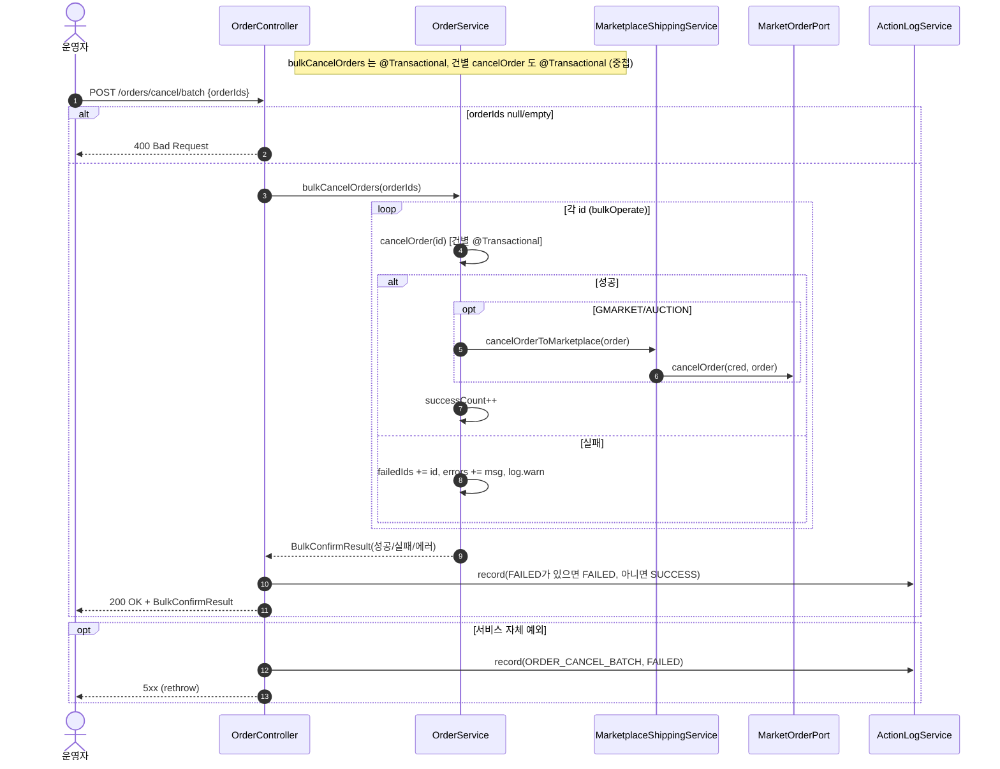
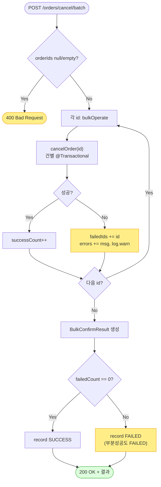

# POST /orders/cancel/batch — 일괄 발주취소

## 1. 개요

> 👉 이 표는 "여러 주문을 한 번에 취소하는 이 기능이 어떤 입구로 들어와서 무엇을 하고, 어떤 답을 돌려주는지"를 한눈에 정리한 것입니다.

| 항목 | 내용 |
|------|------|
| **Method / URL** | `POST /api/v1/orders/cancel/batch` (본문에 주문 번호 목록 `OrderIdsRequest {orderIds:[…]}` 을 담아 호출) |
| **목적** | 여러 주문을 한 건씩 차례로 발주취소(`cancelOrder`)하고, 성공/실패 건수를 세어 결과(`BulkConfirmResult`)로 돌려준다. |
| **핵심 상태전이** | 건별로 `NEW` → `CANCELED` (한 건씩 `cancelOrder` 를 그대로 불러 처리) |
| **부수효과** | 건별로 (G마켓/옥션이면) 마켓에 취소 알림을 보내고, "일괄 발주취소함(`ORDER_CANCEL_BATCH`)" 활동 기록을 남긴다. 한 건이 실패해도 배치를 멈추지 않고 나머지를 계속 처리한다. |
| **응답** | 성공하면 `200 OK` 와 결과(`BulkConfirmResult`). 주문 번호 목록이 비어 있으면 `400`. |

## 2. 호출 체인

> 👉 아래는 "취소 요청이 들어온 순간부터 주문 번호 목록을 하나씩 돌며 취소하고, 결과를 모아 기록하기까지 코드가 어느 파일의 어느 줄을 거치는지"를 보여줍니다.

```
OrderController.bulkCancelOrders(request)                api/.../controller/OrderController.java:162-184
  ├─ request.orderIds()                                  api/.../dto/OrderIdsRequest.java:9
  ├─ null/empty → 400 badRequest                         OrderController.java:167-169
  └─ orderService.bulkCancelOrders(orderIds)             core/.../order/service/OrderService.java:179-182  @Transactional
       └─ bulkOperate(ids, this::cancelOrder, "취소")     :192-216
            └─ for each id: (try) op.accept(id)          :199-208
                 └─ this::cancelOrder(id)                :134-176  @Transactional (건별)
                 └─ (catch) failedIds/errors 집계, log.warn, 계속  :203-207
            └─ BulkConfirmResult.builder()…build()       :210-215
  ├─ statusOf(result.getFailedCount())                   OrderController.java:79-81/176
  └─ actionLogService.record(ORDER_CANCEL_BATCH, null, SUCCESS/FAILED)  :175-177
  └─ (catch) record(ORDER_CANCEL_BATCH, FAILED) + rethrow  :180-182
```

→ 쉽게 말하면 이런 순서입니다.
1. 요청에서 주문 번호 목록을 꺼낸다. 비어 있으면 바로 400 오류.
2. `bulkOperate` 라는 공통 반복 처리에 넘겨, 주문 번호를 하나씩 돌면서 단건 취소(`cancelOrder`)를 그대로 불러 쓴다.
3. 어떤 건이 오류를 내면 그 건은 "실패 목록"과 "오류메시지"에 담아두고, 경고 로그만 남긴 뒤 다음 건으로 계속 넘어간다.
4. 다 돌면 성공수·실패수·실패한 주문번호·오류를 묶은 결과를 만든다.
5. 실패가 한 건이라도 있으면 활동 기록을 "실패"로, 전부 성공이면 "성공"으로 남긴다.

**요청 바디 (`OrderIdsRequest`)**

| 필드 | 타입 | 필수 | 비고 |
|------|------|------|------|
| `orderIds` | List\<Long\> | 필수 | 비어있거나 없으면 `400 Bad Request`(167-169) |

## 3. 유스케이스 다이어그램

> 👉 이 그림은 "운영자가 일괄 발주취소를 쓰면, 그 안에서 건별 cancelOrder 로 (G마켓/옥션이면) 마켓에 취소를 보내고, 성공/실패를 모아 집계하고 활동로그를 남긴다"는 관계를 보여줍니다.


## 4. 시퀀스 다이어그램

> 👉 이 그림은 "취소 요청 한 번이 들어오면 주문 번호를 하나씩 반복하며, 성공한 건은 (G마켓/옥션이면) 마켓에 취소를 보내고 세고, 실패한 건은 모으고, 다 끝난 뒤 실패가 있으면 실패로 기록하는 흐름"을 시간 순서로 보여줍니다.



## 5. 순서도 (플로우차트)

> 👉 이 그림은 "번호 목록이 비었는지 먼저 보고, 아니면 한 건씩 취소하며 성공은 세고 실패는 모아, 마지막에 실패가 하나라도 있으면 실패로 기록하는 갈림길"을 보여줍니다.



## 6. 상태 전이표

> 👉 이 표는 "한 건씩 취소할 때 주문이 어떤 상태로 들어오면 성공/실패로 세어지는지"를 경우별로 정리한 것입니다. 건별 처리 자체는 단건 취소와 똑같아서, 단건의 문제(빈 주문이 성공으로 세어짐, ORDB-5)가 세 번째 줄에 그대로 이어집니다.

건별 상태 변화는 [cancel-order](cancel-order.md) 와 동일하며, 배치는 그 결과를 세기만 한다.

| 진입(건별) | 허용? | 결과 상태 | 집계 반영 | 비고 |
|-----------|:-----:|-----------|-----------|------|
| 모든 항목이 NEW 인 주문 | ✅ | NEW → `CANCELED` | 성공수 +1 | (G마켓/옥션은 마켓에도 전파) |
| NEW 아닌 항목이 섞인 주문 | ❌ | 안 바뀜(그 건만 되돌림) | 실패 목록에 추가 | 오류만 모으고 배치는 계속(203-207) |
| 상품 항목이 없는 주문 | ⚠️ | 안 바뀜(아무 일도 안 함) | 성공수 +1 | 단건 cancelOrder 가 무조건 참으로 성공 처리(ORDB-5 그대로 이어짐) |
| 마켓 취소 전파 실패(G마켓/옥션) | ❌ | 안 바뀜(그 건만 되돌림) | 실패 목록에 추가 | RuntimeException 을 모으고 배치는 안 멈춤 |
| orderIds 가 비었거나 없음 | — | — | — | 시작 전에 400 으로 막음(167-169) |

## 7. 🔎 발견사항

### ORDB-7 · 🟠 GAP — 건별 취소 실패를 삼켜 재던지지 않으므로, 마켓 전파 성공 후 batch 롤백 마킹 상호작용이 불투명
- **무엇이 문제인가:** 여러 주문을 한 번에 취소할 때도 (일괄 발주확인과 같은 구조로) 전체가 하나의 큰 저장 묶음으로 감싸여 있습니다. 취소는 G마켓·옥션의 경우 실제 마켓에 취소를 먼저 보낸 뒤 내부 저장을 하는데, 마켓 취소는 성공한 상태에서 이후 저장 단계에서 오류가 나면 묶음 전체가 되돌려질 수 있습니다.
- **근거:** `bulkOperate`(`OrderService.java:199-208`)는 `bulkCancelOrders`(`:180`, `@Transactional`) 안에서 건별 `cancelOrder`(`@Transactional`)를 호출하고 예외를 잡아 집계만 한다. 스프링 기본 전파(REQUIRED)에서 물리 트랜잭션은 바깥 batch 하나이므로, 건별 `cancelOrder` 예외 → "되돌림 전용(rollback-only)" 표시 → batch 저장 확정 시 `UnexpectedRollbackException` 위험이 있다. 특히 취소 경로는 마켓 취소 전파(`:156`)가 성공한 **뒤** 내부 저장 반복문에서 예외가 나면, 마켓엔 취소가 반영됐는데 batch 전체가 되돌려질 수 있다.
- **영향:** 여러 주문 취소 중 일부가 실패하면 성공한 건까지 저장이 거부되어 부분 성공이 안 남을 수 있고, G마켓·옥션은 이미 마켓에 취소가 나간 상태라 마켓과 내부 데이터가 서로 어긋날 수 있습니다. 발주확인 배치보다 외부(마켓)에 실제 취소가 나가는 부수효과가 있어 위험이 더 큽니다.
- **제안:** 건별 취소를 독립된 저장 묶음(`REQUIRES_NEW`)으로 격리하거나 batch 를 읽기 전용 + 건별 트랜잭션으로 분리한다. 마켓 취소가 이미 나간 건이 되돌려질 때 다시 맞춰주는(재동기화·보상) 경로가 있는지 확인한다.

### ORDB-8 · 🟡 SMELL — 라인아이템 없는 주문이 batch 에서 "성공"으로 집계되고 G마켓/옥션은 빈 주문에 취소 API 호출 (단건 ORDB-5 상속)
- **무엇이 문제인가:** 일괄 취소는 내부적으로 단건 취소를 그대로 불러 씁니다. 그래서 단건 취소의 문제(ORDB-5 — 상품 항목이 없는 주문이 그냥 성공 처리됨)가 일괄 처리에도 똑같이 나타납니다. 그런 빈 주문은 "성공"으로 세어지고, G마켓·옥션이면 마켓에 취소 요청까지 나갑니다.
- **근거:** batch 는 건별 `cancelOrder`(`OrderService.java:134-176`)에 그대로 위임하므로, 상품 항목이 없는 주문이 무조건 참으로 통과하는 문제(ORDB-5)가 그대로 이어진다. 그런 주문은 `successCount++`(`:202`) 로 세어지고 G마켓/옥션이면 `cancelOrderToMarketplace` 가 호출된다.
- **영향:** 실제로는 아무것도 취소하지 않은 주문이 "성공 건수"에 포함되어 운영자가 처리량을 실제보다 많게 착각합니다. 또 빈 주문에 불필요한 마켓 호출이 나갑니다.
- **제안:** 단건 취소의 "항목 없으면 막기"(ORDB-5)를 고치면 일괄 처리도 자동으로 해결된다.

### ORDB-9 · 🔵 NOTE — 부분 성공도 활동로그 상태를 FAILED 로 기록 (confirm-batch ORDB-4 와 동일 정책)
- **무엇이 문제인가:** 일괄 취소도 부분 성공(성공 N/실패 M)이면 활동 기록 상태는 "실패"로 남습니다. 일괄 발주확인(ORDB-4)과 동일한 의도된 정책입니다.
- **근거:** `OrderController.java:79-81` 의 `statusOf(failedCount)` 를 `:176` 에서 사용한다. 성공 N / 실패 M 인 부분 성공도 활동 기록 상태는 FAILED 다.
- **영향:** 활동 기록 상태값만으로는 부분 성공과 완전 실패를 구분할 수 없습니다.
- **제안:** 일괄 발주확인과 동일하게, 필요하면 "부분 성공(PARTIAL)" 상태를 두는 것을 검토한다.

## 8. 테스트 커버리지 메모

> 👉 아래는 "이 일괄 취소의 어떤 부분이 이미 자동 테스트로 지켜지고, 어떤 부분은 아직 테스트가 없는지"를 정리한 것입니다.

- `OrderServiceBulkOperateTest` — 취소 성공/실패가 섞였을 때 집계가 맞는지(`bulkCancelMixed`) 확인.
- `OrderControllerBulkResultLogTest` — 전부 실패면 활동 기록이 FAILED 로 남는지(`bulkCancel_allFailed_logsFailed`) 확인.
- 건별 취소의 상태 가드·마켓 전파는 `OrderServiceStateGuardTest`·`OrderServiceCancelPropagationTest` 로 이미 확인됨(cancel-order 참조).
- **아직 테스트가 없는 경우:** ① 부분 성공일 때 batch 저장 묶음이 되돌려지는 것·마켓 전파 정합(ORDB-7) — 통합 테스트 없음, ② 상품 항목이 없는 주문이 성공으로 세어짐(ORDB-8), ③ 부분 성공 시 활동 기록 상태값(ORDB-9), ④ 주문 번호 목록이 비어 400 으로 막히는 컨트롤러 검사.

---
*(쉬운 설명판 · 2026-07-17 재작성)*
*생성: 2026-07-17 · 근거: 현재 워킹트리*
