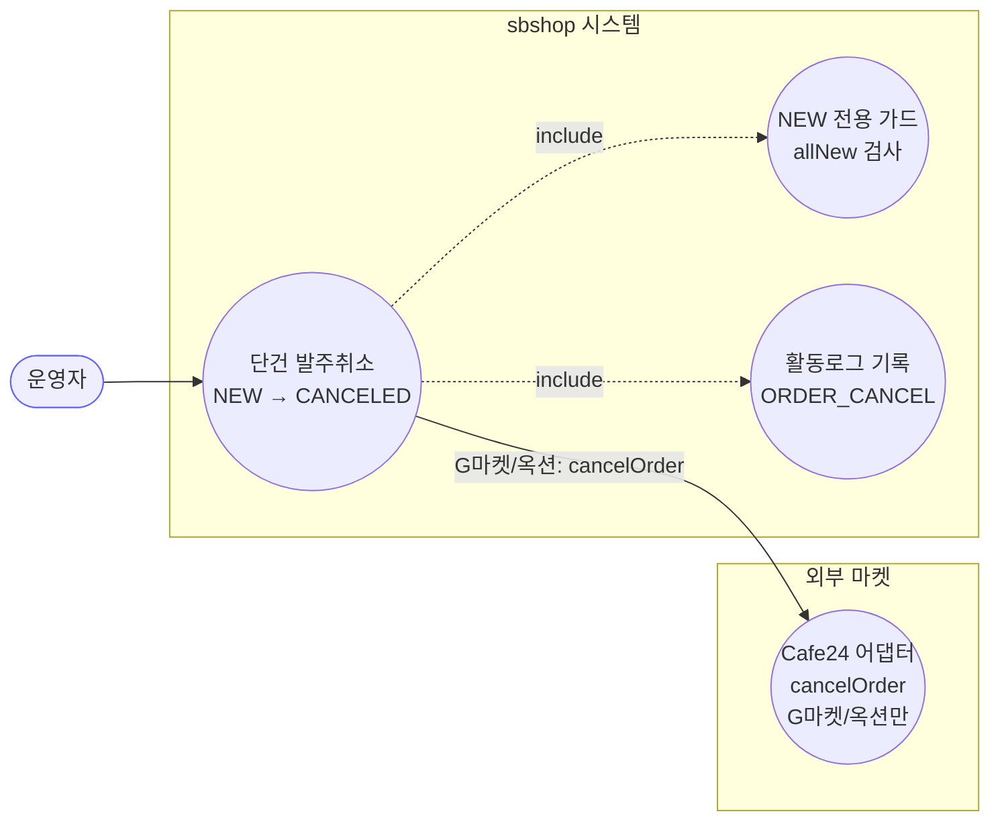
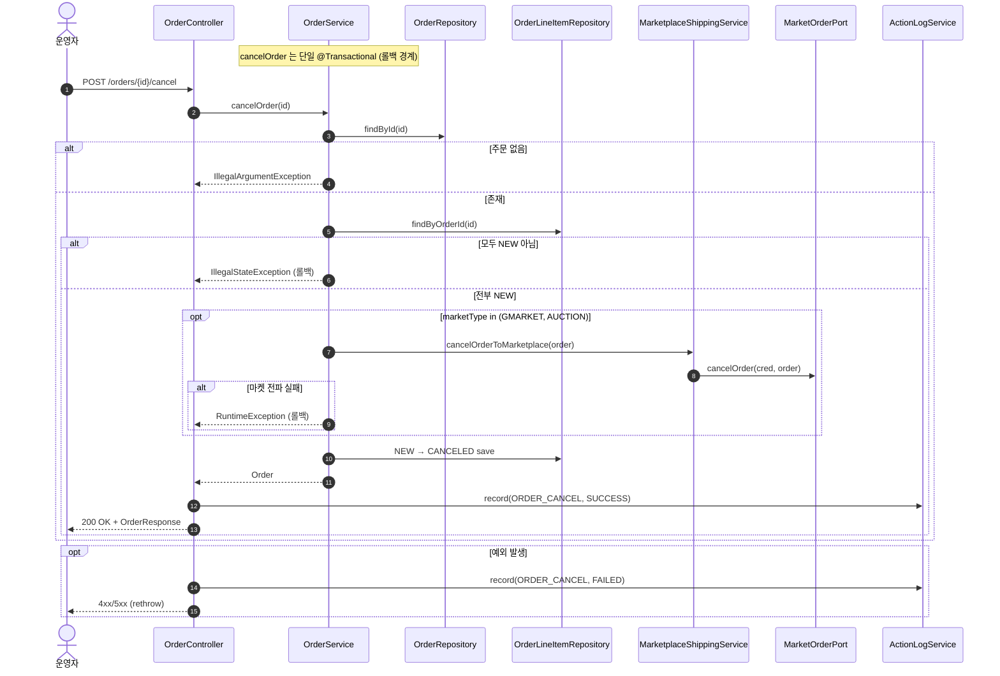
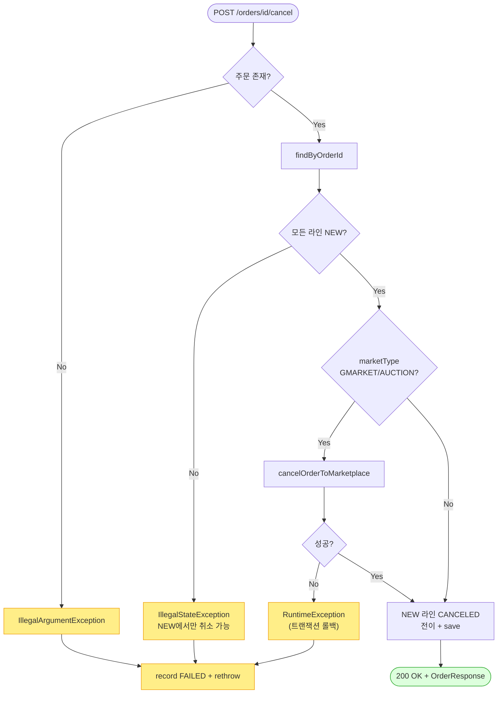

# POST /orders/{id}/cancel — 단건 발주취소

## 1. 개요

> 👉 이 표는 "주문 1건을 취소하는 이 기능이 어떤 입구로 들어와서 무엇을 하고, 어떤 답을 돌려주는지"를 한눈에 정리한 것입니다.

| 항목 | 내용 |
|------|------|
| **Method / URL** | `POST /api/v1/orders/{id}/cancel` (주소 끝에 주문 번호 `id` 를 붙여 호출) |
| **목적** | 아직 손대지 않은(`NEW`, 결제완료·미접수) 주문 하나를 취소한다. G마켓/옥션은 Cafe24 API 로 실제 마켓에도 취소를 전파하고, 상품 항목을 "취소됨(`CANCELED`)"으로 바꾼다. |
| **핵심 상태전이** | 상품 항목 `NEW` → `CANCELED`(취소됨) |
| **부수효과** | (G마켓/옥션만) 마켓에 취소 알림(`cancelOrder`)을 보내고, "발주취소함(`ORDER_CANCEL`)" 활동 기록을 남긴다. 이 과정은 하나의 저장 묶음(`@Transactional`)이다. |
| **응답** | 성공하면 `200 OK` 와 주문 정보(`OrderResponse`). 실패하면 오류를 그대로 다시 던져(400·500) 전달한다. |

## 2. 호출 체인

> 👉 아래는 "취소 요청이 들어온 순간부터 상태 검사·마켓 취소 전파·상태 변경·기록까지 코드가 어느 파일의 어느 줄을 거치는지"를 순서대로 보여줍니다.

```
OrderController.cancelOrder(id)                           api/.../controller/OrderController.java:143-159
  └─ orderService.cancelOrder(id)                         core/.../order/service/OrderService.java:134-176  @Transactional
       ├─ orderRepository.findById(id) → orElseThrow      :138-139  (IllegalArgumentException "Order not found")
       ├─ orderLineItemRepository.findByOrderId()         :143
       ├─ allNew = lineItems.allMatch(status == NEW)      :144-147
       ├─ !allNew → throw                                 :148-150  (IllegalStateException "결제완료(NEW)에서만")
       ├─ (GMARKET|AUCTION) marketplaceShippingService.cancelOrderToMarketplace(order)  :153-161
       │    └─ MarketplaceShippingService.cancelOrderToMarketplace()  core/.../service/MarketplaceShippingService.java:137-146
       │         ├─ credentialRepository.findByMarketType() (nullable)  :141
       │         ├─ getPort(marketType)                   :142
       │         └─ port.cancelOrder(cred, order)         :143  → MarketOrderPort.cancelOrder :59-61
       │    └─ (catch) → RuntimeException "마켓 주문취소 실패"  :159
       └─ for each item: NEW → CANCELED 전이 + save        :164-173
  └─ actionLogService.record(ORDER_CANCEL, marketOf(order), SUCCESS)  OrderController.java:150-151
  └─ (catch) record(ORDER_CANCEL, marketNameOfOrder(id), FAILED) + rethrow  :155-157
  └─ OrderResponse.from(order)                            api/.../dto/OrderResponse.java:52-74
```

→ 쉽게 말하면 이런 순서입니다.
1. 주문 번호로 주문을 찾는다. 없으면 "주문 없음" 오류.
2. 주문에 딸린 상품 항목들을 가져온다.
3. 모든 항목이 `NEW`(결제완료·미접수) 상태인지 확인한다(`allNew`).
4. 하나라도 NEW 가 아니면 "NEW 에서만 취소 가능"이라며 막는다.
5. G마켓/옥션이면 먼저 마켓에 취소를 전파한다. 이 전파가 실패하면 오류를 던져 전부 되돌린다.
6. 그다음 NEW 항목들을 `CANCELED`(취소됨)로 바꿔 저장한다.
7. 마지막에 성공/실패를 활동 기록으로 남기고, 성공이면 주문 정보를 돌려준다.

**요청 파라미터**

| 필드 | 타입 | 필수 | 비고 |
|------|------|------|------|
| `id` | Long (path) | 필수 | 주문 번호. 이 번호의 주문이 없으면 `IllegalArgumentException` |

## 3. 유스케이스 다이어그램

> 👉 이 그림은 "운영자가 발주취소를 쓰면, 그 안에서 NEW 전용 가드·활동로그가 함께 돌고, G마켓/옥션일 때만 Cafe24 어댑터로 마켓에 취소를 보낸다"는 관계를 보여줍니다.



## 4. 시퀀스 다이어그램

> 👉 이 그림은 "취소 요청 한 건이 컨트롤러 → 서비스 → 저장소 → (G마켓/옥션이면) 마켓 순으로 오가며, 각 갈림길(주문 없음·NEW 아님·마켓 전파 실패)에서 어떻게 처리되는지"를 시간 순서로 보여줍니다.



## 5. 순서도 (플로우차트)

> 👉 이 그림은 "요청이 들어온 뒤 통과해야 하는 검사들(주문 있나 → 모든 항목이 NEW 인가 → G마켓/옥션이면 마켓 취소 성공하나)을 차례로 그려, 어디서 막히면 어떤 오류가 나고 통과하면 어떻게 상태가 바뀌는지"를 보여줍니다.



## 6. 상태 전이표

> 👉 이 표는 "주문의 상품 항목들이 어떤 상태로 들어오면 취소를 허용하고, 결과 상태가 어떻게 바뀌며, 마켓에 취소가 나가는지"를 경우별로 정리한 것입니다. 특히 세 번째 줄(항목이 하나도 없는 주문)이 지금 문제(ORDB-5)가 되는 지점입니다.

| 진입 라인상태(집합) | 허용? | 결과 상태 | 마켓 전송 | 비고 |
|-----------|:-----:|-----------|-----------|------|
| 전부 NEW | ✅ | NEW → `CANCELED` | (G마켓/옥션만) cancelOrder 나감 | 164-173 에서 상태 변경 |
| 하나라도 NEW 아님(준비중/구매완료/발송됨/종료) | ❌ | 안 바뀜 | — | `!allNew` 로 막음(148-150) |
| **상품 항목이 하나도 없음** | ⚠️ | 안 바뀜(아무 일도 안 함) | (G마켓/옥션은 cancelOrder 를 호출함) | 대상이 없어 "모두 NEW"가 저절로 참이 되어 통과, 상태 변경 반복문은 0번 돎 |
| 마켓 취소 전파 실패(G마켓/옥션) | ❌ | 안 바뀜(전부 되돌림) | 시도는 됨 | `RuntimeException` 으로 전체 롤백(159) |
| 그 외 마켓(쿠팡 등) | ✅ | NEW → `CANCELED` | 없음(내부에서만 처리) | 152-161 의 마켓 전파 조건에 안 걸림 |

## 7. 🔎 발견사항

### ORDB-5 · 🟠 GAP — 라인아이템이 없는 주문은 취소 가드를 통과해 공허하게 "성공"하고, G마켓/옥션은 빈 주문에도 마켓 취소 API 를 호출
- **무엇이 문제인가:** 취소는 "모든 상품 항목이 NEW 상태인지" 확인한 뒤 진행합니다. 그런데 상품 항목이 아예 하나도 없는 주문은, "모든 항목이 조건을 만족한다"는 검사를 자동으로 통과해 버립니다(대상이 없으니 무조건 참). 결국 실제로 바꿀 게 하나도 없는데 취소가 성공한 것처럼 처리되고, G마켓·옥션이면 마켓에 취소 요청까지 나갑니다.
- **근거:** `OrderService.java:144-147` 의 `allNew` 는 항목을 모두 훑어(`allMatch`) 판단하는데, 항목 목록(`lineItems`)이 비어 있으면 `allMatch` 는 공허참(무조건 true) 을 반환한다. 그러면 취소 가드(148)를 통과해 G마켓/옥션이면 `cancelOrderToMarketplace`(156)를 호출하고, 상태 변경 반복문(164-173)은 0번 돌아 아무 상태 변경 없이 200 을 돌려준다. `confirmOrder` 는 같은 상황을 `currentItems.isEmpty()` 로 명확히 막는데(`:76-78`, F-ORD-22) 취소만 비대칭이다.
- **영향:** 데이터가 깨진(상품 항목이 없는) 주문에 대해 "취소됨"으로 표시돼 운영자가 오해합니다. 또 빈 주문에 대고 마켓에 쓸데없는 취소 알림이 나갑니다.
- **제안:** `cancelOrder` 시작 부분에 "상품 항목이 없으면 막기(`lineItems.isEmpty()`)" 검사를 추가해 `confirmOrder` 와 동일하게 맞춘다.

### ORDB-6 · 🟡 SMELL — 마켓 취소 전파는 라인 CANCELED 전이(로컬 저장) 이전에 수행 — 성공 순서가 confirm 경로와 반대
- **무엇이 문제인가:** 취소는 (G마켓·옥션의 경우) 마켓에 취소를 먼저 보낸 다음, 내부 항목들을 "취소됨"으로 바꿔 저장합니다. 마켓 전송이 실패하면 전체가 되돌려져 안전하지만, 마켓 취소가 성공한 뒤 내부 저장 단계에서 오류가 나면(가능성은 낮음) 마켓엔 취소가 반영됐는데 내부는 되돌려지는 짧은 순간이 이론적으로 존재합니다.
- **근거:** `cancelOrder`(`:153-173`)는 먼저 마켓에 취소를 전파(156)한 뒤 내부 항목을 CANCELED 로 바꾼다(164-173). `confirmOrder`(`:98-119`)도 마켓 호출→내부 변경 순서로 같지만, 취소 경로는 마켓 전파 대상이 G마켓/옥션으로 한정돼 마켓별로 부수효과 유무가 갈린다. 전파 실패 시 `RuntimeException` 으로 전체 롤백되므로 내부는 안전하나, 마켓 취소가 성공한 뒤 내부 저장 반복문에서 예외가 나면(가능성 낮음) DB↔마켓 불일치가 난다.
- **영향:** 마켓엔 취소가 반영됐는데 내부는 되돌려지는 창(window)이 이론적으로 존재합니다. 확률은 낮으나 정산·재동기화에서 혼선이 생길 수 있습니다.
- **제안:** 마켓 전송은 성공했는데 내부 저장이 실패하는 시나리오를 문서로 정리하고, 재동기화가 마켓 취소를 내부로 복원해 주는지 확인한다.

## 8. 테스트 커버리지 메모

> 👉 아래는 "이 취소 기능의 어떤 부분이 이미 자동 테스트로 지켜지고, 어떤 부분은 아직 테스트가 없는지"를 정리한 것입니다.

- `OrderServiceStateGuardTest` — NEW 주문 취소가 성공하며 CANCELED 로 바뀌는지(`newOrder_cancel_succeeds`), 구매완료·발송된 주문은 취소가 막히는지(`purchasedOrder_cancel_blocked`, `shippedOrder_cancel_blocked`) 확인.
- `OrderServiceCancelPropagationTest` — G마켓·옥션 취소가 마켓에 전파되는지(`gmarketCancel_propagatesToMarketplace`, `auctionCancel_propagatesToMarketplace`), 쿠팡은 전파하지 않는지(`coupangCancel_doesNotPropagateToMarketplace`), 전파가 실패하면 오류가 나는지(`gmarketCancelFails_throwsRuntimeException`) 확인.
- `MarketplaceShippingServiceCancelTest` — 마켓 취소 호출이 어댑터로 제대로 위임되는지 확인.
- `OrderControllerMarketTypeLogTest` — 취소 실패 시 활동 기록에 어느 마켓 주문인지 제대로 채워지는지(F-ORD-15) 확인.
- **아직 테스트가 없는 경우:** ① 상품 항목이 없는 주문 취소(ORDB-5) — 미검증, ② 마켓 취소 성공 후 내부 저장 실패 시 정합(ORDB-6).

---
*(쉬운 설명판 · 2026-07-17 재작성)*
*생성: 2026-07-17 · 근거: 현재 워킹트리*
