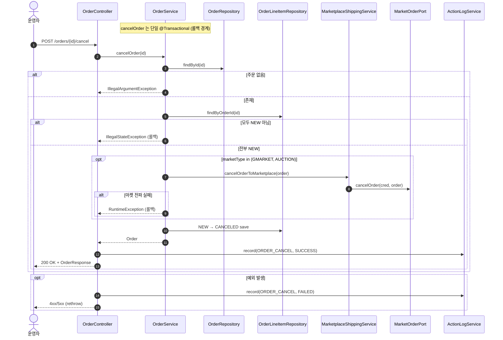

# POST /orders/{id}/cancel — 단건 발주취소

## 1. 개요

| 항목 | 내용 |
|------|------|
| **Method / URL** | `POST /api/v1/orders/{id}/cancel` (PathVariable `id`) |
| **목적** | `NEW`(결제완료·미접수) 상태의 단일 주문을 취소한다. G마켓/옥션은 Cafe24 API 로 실제 취소를 전파하고, 라인아이템을 `CANCELED` 로 전이한다. |
| **핵심 상태전이** | 라인아이템 `NEW` → `CANCELED` |
| **부수효과** | (G마켓/옥션만) 마켓 취소 API 호출(`cancelOrder`) + 활동로그(`ORDER_CANCEL`). 단일 `@Transactional`. |
| **응답** | `200 OK` + `OrderResponse` / 실패 시 예외 재던짐(400·500) |

## 2. 호출 체인

```
OrderController.cancelOrder(id)                           api/.../controller/OrderController.java:143-159
  └─ orderService.cancelOrder(id)                         core/.../order/service/OrderService.java:134-176  @Transactional
       ├─ orderRepository.findById(id) → orElseThrow      :138-139  (IllegalArgumentException "Order not found")
       ├─ orderLineItemRepository.findByOrderId()         :143
       ├─ allNew = lineItems.allMatch(status == NEW)      :144-147
       ├─ !allNew → throw                                 :148-150  (IllegalStateException "결제완료(NEW)에서만")
       ├─ (GMARKET|AUCTION) marketplaceShippingService.cancelOrderToMarketplace(order)  :153-161
       │    └─ MarketplaceShippingService.cancelOrderToMarketplace()  core/.../service/MarketplaceShippingService.java:137-146
       │         ├─ credentialRepository.findByMarketType() (nullable)  :141
       │         ├─ getPort(marketType)                   :142
       │         └─ port.cancelOrder(cred, order)         :143  → MarketOrderPort.cancelOrder :59-61
       │    └─ (catch) → RuntimeException "마켓 주문취소 실패"  :159
       └─ for each item: NEW → CANCELED 전이 + save        :164-173
  └─ actionLogService.record(ORDER_CANCEL, marketOf(order), SUCCESS)  OrderController.java:150-151
  └─ (catch) record(ORDER_CANCEL, marketNameOfOrder(id), FAILED) + rethrow  :155-157
  └─ OrderResponse.from(order)                            api/.../dto/OrderResponse.java:52-74
```

**요청 파라미터**

| 필드 | 타입 | 필수 | 비고 |
|------|------|------|------|
| `id` | Long (path) | 필수 | 주문 PK. 미존재 시 `IllegalArgumentException` |

## 3. 유스케이스 다이어그램


## 4. 시퀀스 다이어그램



## 5. 순서도 (플로우차트)


## 6. 상태 전이표

| 진입 라인상태(집합) | 허용? | 결과 상태 | 마켓 전송 | 비고 |
|-----------|:-----:|-----------|-----------|------|
| 전부 NEW | ✅ | NEW → `CANCELED` | (G마켓/옥션만) cancelOrder | 164-173 전이 |
| 하나라도 NEW 아님(PREPARING/PURCHASED/SHIPPED/종료) | ❌ | 미변경 | — | `!allNew` 차단(148-150) |
| **라인아이템 없음** | ⚠️ | 미변경(no-op) | (G마켓/옥션은 cancelOrder 호출) | `allMatch` 공허참 → allNew=true 통과, 전이 루프는 0회 |
| 마켓 취소 전파 실패(G마켓/옥션) | ❌ | 미변경(롤백) | 시도됨 | `RuntimeException` 전체 롤백(159) |
| 그 외 마켓(쿠팡 등) | ✅ | NEW → `CANCELED` | 없음(로컬 only) | 152-161 조건 미충족 |

## 7. 🔎 발견사항

### ORDB-5 · 🟠 GAP — 라인아이템이 없는 주문은 취소 가드를 통과해 공허하게 "성공"하고, G마켓/옥션은 빈 주문에도 마켓 취소 API 를 호출
- **근거:** `OrderService.java:144-147` `allNew` 는 `lineItems.stream().allMatch(...)` 로 계산되는데, `lineItems` 가 비어 있으면 `allMatch` 는 공허참(true) 을 반환한다. 이후 취소 가드(148)를 통과해 G마켓/옥션이면 `cancelOrderToMarketplace`(156)를 호출하고, 전이 루프(164-173)는 0회 실행돼 아무 상태 변경 없이 200 을 반환한다. `confirmOrder` 는 동일 상황을 `currentItems.isEmpty()` 로 명시 차단(`:76-78`, F-ORD-22)하는 것과 비대칭.
- **영향:** 라인아이템 없는(데이터 정합 깨진) 주문에 대해 취소가 성공으로 보이고, G마켓/옥션은 불필요한 마켓 취소 API 호출이 나간다. 운영자는 "취소됨"으로 오인.
- **제안:** `cancelOrder` 진입부에 `lineItems.isEmpty()` 차단을 추가해 `confirmOrder` 와 대칭화.

### ORDB-6 · 🟡 SMELL — 마켓 취소 전파는 라인 CANCELED 전이(로컬 저장) 이전에 수행 — 성공 순서가 confirm 경로와 반대
- **근거:** `cancelOrder`(`:153-173`)는 먼저 마켓에 취소를 전파(156)한 뒤 로컬 라인을 CANCELED 로 전이(164-173)한다. 반면 `confirmOrder`(`:98-119`)도 마켓 호출→로컬 전이 순서로 동일하나, cancel 경로는 마켓 전파 대상이 G마켓/옥션으로 한정돼 마켓별로 부수효과 유무가 갈린다. 전파 실패 시 `RuntimeException` 으로 전체 롤백되므로 로컬은 안전하나, 마켓 취소가 성공하고 이후 로컬 저장 루프에서 예외가 나면(가능성 낮음) DB↔마켓 불일치.
- **영향:** 마켓엔 취소가 반영됐는데 로컬은 롤백되는 창(window)이 이론적으로 존재. 확률은 낮으나 정산·재동기화에서 혼선 가능.
- **제안:** 마켓 전파와 로컬 저장의 정합 실패 시나리오를 문서화하고, 재동기화가 마켓 취소를 로컬로 복원하는지 확인.

## 8. 테스트 커버리지 메모

- `OrderServiceStateGuardTest` — `newOrder_cancel_succeeds`(NEW 취소 성공, CANCELED 전이), `purchasedOrder_cancel_blocked`, `shippedOrder_cancel_blocked`(비-NEW 차단) 검증.
- `OrderServiceCancelPropagationTest` — `gmarketCancel_propagatesToMarketplace`, `auctionCancel_propagatesToMarketplace`(전파 호출), `coupangCancel_doesNotPropagateToMarketplace`(비전파 회귀), `gmarketCancelFails_throwsRuntimeException`(전파 실패 시 예외) 검증.
- `MarketplaceShippingServiceCancelTest` — `cancelOrderToMarketplace` 포트 위임 검증.
- `OrderControllerMarketTypeLogTest` — 취소 실패 경로 marketType 로그 해석(F-ORD-15).
- **비어있는 케이스:** ① 라인아이템 없는 주문 취소(ORDB-5) — 미검증, ② 마켓 취소 성공 후 로컬 저장 실패 정합(ORDB-6).

---
*생성: 2026-07-17 · 근거: 현재 워킹트리*
