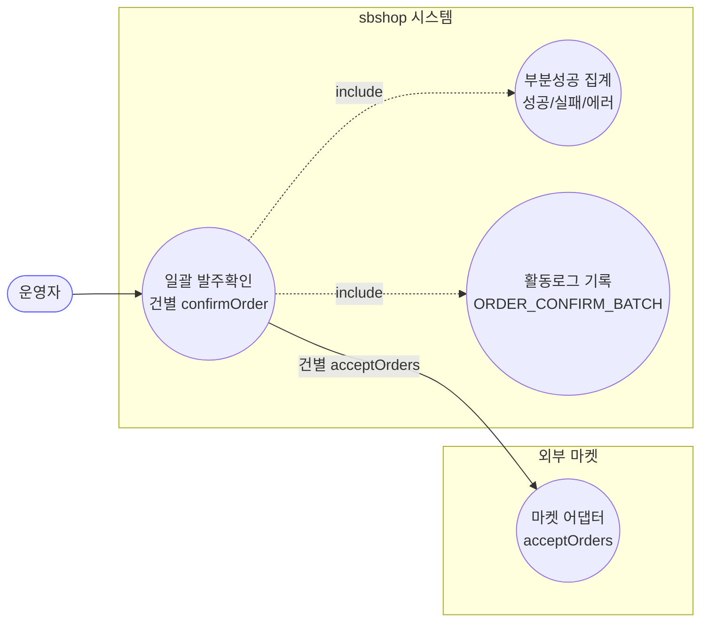
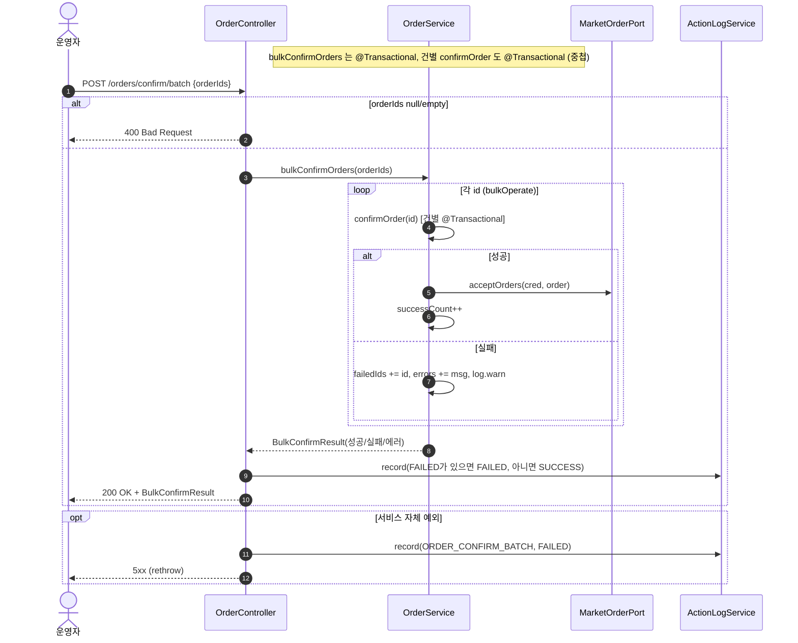

# POST /orders/confirm/batch — 일괄 발주확인

## 1. 개요

| 항목 | 내용 |
|------|------|
| **Method / URL** | `POST /api/v1/orders/confirm/batch` (바디 `OrderIdsRequest {orderIds:[…]}`) |
| **목적** | 여러 주문을 건별로 발주확인(`confirmOrder`)하고, 성공/실패를 집계해 `BulkConfirmResult` 로 반환한다. |
| **핵심 상태전이** | 건별 `NEW` → `PREPARING` (건별 `confirmOrder` 위임) |
| **부수효과** | 건별 마켓 접수 API 호출 + 활동로그(`ORDER_CONFIRM_BATCH`). 건별 실패는 배치를 중단시키지 않고 집계(부분 성공 허용). |
| **응답** | `200 OK` + `BulkConfirmResult`(성공수/실패수/실패ID/에러) · `400` (orderIds null/empty) |

## 2. 호출 체인

```
OrderController.bulkConfirmOrders(request)               api/.../controller/OrderController.java:116-138
  ├─ request.orderIds()                                  api/.../dto/OrderIdsRequest.java:9
  ├─ null/empty → 400 badRequest                         OrderController.java:122-124
  └─ orderService.bulkConfirmOrders(orderIds)            core/.../order/service/OrderService.java:126-129  @Transactional
       └─ bulkOperate(ids, this::confirmOrder, "접수 확인")  :192-216
            └─ for each id: (try) op.accept(id)          :199-208
                 └─ this::confirmOrder(id)               :60-123  @Transactional (건별)
                 └─ (catch) failedIds/errors 집계, log.warn, 계속  :203-207
            └─ BulkConfirmResult.builder()…build()       :210-215
  ├─ statusOf(result.getFailedCount())                   OrderController.java:79-81/130
  └─ actionLogService.record(ORDER_CONFIRM_BATCH, null, SUCCESS/FAILED)  :129-131
  └─ (catch) record(ORDER_CONFIRM_BATCH, FAILED) + rethrow  :134-136
```

**요청 바디 (`OrderIdsRequest`)**

| 필드 | 타입 | 필수 | 비고 |
|------|------|------|------|
| `orderIds` | List\<Long\> | 필수 | null/empty → `400 Bad Request`(122-124) |

## 3. 유스케이스 다이어그램



## 4. 시퀀스 다이어그램



## 5. 순서도 (플로우차트)


## 6. 상태 전이표

건별 전이는 [confirm-order](confirm-order.md) 와 동일하며, 배치는 그 결과를 집계할 뿐이다.

| 진입(건별) | 허용? | 결과 상태 | 집계 반영 | 비고 |
|-----------|:-----:|-----------|-----------|------|
| 전부 NEW 인 주문 | ✅ | NEW → `PREPARING` | successCount++ | 건별 confirmOrder 성공 |
| 진행/종료 라인 포함 주문 | ❌ | 미변경(건별 롤백) | failedIds += id | 예외 집계, 배치 계속(203-207) |
| 라인아이템 없는 주문 | ❌ | 미변경 | failedIds += id | F-ORD-22 예외 집계 |
| 크레덴셜 없음/접수실패 | ❌ | 미변경(건별 롤백) | failedIds += id | 건별 @Transactional 롤백, 배치 미중단 |
| orderIds null/empty | — | — | — | 진입 전 400 차단(122-124) |

## 7. 🔎 발견사항

### ORDB-3 · 🟠 GAP — 건별 실패를 `Exception` 로 삼켜 재던지지 않으므로, 트랜잭션 롤백 마킹 상호작용이 불투명
- **근거:** `bulkOperate`(`OrderService.java:199-208`)는 `bulkConfirmOrders`(`:127`, `@Transactional`) 안에서 건별 `confirmOrder`(`@Transactional`)를 호출하고, 던져진 예외를 catch 해 집계만 한다. 스프링 기본 전파(REQUIRED)에서는 건별 `confirmOrder` 가 예외로 롤백되면 물리 트랜잭션이 하나(외부 batch)이므로 `rollback-only` 로 마킹될 수 있고, 그러면 batch 커밋 시 `UnexpectedRollbackException` 위험이 있다.
- **영향:** 일부 건이 실패하면 성공 건까지 커밋이 거부되어 부분 성공이 실제로 저장되지 않을 수 있다(집계는 성공처럼 보이나 DB 미반영). 다만 `confirmOrder` 의 상태 가드 예외들은 외부 마켓 호출 이전에 던져져 실제 DB 변경 전 롤백이므로 영향이 작을 수 있어 조건부 GAP 로 표기.
- **제안:** 건별 처리를 `REQUIRES_NEW` 로 격리하거나, batch 를 read-only + 건별 트랜잭션으로 분리해 부분 성공 커밋을 보장. 통합/실DB 테스트로 `UnexpectedRollbackException` 재현 여부 확인.

### ORDB-4 · 🔵 NOTE — 부분 성공도 활동로그 상태를 FAILED 로 기록 (성공 건이 있어도 FAILED)
- **근거:** `OrderController.java:79-81` `statusOf` 는 `failedCount != 0` 이면 FAILED 를 반환하고, `:130` 에서 그대로 사용. 성공 N / 실패 M 인 부분 성공도 활동로그 상태는 FAILED 로 남는다(메시지에 "성공 N / 실패 M" 병기).
- **영향:** 의도된 설계(무조건 SUCCESS 금지, `OrderControllerBulkResultLogTest` 로 고정). 단, 활동로그 상태만 보고 필터하면 부분 성공이 완전 실패와 구분되지 않는다.
- **제안:** 필요 시 PARTIAL 같은 중간 상태 도입 검토. 현행은 메시지 파싱에 의존.

## 8. 테스트 커버리지 메모

- `OrderServiceBulkOperateTest` — `bulkConfirmMixed`(성공/실패 혼합 카운트·실패ID·에러 집계), `bulkConfirmAllSuccess`(전건 성공 시 errors=null) 검증.
- `OrderControllerBulkResultLogTest` — `bulkConfirm_allFailed_logsFailed`(전건 실패 FAILED), `bulkConfirm_allSuccess_logsSuccess`(전건 성공 SUCCESS) 검증.
- **비어있는 케이스:** ① 부분 성공 시 batch 트랜잭션 롤백 상호작용(ORDB-3) — 통합 테스트 부재, ② orderIds null/empty → 400 컨트롤러 가드, ③ 부분 성공 활동로그 상태 값(ORDB-4)의 명시 검증.

---
*생성: 2026-07-17 · 근거: 현재 워킹트리*
