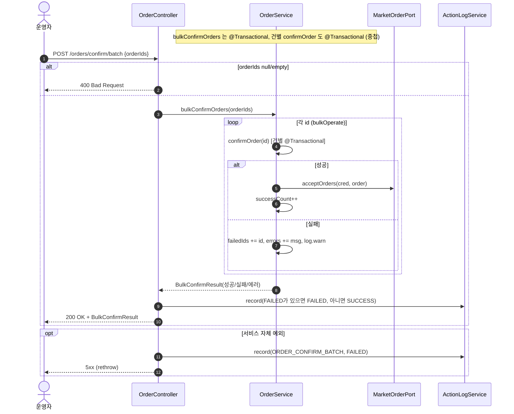
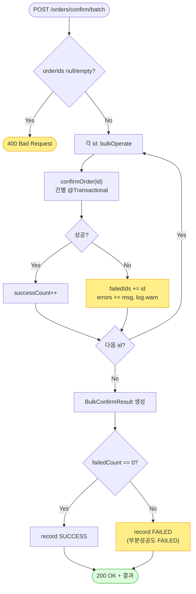

# POST /orders/confirm/batch — 일괄 발주확인

## 1. 개요

> 👉 이 표는 "여러 주문을 한 번에 발주확인시키는 이 기능이 어떤 입구로 들어와서 무엇을 하고, 어떤 답을 돌려주는지"를 한눈에 정리한 것입니다.

| 항목 | 내용 |
|------|------|
| **Method / URL** | `POST /api/v1/orders/confirm/batch` (본문에 주문 번호 목록 `OrderIdsRequest {orderIds:[…]}` 을 담아 호출) |
| **목적** | 여러 주문을 한 건씩 차례로 발주확인(`confirmOrder`)하고, 성공/실패 건수를 세어 결과(`BulkConfirmResult`)로 돌려준다. |
| **핵심 상태전이** | 건별로 `NEW` → `PREPARING` (한 건씩 `confirmOrder` 를 그대로 불러 처리) |
| **부수효과** | 건별로 마켓 접수 알림을 보내고, "일괄 발주확인함(`ORDER_CONFIRM_BATCH`)" 활동 기록을 남긴다. 한 건이 실패해도 배치를 멈추지 않고 나머지를 계속 처리한다(부분 성공 허용). |
| **응답** | 성공하면 `200 OK` 와 결과(성공수/실패수/실패한 주문번호/오류메시지). 주문 번호 목록이 비어 있으면 `400`. |

## 2. 호출 체인

> 👉 아래는 "요청이 들어온 순간부터 주문 번호 목록을 하나씩 돌며 처리하고, 결과를 모아 기록하기까지 코드가 어느 파일의 어느 줄을 거치는지"를 보여줍니다.

```
OrderController.bulkConfirmOrders(request)               api/.../controller/OrderController.java:116-138
  ├─ request.orderIds()                                  api/.../dto/OrderIdsRequest.java:9
  ├─ null/empty → 400 badRequest                         OrderController.java:122-124
  └─ orderService.bulkConfirmOrders(orderIds)            core/.../order/service/OrderService.java:126-129  @Transactional
       └─ bulkOperate(ids, this::confirmOrder, "접수 확인")  :192-216
            └─ for each id: (try) op.accept(id)          :199-208
                 └─ this::confirmOrder(id)               :60-123  @Transactional (건별)
                 └─ (catch) failedIds/errors 집계, log.warn, 계속  :203-207
            └─ BulkConfirmResult.builder()…build()       :210-215
  ├─ statusOf(result.getFailedCount())                   OrderController.java:79-81/130
  └─ actionLogService.record(ORDER_CONFIRM_BATCH, null, SUCCESS/FAILED)  :129-131
  └─ (catch) record(ORDER_CONFIRM_BATCH, FAILED) + rethrow  :134-136
```

→ 쉽게 말하면 이런 순서입니다.
1. 요청에서 주문 번호 목록을 꺼낸다. 비어 있으면 바로 400 오류.
2. `bulkOperate` 라는 공통 반복 처리에 넘겨, 주문 번호를 하나씩 돌면서 단건 발주확인(`confirmOrder`)을 그대로 불러 쓴다.
3. 어떤 건이 오류를 내면 그 건은 "실패 목록"과 "오류메시지"에 담아두고, 경고 로그만 남긴 뒤 다음 건으로 계속 넘어간다.
4. 다 돌면 성공수·실패수·실패한 주문번호·오류를 묶은 결과를 만든다.
5. 실패가 한 건이라도 있으면 활동 기록을 "실패"로, 전부 성공이면 "성공"으로 남긴다.

**요청 바디 (`OrderIdsRequest`)**

| 필드 | 타입 | 필수 | 비고 |
|------|------|------|------|
| `orderIds` | List\<Long\> | 필수 | 비어있거나 없으면 `400 Bad Request`(122-124) |

## 3. 유스케이스 다이어그램

> 👉 이 그림은 "운영자가 일괄 발주확인을 쓰면, 그 안에서 건별 confirmOrder 로 마켓에 접수 알림을 보내고, 성공/실패를 모아 집계하고 활동로그를 남긴다"는 관계를 보여줍니다.


## 4. 시퀀스 다이어그램

> 👉 이 그림은 "요청 한 번이 들어오면 주문 번호를 하나씩 반복하며 성공은 세고 실패는 모으고, 다 끝난 뒤 실패가 있으면 실패로 기록하는 흐름"을 시간 순서로 보여줍니다.



## 5. 순서도 (플로우차트)

> 👉 이 그림은 "번호 목록이 비었는지 먼저 보고, 아니면 한 건씩 돌며 성공은 세고 실패는 모아, 마지막에 실패가 하나라도 있으면 실패로 기록하는 갈림길"을 보여줍니다.



## 6. 상태 전이표

> 👉 이 표는 "한 건씩 처리할 때 주문이 어떤 상태로 들어오면 성공/실패로 세어지는지"를 경우별로 정리한 것입니다. 건별 처리 자체는 단건 발주확인과 똑같습니다.

건별 상태 변화는 [confirm-order](confirm-order.md) 와 동일하며, 배치는 그 결과를 세기만 한다.

| 진입(건별) | 허용? | 결과 상태 | 집계 반영 | 비고 |
|-----------|:-----:|-----------|-----------|------|
| 모든 항목이 NEW 인 주문 | ✅ | NEW → `PREPARING` | 성공수 +1 | 건별 confirmOrder 성공 |
| 진행/종료된 항목이 섞인 주문 | ❌ | 안 바뀜(그 건만 되돌림) | 실패 목록에 추가 | 오류만 모으고 배치는 계속(203-207) |
| 상품 항목이 없는 주문 | ❌ | 안 바뀜 | 실패 목록에 추가 | F-ORD-22 오류를 모음 |
| 인증정보 없음 / 마켓 접수 실패 | ❌ | 안 바뀜(그 건만 되돌림) | 실패 목록에 추가 | 그 건만 되돌리고 배치는 안 멈춤 |
| orderIds 가 비었거나 없음 | — | — | — | 시작 전에 400 으로 막음(122-124) |

## 7. 🔎 발견사항

### ORDB-3 · 🟠 GAP — 건별 실패를 `Exception` 로 삼켜 재던지지 않으므로, 트랜잭션 롤백 마킹 상호작용이 불투명
- **무엇이 문제인가:** 여러 주문을 한 번에 처리할 때, 각 주문을 처리하다 실패한 건은 "실패 목록"에 담아두고 나머지는 계속 처리합니다. 그런데 이 전체 작업이 하나의 큰 저장 묶음(트랜잭션)으로 감싸여 있어서, 중간에 한 건이라도 오류가 나면 그 묶음 전체가 "취소 대상"으로 표시될 수 있습니다. 그러면 마지막에 저장을 확정하는 순간 성공한 건들까지 함께 되돌려질 위험이 있습니다.
- **근거:** `bulkOperate`(`OrderService.java:199-208`)는 `bulkConfirmOrders`(`:127`, `@Transactional`) 안에서 건별 `confirmOrder`(`@Transactional`)를 호출하고, 던져진 예외를 잡아(catch) 집계만 한다. 스프링 기본 전파(REQUIRED)에서는 건별 `confirmOrder` 가 예외로 되돌려질 때 물리 트랜잭션이 하나(바깥 batch)이므로 "되돌림 전용(rollback-only)"으로 표시될 수 있고, 그러면 batch 저장 확정 시 `UnexpectedRollbackException` 위험이 있다.
- **영향:** 일부 건이 실패하면 성공한 건까지 저장이 거부되어, 부분 성공이 실제로는 DB에 안 남을 수 있습니다(집계 화면엔 성공처럼 보이나 실제 저장은 안 됨). 다만 발주확인은 상태 가드 오류가 실제 마켓 호출 이전, 즉 DB를 바꾸기 전에 나므로 영향이 작을 수 있어 조건부 GAP 로 표기합니다.
- **제안:** 건별 처리를 독립된 저장 묶음(`REQUIRES_NEW`)으로 격리하거나, batch 를 읽기 전용으로 두고 건별 트랜잭션으로 분리해 성공 건 저장을 보장한다. 통합/실제DB 테스트로 `UnexpectedRollbackException` 이 실제로 나는지 확인한다.

### ORDB-4 · 🔵 NOTE — 부분 성공도 활동로그 상태를 FAILED 로 기록 (성공 건이 있어도 FAILED)
- **무엇이 문제인가:** 여러 주문을 한 번에 발주확인할 때, 성공 N건·실패 M건인 부분 성공이라도 활동 기록의 상태는 "실패(FAILED)"로 남습니다(메시지에는 "성공 N / 실패 M"이 함께 적힘). 이는 "실패가 하나라도 있으면 성공으로 표기하지 않는다"는 의도된 설계입니다.
- **근거:** `OrderController.java:79-81` 의 `statusOf` 는 실패 건수(`failedCount`)가 0이 아니면 FAILED 를 반환하고, `:130` 에서 그대로 사용한다. 그래서 성공 N / 실패 M 인 부분 성공도 활동 기록 상태는 FAILED 로 남는다(메시지에 "성공 N / 실패 M" 병기).
- **영향:** 활동 기록의 상태값만으로 걸러보면 "부분 성공"과 "전부 실패"를 구분할 수 없습니다.
- **제안:** 필요하면 "부분 성공(PARTIAL)" 같은 중간 상태를 두는 것을 검토한다. 지금은 메시지 내용을 읽어야 구분된다.

## 8. 테스트 커버리지 메모

> 👉 아래는 "이 일괄 처리의 어떤 부분이 이미 자동 테스트로 지켜지고, 어떤 부분은 아직 테스트가 없는지"를 정리한 것입니다.

- `OrderServiceBulkOperateTest` — 성공/실패가 섞였을 때 개수·실패한 주문번호·오류가 제대로 집계되는지(`bulkConfirmMixed`), 전부 성공이면 오류 목록이 비는지(`bulkConfirmAllSuccess`) 확인.
- `OrderControllerBulkResultLogTest` — 전부 실패면 활동 기록이 FAILED(`bulkConfirm_allFailed_logsFailed`), 전부 성공이면 SUCCESS(`bulkConfirm_allSuccess_logsSuccess`)로 남는지 확인.
- **아직 테스트가 없는 경우:** ① 부분 성공일 때 batch 저장 묶음이 통째로 되돌려지는 상호작용(ORDB-3) — 통합 테스트 없음, ② 주문 번호 목록이 비어 400 으로 막히는 컨트롤러 검사, ③ 부분 성공 시 활동 기록 상태값(ORDB-4)을 콕 집어 확인하는 테스트.

---
*(쉬운 설명판 · 2026-07-17 재작성)*
*생성: 2026-07-17 · 근거: 현재 워킹트리*
