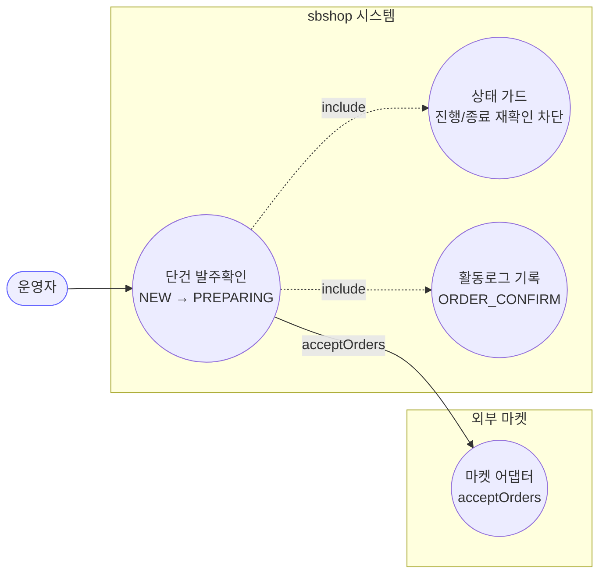
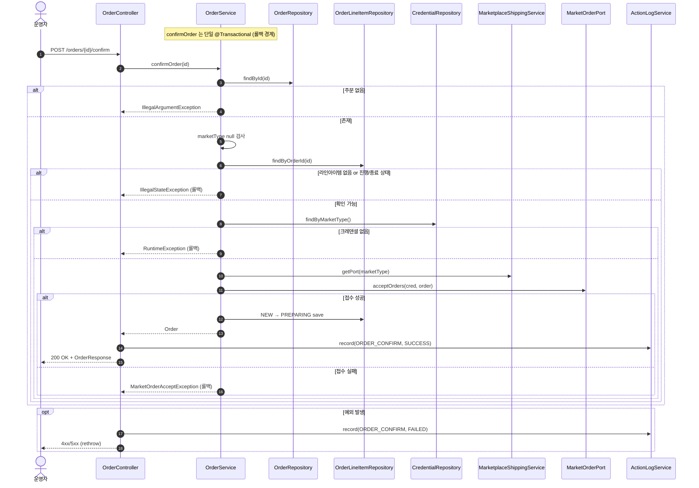
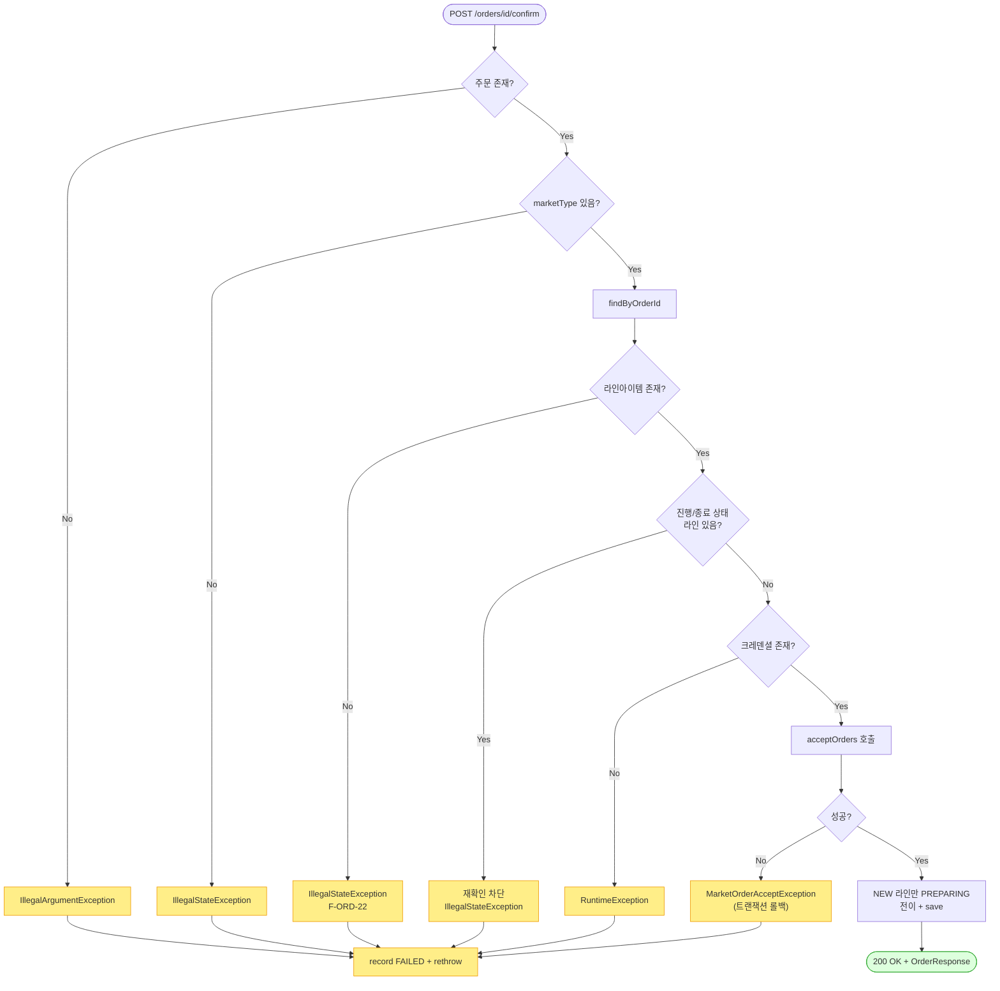

# POST /orders/{id}/confirm — 단건 발주확인

## 1. 개요

> 👉 이 표는 "주문 1건을 마켓에 접수 확인시키는 이 기능이 어떤 입구로 들어와서 무엇을 하고, 어떤 답을 돌려주는지"를 한눈에 정리한 것입니다.

| 항목 | 내용 |
|------|------|
| **Method / URL** | `POST /api/v1/orders/{id}/confirm` (주소 끝에 주문 번호 `id` 를 붙여 호출) |
| **목적** | 주문 하나를 골라 마켓에 "이 주문 접수했습니다"라고 알리고(`acceptOrders`), 그 주문의 아직 손대지 않은(`NEW`) 상품 항목들을 "준비중(`PREPARING`)"으로 바꾼다. |
| **핵심 상태전이** | 상품 항목 `NEW`(결제완료·미접수) → `PREPARING`(준비중). 단, 마켓 접수 알림이 성공한 뒤에만 바꾼다. |
| **부수효과** | 마켓에 접수 알림(`acceptOrders`)을 보내고, "발주확인함(`ORDER_CONFIRM`)"이라는 활동 기록을 남긴다. 이 모든 과정은 하나의 저장 묶음(`@Transactional`)이라, 마켓 접수가 실패하면 전용 오류로 전부 되돌린다(롤백). |
| **응답** | 성공하면 `200 OK` 와 주문 정보(`OrderResponse`). 실패하면 오류를 그대로 다시 던져(400·500) 화면에 전달한다. |

## 2. 호출 체인

> 👉 아래는 "요청이 들어온 순간부터 마켓 접수·상태 변경·기록까지, 코드가 어느 파일의 어느 줄을 거쳐 흘러가는지"를 순서대로 보여줍니다. 각 줄 오른쪽은 실제 코드 위치입니다.

```
OrderController.confirmOrder(id)                          api/.../controller/OrderController.java:97-113
  └─ orderService.confirmOrder(id)                        core/.../order/service/OrderService.java:59-123  @Transactional
       ├─ orderRepository.findById(id) → orElseThrow      :63-64  (IllegalArgumentException "Order not found")
       ├─ order.getMarketType() == null → throw           :67-69  (IllegalStateException)
       ├─ orderLineItemRepository.findByOrderId(id)       :73
       ├─ currentItems.isEmpty() → throw                  :76-78  (IllegalStateException, F-ORD-22)
       ├─ hasProgressedOrEnded 검사                       :80-92  (PREPARING 이상 or 종료상태 → 재확인 차단)
       ├─ credentialRepository.findByMarketType() → orElseThrow  :95-96  (RuntimeException "credentials not found")
       ├─ callMarketplaceAcceptApi(order, credential)     :98-105 (try) → catch → MarketOrderAcceptException  :104
       │    └─ marketplaceShippingService.getPort(marketType).acceptOrders(cred, order)  :606-609
       │         └─ MarketplaceShippingService.getPort()  core/.../service/MarketplaceShippingService.java:30-35
       │              └─ MarketOrderPort.acceptOrders()   core/.../order/port/MarketOrderPort.java:52
       └─ for each item: NEW → PREPARING 전이 + save       :108-119
  └─ actionLogService.record(ORDER_CONFIRM, marketOf(order), SUCCESS)  OrderController.java:104-105
  └─ (catch) actionLogService.record(ORDER_CONFIRM, marketNameOfOrder(id), FAILED) + rethrow  :109-111
  └─ OrderResponse.from(order)                            api/.../dto/OrderResponse.java:52-74
```

→ 쉽게 말하면 이런 순서입니다.
1. 주문 번호로 주문을 찾는다. 없으면 "주문 없음" 오류.
2. 이 주문이 어느 마켓 것인지(marketType) 확인. 비어 있으면 오류.
3. 주문에 딸린 상품 항목들을 가져온다.
4. 항목이 하나도 없으면 막는다(F-ORD-22).
5. 이미 준비중 이상으로 진행됐거나 취소·반품 등으로 끝난 항목이 하나라도 있으면 "다시 확인할 수 없다"며 막는다.
6. 마켓 접속에 필요한 인증정보(크레덴셜)를 찾는다. 없으면 오류.
7. 마켓에 "접수했다"고 알린다. 이 알림이 실패하면 전용 오류를 던져 전부 되돌린다.
8. 알림이 성공하면 `NEW` 항목만 `PREPARING`으로 바꿔 저장한다.
9. 마지막에 성공/실패를 활동 기록으로 남기고, 성공이면 주문 정보를 돌려준다.

**요청 파라미터**

| 필드 | 타입 | 필수 | 비고 |
|------|------|------|------|
| `id` | Long (path) | 필수 | 주문 번호. 이 번호의 주문이 없으면 `IllegalArgumentException`(400 성격의 오류)이 난다 |

## 3. 유스케이스 다이어그램

> 👉 이 그림은 "운영자가 발주확인 기능을 쓰면, 그 안에서 상태 가드·활동로그가 함께 돌고, 시스템이 외부 마켓에 접수 알림을 보낸다"는 관계를 보여줍니다.



## 4. 시퀀스 다이어그램

> 👉 이 그림은 "요청 한 건이 컨트롤러 → 서비스 → 저장소 → 마켓 순으로 오가며, 각 갈림길(주문 없음·항목 없음·인증정보 없음·접수 실패)에서 어떻게 처리되는지"를 시간 순서로 보여줍니다.



## 5. 순서도 (플로우차트)

> 👉 이 그림은 "요청이 들어온 뒤 통과해야 하는 검사들(주문 있나 → 마켓 있나 → 항목 있나 → 진행/종료 아닌가 → 인증정보 있나 → 마켓 접수 성공하나)을 차례로 그려, 어디서 막히면 어떤 오류가 나고 통과하면 어떻게 상태가 바뀌는지"를 보여줍니다.



## 6. 상태 전이표

> 👉 이 표는 "주문에 딸린 상품 항목들이 어떤 상태로 들어오면 발주확인을 허용하고, 그 결과 상태가 어떻게 바뀌며, 마켓에 알림이 나가는지"를 경우별로 정리한 것입니다.

진입 판단은 **한 주문에 딸린 상품 항목 전체**를 기준으로 한다.

| 진입 라인상태(집합) | 허용? | 결과 상태 | 마켓 전송 | 비고 |
|-----------|:-----:|-----------|-----------|------|
| 상품 항목이 하나도 없음 | ❌ | 안 바뀜 | — | 항목 없음(`isEmpty()`)으로 막음(76-78, F-ORD-22) |
| 하나라도 준비중(PREPARING) 이상으로 진행됨 | ❌ | 안 바뀜 | — | 이미 진행된 주문 재확인 막음(`hasProgressedOrEnded`, 80-92) |
| 하나라도 취소/반품/교환으로 끝남(CANCELED/RETURNED/EXCHANGED) | ❌ | 안 바뀜 | — | 끝난 주문 재확인 막음(86-88) |
| 전부 NEW(결제완료·미접수) | ✅ | NEW → `PREPARING` | acceptOrders 나감 | 마켓 접수 성공 후 상태 변경(108-119) |
| NEW + 상태 비어있음(null)이 섞임 | ✅(일부만) | NEW 항목만 PREPARING | acceptOrders 나감 | 상태 비어있는 항목은 검사(82-84)를 통과하지만 상태 변경 대상은 아님(111) |
| 마켓 접수 알림 실패 | ❌ | 안 바뀜(전부 되돌림) | 시도는 됨 | `MarketOrderAcceptException`으로 전체 롤백(104) |

## 7. 🔎 발견사항

### ORDB-1 · 🟡 SMELL — 상태 가드는 "라인 하나라도 진행/종료면 차단"인데 전이는 "NEW 라인만" — 혼재 주문 처리 비대칭
- **무엇이 문제인가:** 발주확인 전에 "항목 중 하나라도 진행됐거나 끝난 게 있으면 전체를 막는다"고 검사합니다. 그런데 상태 값이 아예 비어있는(null) 항목은 이 검사를 그냥 통과시킵니다. 반면 실제로 상태를 바꾸는 단계에서는 `NEW` 항목만 준비중으로 바꿉니다. 즉 "막을지 검사하는 대상"과 "실제로 바꾸는 대상"이 서로 다릅니다.
- **근거:** `OrderService.java:80-92` 의 `hasProgressedOrEnded` 는 항목을 하나씩 훑어(`anyMatch`) 하나라도 진행/종료면 전체를 막지만, 상태가 비어있는(shippingData 없음 또는 status null) 항목은 `return false`(82-84)로 통과시킨다. 실제 상태를 바꾸는 반복문(108-119)은 `NEW` 항목만 PREPARING 으로 바꾼다.
- **영향:** `NEW` 항목과 "상태 비어있는" 항목이 섞인 주문은 검사를 통과해 마켓에 접수 알림까지 나가지만, 상태가 비어있는 항목은 갱신되지 않고 남습니다. 데이터가 깨진(status null) 항목이 섞이면 마켓엔 접수가 나갔는데 내부는 일부만 바뀌어, 이후 흐름에서 그 항목이 유실될 수 있습니다.
- **제안:** 상태가 비어있는 항목을 어떻게 다룰지(막을지, NEW로 취급할지) 정책을 정하고, 마켓에 보내는 대상과 실제 상태를 바꾸는 대상을 똑같이 맞춘다.

### ORDB-2 · 🔵 NOTE — 접수 실패는 `MarketOrderAcceptException`, 크레덴셜 없음은 `RuntimeException` — 실패 원인이 응답코드로 구분되지 않음
- **무엇이 문제인가:** 발주확인이 실패하는 두 원인 — 마켓 접속에 필요한 인증정보(크레덴셜)가 없는 경우와, 마켓 접수 알림 자체가 실패한 경우 — 이 서로 다른 종류의 오류로 던져지지만, 컨트롤러가 이를 뭉뚱그려 다시 던지기 때문에 화면에는 둘 다 500 계열 오류로 보일 가능성이 큽니다.
- **근거:** `OrderService.java:95-96` 은 크레덴셜 미존재를 `RuntimeException` 으로, `:104` 는 접수 API 실패를 `MarketOrderAcceptException`(RuntimeException 의 하위 종류)으로 던진다. 컨트롤러(107-111)는 모든 예외를 그대로 다시 던지므로, 전역 예외 처리에서 둘 다 500 계열로 매핑될 가능성이 높다.
- **영향:** "설정을 안 넣어서 실패"와 "마켓이 일시적으로 오류"가 화면에서 같은 코드로 보이면, 운영자가 원인을 구분해 대응하기 어렵습니다(설정을 채워야 할지, 잠시 후 다시 시도할지).
- **제안:** 인증정보 없음 같은 설정성 오류와 외부 마켓 오류를 서로 다른 HTTP 상태코드(예: 409/424 대 502)로 나눠 매핑하는 것을 검토한다.

## 8. 테스트 커버리지 메모

> 👉 아래는 "이 기능의 어떤 부분이 이미 자동 테스트로 지켜지고 있고, 어떤 부분은 아직 테스트가 없는지"를 정리한 것입니다.

- `OrderServiceStateGuardTest` — 이미 진행된 주문을 다시 확인하려 하면 막히는지(`shippedOrder_reconfirm_blocked`), 이미 끝난 주문을 다시 확인하려 하면 막히는지(`canceledOrder_reconfirm_blocked`) 확인.
- `OrderServiceInputGuardTest` — 상품 항목이 하나도 없는 주문은 막히고 마켓 알림도 안 나가는지(`confirmOrder_withNoLineItems_blocked`) 확인(F-ORD-22).
- `OrderServiceConfirmFailureTypeTest` — 마켓 접수가 실패했을 때 `MarketOrderAcceptException` 으로 원래 원인·메시지가 그대로 보존되는지 확인(2건).
- `OrderControllerMarketTypeLogTest` — 실패했을 때 활동 기록에 어느 마켓 주문인지 제대로 채워지는지(F-ORD-5) 확인.
- **아직 테스트가 없는 경우:** ① NEW 항목과 상태 비어있는 항목이 섞인 주문에서 일부만 바뀌는 비대칭(ORDB-1), ② 마켓 정보(marketType)가 비어있어 막히는 단독 경우, ③ 인증정보 없음과 접수 실패가 서로 다른 응답코드로 구분되는지(ORDB-2).

---
*(쉬운 설명판 · 2026-07-17 재작성)*
*생성: 2026-07-17 · 근거: 현재 워킹트리*
