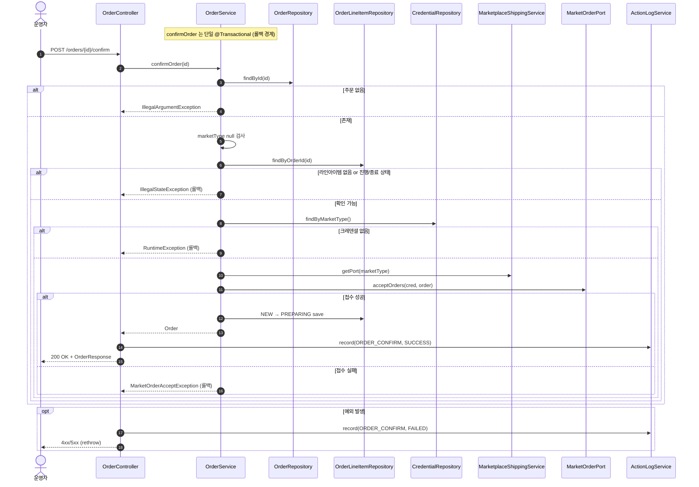

# POST /orders/{id}/confirm — 단건 발주확인

## 1. 개요

| 항목 | 내용 |
|------|------|
| **Method / URL** | `POST /api/v1/orders/{id}/confirm` (PathVariable `id`) |
| **목적** | 단일 주문을 마켓에 접수(acceptOrders)하고, 해당 주문의 `NEW` 라인아이템을 `PREPARING` 으로 전이한다. |
| **핵심 상태전이** | 라인아이템 `NEW` → `PREPARING` (마켓 접수 API 성공 후) |
| **부수효과** | 마켓 접수 API 호출(`acceptOrders`) + 활동로그 기록(`ORDER_CONFIRM`). 단일 `@Transactional` — 마켓 접수 실패 시 전용 예외로 롤백. |
| **응답** | `200 OK` + `OrderResponse` / 실패 시 예외 재던짐(400·500) |

## 2. 호출 체인

```
OrderController.confirmOrder(id)                          api/.../controller/OrderController.java:97-113
  └─ orderService.confirmOrder(id)                        core/.../order/service/OrderService.java:59-123  @Transactional
       ├─ orderRepository.findById(id) → orElseThrow      :63-64  (IllegalArgumentException "Order not found")
       ├─ order.getMarketType() == null → throw           :67-69  (IllegalStateException)
       ├─ orderLineItemRepository.findByOrderId(id)       :73
       ├─ currentItems.isEmpty() → throw                  :76-78  (IllegalStateException, F-ORD-22)
       ├─ hasProgressedOrEnded 검사                       :80-92  (PREPARING 이상 or 종료상태 → 재확인 차단)
       ├─ credentialRepository.findByMarketType() → orElseThrow  :95-96  (RuntimeException "credentials not found")
       ├─ callMarketplaceAcceptApi(order, credential)     :98-105 (try) → catch → MarketOrderAcceptException  :104
       │    └─ marketplaceShippingService.getPort(marketType).acceptOrders(cred, order)  :606-609
       │         └─ MarketplaceShippingService.getPort()  core/.../service/MarketplaceShippingService.java:30-35
       │              └─ MarketOrderPort.acceptOrders()   core/.../order/port/MarketOrderPort.java:52
       └─ for each item: NEW → PREPARING 전이 + save       :108-119
  └─ actionLogService.record(ORDER_CONFIRM, marketOf(order), SUCCESS)  OrderController.java:104-105
  └─ (catch) actionLogService.record(ORDER_CONFIRM, marketNameOfOrder(id), FAILED) + rethrow  :109-111
  └─ OrderResponse.from(order)                            api/.../dto/OrderResponse.java:52-74
```

**요청 파라미터**

| 필드 | 타입 | 필수 | 비고 |
|------|------|------|------|
| `id` | Long (path) | 필수 | 주문 PK. 미존재 시 `IllegalArgumentException` → 400 성격 |

## 3. 유스케이스 다이어그램


## 4. 시퀀스 다이어그램



## 5. 순서도 (플로우차트)


## 6. 상태 전이표

진입 판단은 **주문 내 라인아이템 집합**을 기준으로 한다.

| 진입 라인상태(집합) | 허용? | 결과 상태 | 마켓 전송 | 비고 |
|-----------|:-----:|-----------|-----------|------|
| 라인아이템 없음 | ❌ | 미변경 | — | `isEmpty()` 차단(76-78, F-ORD-22) |
| 하나라도 PREPARING 이상(진행) | ❌ | 미변경 | — | `hasProgressedOrEnded` 차단(80-92) |
| 하나라도 CANCELED/RETURNED/EXCHANGED(종료) | ❌ | 미변경 | — | 재확인 차단(86-88) |
| 전부 NEW | ✅ | NEW → `PREPARING` | acceptOrders | 접수 성공 후 전이(108-119) |
| NEW + null 상태 혼재 | ✅(부분) | NEW 만 PREPARING | acceptOrders | null 상태 라인은 `hasProgressedOrEnded=false`(82-84)로 통과하나 전이 대상 아님(111) |
| 접수 API 실패 | ❌ | 미변경(롤백) | 시도됨 | `MarketOrderAcceptException` 전체 롤백(104) |

## 7. 🔎 발견사항

### ORDB-1 · 🟡 SMELL — 상태 가드는 "라인 하나라도 진행/종료면 차단"인데 전이는 "NEW 라인만" — 혼재 주문 처리 비대칭
- **근거:** `OrderService.java:80-92` 의 `hasProgressedOrEnded` 는 `anyMatch` 로 하나라도 진행/종료면 전체 차단하지만, null 상태(shippingData 없음 또는 status null) 라인은 `return false`(82-84)로 통과시킨다. 전이 루프(108-119)는 `NEW` 라인만 PREPARING 으로 바꾼다.
- **영향:** `NEW` + `null 상태` 혼재 주문은 접수 API 를 호출하고 통과하지만 null 라인은 상태가 갱신되지 않는다. 반대로 이미 정상 데이터라면 문제없으나, 데이터 정합이 깨진(status null) 라인이 섞이면 마켓엔 접수가 나가고 로컬은 부분만 전이돼 이후 흐름에서 그 라인이 유실될 수 있다.
- **제안:** null 상태 라인의 처리 정책을 명시(차단 or NEW 취급)하고, 접수 대상 라인과 전이 대상 라인 집합을 일치시킨다.

### ORDB-2 · 🔵 NOTE — 접수 실패는 `MarketOrderAcceptException`, 크레덴셜 없음은 `RuntimeException` — 실패 원인이 응답코드로 구분되지 않음
- **근거:** `OrderService.java:95-96` 은 크레덴셜 미존재를 `RuntimeException` 으로, `:104` 는 접수 API 실패를 `MarketOrderAcceptException`(RuntimeException 서브타입)으로 던진다. 컨트롤러(107-111)는 모든 `Exception` 을 그대로 rethrow 하므로 전역 예외 처리에서 둘 다 500 계열로 매핑될 가능성이 높다.
- **영향:** "설정 누락(크레덴셜)"과 "마켓 일시 오류(접수)"가 클라이언트에서 동일 코드로 보여 운영자가 원인을 구분·대응하기 어렵다.
- **제안:** 크레덴셜 미존재 등 설정성 오류와 외부 마켓 오류를 상이한 HTTP 상태(예: 409/424 vs 502)로 매핑 검토.

## 8. 테스트 커버리지 메모

- `OrderServiceStateGuardTest` — `shippedOrder_reconfirm_blocked`(진행상태 재확인 차단), `canceledOrder_reconfirm_blocked`(종료상태 재확인 차단) 검증.
- `OrderServiceInputGuardTest` — `confirmOrder_withNoLineItems_blocked`(라인 없음 차단, 마켓 API 미호출) 검증(F-ORD-22).
- `OrderServiceConfirmFailureTypeTest` — 접수 실패 시 `MarketOrderAcceptException` 으로 cause·원 메시지 보존 검증(2건).
- `OrderControllerMarketTypeLogTest` — 실패 경로 활동로그 marketType 해석(F-ORD-5) 검증.
- **비어있는 케이스:** ① NEW+null 혼재 주문 전이 비대칭(ORDB-1), ② marketType null 차단 단독 케이스, ③ 크레덴셜 미존재 vs 접수실패의 응답코드 구분(ORDB-2).

---
*생성: 2026-07-17 · 근거: 현재 워킹트리*
