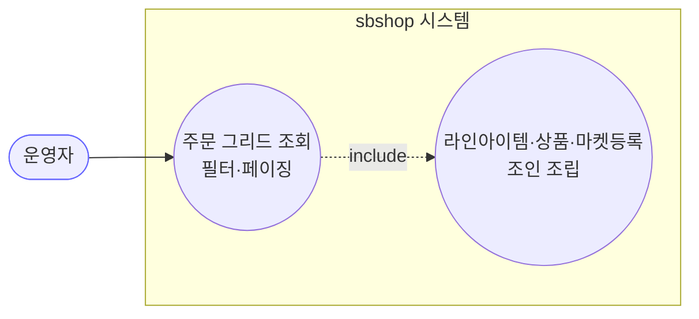

# GET /orders — 주문 목록(그리드) 조회

## 1. 개요

이 기능은 **여러 마켓에서 들어온 주문을 한 화면 표(그리드)로 모아서 보여주는 조회 기능**입니다. 마켓, 배송상태, 통관상태, 검색어, 기간 같은 조건으로 원하는 주문만 걸러 볼 수 있고, 한 번에 다 보여주는 대신 **페이지 단위로 나눠서** 가져옵니다. 조회만 하는 기능이라 데이터를 바꾸거나 마켓에 뭔가를 보내는 일은 전혀 없습니다.

| 항목 | 내용 (쉬운 설명) |
|------|------|
| **어떻게 호출하나** | `GET /api/v1/orders` — 주소 뒤에 필터 조건(`OrderSearchCondition`)과 페이지 정보(`Pageable`)를 붙여 보냅니다. |
| **무엇을 하나** | 마켓 / 배송상태 / 통관상태 / 검색어 / 기간 조건으로 주문을 골라, 페이지 단위로 가져옵니다. 그런 다음 각 주문에 그 주문의 상품 항목·상품 정보·마켓 등록 정보를 붙여서, 화면 표에 뿌릴 형태(DTO)로 만들어 돌려줍니다. |
| **상태를 바꾸나** | 아니요. 순수하게 읽기만 합니다(조회 전용). |
| **다른 곳에 영향 주나** | 없음. 이 조회는 "읽기 전용" 표시가 붙어 있어서 저장이나 마켓 전송 같은 부작용이 일어나지 않습니다. |
| **무엇을 돌려주나** | `200 OK` 와 함께 주문 목록 한 페이지(`Page<OrderDetailDto>`) |

## 2. 호출 체인

아래는 요청이 들어와서 결과가 나갈 때까지 **코드가 거쳐가는 순서**입니다. 각 줄 옆의 `파일명:줄번호`는 실제 그 일이 일어나는 코드 위치이고, "→ 쉽게 말하면" 부분이 그 단계가 하는 일입니다.

```
OrderController.getOrders()                            api/.../controller/OrderController.java:86-92
  └─ OrderSearchCondition (쿼리 바인딩)                 core/.../order/dto/OrderSearchCondition.java:11-19
  └─ Pageable (스프링 바인딩)
       └─ OrderService.searchOrders()                  core/.../order/service/OrderService.java:50-54  @Transactional(readOnly=true)
            └─ OrderRepository.searchOrderGrid()        core/.../order/repository/OrderRepository.java (Custom 위임)
                 └─ OrderRepositoryImpl.searchOrderGrid()   infrastructure/.../repository/order/OrderRepositoryImpl.java:40-131
                      ├─ 본문 쿼리(order + 필터 + orderBy + offset/limit)   :48-61
                      ├─ orderId in → OrderLineItem 조회                    :65-69
                      ├─ productId in → productRepository.findAllById()     :77-79
                      ├─ productId in → MarketRegistration 조회             :82-86
                      ├─ 그룹핑 후 OrderDetailDto 조립                       :91-118
                      └─ countQuery.fetchOne → PageableExecutionUtils.getPage :120-130
       └─ ResponseEntity.ok(dtoPage)                   OrderController.java:91
```

**→ 쉽게 말하면 이런 순서입니다:**
1. 사용자가 보낸 필터·페이지 조건을 받아 정리합니다(`getOrders` → `OrderSearchCondition`/`Pageable`).
2. "읽기 전용" 표시를 단 채로 조회 담당(`OrderService.searchOrders`)에게 넘깁니다. → 쉽게 말하면 "여긴 절대 아무것도 안 바꾸고 보기만 한다"는 약속.
3. 실제 DB 조회 담당(`OrderRepositoryImpl.searchOrderGrid`)이 조건에 맞는 주문을 먼저 한 페이지만큼 가져옵니다.
4. 그 주문들에 딸린 상품 항목(라인아이템)을 가져오고, 거기서 상품 정보와 마켓 등록 정보도 이어서 가져옵니다.
5. 이 조각들을 주문별로 묶어서 화면 표에 맞는 형태(OrderDetailDto)로 조립합니다.
6. 전체가 몇 건인지도 세어(countQuery), 한 페이지 결과로 만들어 그대로 돌려줍니다.

**보낼 수 있는 검색 조건 (`OrderSearchCondition`, `OrderSearchCondition.java:11-19`)** — 아래 조건들은 전부 선택이라, 안 넣으면 그 조건은 그냥 무시됩니다.

| 필드 | 타입 | 필수 | 쉬운 설명 |
|------|------|------|------|
| `marketTypes` | List\<MarketType\> | 선택 | 특정 마켓만 보고 싶을 때. 비워두면 마켓 구분 없이 전부. |
| `shippingStatuses` | List\<ShippingStatus\> | 선택 | 특정 배송상태만. "그 상태인 상품 항목이 하나라도 있는 주문"을 찾습니다. |
| `customsStatuses` | List\<CustomsStatus\> | 선택 | 특정 통관상태만. |
| `keyword` | String | 선택 | 주문·항목·상품의 여러 글자 중 일부만 일치해도 검색됩니다. |
| `startDate` / `endDate` | LocalDateTime | 선택 | 기간. 시작·끝 중 한쪽만 넣어도 그 경계로 걸러줍니다. |

## 3. 유스케이스 다이어그램

👉 이 그림은 **운영자가 "주문 목록 조회" 하나를 누르면, 시스템이 내부에서 "상품·마켓등록 정보 붙이기"까지 함께 해준다**는 것을 보여줍니다(include = 항상 같이 딸려오는 동작).



## 4. 시퀀스 다이어그램

👉 이 그림은 **요청 하나가 컨트롤러 → 서비스 → 저장소 순으로 넘어가면서 주문·상품·마켓등록을 차례로 모아 조립한 뒤 결과를 돌려주기까지의 대화 순서**를 보여줍니다.

```mermaid
sequenceDiagram
    autonumber
    actor U as 운영자
    participant C as OrderController
    participant S as OrderService
    participant R as OrderRepositoryImpl
    participant PR as ProductRepository
    Note over S: searchOrders 는 readOnly @Transactional (부수효과 없음)

    U->>C: GET /orders?filters&page
    C->>S: searchOrders(condition, pageable)
    S->>R: searchOrderGrid(condition, pageable)
    R->>R: 본문 쿼리(order + 필터 + 페이징)
    R->>R: orderId in → OrderLineItem 조회
    R->>PR: findAllById(productIds)
    R->>R: MarketRegistration 조회
    R->>R: 그룹핑 → OrderDetailDto 조립
    R->>R: countQuery.fetchOne
    R-->>S: Page&lt;OrderDetailDto&gt;
    S-->>C: Page&lt;OrderDetailDto&gt;
    C-->>U: 200 OK + Page&lt;OrderDetailDto&gt;
```

## 5. 순서도 (플로우차트)

👉 이 그림은 **조회한 주문이 있는지 없는지, 상품 정보가 있는지 없는지에 따라 갈라지는 처리 흐름**을 보여줍니다. 결국 어느 길로 가든 마지막엔 결과 한 페이지를 돌려줍니다.


## 6. 상태 전이표

**바뀌는 상태 없음(조회 전용)** — 이 기능은 화면에 보여줄 목적으로 읽기만 하고, 주문이나 상품의 어떤 상태도 바꾸지 않습니다. 코드에도 "읽기 전용" 표시(`@Transactional(readOnly = true)`, `OrderService.java:39`)가 달려 있어서, 마켓에 무언가 보내거나 저장하는 부작용이 없습니다.

## 7. 🔎 발견사항

### ORDA-1 · 🟡 SMELL — 배송상태 필터와 검색어가 따로 놀아, 둘을 같이 걸면 서로 다른 상품에서 조건이 맞아도 검색됨
- **무엇이 문제인가:** 목록 조회에서 "배송상태" 필터와 "검색어"는 각각 따로 "이 조건에 맞는 상품 항목이 하나라도 있나?"를 확인합니다. 그래서 한 주문에 상품이 여러 개 있으면, **A 항목이 '발송됨'이고, 전혀 다른 B 항목의 송장번호가 검색어에 맞아도** 그 주문이 검색 결과에 나옵니다. 두 조건이 같은 항목에서 동시에 맞아야 하는 게 아니라, 서로 다른 항목에서 따로따로 맞아도 통과하는 것입니다.
- **근거:** `OrderRepositoryImpl.java:139-150`(`shippingStatusIn`)와 `:159-186`(`keywordContains`)가 각각 별개의 `exists` 서브쿼리를 만든다. 예컨대 "배송상태=SHIPPED" + "키워드=송장번호"를 함께 주면, 한 라인이 SHIPPED이고 다른 라인의 송장번호가 키워드에 매치되어도(둘이 서로 다른 라인이라도) 주문이 조회된다. 두 조건이 각각 다른 라인에서 충족돼도 AND로 묶여 주문이 통과한다.
- **왜 문제인가:** 상품이 여러 개인 주문에서, 운영자는 "같은 상품이 두 조건을 다 만족"하길 기대하는데 실제로는 그렇지 않아, 원하는 것보다 더 많은 주문이 걸려 나올 수 있습니다.
- **어떻게 고치면 되나:** 두 조건을 "같은 항목에서 둘 다 만족"하도록 하나로 합칠지, 아니면 지금의 "주문 단위로 항목 중 하나라도 맞으면 통과" 방식이 원래 의도인지 명세로 정하고, 의도라면 문서에 남깁니다.

### ORDA-2 · 🔵 NOTE — 한 페이지에 담을 개수의 상한이 없어, 아주 큰 개수를 요청하면 서버 부담이 커짐
- **무엇이 문제인가:** 목록 조회는 사용자가 요청한 페이지 크기를 그대로 받아들이고, 조회 후 각 주문에 상품·마켓등록 정보를 앱에서 하나하나 붙여 조립합니다. 그런데 "한 번에 최대 몇 건까지"라는 상한이 없습니다.
- **근거:** `OrderRepositoryImpl.java:58-59`는 `pageable.getPageSize()`를 그대로 `limit`으로 사용하고, 이후 라인아이템·상품·마켓등록을 애플리케이션에서 조립(`:65-118`)한다. 컨트롤러(`OrderController.java:87-88`)에 `@PageableDefault` 등 상한이 없다.
- **왜 문제인가:** `?size=100000` 같은 요청이 들어오면 대량 조회와 메모리 조립을 유발합니다. 조회 기능이라 데이터가 깨질 위험은 없지만, 성능·메모리 부담에 노출됩니다.
- **어떻게 고치면 되나:** 페이지의 기본 크기·최대 크기 정책(설정값 `spring.data.web.pageable.max-page-size` 또는 `@PageableDefault`)을 명시합니다.

### ORDA-3 · 🔵 NOTE — 같은 상품·같은 마켓에 등록이 여러 개면 그중 아무거나 하나만 표시될 수 있음
- **무엇이 문제인가:** 주문 표에 마켓 등록 정보를 붙일 때, 상품마다 "마켓이 일치하는 첫 번째 등록"만 골라 담습니다. 그래서 같은 상품·같은 마켓에 등록이 여러 건 있으면, 그중 하나만(사실상 아무거나) 화면에 나옵니다.
- **근거:** `OrderRepositoryImpl.java:100-105`는 `regsByProductId`에서 `r.getMarketType() == o.getMarketType()`인 첫 등록만(`findFirst`) DTO에 담는다. 동일 상품·동일 마켓에 복수 등록이 있으면 임의의 한 건만 노출된다.
- **왜 문제인가:** 보통은 상품·마켓당 등록이 1건이라 괜찮지만, 중복 등록이 있으면 표에 나오는 등록정보가 조회할 때마다 달라질(예측 불가) 수 있습니다.
- **어떻게 고치면 되나:** 상품·마켓당 등록이 하나만 유효하도록 데이터·제약으로 보장하거나, 여러 건일 때 어느 것을 고를지 규칙을 명시합니다.

## 8. 테스트 커버리지 메모

- 이 조회 기능(`searchOrders`/`searchOrderGrid`)을 직접 검사하는 테스트가 아직 없습니다(저장소 통합 테스트 부재).
- **지금 보장되는 약속:** 없음(조회 경로만 검사하는 테스트를 못 찾음).
- **아직 검사 안 하는 경우들:**
  - ① 배송상태 + 검색어를 같이 걸었을 때 "같은 항목이냐 다른 항목이냐"의 의미(ORDA-1),
  - ② 기간을 한쪽만 넣었을 때 경계 처리(`dateBetween`, `OrderRepositoryImpl.java:189-200`),
  - ③ 조회 결과가 비었을 때 상품·항목 조회를 건너뛰는 흐름(`:65`, `:77`),
  - ④ 페이지 크기 상한(ORDA-2).
- 조회 기능이라 데이터가 깨질 위험은 낮지만, 특히 필터 조합(ORDA-1)에 대한 테스트를 추가하길 권장합니다.

---
*(쉬운 설명판 · 2026-07-17 재작성)*
*생성: 2026-07-17 · 근거: 현재 워킹트리*
