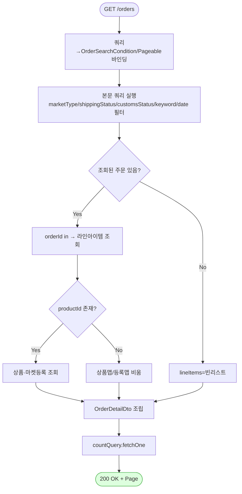

# GET /orders — 주문 그리드 조회

## 1. 개요

| 항목 | 내용 |
|------|------|
| **Method / URL** | `GET /api/v1/orders` (쿼리 파라미터 `OrderSearchCondition` + `Pageable`) |
| **목적** | 마켓/배송상태/통관상태/키워드/기간 필터로 주문을 페이지 단위 조회하고, 각 주문에 라인아이템·상품·마켓등록 정보를 조인해 그리드용 DTO로 반환한다. |
| **핵심 상태전이** | 없음 (읽기 전용 조회) |
| **부수효과** | 없음. `OrderService`는 클래스 레벨 `@Transactional(readOnly = true)`, `searchOrders`는 read-only 트랜잭션에서 실행. |
| **응답** | `200 OK` + `Page<OrderDetailDto>` |

## 2. 호출 체인

```
OrderController.getOrders()                            api/.../controller/OrderController.java:86-92
  └─ OrderSearchCondition (쿼리 바인딩)                 core/.../order/dto/OrderSearchCondition.java:11-19
  └─ Pageable (스프링 바인딩)
       └─ OrderService.searchOrders()                  core/.../order/service/OrderService.java:50-54  @Transactional(readOnly=true)
            └─ OrderRepository.searchOrderGrid()        core/.../order/repository/OrderRepository.java (Custom 위임)
                 └─ OrderRepositoryImpl.searchOrderGrid()   infrastructure/.../repository/order/OrderRepositoryImpl.java:40-131
                      ├─ 본문 쿼리(order + 필터 + orderBy + offset/limit)   :48-61
                      ├─ orderId in → OrderLineItem 조회                    :65-69
                      ├─ productId in → productRepository.findAllById()     :77-79
                      ├─ productId in → MarketRegistration 조회             :82-86
                      ├─ 그룹핑 후 OrderDetailDto 조립                       :91-118
                      └─ countQuery.fetchOne → PageableExecutionUtils.getPage :120-130
       └─ ResponseEntity.ok(dtoPage)                   OrderController.java:91
```

**요청 파라미터 (`OrderSearchCondition`, `OrderSearchCondition.java:11-19`)**

| 필드 | 타입 | 필수 | 비고 |
|------|------|------|------|
| `marketTypes` | List\<MarketType\> | 선택 | null/empty 시 필터 미적용 |
| `shippingStatuses` | List\<ShippingStatus\> | 선택 | 라인아이템 서브쿼리 `exists` |
| `customsStatuses` | List\<CustomsStatus\> | 선택 | Order 임베드 컬럼 |
| `keyword` | String | 선택 | 주문/라인/상품 필드 부분일치 |
| `startDate` / `endDate` | LocalDateTime | 선택 | 한쪽만 있어도 경계 적용 |

## 3. 유스케이스 다이어그램


## 4. 시퀀스 다이어그램

```mermaid
sequenceDiagram
    autonumber
    actor U as 운영자
    participant C as OrderController
    participant S as OrderService
    participant R as OrderRepositoryImpl
    participant PR as ProductRepository
    Note over S: searchOrders 는 readOnly @Transactional (부수효과 없음)

    U->>C: GET /orders?filters&page
    C->>S: searchOrders(condition, pageable)
    S->>R: searchOrderGrid(condition, pageable)
    R->>R: 본문 쿼리(order + 필터 + 페이징)
    R->>R: orderId in → OrderLineItem 조회
    R->>PR: findAllById(productIds)
    R->>R: MarketRegistration 조회
    R->>R: 그룹핑 → OrderDetailDto 조립
    R->>R: countQuery.fetchOne
    R-->>S: Page&lt;OrderDetailDto&gt;
    S-->>C: Page&lt;OrderDetailDto&gt;
    C-->>U: 200 OK + Page&lt;OrderDetailDto&gt;
```

## 5. 순서도 (플로우차트)



## 6. 상태 전이표

**상태 전이 없음(조회)** — 읽기 전용 그리드 조회로 어떤 도메인 상태도 변경하지 않는다. `OrderService` 클래스 레벨 `@Transactional(readOnly = true)`(`OrderService.java:39`)로 실행되며 마켓 전송·저장 부수효과가 없다.

## 7. 🔎 발견사항

### ORDA-1 · 🟡 SMELL — 배송상태 필터와 키워드 검색이 서로 독립 서브쿼리라 조합 필터 시 의미가 어긋날 수 있음
- **근거:** `OrderRepositoryImpl.java:139-150`(`shippingStatusIn`)와 `:159-186`(`keywordContains`)는 각각 별개의 `exists` 서브쿼리를 만든다. 예컨대 "배송상태=SHIPPED" + "키워드=송장번호"를 함께 주면, 한 라인이 SHIPPED이고 다른 라인의 송장번호가 키워드에 매치되어도(둘이 서로 다른 라인이라도) 주문이 조회된다. 두 조건이 각각 다른 라인에서 충족돼도 AND로 묶여 주문이 통과한다.
- **영향:** 배송상태와 라인 기반 키워드를 동시에 좁힐 때, 운영자 기대와 달리 "동일 라인에서 둘 다 만족"이 보장되지 않는다. 다품목 주문에서 과도포함이 발생할 수 있다.
- **제안:** 두 필터를 동일 라인 서브쿼리로 결합할지, 현재의 "주문 단위 OR-of-lines" 의미가 의도인지 명세로 확정. 의도라면 문서화.

### ORDA-2 · 🔵 NOTE — 페이지 크기 상한이 없어 큰 `size` 요청 시 조인 조립 비용이 선형 증가
- **근거:** `OrderRepositoryImpl.java:58-59`는 `pageable.getPageSize()`를 그대로 `limit`으로 사용하고, 이후 라인아이템·상품·마켓등록을 애플리케이션에서 조립(`:65-118`)한다. 컨트롤러(`OrderController.java:87-88`)에 `@PageableDefault` 등 상한이 없다.
- **영향:** `?size=100000` 같은 요청이 대량 in-절 조회 + 메모리 그룹핑을 유발할 수 있다. 조회 API라 데이터 정합 위험은 없으나 성능/메모리 노출.
- **제안:** `Pageable` 기본·최대 크기 정책(`spring.data.web.pageable.max-page-size` 또는 `@PageableDefault`)을 명시.

### ORDA-3 · 🔵 NOTE — 마켓등록 조인이 상품당 마켓타입 일치 첫 건만 선택
- **근거:** `OrderRepositoryImpl.java:100-105`는 `regsByProductId`에서 `r.getMarketType() == o.getMarketType()`인 첫 등록만(`findFirst`) DTO에 담는다. 동일 상품·동일 마켓에 복수 등록이 있으면 임의의 한 건만 노출된다.
- **영향:** 대개 상품·마켓당 등록은 1건이라 문제 없으나, 중복 등록 행이 존재하면 그리드에 표시되는 등록정보가 비결정적일 수 있다.
- **제안:** 상품·마켓당 유효 등록 유일성을 데이터/제약으로 보장하거나, 다건일 때의 선택 규칙을 명시.

## 8. 테스트 커버리지 메모

- `searchOrders`/`searchOrderGrid`를 직접 대상으로 하는 단위 테스트가 검색되지 않음(리포지토리 통합 테스트 부재).
- **검증되는 계약:** 없음(조회 경로 전용 테스트 미발견).
- **비어있는 케이스:** ① 배송상태+키워드 조합 시 라인 경계 의미(ORDA-1), ② 기간 한쪽만 지정(`dateBetween` 경계, `OrderRepositoryImpl.java:189-200`), ③ 빈 결과 시 라인/상품 조회 스킵 경로(`:65`,`:77`), ④ 페이지 크기 상한(ORDA-2).
- 조회 API 특성상 정합 위험은 낮으나, 필터 조합(특히 ORDA-1)에 대한 슬라이스/통합 테스트 추가 권장.

---
*생성: 2026-07-17 · 근거: 현재 워킹트리*
