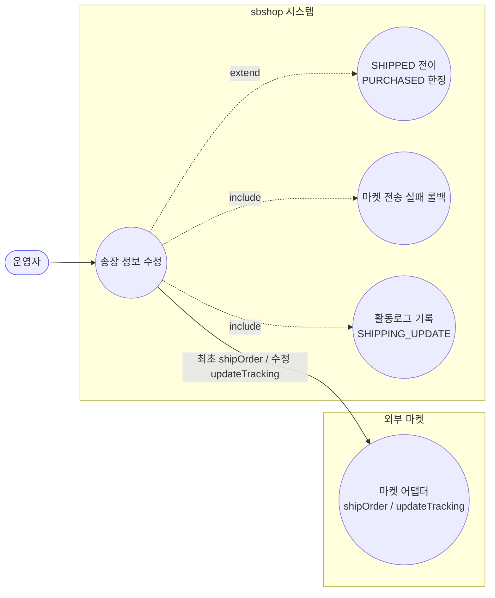
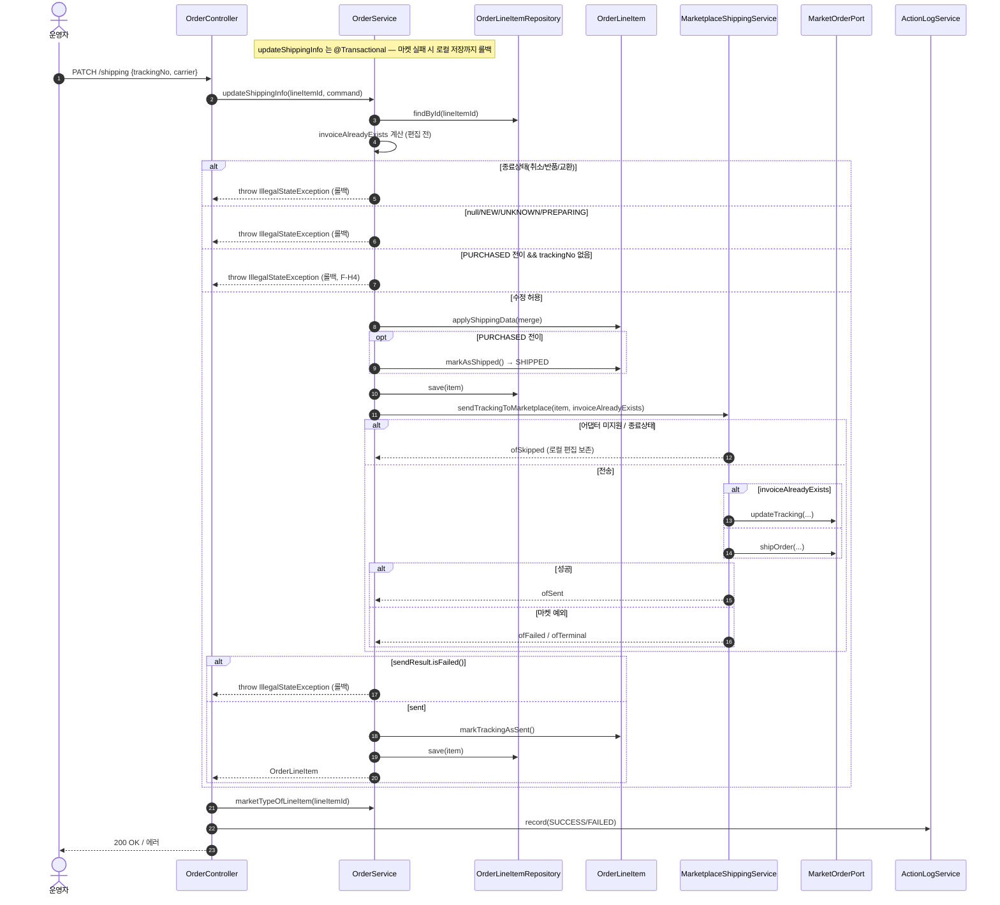

# PATCH /line-items/{lineItemId}/shipping — 라인아이템 배송(송장) 정보 수정

## 1. 개요

| 항목 | 내용 |
|------|------|
| **Method / URL** | `PATCH /api/v1/orders/line-items/{lineItemId}/shipping` (바디 `ShippingUpdateRequest`) |
| **목적** | 라인아이템의 송장번호·택배사를 수정하고 마켓에 전송한다. `PURCHASED` 이면 `SHIPPED` 로 전이(최초 등록), `SHIPPED` 이후면 송장 수정. |
| **핵심 상태전이** | `PURCHASED` → `SHIPPED` (송장번호 필수), `SHIPPED` 이후는 상태 불변 송장 수정 |
| **부수효과** | 로컬 저장 후 마켓 API 전송(`shipOrder` 최초 등록 / `updateTracking` 수정). 마켓 실패 시 `@Transactional` 롤백. 활동로그 `SHIPPING_UPDATE`. |
| **응답** | `200 OK` + `OrderLineItemResponse` / 상태가드·마켓실패 시 예외 → 에러 응답 |

## 2. 호출 체인

```
OrderController.updateShippingInfo()                        api/.../controller/OrderController.java:273-291
  ├─ ShippingUpdateRequest.toCommand()                      api/.../dto/ShippingUpdateRequest.java:12-17
  └─ orderService.updateShippingInfo(lineItemId, command)   core/.../order/service/OrderService.java:316-375  @Transactional
        ├─ orderLineItemRepository.findById() → orElseThrow core/.../order/service/OrderService.java:320-321
        ├─ invoiceAlreadyExists 계산(편집 전 송장 존재 여부)  core/.../order/service/OrderService.java:325-327
        ├─ 종료상태(CANCELED/RETURNED/EXCHANGED) 차단        core/.../order/service/OrderService.java:333-336
        ├─ null/NEW/UNKNOWN/PREPARING 차단                   core/.../order/service/OrderService.java:339-342
        ├─ PURCHASED 전이 판정 + 전이 시 송장번호 필수(F-H4)  core/.../order/service/OrderService.java:345-351
        ├─ item.applyShippingData(cmd.toShippingData(existing)) core/.../order/service/OrderService.java:354 → ShippingUpdateCommand.toShippingData() dto/ShippingUpdateCommand.java:18-29
        ├─ (전이 시) item.markAsShipped()                   core/.../order/service/OrderService.java:355-357 → domain/order/OrderLineItem.java:75-79
        ├─ orderLineItemRepository.save(item)               core/.../order/service/OrderService.java:358
        ├─ marketplaceShippingService.sendTrackingToMarketplace(item, invoiceAlreadyExists) core/.../order/service/OrderService.java:362 → MarketplaceShippingService.java:62-119
        │     ├─ findPort() empty → ofSkipped(어댑터 미지원)  service/MarketplaceShippingService.java:88-93
        │     ├─ invoiceAlreadyExists ? port.updateTracking() : port.shipOrder() service/MarketplaceShippingService.java:98-106
        │     └─ 예외 → terminal/failed 결과                 service/MarketplaceShippingService.java:107-115
        ├─ failIfNotSent(item, sendResult)                  core/.../order/service/OrderService.java:363 → 577-587 (failed/terminal → throw → 롤백)
        └─ markSentIfSucceeded(item, sendResult, lineItemId) core/.../order/service/OrderService.java:364 → 595-603 (sent → markTrackingAsSent + save)
  └─ actionLogService.record(SHIPPING_UPDATE, marketNameOfLineItem, SUCCESS/FAILED) api/.../controller/OrderController.java:283-289
```

**요청 바디 (`ShippingUpdateRequest`, `ShippingUpdateRequest.java:8-10`)**

| 필드 | 타입 | 필수 | 비고 |
|------|------|------|------|
| `trackingNo` | String | 조건부 | PURCHASED→SHIPPED 전이 시 필수(:349). SHIPPED 이후 수정 시 가드 없음 |
| `shippingCarrier` | ShippingCarrier | 선택 | null 이면 미변경(부분 병합) |

## 3. 유스케이스 다이어그램



## 4. 시퀀스 다이어그램



## 5. 순서도 (플로우차트)


## 6. 상태 전이표

| 진입 라인상태 | 허용? | 결과 상태 | 마켓 전송 | 비고 |
|-----------|:-----:|-----------|-----------|------|
| null / `NEW` / `UNKNOWN` / `PREPARING` | ❌ | 불변 | — | 차단(:339-342) |
| `CANCELED` / `RETURNED` / `EXCHANGED` | ❌ | 불변 | — | 종료상태 차단(:333-336, F-H2) |
| `PURCHASED` + 송장번호 있음 | ✅ | `SHIPPED` | `shipOrder`(최초등록, invoice 없으면) | 전이(:345-357) |
| `PURCHASED` + 송장번호 없음 | ❌ | 불변 | — | 차단(:349-351, F-H4) |
| `SHIPPED` + 기존 송장 있음 | ✅ | `SHIPPED`(불변) | `updateTracking`(수정) | invoiceAlreadyExists=true |
| `SHIPPED` + 기존 송장 없음 | ✅ | `SHIPPED`(불변) | `shipOrder`(최초등록) | 동기화 지연 등 예외 케이스 |
| `DELIVERED` | ✅ | 불변 | 전송 시도 → 마켓 terminal 시 롤백 | 명시 차단 없음(ORDC-4) |
| 마켓 어댑터 없는 마켓(Cafe24 등) | ✅ | (전이 반영) | 스킵 | 로컬 저장 유지(:88-93) |

## 7. 🔎 발견사항

### ORDC-4 · 🟠 GAP — `DELIVERED`(배송완료) 상태 라인의 송장 수정이 상태 가드로 차단되지 않음
- **근거:** `OrderService.java:333-342` 의 차단 목록은 종료상태(CANCELED/RETURNED/EXCHANGED)와 초기상태(null/NEW/UNKNOWN/PREPARING)만 포함하고 `DELIVERED` 는 빠져 있다. 따라서 DELIVERED 라인도 `else` 분기(상태 불변 송장 수정)로 통과해 `sendTrackingToMarketplace` 가 호출된다.
- **영향:** 배송완료된 건의 송장 수정 요청이 로컬 저장 후 마켓 전송을 시도한다. 마켓이 배송완료 잠금으로 거부하면 `isNonRetryableMarketState`(`MarketplaceShippingService.java:126-133`)가 terminal 로 잡아 `@Transactional` 롤백(`OrderService.java:581-584`)되어 데이터 정합은 보전되나, 마켓이 거부 메시지를 알려진 문자열로 주지 않으면 `ofFailed` 로 분류돼 재시도 대상이 되는 등 진입 자체가 부적절하다. 배송완료 후 로컬 편집을 시도하는 것 자체를 진입부에서 걸러내는 편이 명확하다.
- **제안:** DELIVERED 를 진입 가드에 포함할지, 아니면 "완료 후 송장 정정은 마켓 terminal 판정에 위임"이 의도된 설계인지 명문화. terminal 판정이 마켓 메시지 문자열 매칭에 의존하는 점이 이 GAP의 잔여 리스크.

### ORDC-5 · 🔵 NOTE — `terminal` 재시도불가 판정이 한글 오류 메시지 문자열 매칭에 의존
- **근거:** `MarketplaceShippingService.isNonRetryableMarketState`(`:126-133`)는 마켓 응답 메시지에 `"배송진행상태가 유효하지 않습니다"`, `"이미 배송완료"`, `"배송완료된"` 문자열이 포함되는지로 terminal 여부를 판정한다.
- **영향:** 쿠팡 메시지 문구가 바뀌거나 다른 마켓이 다른 문구/코드로 거부하면 terminal 을 놓쳐 `ofFailed` 로 분류 → 무한 재시도 대상이 될 수 있다. 마켓 오류 분류가 문자열 상수에 결합되어 취약.
- **제안:** 마켓별 오류 코드/타입 기반 분류로 이행하거나, 최소한 마켓별 terminal 판정을 포트 어댑터로 위임하는 방안 검토.

### ORDC-6 · 🟡 SMELL — 실패 경로 활동로그의 마켓 타입이 항상 null (소싱 경로와 동일 패턴)
- **근거:** `OrderController.java:287-289` catch 블록은 `record(SHIPPING_UPDATE, null, FAILED, ...)`. 성공 경로(:283)만 `marketNameOfLineItem(lineItemId)` 로 마켓을 해석한다. `marketTypeOfLineItem` 은 read-only 조회라 예외와 무관하게 호출 가능하다(`OrderService.java:545-551`).
- **영향:** 배송 실패 활동로그에서 마켓별 집계·필터 불가. 발주확인/취소 실패 경로가 `marketNameOfOrder` 로 마켓을 채우는 것과 비대칭.
- **제안:** 실패 경로에서도 `marketNameOfLineItem` 로 마켓 해석 시도.

## 8. 테스트 커버리지 메모

- **상태 가드:** `OrderServiceShippingGuardTest` — 종료상태(CANCELED/RETURNED) 송장수정 차단·마켓 전송/저장 없음, SHIPPED 송장수정 마켓 terminal 전용 메시지 롤백(3건). ✅
- **F-H4 전이 가드:** `OrderServiceInputGuardTest` — PURCHASED→SHIPPED 전이 시 trackingNo 없음/공백 차단·전송/저장 없음(2건). ✅
- **롤백 계약:** `OrderServiceShippingRollbackTest`(5건) — 마켓 failed → 롤백 예외, sent → 정상 반환, skipped → 로컬 편집 보존, SHIPPED+기존송장 → sendTracking(true) 수정, PURCHASED+무송장 → sendTracking(false) 최초등록. ✅
- **terminal 분류:** `MarketplaceShippingTerminalTest`(2건).
- **비어있는 케이스:** ① `DELIVERED` 상태 진입(ORDC-4) — 명시 테스트 없음, ② 실패 경로 활동로그 마켓 null(ORDC-6), ③ 어댑터 미지원 마켓(Cafe24)의 스킵 후 로컬 저장 유지 경로.

---
*생성: 2026-07-17 · 근거: 현재 워킹트리*
