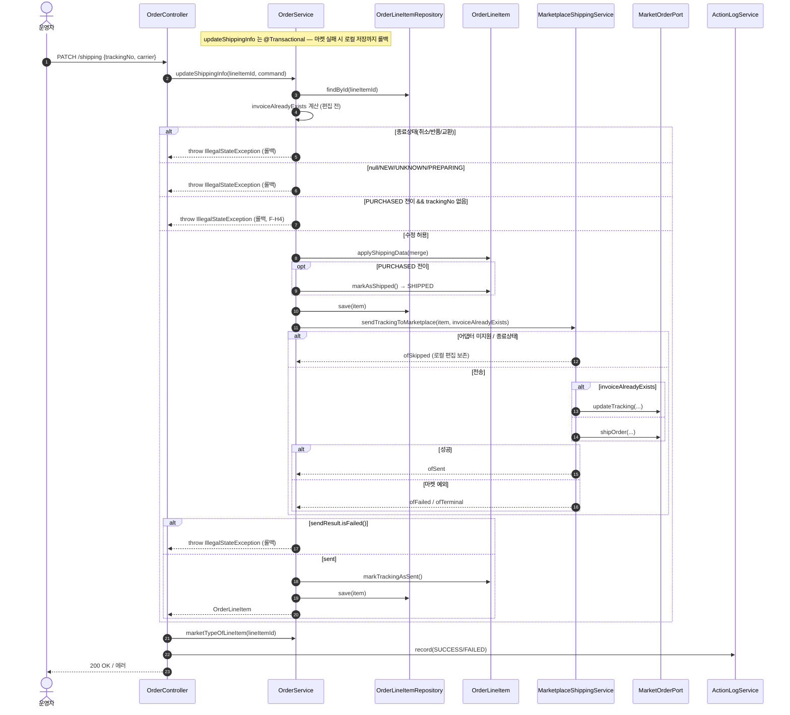
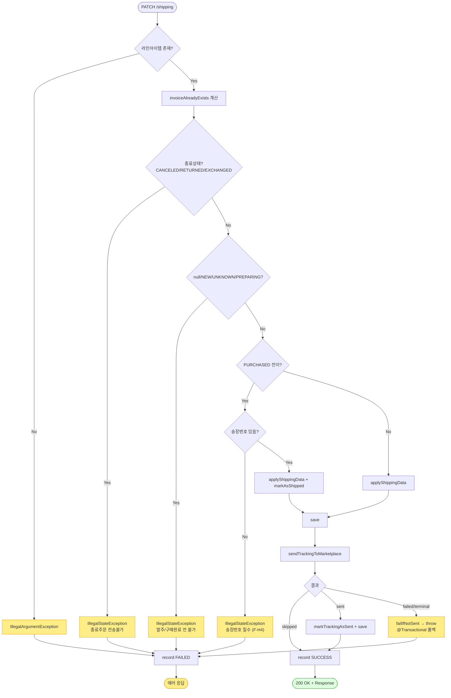

# PATCH /line-items/{lineItemId}/shipping — 주문 상품 한 줄의 "배송(송장) 정보" 수정

## 1. 개요

> 이 기능은 한마디로: **주문에 들어온 상품 한 줄을 골라, 그 줄의 송장번호와 택배사를 입력·수정하고 그 값을 실제 마켓에도 보내주는 창구**입니다. 아직 "구매완료(PURCHASED)"이던 항목에 송장을 처음 달면 "발송됨(SHIPPED)"으로 넘어가고, 이미 발송된 항목이면 송장만 고쳐서 마켓에 다시 알려줍니다. 마켓 전송이 실패하면 우리 DB 저장까지 전부 되돌립니다.

| 항목 | 쉬운 설명 |
|------|------|
| **주소(Method / URL)** | `PATCH /api/v1/orders/line-items/{lineItemId}/shipping` — 특정 상품 줄(lineItemId)의 송장 정보를 고쳐 달라는 요청. 보내는 내용은 `ShippingUpdateRequest`. |
| **무엇을 하나** | 상품 한 줄의 송장번호·택배사를 저장하고 마켓에 보냅니다. 그 줄이 "구매완료(PURCHASED)"였다면 송장을 처음 다는 것이므로 "발송됨(SHIPPED)"으로 넘겨줍니다. 이미 발송된 상태면 송장만 수정합니다. |
| **상태가 어떻게 바뀌나** | `구매완료(PURCHASED)` → `발송됨(SHIPPED)` (이때는 송장번호가 반드시 있어야 함). 이미 발송된 뒤에는 상태는 그대로 두고 송장만 고칩니다. |
| **딸려오는 일(부수효과)** | 우리 DB에 먼저 저장한 뒤 마켓에 전송합니다(처음 등록이면 `shipOrder`, 수정이면 `updateTracking`). 마켓 전송이 실패하면 방금 저장한 것까지 통째로 되돌립니다(`@Transactional` 롤백). 그리고 활동기록(`SHIPPING_UPDATE`)을 남깁니다. |
| **응답** | 잘되면 `200 OK`와 함께 바뀐 상품 줄 정보를 돌려줍니다. 지금 고치면 안 되는 상태이거나 마켓 전송이 실패하면 오류로 막습니다. |

## 2. 호출 체인

> 아래는 요청이 처리될 때 **코드가 거쳐 가는 순서**입니다. 각 줄 오른쪽은 실제 코드 위치이고, "→ 쉽게 말하면"에 그 단계가 무슨 뜻인지 풀어 적었습니다.

```
OrderController.updateShippingInfo()                        api/.../controller/OrderController.java:273-291
  ├─ ShippingUpdateRequest.toCommand()                      api/.../dto/ShippingUpdateRequest.java:12-17
  └─ orderService.updateShippingInfo(lineItemId, command)   core/.../order/service/OrderService.java:316-375  @Transactional
        ├─ orderLineItemRepository.findById() → orElseThrow core/.../order/service/OrderService.java:320-321
        ├─ invoiceAlreadyExists 계산(편집 전 송장 존재 여부)  core/.../order/service/OrderService.java:325-327
        ├─ 종료상태(CANCELED/RETURNED/EXCHANGED) 차단        core/.../order/service/OrderService.java:333-336
        ├─ null/NEW/UNKNOWN/PREPARING 차단                   core/.../order/service/OrderService.java:339-342
        ├─ PURCHASED 전이 판정 + 전이 시 송장번호 필수(F-H4)  core/.../order/service/OrderService.java:345-351
        ├─ item.applyShippingData(cmd.toShippingData(existing)) core/.../order/service/OrderService.java:354 → ShippingUpdateCommand.toShippingData() dto/ShippingUpdateCommand.java:18-29
        ├─ (전이 시) item.markAsShipped()                   core/.../order/service/OrderService.java:355-357 → domain/order/OrderLineItem.java:75-79
        ├─ orderLineItemRepository.save(item)               core/.../order/service/OrderService.java:358
        ├─ marketplaceShippingService.sendTrackingToMarketplace(item, invoiceAlreadyExists) core/.../order/service/OrderService.java:362 → MarketplaceShippingService.java:62-119
        │     ├─ findPort() empty → ofSkipped(어댑터 미지원)  service/MarketplaceShippingService.java:88-93
        │     ├─ invoiceAlreadyExists ? port.updateTracking() : port.shipOrder() service/MarketplaceShippingService.java:98-106
        │     └─ 예외 → terminal/failed 결과                 service/MarketplaceShippingService.java:107-115
        ├─ failIfNotSent(item, sendResult)                  core/.../order/service/OrderService.java:363 → 577-587 (failed/terminal → throw → 롤백)
        └─ markSentIfSucceeded(item, sendResult, lineItemId) core/.../order/service/OrderService.java:364 → 595-603 (sent → markTrackingAsSent + save)
  └─ actionLogService.record(SHIPPING_UPDATE, marketNameOfLineItem, SUCCESS/FAILED) api/.../controller/OrderController.java:283-289
```

- **`updateShippingInfo()` (입구)** → 쉽게 말하면: 화면에서 온 "송장정보 수정" 요청을 가장 먼저 받는 문지기입니다.
- **`orderService.updateShippingInfo(...)` (@Transactional)** → 쉽게 말하면: 실제 저장과 마켓 전송을 담당하는 핵심 로직. `@Transactional` 덕분에 마켓 전송이 실패하면 방금 한 저장까지 통째로 되돌립니다.
- **`findById() → orElseThrow`** → 쉽게 말하면: 고치려는 상품 줄이 실제로 있는지 찾습니다. 없으면 오류.
- **`invoiceAlreadyExists 계산`** → 쉽게 말하면: 이 줄에 **이미 송장이 달려 있었는지**를 편집하기 전에 미리 확인해 둡니다. 이 값으로 나중에 "처음 등록"인지 "수정"인지를 판단합니다.
- **종료상태 차단** → 쉽게 말하면: 이미 취소·반품·교환으로 끝난 주문이면 송장 수정을 막습니다.
- **null/NEW/UNKNOWN/PREPARING 차단** → 쉽게 말하면: 아직 구매완료 전(초기·준비중)인 줄이면 발송으로 넘길 수 없으니 막습니다.
- **PURCHASED 전이 판정 + 송장번호 필수** → 쉽게 말하면: "구매완료"였던 줄을 "발송됨"으로 넘길 때는 송장번호가 반드시 있어야 합니다.
- **`applyShippingData(...)`** → 쉽게 말하면: 새로 들어온 송장번호·택배사를 기존 값에 덮어씁니다(안 온 값은 그대로 둠).
- **`markAsShipped()`** → 쉽게 말하면: 상태를 "발송됨(SHIPPED)"으로 도장 찍습니다.
- **`save(item)`** → 쉽게 말하면: 바뀐 내용을 먼저 DB에 저장합니다.
- **`sendTrackingToMarketplace(...)`** → 쉽게 말하면: 마켓에 송장을 실제로 보냅니다. 어댑터가 없는 마켓(예: Cafe24)이면 그냥 건너뛰고(ofSkipped) 우리 저장만 남깁니다. 이미 송장이 있었으면 "수정(updateTracking)", 처음이면 "등록(shipOrder)"으로 보냅니다.
- **`failIfNotSent(...)`** → 쉽게 말하면: 마켓 전송이 실패(failed/terminal)했으면 오류를 내서 앞서 한 저장까지 통째로 되돌립니다.
- **`markSentIfSucceeded(...)`** → 쉽게 말하면: 마켓 전송이 성공했으면 "마켓에 잘 보냄" 표시를 하고 다시 저장합니다.
- **`actionLogService.record(...)`** → 쉽게 말하면: "누가 송장을 고쳤고 성공/실패했다"는 기록을 남깁니다.

**요청 바디 (`ShippingUpdateRequest`, `ShippingUpdateRequest.java:8-10`)** — 화면에서 보내는 값들입니다.

| 필드 | 타입 | 필수 | 쉬운 설명 |
|------|------|------|------|
| `trackingNo` | String | 조건부 | 송장번호. "구매완료 → 발송됨"으로 넘길 때는 반드시 있어야 함(:349). 이미 발송된 뒤 수정할 때는 필수 아님. |
| `shippingCarrier` | ShippingCarrier | 선택 | 택배사. 값을 안 보내면 기존 값 그대로 둠(부분 병합). |

## 3. 유스케이스 다이어그램

> 👉 이 그림은 **운영자가 이 기능으로 할 수 있는 일**(송장 수정, 그에 딸린 발송됨 전이·마켓 전송 실패 시 되돌리기·활동로그 기록)과, 그 과정에서 **외부 마켓과 주고받는 부분**을 한눈에 보여줍니다.


## 4. 시퀀스 다이어그램

> 👉 이 그림은 요청이 들어온 순간부터 응답까지, **각 부품(컨트롤러·서비스·저장소·마켓 전송·마켓 어댑터·활동로그)이 어떤 순서로 메시지를 주고받는지**를 시간 순서로 보여줍니다. 상태가 맞지 않아 막히는 경우, 마켓이 성공/실패한 경우, 실패 시 저장까지 되돌리는(롤백) 경우가 함께 그려져 있습니다.



## 5. 순서도 (플로우차트)

> 👉 이 그림은 요청이 들어왔을 때 **어떤 조건을 차례로 따지며 갈라지는지**를 "예/아니오" 갈림길로 보여줍니다. 상태 검사 → 송장번호 검사 → 마켓 전송 결과(건너뜀/성공/실패)로 이어지는 흐름을 위에서 아래로 따라 읽으면 됩니다.



## 6. 상태 전이표

> 이 표는 **상품 줄이 지금 어떤 상태냐에 따라 송장 수정을 허용하는지, 그 결과 상태와 마켓에 어떻게 보내는지**를 정리한 것입니다. ✅는 허용, ❌는 막힘입니다.

| 지금 상태(진입 라인상태) | 수정 허용? | 처리 후 상태 | 마켓 전송 | 쉬운 설명 |
|-----------|:-----:|-----------|-----------|------|
| null / `NEW` / `UNKNOWN` / `PREPARING` (초기·준비중) | ❌ | 그대로 | — | 아직 구매완료 전이라 막음(:339-342) |
| `CANCELED`(취소) / `RETURNED`(반품) / `EXCHANGED`(교환) | ❌ | 그대로 | — | 이미 끝난 주문이라 막음(:333-336, F-H2) |
| `PURCHASED`(구매완료) + 송장번호 있음 | ✅ | `SHIPPED`(발송됨) | `shipOrder`(처음 등록, 기존 송장 없을 때) | 발송됨으로 넘김(:345-357) |
| `PURCHASED`(구매완료) + 송장번호 없음 | ❌ | 그대로 | — | 번호가 없어 발송으로 넘길 수 없어 막음(:349-351, F-H4) |
| `SHIPPED`(발송됨) + 기존 송장 있음 | ✅ | `SHIPPED` 그대로 | `updateTracking`(수정) | 이미 있던 송장을 고쳐 다시 알림(invoiceAlreadyExists=true) |
| `SHIPPED`(발송됨) + 기존 송장 없음 | ✅ | `SHIPPED` 그대로 | `shipOrder`(처음 등록) | 동기화 지연 등으로 송장이 비어있던 예외 상황 |
| `DELIVERED`(배송완료) | ✅ | 그대로 | 전송 시도 → 마켓이 "완료라 안 됨"이라고 하면 되돌림 | 여기엔 막는 가드가 없음(ORDC-4) |
| 마켓 어댑터가 없는 마켓(Cafe24 등) | ✅ | (상태 전이는 반영) | 건너뜀 | 마켓엔 안 보내고 우리 저장만 유지(:88-93) |

## 7. 🔎 발견사항

### ORDC-4 · 🟠 GAP — 이미 배송완료(`DELIVERED`)된 줄의 송장 수정이 걸러지지 않고 마켓 전송까지 시도됨
- **무엇이 문제인가:** 송장 수정을 막는 "차단 목록"에 배송완료(DELIVERED) 상태가 빠져 있습니다. 그래서 이미 배송이 끝난 줄도 검사를 통과해 마켓에 송장을 보내려고 시도합니다.
- **근거:** `OrderService.java:333-342` 의 차단 목록은 종료상태(CANCELED/RETURNED/EXCHANGED)와 초기상태(null/NEW/UNKNOWN/PREPARING)만 포함하고 `DELIVERED` 는 빠져 있다. 따라서 DELIVERED 라인도 `else` 분기(상태 불변 송장 수정)로 통과해 `sendTrackingToMarketplace` 가 호출된다.
- **왜 문제인가:** 배송완료 건은 마켓이 대개 "이미 배송완료라 안 됨"으로 거부합니다. 시스템은 이 거부를 알아보면 저장을 되돌려(롤백) 데이터는 지켜집니다. 하지만 마켓이 거부 사유를 우리가 아는 정해진 문구로 알려주지 않으면, 이를 "일시 실패"로 잘못 분류해 계속 재시도 대상으로 남길 수 있습니다. 애초에 배송완료 건은 입구에서 걸러내는 편이 깔끔합니다.
- **어떻게 고치면 되나:** DELIVERED를 입구 차단 목록에 넣거나, "완료 후 송장 정정은 마켓 거부 판정에 맡긴다"가 의도된 설계라면 그렇게 문서로 명확히 합니다. 그 거부 판정이 아래 ORDC-5(문구 매칭)에 의존한다는 점이 남는 위험입니다.

### ORDC-5 · 🔵 NOTE — "재시도해도 소용없음(terminal)" 판정이 한글 오류 메시지 문구가 맞는지에 의존해 취약함
- **무엇이 문제인가:** 마켓 전송이 실패했을 때 "이건 다시 보내봐야 소용없는 최종 상황인가"를 판정하는데, 그 판정을 마켓 응답 메시지에 `"배송진행상태가 유효하지 않습니다"`, `"이미 배송완료"`, `"배송완료된"` 같은 특정 한글 문구가 들어 있는지로 합니다.
- **근거:** `MarketplaceShippingService.isNonRetryableMarketState`(`:126-133`)는 마켓 응답 메시지에 위 문자열이 포함되는지로 terminal 여부를 판정한다.
- **왜 문제인가:** 쿠팡이 문구를 조금만 바꾸거나, 다른 마켓이 다른 문구·코드로 거부하면 최종 상황임을 놓쳐 "일시 실패"로 잘못 분류하고, 결국 무한 재시도 대상으로 만들 수 있습니다. 오류 분류가 정해진 문자열에 묶여 있어 깨지기 쉽습니다.
- **어떻게 고치면 되나:** 마켓별 오류 코드/타입 기반 분류로 바꾸거나, 최소한 최종 판정을 각 마켓 어댑터에 맡기는 방안을 검토합니다.

### ORDC-6 · 🟡 SMELL — 송장 수정이 실패했을 때, 활동로그에 "어느 마켓 주문이었는지"가 항상 비어(null) 남음 (구매정보 경로와 같은 패턴)
- **무엇이 문제인가:** 송장 수정이 성공하면 활동로그에 마켓 이름을 채우지만, 실패하면 마켓 칸이 항상 비어(null) 있습니다. 앞선 구매정보 수정의 ORDC-3과 똑같은 문제입니다.
- **근거:** `OrderController.java:287-289` catch 블록은 `record(SHIPPING_UPDATE, null, FAILED, ...)`. 성공 경로(:283)만 `marketNameOfLineItem(lineItemId)` 로 마켓을 해석한다. `marketTypeOfLineItem` 은 read-only 조회라 예외와 무관하게 호출 가능하다(`OrderService.java:545-551`).
- **왜 문제인가:** 배송 실패 로그를 마켓별로 골라보거나 집계할 수 없습니다. 발주확인·취소의 실패 로그가 마켓을 채우는 것과 다릅니다.
- **어떻게 고치면 되나:** 실패했을 때도 상품 줄로 마켓을 조회해 채워 넣습니다.

## 8. 테스트 커버리지 메모

> 이 기능이 **어떤 상황까지 자동 테스트로 검증되고 있고, 어떤 상황은 아직 테스트가 비어 있는지**를 정리한 메모입니다. ✅는 이미 테스트로 확인된 것입니다.

- **상태 가드:** `OrderServiceShippingGuardTest` — 끝난 상태(취소/반품)의 송장수정을 막고 마켓 전송·저장을 안 함, 이미 발송된 줄의 송장수정 시 마켓이 "완료라 안 됨"으로 거부하면 되돌리는지(3건). ✅
- **F-H4 전이 가드:** `OrderServiceInputGuardTest` — 구매완료 → 발송됨으로 넘길 때 송장번호가 없거나 공백이면 막고, 전송·저장을 안 함(2건). ✅
- **되돌리기(롤백) 계약:** `OrderServiceShippingRollbackTest`(5건) — 마켓 실패 → 되돌림 오류, 성공 → 정상 반환, 건너뜀 → 우리 저장은 유지, 발송됨+기존 송장 → 수정 전송(updateTracking), 구매완료+송장 없음 → 처음 등록 전송(shipOrder). ✅
- **최종 상황 분류:** `MarketplaceShippingTerminalTest`(2건).
- **아직 테스트가 없는 상황:** ① 배송완료(`DELIVERED`) 상태로 들어오는 경우(ORDC-4) — 명시 테스트 없음, ② 실패했을 때 로그의 마켓이 비는 문제(ORDC-6), ③ 어댑터가 없는 마켓(Cafe24)에서 건너뛴 뒤 우리 저장은 유지되는 경로.

---
*(쉬운 설명판 · 2026-07-17 재작성)*
*생성: 2026-07-17 · 근거: 현재 워킹트리*
