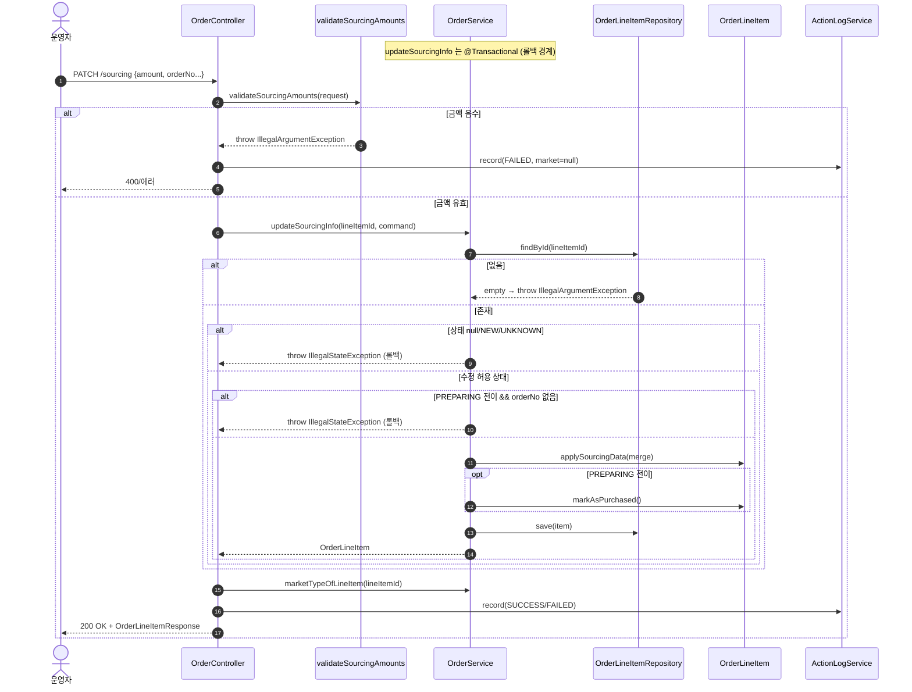
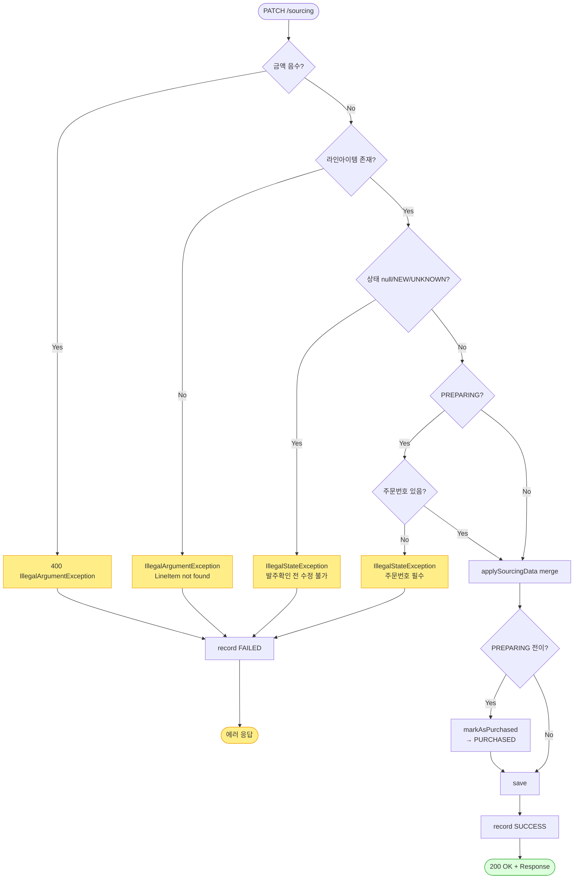

# PATCH /line-items/{lineItemId}/sourcing — 주문 상품 한 줄의 "구매(소싱) 정보" 수정

## 1. 개요

> 이 기능은 한마디로: **주문에 들어온 상품 한 줄을 골라, 그걸 우리가 어디서·얼마에 사왔는지(구매처·계정·구매주문번호·구매금액·물류비 등)를 입력·수정하는 창구**입니다. 구매 정보를 채우면서, 아직 "준비중(PREPARING)"이던 항목은 "구매완료(PURCHASED)"로 넘어갑니다. 마켓에 뭔가를 보내지는 않고, 우리 DB에만 저장합니다.

| 항목 | 쉬운 설명 |
|------|------|
| **주소(Method / URL)** | `PATCH /api/v1/orders/line-items/{lineItemId}/sourcing` — 특정 상품 줄(lineItemId)의 구매 정보를 고쳐 달라는 요청. 보내는 내용은 `SourcingUpdateRequest`. |
| **무엇을 하나** | 상품 한 줄의 구매 정보(구매처·계정·구매주문번호·구매금액·물류비·할인코드)를 저장합니다. 그 줄이 "준비중(PREPARING)" 상태였다면 "구매완료(PURCHASED)"로 넘겨줍니다. |
| **상태가 어떻게 바뀌나** | `준비중(PREPARING)` → `구매완료(PURCHASED)` (이때는 구매주문번호가 반드시 있어야 함). 그 밖의 상태에서는 상태는 그대로 두고 정보만 고칩니다. |
| **딸려오는 일(부수효과)** | 마켓에 아무것도 보내지 않고 우리 DB에만 저장합니다. 그리고 "누가 언제 구매정보를 고쳤다"는 활동기록(`PURCHASE_UPDATE`)을 남깁니다. |
| **응답** | 잘되면 `200 OK`와 함께 바뀐 상품 줄 정보를 돌려줍니다. 금액이 음수이거나 지금 고치면 안 되는 상태이면 오류로 막습니다. |

## 2. 호출 체인

> 아래는 요청이 들어와서 처리될 때까지 **코드가 거쳐 가는 순서**입니다. 각 줄 오른쪽은 실제 코드 위치(파일:줄번호)이고, "→ 쉽게 말하면"에 그 단계가 무슨 뜻인지 풀어 적었습니다.

```
OrderController.updateSourcingInfo()                         api/.../controller/OrderController.java:233-254
  ├─ validateSourcingAmounts(request)                        api/.../controller/OrderController.java:242 → 261-270
  │     └─ requireNonNegative(sourcingAmount, logisticsCost) api/.../controller/OrderController.java:266-270 (signum()<0 → IllegalArgumentException=400)
  ├─ SourcingUpdateRequest.toCommand()                       api/.../dto/SourcingUpdateRequest.java:17-26
  └─ orderService.updateSourcingInfo(lineItemId, command)    core/.../order/service/OrderService.java:275-313  @Transactional
        ├─ orderLineItemRepository.findById() → orElseThrow  core/.../order/service/OrderService.java:279-280
        ├─ 상태 가드: null/NEW/UNKNOWN → IllegalStateException core/.../order/service/OrderService.java:283-288
        ├─ PREPARING 전이 판정 + 주문번호 필수 가드          core/.../order/service/OrderService.java:291-295
        ├─ item.applySourcingData(cmd.toSourcingData(existing)) core/.../order/service/OrderService.java:298 → SourcingUpdateCommand.toSourcingData() dto/SourcingUpdateCommand.java:20-35
        ├─ (전이 시) item.markAsPurchased()                  core/.../order/service/OrderService.java:299-301 → domain/order/OrderLineItem.java:68-72
        └─ orderLineItemRepository.save(item)                core/.../order/service/OrderService.java:302
  └─ actionLogService.record(PURCHASE_UPDATE, marketNameOfLineItem, SUCCESS/FAILED) api/.../controller/OrderController.java:246-252
        └─ marketNameOfLineItem → orderService.marketTypeOfLineItem() core/.../order/service/OrderService.java:545-551
```

- **`updateSourcingInfo()` (입구)** → 쉽게 말하면: 화면에서 온 "구매정보 수정" 요청을 가장 먼저 받는 문지기입니다.
- **`validateSourcingAmounts` → `requireNonNegative`** → 쉽게 말하면: 구매금액·물류비가 **음수(마이너스)**이면 여기서 바로 잘못된 요청(400)으로 막습니다. 돈이 마이너스일 수는 없으니까요.
- **`toCommand()`** → 쉽게 말하면: 화면에서 온 요청을 내부에서 다루기 좋은 형태로 바꿔줍니다.
- **`orderService.updateSourcingInfo(...)` (@Transactional)** → 쉽게 말하면: 실제 저장을 담당하는 핵심 로직. `@Transactional`은 "여기서 하는 일들을 한 묶음으로 처리하고, 중간에 문제가 생기면 통째로 되돌린다"는 안전장치입니다.
- **`findById() → orElseThrow`** → 쉽게 말하면: 고치려는 그 상품 줄이 실제로 있는지 찾습니다. 없으면 오류를 냅니다.
- **상태 가드 (null/NEW/UNKNOWN 차단)** → 쉽게 말하면: 아직 발주확인도 안 된 초기 상태(비어있음·NEW·UNKNOWN)면 구매정보 수정을 막습니다.
- **PREPARING 전이 판정 + 주문번호 필수** → 쉽게 말하면: "준비중"이던 줄을 "구매완료"로 넘길 때는 구매주문번호가 반드시 있어야 합니다.
- **`applySourcingData(...)`** → 쉽게 말하면: 새로 들어온 구매 정보를 기존 값에 덮어씁니다(값이 안 온 항목은 그대로 둠).
- **`markAsPurchased()`** → 쉽게 말하면: 상태를 "구매완료(PURCHASED)"로 도장 찍습니다.
- **`save(item)`** → 쉽게 말하면: 바뀐 내용을 DB에 저장합니다.
- **`actionLogService.record(...)`** → 쉽게 말하면: "누가 구매정보를 고쳤고 성공/실패했다"는 기록을 남깁니다. 이때 어느 마켓 주문이었는지도 함께 적습니다.

**요청 바디 (`SourcingUpdateRequest`, `SourcingUpdateRequest.java:9-16`)** — 화면에서 보내는 값들입니다.

| 필드 | 타입 | 필수 | 쉬운 설명 |
|------|------|------|------|
| `sourcingAccount` | String | 선택 | 구매에 쓴 계정. 값을 안 보내면 기존 값 그대로 둠(부분 병합). |
| `sourcingOrderNo` | String | 조건부 | 구매주문번호. "준비중 → 구매완료"로 넘길 때는 반드시 있어야 함(:293). |
| `sourcingAmount` | BigDecimal | 선택 | 구매금액. 음수는 거부(:262), 비어있거나 0은 허용. |
| `logisticsCost` | BigDecimal | 선택 | 물류비. 음수는 거부(:263), 비어있거나 0은 허용. |
| `discountCode` | String | 선택 | 할인코드. 값을 안 보내면 기존 값 그대로 둠. |
| `sourcingVendor` | String | 선택 | 구매처(벤더). 값을 안 보내면 기존 값 그대로 둠. |

## 3. 유스케이스 다이어그램

> 👉 이 그림은 **운영자가 이 기능으로 할 수 있는 일들**(구매정보 수정, 그에 딸려 일어나는 구매완료 전이·음수 금액 거부·활동로그 기록)이 서로 어떻게 엮여 있는지 한눈에 보여줍니다.


## 4. 시퀀스 다이어그램

> 👉 이 그림은 요청이 들어온 순간부터 응답이 나갈 때까지, **각 부품(컨트롤러·검증기·서비스·저장소·활동로그)이 서로 어떤 순서로 메시지를 주고받는지**를 시간 순서대로 보여줍니다. 금액이 음수일 때(막힘)와 정상일 때, 그리고 상태가 맞지 않아 되돌려지는(롤백) 갈림길이 함께 그려져 있습니다.



## 5. 순서도 (플로우차트)

> 👉 이 그림은 요청이 들어왔을 때 **어떤 조건을 차례로 따져가며 갈라지는지**를 "예/아니오" 갈림길로 보여줍니다. 위에서 아래로 따라 읽으면, 결국 성공(200 OK)으로 가는지 오류로 가는지가 드러납니다.



## 6. 상태 전이표

> 이 표는 **상품 줄이 지금 어떤 상태냐에 따라 구매정보 수정을 허용하는지, 그리고 그 결과 상태가 어떻게 되는지**를 정리한 것입니다. ✅는 허용, ❌는 막힘입니다.

| 지금 상태(진입 라인상태) | 수정 허용? | 처리 후 상태 | 마켓 전송 | 쉬운 설명 |
|-----------|:-----:|-----------|-----------|------|
| null / `NEW` / `UNKNOWN` (초기) | ❌ | 그대로 | — | 아직 발주확인 전이라 막음, 오류로 거부(:286-288) |
| `PREPARING`(준비중) + 구매주문번호 있음 | ✅ | `PURCHASED`(구매완료) | 없음 | 구매완료로 넘기며 구매정보 반영(:291-301) |
| `PREPARING`(준비중) + 구매주문번호 없음 | ❌ | 그대로 | — | 번호가 없어 넘길 수 없어 막음(:292-295) |
| `PURCHASED`(구매완료) | ✅ | `PURCHASED` 그대로 | 없음 | 상태는 그대로 두고 정보만 고침(:308) |
| `SHIPPED`(발송됨) / `DELIVERED`(배송완료) | ✅ | 그대로 | 없음 | 상태는 그대로, 정보만 고침 허용 |
| `CANCELED`(취소) / `RETURNED`(반품) / `EXCHANGED`(교환) | ✅ | 그대로 | 없음 | 이미 끝난 주문인데도 구매정보 수정을 허용함(막는 가드 없음) |

## 7. 🔎 발견사항

### ORDC-1 · 🟠 GAP — 이미 끝난 주문(취소/반품/교환)의 구매정보를 나중에 바꿀 수 있음
- **무엇이 문제인가:** 구매정보 수정은 "아직 초기 상태(비어있음/NEW/UNKNOWN)"일 때만 막습니다. 그래서 이미 취소·반품·교환으로 완전히 끝난 주문도 구매정보를 그대로 고칠 수 있습니다. 바로 옆의 배송정보 수정(`updateShippingInfo`)은 끝난 주문을 확실히 막는데, 구매정보 쪽만 안 막습니다.
- **근거:** `OrderService.java:283-288` 의 상태 가드는 `null/NEW/UNKNOWN` 만 차단하고, 종료상태(CANCELED/RETURNED/EXCHANGED)는 통과시킨다. 대칭 경로인 배송정보 수정(`updateShippingInfo`, `OrderService.java:333-336`)은 종료상태를 명시적으로 차단한다. 테스트 `OrderServiceStateGuardTest#endStateItem_clearsDiscountCode_withEmptyString` 는 이를 "허용"으로 확정한다.
- **왜 문제인가:** 이 구매금액·물류비·구매주문번호 값들은 나중에 정산과 원가 계산의 근거가 됩니다. 이미 끝난 주문의 이 값을 임의로 바꾸면, 정산 숫자가 실제와 어긋날 수 있습니다.
- **어떻게 고치면 되나:** 구매정보 수정에도 배송정보 수정과 똑같이 "끝난 주문은 막기" 규칙을 넣거나, 반대로 "끝난 뒤에도 원가 정정은 허용한다"가 원래 의도라면 그 사실을 문서로 분명히 남깁니다. 정책이라면 NOTE로 낮추고, 아니면 배송 쪽과 똑같이 막는 가드를 추가합니다.

### ORDC-2 · 🔵 NOTE — 음수 금액을 막는 검사가 입구(컨트롤러)에만 있고, 핵심 저장 로직에는 없음
- **무엇이 문제인가:** 구매금액·물류비가 음수인지 확인해 거부하는 검사가 오직 API 입구(컨트롤러)에서만 이뤄집니다. 실제 저장을 담당하는 서비스나 도메인(구매정보 값)에는 음수 검사가 없습니다.
- **근거:** 음수 거부는 `OrderController.validateSourcingAmounts`(`OrderController.java:242, 261-270`)에서만 수행된다. `OrderService.updateSourcingInfo` 나 `SourcingData` 도메인에는 signum 검증이 없다.
- **왜 문제인가:** 지금은 이 컨트롤러가 유일한 통로라 괜찮습니다. 하지만 나중에 배치·워커·다른 내부 코드에서 저장 로직을 직접 부르면, 음수 금액이 검사 없이 그대로 저장될 수 있습니다. 방어가 한 곳(입구)에만 있어 취약합니다.
- **어떻게 고치면 되나:** 음수 금지 규칙을 구매정보 값(`SourcingData`)이나 서비스 진입부로 내려서, 어느 경로로 들어와도 항상 걸러지게 하는 방안을 검토합니다.

### ORDC-3 · 🟡 SMELL — 구매정보 수정이 실패했을 때, 활동로그에 "어느 마켓 주문이었는지"가 항상 비어(null) 남음
- **무엇이 문제인가:** 구매정보 수정이 성공하면 활동로그에 마켓 이름을 채워 넣습니다. 그런데 실패하면 마켓 칸이 항상 비어(null) 있습니다. 마켓 이름을 알아내는 조회는 실패와 상관없이 할 수 있는데도, 실패 경로에서는 이를 안 합니다.
- **근거:** `OrderController.java:250-252` catch 블록은 `record(PURCHASE_UPDATE, null, FAILED, ...)` 로 마켓 타입을 null 로 남긴다. 성공 경로(:246)는 `marketNameOfLineItem(lineItemId)` 로 마켓을 해석한다. `marketTypeOfLineItem`(`OrderService.java:545-551`)은 read-only 조회라 실패 예외 트랜잭션과 무관하게 호출 가능하다.
- **왜 문제인가:** 실패 활동로그만 봐서는 "어느 마켓 주문이 실패했는지" 마켓별로 골라보거나 통계를 낼 수 없습니다(마켓별 실패 통계가 빠짐). 발주확인·취소의 실패 로그는 마켓을 채워 넣는데, 구매정보 수정만 다릅니다.
- **어떻게 고치면 되나:** 실패했을 때도 상품 줄로 마켓을 조회해 채워 넣습니다(마켓 조회 자체가 실패할 때만 어쩔 수 없이 null).

## 8. 테스트 커버리지 메모

> 이 기능이 **어떤 상황까지 자동 테스트로 검증되고 있고, 어떤 상황은 아직 테스트가 비어 있는지**를 정리한 메모입니다. ✅는 이미 테스트로 확인된 것입니다.

- **입구의 음수 검증:** `OrderControllerSourcingValidationTest`(3건) — 구매금액/물류비가 음수면 400으로 거부하고 서비스는 부르지도 않음, 0이나 비어있는 값은 통과. ✅
- **상태 가드/전이:** `OrderServiceStateGuardTest` — 준비중+구매주문번호 → 구매완료로 넘기고 저장(`preparingItem_sourcingUpdateWithOrderNo_becomesPurchased`), 준비중+번호 없음 → 막고 저장 안 함(`preparingItem_sourcingUpdateWithoutOrderNo_blocked`), 끝난 상태에서 할인코드 비우기 허용(`endStateItem_clearsDiscountCode_withEmptyString`). ✅
- **마켓 로그 해석:** `OrderControllerMarketTypeLogTest` 있음(성공했을 때 마켓 이름을 제대로 채우는지).
- **아직 테스트가 없는 상황:** ① 끝난 주문의 구매금액 수정이 정산에 미치는 영향(ORDC-1), ② 초기 상태(null/NEW/UNKNOWN)를 막는 걸 구매정보 경로만 콕 집어 확인하는 테스트, ③ 실패했을 때 로그의 마켓이 비는 문제(ORDC-3).

---
*(쉬운 설명판 · 2026-07-17 재작성)*
*생성: 2026-07-17 · 근거: 현재 워킹트리*
