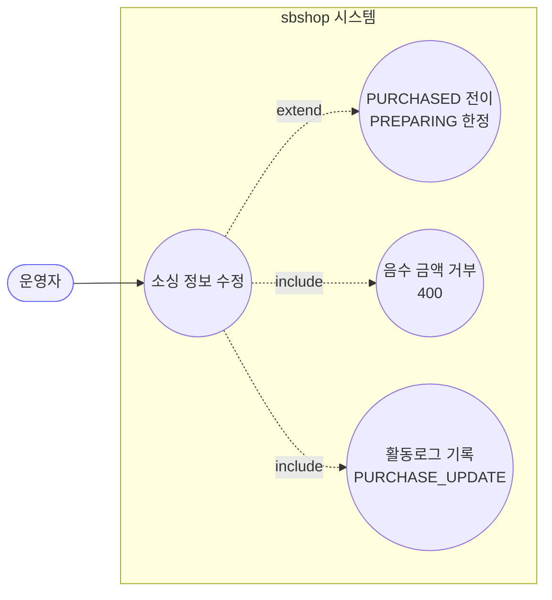
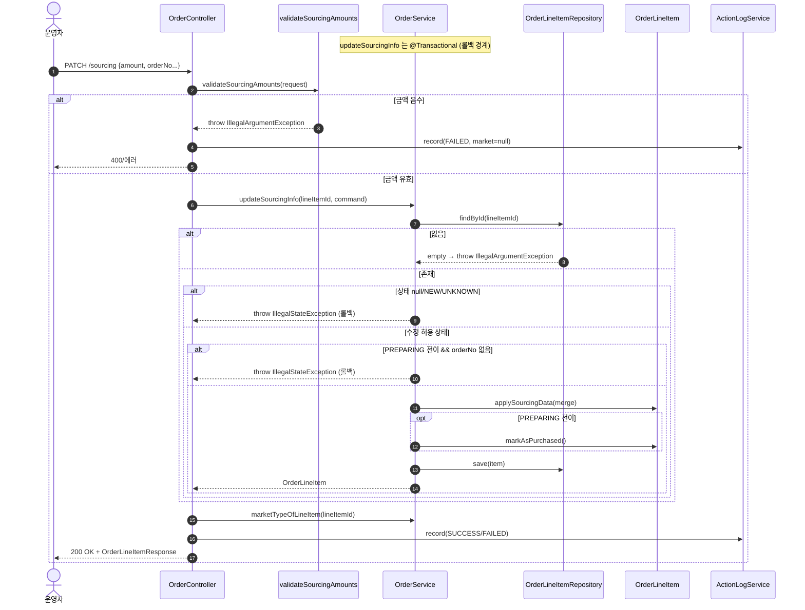

# PATCH /line-items/{lineItemId}/sourcing — 라인아이템 소싱(구매) 정보 수정

## 1. 개요

| 항목 | 내용 |
|------|------|
| **Method / URL** | `PATCH /api/v1/orders/line-items/{lineItemId}/sourcing` (바디 `SourcingUpdateRequest`) |
| **목적** | 라인아이템의 소싱(구매) 정보(벤더·계정·주문번호·금액·물류비·할인코드)를 수정하고, `PREPARING` 상태이면 `PURCHASED` 로 전이한다. |
| **핵심 상태전이** | `PREPARING` → `PURCHASED` (주문번호 필수), 그 외 상태는 단순 정보 수정(상태 불변) |
| **부수효과** | 없음(로컬 DB 저장만). 마켓 API 호출 없음. 활동로그 `PURCHASE_UPDATE` 기록. |
| **응답** | `200 OK` + `OrderLineItemResponse` / 음수 금액·상태가드 위반 시 예외 → 에러 응답 |

## 2. 호출 체인

```
OrderController.updateSourcingInfo()                         api/.../controller/OrderController.java:233-254
  ├─ validateSourcingAmounts(request)                        api/.../controller/OrderController.java:242 → 261-270
  │     └─ requireNonNegative(sourcingAmount, logisticsCost) api/.../controller/OrderController.java:266-270 (signum()<0 → IllegalArgumentException=400)
  ├─ SourcingUpdateRequest.toCommand()                       api/.../dto/SourcingUpdateRequest.java:17-26
  └─ orderService.updateSourcingInfo(lineItemId, command)    core/.../order/service/OrderService.java:275-313  @Transactional
        ├─ orderLineItemRepository.findById() → orElseThrow  core/.../order/service/OrderService.java:279-280
        ├─ 상태 가드: null/NEW/UNKNOWN → IllegalStateException core/.../order/service/OrderService.java:283-288
        ├─ PREPARING 전이 판정 + 주문번호 필수 가드          core/.../order/service/OrderService.java:291-295
        ├─ item.applySourcingData(cmd.toSourcingData(existing)) core/.../order/service/OrderService.java:298 → SourcingUpdateCommand.toSourcingData() dto/SourcingUpdateCommand.java:20-35
        ├─ (전이 시) item.markAsPurchased()                  core/.../order/service/OrderService.java:299-301 → domain/order/OrderLineItem.java:68-72
        └─ orderLineItemRepository.save(item)                core/.../order/service/OrderService.java:302
  └─ actionLogService.record(PURCHASE_UPDATE, marketNameOfLineItem, SUCCESS/FAILED) api/.../controller/OrderController.java:246-252
        └─ marketNameOfLineItem → orderService.marketTypeOfLineItem() core/.../order/service/OrderService.java:545-551
```

**요청 바디 (`SourcingUpdateRequest`, `SourcingUpdateRequest.java:9-16`)**

| 필드 | 타입 | 필수 | 비고 |
|------|------|------|------|
| `sourcingAccount` | String | 선택 | null 이면 미변경(부분 병합) |
| `sourcingOrderNo` | String | 조건부 | PREPARING→PURCHASED 전이 시 필수(:293) |
| `sourcingAmount` | BigDecimal | 선택 | 음수 거부(:262), null/0 허용 |
| `logisticsCost` | BigDecimal | 선택 | 음수 거부(:263), null/0 허용 |
| `discountCode` | String | 선택 | null 이면 미변경 |
| `sourcingVendor` | String | 선택 | null 이면 미변경 |

## 3. 유스케이스 다이어그램



## 4. 시퀀스 다이어그램



## 5. 순서도 (플로우차트)


## 6. 상태 전이표

| 진입 라인상태 | 허용? | 결과 상태 | 마켓 전송 | 비고 |
|-----------|:-----:|-----------|-----------|------|
| null / `NEW` / `UNKNOWN` | ❌ | 불변 | — | 차단, IllegalStateException(:286-288) |
| `PREPARING` + 주문번호 있음 | ✅ | `PURCHASED` | 없음 | 전이 + 소싱데이터 반영(:291-301) |
| `PREPARING` + 주문번호 없음 | ❌ | 불변 | — | 차단(:292-295) |
| `PURCHASED` | ✅ | `PURCHASED`(불변) | 없음 | 단순 정보 수정(:308) |
| `SHIPPED` / `DELIVERED` | ✅ | 불변 | 없음 | 단순 정보 수정 허용 |
| `CANCELED` / `RETURNED` / `EXCHANGED` | ✅ | 불변 | 없음 | 종료상태도 소싱 정보 수정 허용(가드 없음) |

## 7. 🔎 발견사항

### ORDC-1 · 🟠 GAP — 종료상태(CANCELED/RETURNED/EXCHANGED) 라인의 소싱 정보 수정이 차단되지 않음
- **근거:** `OrderService.java:283-288` 의 상태 가드는 `null/NEW/UNKNOWN` 만 차단하고, 종료상태(CANCELED/RETURNED/EXCHANGED)는 통과시킨다. 대칭 경로인 배송정보 수정(`updateShippingInfo`, `OrderService.java:333-336`)은 종료상태를 명시적으로 차단한다. 테스트 `OrderServiceStateGuardTest#endStateItem_clearsDiscountCode_withEmptyString` 는 이를 "허용"으로 확정한다.
- **영향:** 취소/반품/교환으로 종결된 주문의 소싱금액·물류비·주문번호를 사후 변경할 수 있다. 이 값들은 정산/원가 리포트의 근거가 되므로, 종결 이후 임의 수정 시 정산 데이터 정합이 흔들릴 수 있다.
- **제안:** 소싱 수정에도 종료상태 차단 가드를 둘지, 아니면 "종료 후에도 원가 정정 허용"이 의도된 정책인지 명문화. 정책이면 NOTE로 강등, 아니면 배송 경로와 대칭 가드 추가.

### ORDC-2 · 🔵 NOTE — 음수 금액 검증이 컨트롤러에만 있고 서비스/도메인 계층엔 없음
- **근거:** 음수 거부는 `OrderController.validateSourcingAmounts`(`OrderController.java:242, 261-270`)에서만 수행된다. `OrderService.updateSourcingInfo` 나 `SourcingData` 도메인에는 signum 검증이 없다.
- **영향:** 다른 진입점(배치·워커·내부 호출)에서 `updateSourcingInfo` 를 직접 호출하면 음수 금액이 그대로 저장된다. 현재는 이 컨트롤러가 유일한 호출부이나, 불변식이 애플리케이션 서비스가 아닌 API 계층에 위치해 방어가 국소적이다.
- **제안:** 음수 불변식을 `SourcingData` VO 또는 서비스 진입부로 내려 계층 무관하게 보장하는 방안 검토.

### ORDC-3 · 🟡 SMELL — 실패 경로 활동로그의 마켓 타입이 항상 null
- **근거:** `OrderController.java:250-252` catch 블록은 `record(PURCHASE_UPDATE, null, FAILED, ...)` 로 마켓 타입을 null 로 남긴다. 성공 경로(:246)는 `marketNameOfLineItem(lineItemId)` 로 마켓을 해석한다. `marketTypeOfLineItem`(`OrderService.java:545-551`)은 read-only 조회라 실패 예외 트랜잭션과 무관하게 호출 가능하다.
- **영향:** 실패 활동로그에서 어느 마켓 주문이 실패했는지 필터/집계가 불가능(마켓별 실패 통계 누락). 발주확인/취소 실패 경로는 `marketNameOfOrder(id)` 로 마켓을 채우는 것과 비대칭.
- **제안:** 실패 경로에서도 `marketNameOfLineItem(lineItemId)` 로 마켓 해석을 시도(조회 실패 시에만 null).

## 8. 테스트 커버리지 메모

- **컨트롤러 음수 검증:** `OrderControllerSourcingValidationTest`(3건) — sourcingAmount/logisticsCost 음수 400 거부·서비스 미호출, 0/null 통과 검증. ✅
- **상태 가드/전이:** `OrderServiceStateGuardTest` — PREPARING+주문번호 → PURCHASED 전이·저장(`preparingItem_sourcingUpdateWithOrderNo_becomesPurchased`), PREPARING+주문번호 없음 → 차단·저장 없음(`preparingItem_sourcingUpdateWithoutOrderNo_blocked`), 종료상태 discountCode 클리어 허용(`endStateItem_clearsDiscountCode_withEmptyString`). ✅
- **마켓 로그 해석:** `OrderControllerMarketTypeLogTest` 존재(성공 경로 마켓 해석).
- **비어있는 케이스:** ① 종료상태 소싱 금액 수정 시 정산 영향(ORDC-1), ② null/NEW/UNKNOWN 차단의 명시 단위 테스트(소싱 경로 한정), ③ 실패 경로 로그 마켓 null(ORDC-3).

---
*생성: 2026-07-17 · 근거: 현재 워킹트리*
