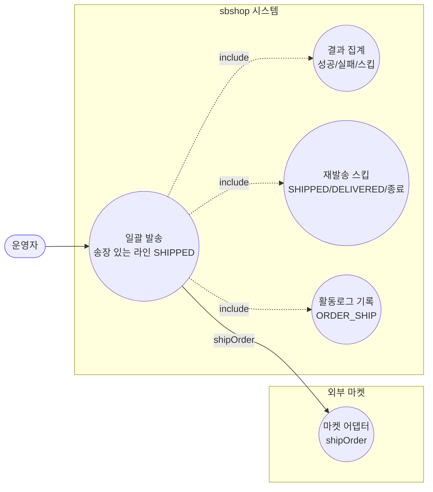
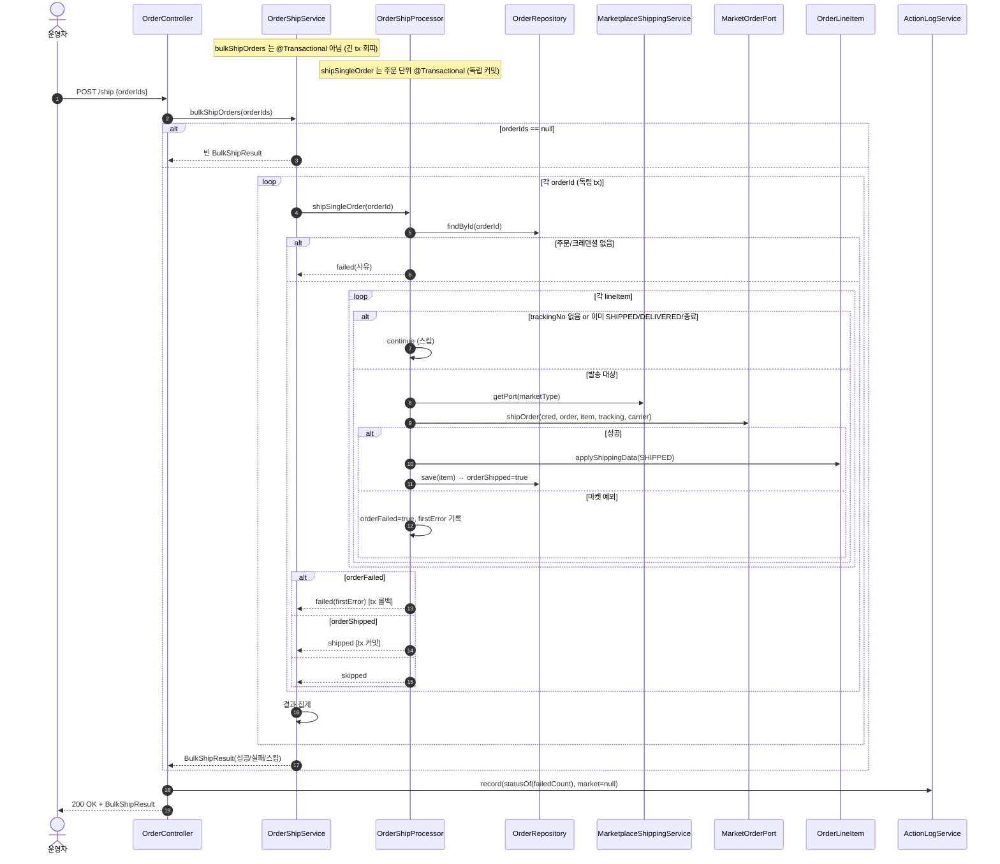

# POST /ship — 일괄 발송 처리

## 1. 개요

| 항목 | 내용 |
|------|------|
| **Method / URL** | `POST /api/v1/orders/ship` (바디 `OrderShipRequest`) |
| **목적** | 여러 주문의 송장 있는 라인아이템을 마켓에 발송 등록(`shipOrder`)하고 성공 라인을 `SHIPPED` 로 전이한다. 결과를 성공/실패/스킵으로 집계해 반환. |
| **핵심 상태전이** | 송장 있는 발송 가능 라인 → `SHIPPED` (마켓 `shipOrder` 성공 라인만) |
| **부수효과** | 주문 단위 독립 트랜잭션(`shipSingleOrder`, `@Transactional`)으로 마켓 전송 + 저장. 오케스트레이터(`bulkShipOrders`)는 **비-트랜잭션**. 활동로그 `ORDER_SHIP`. |
| **응답** | `200 OK` + `BulkShipResult`(successCount/failedCount/skippedCount/failedIds/errors) |

## 2. 호출 체인

```
OrderController.shipOrders()                                api/.../controller/OrderController.java:296-315
  ├─ request.getOrderIds()                                  api/.../dto/OrderShipRequest.java:8
  └─ orderShipService.bulkShipOrders(orderIds)             core/.../order/service/OrderShipService.java:27-61  (@Transactional 아님)
        ├─ orderIds == null → 빈 BulkShipResult 반환         core/.../order/service/OrderShipService.java:33-38
        └─ for each orderId:                                core/.../order/service/OrderShipService.java:40-52
             └─ orderShipProcessor.shipSingleOrder(orderId) core/.../order/service/OrderShipProcessor.java:47-123  @Transactional (주문 단위 독립 커밋)
                  ├─ orderRepository.findById() → null → OrderShipOutcome.failed(주문 없음) OrderShipProcessor.java:49-53
                  ├─ credentialRepository.findByMarketType() → null → failed(인증정보 없음) OrderShipProcessor.java:55-59
                  ├─ orderLineItemRepository.findByOrderId() OrderShipProcessor.java:61
                  └─ for each lineItem:                     OrderShipProcessor.java:68-110
                       ├─ trackingNo null/empty → continue(스킵) OrderShipProcessor.java:69-73
                       ├─ 상태 SHIPPED/DELIVERED/종료 → continue(재발송 스킵, F-ORD-29) OrderShipProcessor.java:75-83
                       ├─ port.shipOrder(cred, order, item, trackingNo, carrier) OrderShipProcessor.java:89-91 (via marketplaceShippingService.getPort)
                       ├─ applyShippingData(SHIPPED) + save   OrderShipProcessor.java:93-101 (정산 재계산 없음, F-SYNC-4)
                       └─ (실패) catch → orderFailed=true, firstError 기록 OrderShipProcessor.java:102-109
                  └─ orderFailed→failed / orderShipped→shipped / !anyProcessable→skipped OrderShipProcessor.java:112-122
             └─ outcome.isFailed/isShipped 집계 → successCount/failedIds/skippedCount OrderShipService.java:44-51
        └─ BulkShipResult.builder()... 반환                  core/.../order/service/OrderShipService.java:54-60
  └─ actionLogService.record(ORDER_SHIP, null, statusOf(failedCount), 성공/실패/스킵 요약) api/.../controller/OrderController.java:305-313
        └─ statusOf: failedCount==0 ? SUCCESS : FAILED       api/.../controller/OrderController.java:79-81
```

**요청 바디 (`OrderShipRequest`, `OrderShipRequest.java:6-9`)**

| 필드 | 타입 | 필수 | 비고 |
|------|------|------|------|
| `orderIds` | List\<Long\> | 선택 | null 이면 서비스가 빈 `BulkShipResult` 반환(:33-38), 컨트롤러 reqCount=0(:302) |

## 3. 유스케이스 다이어그램



## 4. 시퀀스 다이어그램



## 5. 순서도 (플로우차트)


## 6. 상태 전이표

| 진입 라인상태 | 허용? | 결과 상태 | 마켓 전송 | 집계 |
|-----------|:-----:|-----------|-----------|------|
| 송장 없음(trackingNo null/empty) | — | 불변 | — | 라인 스킵(:69-73) |
| `SHIPPED` / `DELIVERED` / `CANCELED` / `RETURNED` / `EXCHANGED` | ❌ | 불변 | — | 라인 스킵, 재발송 방지(:75-83, F-ORD-29) |
| `NEW` / `PREPARING` / `PURCHASED` + 송장 있음 + `shipOrder` 성공 | ✅ | `SHIPPED` | `shipOrder` | 주문 shipped(success) |
| 위 조건 + `shipOrder` 실패 | — | 불변(롤백) | 시도됨 | 주문 failed(errors 기록) |
| 크레덴셜 없는 마켓 | ❌ | 불변 | — | 주문 통째 failed(:55-59) |
| 존재하지 않는 주문 | — | — | — | 주문 failed(:49-53) |
| 발송 대상 라인 0건(전부 이미 발송/무송장) | — | 불변 | — | 주문 skipped(:117-122) |

## 7. 🔎 발견사항

### ORDC-7 · 🟠 GAP — 일괄발송에는 `NEW`/`PREPARING` 진입 상태 가드가 없어, 발주확인/구매완료 전 라인도 송장만 있으면 `SHIPPED` 로 강제 전이됨
- **근거:** `OrderShipProcessor.java:75-83` 은 SHIPPED/DELIVERED/CANCELED/RETURNED/EXCHANGED 만 스킵하고, `NEW`·`PREPARING`·`PURCHASED` 는 발송 대상으로 통과시킨다. 반면 단건 배송 경로 `OrderService.updateShippingInfo`(`OrderService.java:339-342`)는 `NEW/UNKNOWN/PREPARING` 을 명시 차단하고 `PURCHASED` 에서만 전이한다. 두 발송 경로의 진입 가드가 비대칭이다.
- **영향:** 정상 워크플로우상 발송 전이는 `PURCHASED` 에서만 이뤄져야 하는데, 일괄발송은 어떤 이유로 `NEW`/`PREPARING` 상태인데 송장이 채워진 라인(예: 동기화·수기 편집 잔여)을 곧바로 마켓 `shipOrder` 로 밀어넣고 `SHIPPED` 로 덮어쓴다. 구매완료를 건너뛴 발송으로 상태 흐름·정산 근거가 흐트러질 수 있다.
- **제안:** 일괄발송도 `PURCHASED`(또는 발송 가능 상태) 진입 가드를 두어 단건 경로와 정합화. 또는 발송 가능 상태 목록을 도메인 상수로 단일화.

### ORDC-8 · 🟡 SMELL — 일괄발송은 `shipOrder`(최초등록)만 호출하고 `invoiceAlreadyExists` 분기가 없어, 단건 경로와 마켓 API 선택 로직이 이원화됨
- **근거:** `OrderShipProcessor.java:89-91` 은 무조건 `port.shipOrder`(최초 등록)를 호출한다. 단건 경로는 `MarketplaceShippingService.sendTrackingToMarketplace`(`:98-106`)에서 `invoiceAlreadyExists` 로 `updateTracking`/`shipOrder` 를 분기한다. 일괄발송은 이 서비스를 거치지 않고 `getPort(...).shipOrder` 를 직접 호출한다.
- **영향:** 일괄발송 대상 라인은 상태 가드로 SHIPPED/DELIVERED 를 이미 걸러내므로 대개 최초 등록이 맞지만, 마켓에 이미 송장이 존재하는데 로컬 상태가 미갱신인 경우(동기화 지연 등) `shipOrder` 가 마켓에서 거부될 수 있다. 또한 마켓 전송 실패의 terminal/재시도 분류(`isNonRetryableMarketState`)를 우회해, 단건 경로가 갖춘 terminal 처리 이점을 못 받는다.
- **제안:** 일괄발송도 `sendTrackingToMarketplace` 로 전송을 위임해 등록/수정 분기·terminal 분류를 공유하거나, 최소한 두 경로의 전송 정책 차이를 문서화.

### ORDC-9 · 🔵 NOTE — 주문 내 일부 라인만 실패해도 주문 전체가 `failed` 로 집계되나, 성공한 라인의 SHIPPED 저장은 tx 롤백으로 되돌아감
- **근거:** `OrderShipProcessor.java:112-114` 은 `orderFailed` 이면 `OrderShipOutcome.failed` 를 반환하고, 이 메서드는 `@Transactional`(`:47`)이므로 정상 반환이라도 예외 없이 커밋된다 — 즉 실패 반환 시에도 그 주문 내 앞서 `save`(:100)된 성공 라인이 **커밋**된다. 반면 실제로 예외로 롤백되는 것이 아니라 값 반환이므로, 한 주문 안에서 라인 A 발송 성공(save)·라인 B 실패 시, A 는 마켓·DB 모두 SHIPPED 로 커밋되고 주문은 failed 로 집계되어 `failedIds` 에 담긴다.
- **영향:** 운영자가 `failedIds` 를 보고 해당 주문을 재발송하면, 이미 SHIPPED 커밋된 라인 A 는 상태 가드(:75-83)로 스킵되어 중복 발송은 없다(정합은 유지). 다만 "주문 단위 failed" 표기와 "라인 A 는 실제 발송됨" 사이의 의미 불일치로, 재시도·집계 해석에 혼동 여지가 있다.
- **제안:** 주문 단위가 아닌 라인 단위 성공/실패 집계로 표면화하거나, 부분성공 주문을 별도 상태(partial)로 구분. 최소한 errors 메시지에 성공/실패 라인 수를 함께 기재.

### ORDC-10 · 🔵 NOTE — 크레덴셜 없는 마켓·존재하지 않는 주문이 `skipped` 가 아닌 `failed` 로 집계됨
- **근거:** `OrderShipProcessor.java:49-59` 은 주문 없음·크레덴셜 없음을 `OrderShipOutcome.failed` 로 반환한다(주석: "요청 자체가 잘못된 것"). 단건 배송의 `sendTrackingToMarketplace` 는 어댑터 없는 마켓을 `ofSkipped`(정상 스킵)로 처리(`MarketplaceShippingService.java:88-93`)하는 것과 대비된다.
- **영향:** 크레덴셜 미설정(설정 누락) 마켓 주문이 발송 실패로 집계되어 활동로그가 FAILED 가 되고 `failedIds` 에 담긴다. 재시도 대상처럼 보이나 크레덴셜을 넣기 전엔 계속 실패한다. "설정 문제"와 "발송 실패"가 같은 failed 로 뭉뚱그려진다.
- **제안:** 크레덴셜 없음을 별도 스킵/설정오류 범주로 분리할지 정책 결정. 현재 동작(실패로 표면화)이 의도라면 NOTE로 유지.

## 8. 테스트 커버리지 메모

- **결과 집계:** `OrderShipServiceResultTest`(4건) — 마켓 실패→FAILED, 성공→SHIPPED, 이미발송/무송장→SKIPPED, 주문 없음→FAILED. ✅
- **null 방어:** `OrderShipServiceNullOrderIdsTest`(1건) — orderIds null 시 빈 결과(NPE 없음). ✅
- **트랜잭션 경계:** `OrderShipTransactionBoundaryTest`(4건) — bulkShipOrders 비-@Transactional, shipSingleOrder @Transactional, 주문 수만큼 독립 tx, 한 주문 실패가 다른 주문을 막지 않음. ✅
- **재발송 스킵 가드:** `OrderShipServiceGuardTest`(2건) — SHIPPED/DELIVERED/종료 재발송 스킵.
- **컨트롤러 결과 로그:** `OrderControllerBulkResultLogTest`(6건) — statusOf 기반 SUCCESS/FAILED 기록.
- **비어있는 케이스:** ① `NEW`/`PREPARING` 진입 라인 발송 강제 전이(ORDC-7) — 명시 테스트 없음, ② 부분성공 주문의 성공라인 커밋 + 주문 failed 집계(ORDC-9), ③ 크레덴셜 없음의 failed 분류(ORDC-10), ④ 일괄발송이 `updateTracking` 아닌 `shipOrder` 만 호출하는 경로(ORDC-8).

---
*생성: 2026-07-17 · 근거: 현재 워킹트리*
