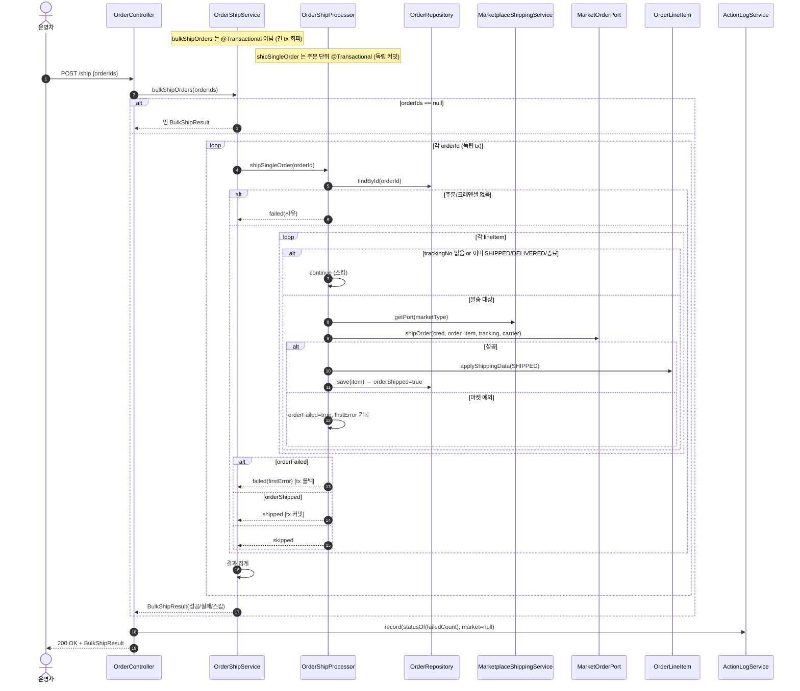
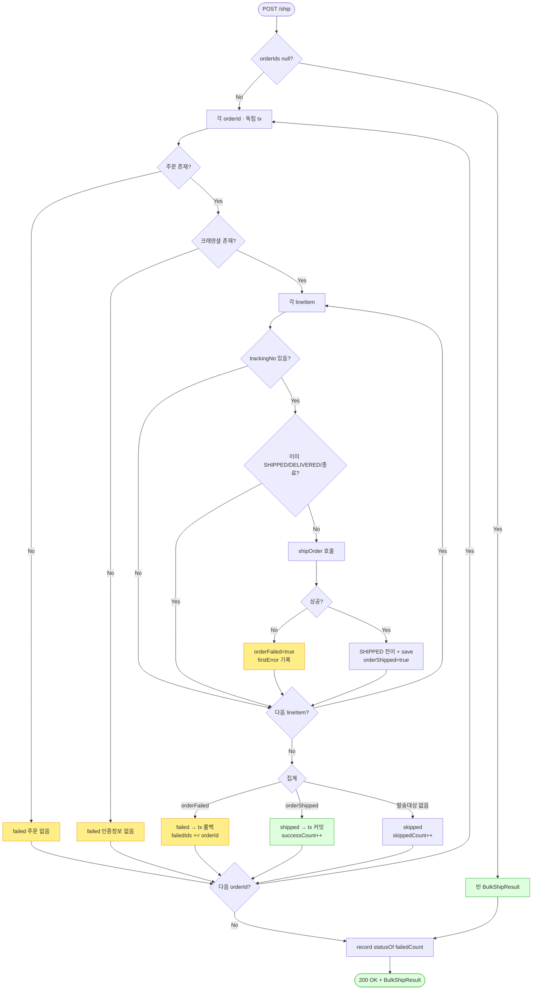

# POST /ship — 여러 주문을 한 번에 발송 처리(일괄 발송)

## 1. 개요

> 이 기능은 한마디로: **운영자가 주문 여러 건을 골라 "한꺼번에 발송 처리"를 누르면, 각 주문에서 송장이 달린 상품 줄들을 마켓에 발송 등록하고 "발송됨(SHIPPED)"으로 바꿔주는 창구**입니다. 주문 하나하나를 따로따로 저장(독립 처리)하므로, 어느 주문 하나가 실패해도 다른 주문 처리는 계속됩니다. 마지막에 "성공 몇 건 / 실패 몇 건 / 건너뜀 몇 건"으로 결과를 모아 돌려줍니다.

| 항목 | 쉬운 설명 |
|------|------|
| **주소(Method / URL)** | `POST /api/v1/orders/ship` — 주문 여러 개를 발송 처리해 달라는 요청. 보내는 내용은 `OrderShipRequest`(주문 ID 목록). |
| **무엇을 하나** | 여러 주문에서 송장이 있는 상품 줄들을 마켓에 발송 등록(`shipOrder`)하고, 성공한 줄만 "발송됨(SHIPPED)"으로 바꿉니다. 결과를 성공/실패/건너뜀으로 세어 돌려줍니다. |
| **상태가 어떻게 바뀌나** | 송장이 있고 발송 가능한 줄 → `SHIPPED`(발송됨). 단, 마켓 발송 등록이 성공한 줄만 바뀝니다. |
| **딸려오는 일(부수효과)** | 주문 하나하나를 따로 저장합니다(`shipSingleOrder`, `@Transactional` — 주문 단위 독립 처리). 여러 주문을 도는 바깥 흐름(`bulkShipOrders`)은 하나의 큰 묶음으로 묶지 않습니다. 활동기록(`ORDER_SHIP`)을 남깁니다. |
| **응답** | `200 OK`와 함께 결과 요약(`BulkShipResult` — 성공 수/실패 수/건너뜀 수/실패한 주문 ID들/오류 메시지들)을 돌려줍니다. |

## 2. 호출 체인

> 아래는 요청이 처리될 때 **코드가 거쳐 가는 순서**입니다. 각 줄 오른쪽은 실제 코드 위치이고, "→ 쉽게 말하면"에 그 단계가 무슨 뜻인지 풀어 적었습니다.

```
OrderController.shipOrders()                                api/.../controller/OrderController.java:296-315
  ├─ request.getOrderIds()                                  api/.../dto/OrderShipRequest.java:8
  └─ orderShipService.bulkShipOrders(orderIds)             core/.../order/service/OrderShipService.java:27-61  (@Transactional 아님)
        ├─ orderIds == null → 빈 BulkShipResult 반환         core/.../order/service/OrderShipService.java:33-38
        └─ for each orderId:                                core/.../order/service/OrderShipService.java:40-52
             └─ orderShipProcessor.shipSingleOrder(orderId) core/.../order/service/OrderShipProcessor.java:47-123  @Transactional (주문 단위 독립 커밋)
                  ├─ orderRepository.findById() → null → OrderShipOutcome.failed(주문 없음) OrderShipProcessor.java:49-53
                  ├─ credentialRepository.findByMarketType() → null → failed(인증정보 없음) OrderShipProcessor.java:55-59
                  ├─ orderLineItemRepository.findByOrderId() OrderShipProcessor.java:61
                  └─ for each lineItem:                     OrderShipProcessor.java:68-110
                       ├─ trackingNo null/empty → continue(스킵) OrderShipProcessor.java:69-73
                       ├─ 상태 SHIPPED/DELIVERED/종료 → continue(재발송 스킵, F-ORD-29) OrderShipProcessor.java:75-83
                       ├─ port.shipOrder(cred, order, item, trackingNo, carrier) OrderShipProcessor.java:89-91 (via marketplaceShippingService.getPort)
                       ├─ applyShippingData(SHIPPED) + save   OrderShipProcessor.java:93-101 (정산 재계산 없음, F-SYNC-4)
                       └─ (실패) catch → orderFailed=true, firstError 기록 OrderShipProcessor.java:102-109
                  └─ orderFailed→failed / orderShipped→shipped / !anyProcessable→skipped OrderShipProcessor.java:112-122
             └─ outcome.isFailed/isShipped 집계 → successCount/failedIds/skippedCount OrderShipService.java:44-51
        └─ BulkShipResult.builder()... 반환                  core/.../order/service/OrderShipService.java:54-60
  └─ actionLogService.record(ORDER_SHIP, null, statusOf(failedCount), 성공/실패/스킵 요약) api/.../controller/OrderController.java:305-313
        └─ statusOf: failedCount==0 ? SUCCESS : FAILED       api/.../controller/OrderController.java:79-81
```

- **`shipOrders()` (입구)** → 쉽게 말하면: 화면에서 온 "이 주문들 일괄 발송해 줘" 요청을 가장 먼저 받는 문지기입니다.
- **`bulkShipOrders(orderIds)` (@Transactional 아님)** → 쉽게 말하면: 주문 목록을 하나씩 도는 진행 담당. 일부러 하나의 큰 저장 묶음으로 묶지 **않아서**(긴 처리 동안 DB를 오래 붙잡지 않으려고), 한 주문이 실패해도 나머지는 각자 저장됩니다.
- **`orderIds == null → 빈 결과`** → 쉽게 말하면: 보낸 주문 목록이 아예 없으면 아무것도 안 하고 빈 결과를 돌려줍니다.
- **`shipSingleOrder(orderId)` (@Transactional)** → 쉽게 말하면: 주문 한 건을 처리하는 단위. 이건 하나의 저장 묶음이라, 이 주문 안에서 문제가 나면 이 주문 처리만 되돌아갑니다.
- **`findById() → null → failed(주문 없음)`** → 쉽게 말하면: 주문이 실제로 있는지 확인. 없으면 그 주문을 "실패"로 처리합니다.
- **`findByMarketType() → null → failed(인증정보 없음)`** → 쉽게 말하면: 그 마켓에 접속할 인증정보(크레덴셜)가 있는지 확인. 없으면 "실패"로 처리합니다.
- **`findByOrderId()`** → 쉽게 말하면: 그 주문에 딸린 상품 줄들을 모두 가져옵니다.
- **`trackingNo null/empty → 스킵`** → 쉽게 말하면: 송장번호가 없는 줄은 발송할 게 없으니 그냥 건너뜁니다.
- **상태 SHIPPED/DELIVERED/종료 → 스킵** → 쉽게 말하면: 이미 발송됐거나 배송완료·취소·반품·교환된 줄은 다시 보내지 않고 건너뜁니다(재발송 방지).
- **`port.shipOrder(...)`** → 쉽게 말하면: 남은 대상 줄을 마켓에 발송 등록합니다.
- **`applyShippingData(SHIPPED) + save`** → 쉽게 말하면: 마켓 등록이 성공하면 그 줄을 "발송됨"으로 바꿔 저장합니다.
- **(실패) catch → orderFailed=true** → 쉽게 말하면: 마켓 등록이 실패하면 이 주문을 "실패"로 표시하고 첫 오류 메시지를 기록합니다.
- **`actionLogService.record(...)`** → 쉽게 말하면: "일괄 발송했고 성공 N/실패 M/건너뜀 K"라는 기록을 남깁니다. 실패가 하나도 없으면 SUCCESS, 하나라도 있으면 FAILED로 적습니다.

**요청 바디 (`OrderShipRequest`, `OrderShipRequest.java:6-9`)** — 화면에서 보내는 값입니다.

| 필드 | 타입 | 필수 | 쉬운 설명 |
|------|------|------|------|
| `orderIds` | List\<Long\> | 선택 | 발송할 주문 ID 목록. 아예 없으면 서비스가 빈 결과를 돌려줌(:33-38), 컨트롤러는 요청 건수 0으로 처리(:302). |

## 3. 유스케이스 다이어그램

> 👉 이 그림은 **운영자가 일괄 발송으로 하는 일**(발송, 결과 집계, 이미 발송된 줄 건너뛰기, 활동로그 기록)과 **외부 마켓에 발송 등록을 보내는 부분**을 한눈에 보여줍니다.


## 4. 시퀀스 다이어그램

> 👉 이 그림은 **여러 주문을 하나씩 돌면서** 각 주문 안의 상품 줄들을 처리하는 순서를, 각 부품(컨트롤러·서비스·처리기·저장소·마켓 전송·마켓 어댑터)이 주고받는 메시지로 보여줍니다. 주문/인증정보가 없을 때, 줄을 건너뛸 때, 마켓 성공/실패에 따라 주문이 발송됨/실패/건너뜀으로 갈리는 모습이 함께 그려져 있습니다.



## 5. 순서도 (플로우차트)

> 👉 이 그림은 **주문 목록을 위에서부터 하나씩, 그 안의 상품 줄도 하나씩** 따지며 갈라지는 흐름을 "예/아니오" 갈림길로 보여줍니다. 주문 존재 → 인증정보 존재 → 줄마다 송장/상태 검사 → 마켓 발송 → 마지막에 그 주문을 발송됨/실패/건너뜀으로 집계하는 순서입니다.



## 6. 상태 전이표

> 이 표는 **상품 줄이 지금 어떤 상태냐에 따라 일괄 발송이 그 줄을 어떻게 다루는지**(발송하는지·건너뛰는지·실패로 세는지)를 정리한 것입니다. ✅는 발송 대상, ❌는 처리 못 함, —는 아무 변화 없음입니다.

| 지금 상태(진입 라인상태) | 발송? | 처리 후 상태 | 마켓 전송 | 결과 집계 |
|-----------|:-----:|-----------|-----------|------|
| 송장번호 없음(trackingNo null/empty) | — | 그대로 | — | 그 줄은 건너뜀(:69-73) |
| `SHIPPED`(발송됨) / `DELIVERED`(배송완료) / `CANCELED`(취소) / `RETURNED`(반품) / `EXCHANGED`(교환) | ❌ | 그대로 | — | 그 줄은 건너뜀, 재발송 방지(:75-83, F-ORD-29) |
| `NEW` / `PREPARING`(준비중) / `PURCHASED`(구매완료) + 송장 있음 + 마켓 등록 성공 | ✅ | `SHIPPED`(발송됨) | `shipOrder` | 그 주문은 발송됨(성공) |
| 위와 같은데 마켓 등록 실패 | — | 그대로(되돌림) | 시도했으나 실패 | 그 주문은 실패(오류 메시지 기록) |
| 인증정보(크레덴셜) 없는 마켓 | ❌ | 그대로 | — | 그 주문은 통째로 실패(:55-59) |
| 존재하지 않는 주문 | — | — | — | 그 주문은 실패(:49-53) |
| 발송할 줄이 하나도 없음(전부 이미 발송·송장 없음) | — | 그대로 | — | 그 주문은 건너뜀(:117-122) |

## 7. 🔎 발견사항

### ORDC-7 · 🟠 GAP — 일괄발송에는 `NEW`/`PREPARING` 진입 상태를 막는 가드가 없어, 발주확인·구매완료 전 줄도 송장만 있으면 곧바로 `SHIPPED`로 넘어감
- **무엇이 문제인가:** 일괄 발송은 이미 발송됐거나 끝난 줄만 건너뛰고, 나머지는 송장번호만 채워져 있으면 곧바로 마켓에 발송 등록하고 "발송됨(SHIPPED)"으로 바꿉니다. 정상 흐름이라면 구매완료(PURCHASED)에서만 발송으로 넘어가야 하는데, 일괄발송에는 이 진입 검사가 없습니다. 단건 발송 경로에는 있는데 서로 다릅니다.
- **근거:** `OrderShipProcessor.java:75-83` 은 SHIPPED/DELIVERED/CANCELED/RETURNED/EXCHANGED 만 스킵하고, `NEW`·`PREPARING`·`PURCHASED` 는 발송 대상으로 통과시킨다. 반면 단건 배송 경로 `OrderService.updateShippingInfo`(`OrderService.java:339-342`)는 `NEW/UNKNOWN/PREPARING` 을 명시 차단하고 `PURCHASED` 에서만 전이한다. 두 발송 경로의 진입 가드가 비대칭이다.
- **왜 문제인가:** 아직 발주확인이나 구매완료를 안 거친(예: 동기화 오류나 수기 편집으로 송장만 남은) 줄이 곧바로 마켓에 발송되고 "발송됨"으로 덮여, 상태 흐름과 정산 근거가 흐트러질 수 있습니다.
- **어떻게 고치면 되나:** 일괄발송에도 "구매완료(또는 발송 가능한 상태)에서만 발송" 검사를 넣어 단건 경로와 맞추거나, 발송 가능한 상태 목록을 한 곳(도메인 상수)에 정의해 두 경로가 공유하게 합니다.

### ORDC-8 · 🟡 SMELL — 일괄발송은 무조건 "처음 등록(shipOrder)"만 부르고 "이미 송장 있음" 분기가 없어, 단건 경로와 마켓 전송 방식이 서로 다름
- **무엇이 문제인가:** 단건 발송은 "이미 송장이 등록돼 있는지"를 보고 처음 등록(shipOrder)과 수정(updateTracking)을 골라 보냅니다. 반면 일괄발송은 무조건 처음 등록(shipOrder)만 호출합니다. 두 경로가 마켓에 보내는 방식이 다릅니다.
- **근거:** `OrderShipProcessor.java:89-91` 은 무조건 `port.shipOrder`(최초 등록)를 호출한다. 단건 경로는 `MarketplaceShippingService.sendTrackingToMarketplace`(`:98-106`)에서 `invoiceAlreadyExists` 로 `updateTracking`/`shipOrder` 를 분기한다. 일괄발송은 이 서비스를 거치지 않고 `getPort(...).shipOrder` 를 직접 호출한다.
- **왜 문제인가:** 일괄발송은 이미 발송/배송완료된 줄을 미리 걸러내므로 대개 처음 등록이 맞습니다. 하지만 마켓엔 이미 송장이 있는데 우리 상태만 안 맞춰진 경우(동기화 지연 등)에는 처음 등록이 마켓에서 거부될 수 있습니다. 또 일괄발송은 단건 경로가 가진 "재시도해도 소용없는 상황 구분(terminal 판정)" 기능을 우회해 그 이점을 못 받습니다.
- **어떻게 고치면 되나:** 일괄발송도 단건과 같은 전송 담당 로직(`sendTrackingToMarketplace`)에 맡겨 등록/수정 구분과 재시도 판정을 공유하거나, 최소한 두 경로의 전송 방식 차이를 문서로 남깁니다.

### ORDC-9 · 🔵 NOTE — 한 주문 안에서 일부 줄만 실패해도 주문 전체가 "실패"로 집계되는데, 앞서 성공한 줄의 발송 저장은 그대로 남음
- **무엇이 문제인가:** 한 주문에 여러 줄이 있고 줄 A는 발송 성공(저장됨), 줄 B는 실패하면, 그 주문은 통째로 "실패"로 집계되어 실패 목록에 담깁니다. 그런데 이 처리는 실제로 예외로 되돌려지는 게 아니라 결과값만 "실패"로 돌려주는 구조라, 앞서 성공해 저장한 줄 A는 마켓·우리 DB 모두 "발송됨"으로 그대로 확정됩니다.
- **근거:** `OrderShipProcessor.java:112-114` 은 `orderFailed` 이면 `OrderShipOutcome.failed` 를 반환하고, 이 메서드는 `@Transactional`(`:47`)이므로 정상 반환이라도 예외 없이 커밋된다 — 즉 실패 반환 시에도 그 주문 내 앞서 `save`(:100)된 성공 라인이 **커밋**된다. 반면 실제로 예외로 롤백되는 것이 아니라 값 반환이므로, 한 주문 안에서 라인 A 발송 성공(save)·라인 B 실패 시, A 는 마켓·DB 모두 SHIPPED 로 커밋되고 주문은 failed 로 집계되어 `failedIds` 에 담긴다.
- **왜 문제인가:** 운영자가 실패 목록을 보고 그 주문을 다시 발송해도, 이미 발송된 줄 A는 재발송 방지 규칙에 걸려 건너뛰므로 중복 발송은 없습니다(정합은 유지됨). 다만 "주문은 실패"라고 표시되는데 "줄 A는 실제로 발송됨"이라, 표기와 실제가 어긋나 재시도·집계를 해석할 때 혼동이 생길 수 있습니다.
- **어떻게 고치면 되나:** 집계를 주문 단위가 아닌 줄 단위 성공/실패로 드러내거나, 부분 성공 주문을 별도(partial) 상태로 구분합니다. 최소한 오류 메시지에 성공/실패한 줄 수를 함께 적습니다.

### ORDC-10 · 🔵 NOTE — 인증정보가 없거나 주문이 없는 경우가 "건너뜀"이 아니라 "실패"로 집계됨
- **무엇이 문제인가:** 일괄발송에서 주문이 없거나 마켓 인증정보(크레덴셜)가 없는 경우를 "실패"로 처리합니다. 반면 단건 배송은 어댑터를 지원하지 않는 마켓을 "정상 건너뜀"으로 처리해 서로 다릅니다.
- **근거:** `OrderShipProcessor.java:49-59` 은 주문 없음·크레덴셜 없음을 `OrderShipOutcome.failed` 로 반환한다(주석: "요청 자체가 잘못된 것"). 단건 배송의 `sendTrackingToMarketplace` 는 어댑터 없는 마켓을 `ofSkipped`(정상 스킵)로 처리(`MarketplaceShippingService.java:88-93`)하는 것과 대비된다.
- **왜 문제인가:** 인증정보를 아직 설정 안 한 마켓의 주문이 "발송 실패"로 집계되어 로그가 FAILED가 되고 실패 목록에 담깁니다. 재시도 대상처럼 보이지만 인증정보를 넣기 전엔 계속 실패합니다. "설정 문제"와 "발송 실패"가 같은 실패로 뭉뚱그려집니다.
- **어떻게 고치면 되나:** 인증정보 없음을 별도의 건너뜀/설정오류 범주로 나눌지 정책을 정합니다. 현재 동작(실패로 드러냄)이 의도라면 NOTE로 그대로 둡니다.

## 8. 테스트 커버리지 메모

> 이 기능이 **어떤 상황까지 자동 테스트로 검증되고 있고, 어떤 상황은 아직 테스트가 비어 있는지**를 정리한 메모입니다. ✅는 이미 테스트로 확인된 것입니다.

- **결과 집계:** `OrderShipServiceResultTest`(4건) — 마켓 실패→FAILED, 성공→SHIPPED, 이미발송/송장없음→SKIPPED, 주문 없음→FAILED. ✅
- **빈 값 방어:** `OrderShipServiceNullOrderIdsTest`(1건) — 주문 목록이 없으면 빈 결과(오류 없음). ✅
- **저장 묶음 경계:** `OrderShipTransactionBoundaryTest`(4건) — 바깥 흐름은 하나의 큰 묶음이 아님, 주문 하나 처리는 독립 묶음, 주문 수만큼 따로 저장, 한 주문 실패가 다른 주문을 막지 않음. ✅
- **재발송 건너뛰기 가드:** `OrderShipServiceGuardTest`(2건) — 이미 발송/배송완료/끝난 줄은 재발송 건너뜀.
- **컨트롤러 결과 로그:** `OrderControllerBulkResultLogTest`(6건) — 실패 수에 따라 SUCCESS/FAILED로 기록.
- **아직 테스트가 없는 상황:** ① `NEW`/`PREPARING` 상태로 들어온 줄이 강제로 발송으로 넘어가는 경우(ORDC-7) — 명시 테스트 없음, ② 부분 성공 주문에서 성공한 줄은 저장되는데 주문은 실패로 집계되는 경우(ORDC-9), ③ 인증정보 없음이 실패로 분류되는 경우(ORDC-10), ④ 일괄발송이 수정(updateTracking)이 아닌 처음 등록(shipOrder)만 호출하는 경로(ORDC-8).

---
*(쉬운 설명판 · 2026-07-17 재작성)*
*생성: 2026-07-17 · 근거: 현재 워킹트리*
