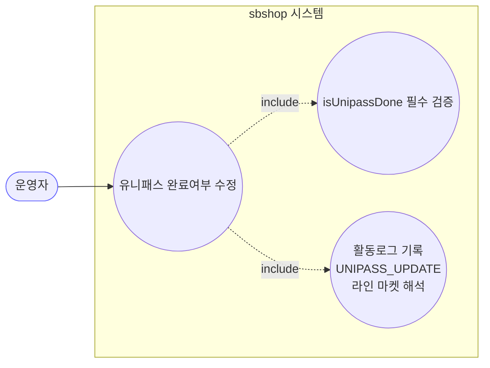
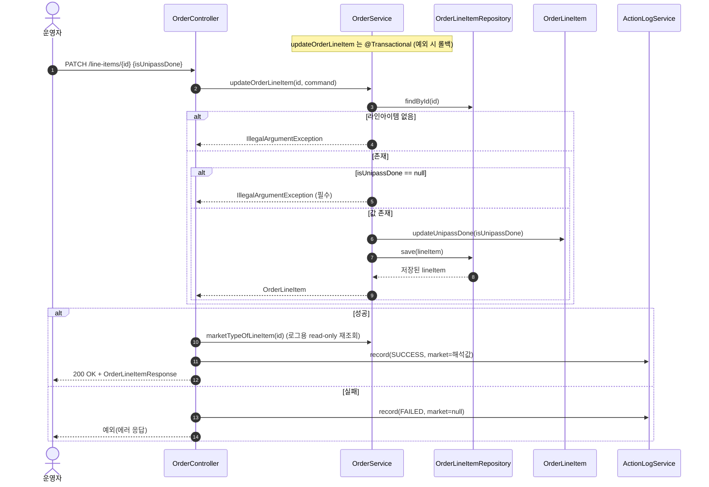
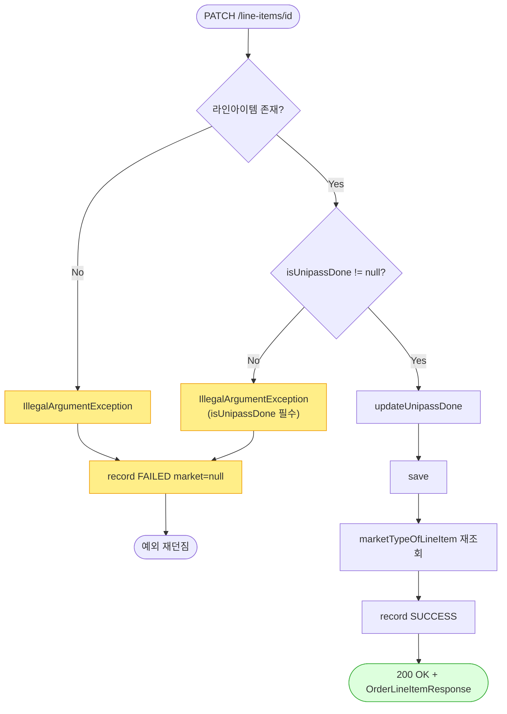

# PATCH /orders/line-items/{lineItemId} — 유니패스(통관신고) 완료여부 수정

## 1. 개요

이 기능은 **한 상품 항목의 "유니패스(통관 신고) 완료 여부" 체크를 운영자가 켜고 끄는 관리용 기능**입니다. 배송이 어느 단계에 있든(신규든 배송완료든 취소됐든) 상관없이 언제든 바꿀 수 있습니다.

| 항목 | 내용 (쉬운 설명) |
|------|------|
| **어떻게 호출하나** | `PATCH /api/v1/orders/line-items/{lineItemId}` — "완료여부" 값(`OrderLineItemUpdateRequest`)을 함께 보냅니다. |
| **무엇을 하나** | 상품 항목의 유니패스 완료여부(`isUnipassDone`) 체크를 관리용으로 켜거나 끕니다. 배송상태와 무관하게 언제든 가능. |
| **상태를 바꾸나** | 배송상태는 안 바꿉니다. `isUnipassDone`이라는 참/거짓 체크 하나만 바꿉니다. |
| **다른 곳에 영향 주나** | 없음(마켓 전송 없음). 상품 항목 저장만 합니다. |
| **무엇을 돌려주나** | `200 OK` 와 함께 수정된 상품 항목 정보(`OrderLineItemResponse`) |

## 2. 호출 체인

아래는 요청이 들어와 처리될 때까지 **코드가 거쳐가는 순서**입니다. `파일명:줄번호`는 실제 코드 위치입니다.

```
OrderController.updateOrderLineItem()                  api/.../controller/OrderController.java:211-230  (try/catch 로그)
  └─ OrderLineItemUpdateRequest.toCommand()            api/.../dto/OrderLineItemUpdateRequest.java:11-15
       └─ OrderLineItemUpdateCommand{isUnipassDone}    core/.../order/dto/OrderLineItemUpdateCommand.java:8-10
  └─ OrderService.updateOrderLineItem(id, command)     core/.../order/service/OrderService.java:255-272  @Transactional
       ├─ orderLineItemRepository.findById() → 없으면 IllegalArgumentException   :258-259
       ├─ command.getIsUnipassDone() == null → IllegalArgumentException(필수)    :264-266
       ├─ lineItem.updateUnipassDone(isUnipassDone)    :269 → OrderLineItem.java:108-110
       └─ orderLineItemRepository.save(lineItem)        :271
  └─ marketNameOfLineItem(lineItemId) → OrderService.marketTypeOfLineItem()   OrderController.java:65-67 → OrderService.java:545-551
  └─ ActionLogService.record(UNIPASS_UPDATE, market/null, SUCCESS/FAILED)   OrderController.java:222-227
  └─ OrderLineItemResponse.from(updated)               api/.../dto/OrderLineItemResponse.java:44-59
```

**→ 쉽게 말하면 이런 순서입니다:**
1. 사용자가 보낸 "완료여부" 값을 정리합니다(`updateOrderLineItem` → `OrderLineItemUpdateCommand`).
2. 저장을 바꾸는 작업이라 "잘못되면 되돌리기(`@Transactional`)" 묶음으로 처리합니다.
3. 그 상품 항목이 실제로 있는지 찾습니다. 없으면 "그런 항목 없음" 오류를 냅니다.
4. "완료여부" 값이 아예 안 들어왔으면(null) 막습니다. → 쉽게 말하면 "빈 요청을 성공으로 착각하지 않게" 하는 보호(F-ORD-26).
5. 값이 있으면 완료여부를 바꾸고 저장합니다.
6. 로그에 마켓 이름을 적으려고 이 항목의 마켓을 한 번 조회하고, "성공/실패"를 활동로그에 남긴 뒤 결과를 돌려줍니다.

**보낼 수 있는 내용 (`OrderLineItemUpdateRequest`, `OrderLineItemUpdateRequest.java:7-16`)**

| 필드 | 타입 | 필수 | 쉬운 설명 |
|------|------|------|------|
| `isUnipassDone` | Boolean | 필수 | 안 넣으면(null) 서비스가 막아서 400 오류를 냅니다 — 아무것도 안 바꾸는 요청을 "성공"으로 착각하지 않기 위함(F-ORD-26). |

## 3. 유스케이스 다이어그램

👉 이 그림은 **운영자가 "유니패스 완료여부 수정" 하나를 하면, 시스템이 값이 들어왔는지 검사하고(필수), 어느 마켓 항목인지 알아내 활동로그를 남기는 것**까지 함께한다는 것을 보여줍니다.



## 4. 시퀀스 다이어그램

👉 이 그림은 **요청이 들어왔을 때, 항목이 없거나 / 값이 비었거나 / 정상인 갈래로 나뉘고, 성공하면 로그용 마켓을 다시 조회해 성공 로그를 남기는 대화 순서**를 보여줍니다.



## 5. 순서도 (플로우차트)

👉 이 그림은 **"항목이 있나? → 값이 들어왔나? → 값을 바꾸고 저장한다"로 이어지는 판단의 갈림길**을 보여줍니다. 막히면 실패 로그를 남기고 예외를 던지며, 통과하면 마켓을 조회해 성공 로그를 남깁니다.



## 6. 상태 전이표

**배송상태는 바뀌지 않습니다** — 이 기능은 `isUnipassDone` 체크 하나만 바꾸고, 배송이 어느 단계든 자유롭게 수정을 허용합니다(F-ORD-25로 결론). 들어올 때 상태에 따른 부작용 차이도 없습니다.

| 들어올 때 항목 상태 | 수정 허용? | 결과 | 마켓 전송 | 쉬운 설명 |
|-----------|:-----:|------|-----------|------|
| NEW / PREPARING / PURCHASED / SHIPPED / DELIVERED | ✅ | 완료여부 반영 | — | 배송상태로 막지 않음(`OrderService.java:261` 주석). |
| CANCELED / RETURNED / EXCHANGED (종료) | ✅ | 완료여부 반영 | — | 끝난 주문도 관리용 수정은 허용. |
| isUnipassDone 값이 없음(null) | ❌ | 막힘(IllegalArgument→400) | — | 아무것도 안 바꾸는 요청을 성공으로 착각 방지(`:264-266`). |

## 7. 🔎 발견사항

### ORDA-7 · 🔵 NOTE — 성공 후 로그용 마켓 정보를 얻으려고 이미 다룬 데이터를 두 번 더 조회함
- **무엇이 문제인가:** 유니패스 수정이 성공하면, 활동로그에 마켓 이름을 채우려고 상품 항목과 그 주문을 다시 조회합니다. 그런데 방금 저장을 마친 서비스가 이미 그 항목(주문 ID까지 담긴)을 돌려주는데도, 컨트롤러는 그걸 안 쓰고 항목 ID로 처음부터 다시 조회합니다.
- **근거:** `OrderController.java:222`가 성공 시 `marketNameOfLineItem(lineItemId)`를 호출하고, 이는 `OrderService.marketTypeOfLineItem()`(`OrderService.java:545-551`)에서 `orderLineItemRepository.findById()` → `orderRepository.findById()`로 이미 방금 다룬 라인아이템/주문을 다시 조회한다. 서비스 메서드는 이미 `updated` 엔티티(orderId 보유)를 반환하는데 컨트롤러는 그 정보를 쓰지 않고 lineItemId로 재해석한다.
- **왜 문제인가:** 성공할 때마다 로그를 위한 추가 조회가 2번씩 일어납니다. 기능이나 데이터 정합에는 문제가 없고 읽기 전용이라 부작용도 없지만, 불필요한 왕복입니다.
- **어떻게 고치면 되나:** 서비스가 돌려준 항목의 주문 ID로 마켓을 알아내는 헬퍼를 두면 재조회를 줄일 수 있습니다. 우선순위는 낮습니다.

### ORDA-8 · 🔵 NOTE — 요청 본문이 아예 없거나 형식이 깨지면 처리가 프레임워크 기본 동작에 맡겨져 로그가 누락될 수 있음
- **무엇이 문제인가:** 이 기능은 요청 본문에서 완료여부 값을 읽습니다. 본문은 있는데 값이 비어 있으면 값이 null이 되어 서비스 검사에서 400으로 막힙니다. 그런데 본문이 아예 없거나 JSON 형식이 아니면, 서비스 검사 이전 단계인 스프링 프레임워크의 예외 처리로 빠집니다.
- **근거:** `OrderController.java:215-216`은 `@RequestBody OrderLineItemUpdateRequest`로 바인딩하고, 빈 바디면 `isUnipassDone`이 null이 되어 서비스 가드(`OrderService.java:264-266`)로 400이 유도된다. 다만 완전 누락 바디/비 JSON 등은 Spring 메시지 컨버터 예외 경로로 빠진다.
- **왜 문제인가:** 결과적으로 400으로 끝나긴 하지만, 그 경로가 서비스 검사가 아니라 프레임워크 예외라서, 컨트롤러의 활동로그 기록 부분(catch, `:226`)에 안 잡힐 수 있습니다(로그 누락 가능성).
- **어떻게 고치면 되나:** 본문이 반드시 필요함을 계약으로 명시하고, 필요하면 진입부 검증(`required=true`/`@Valid`)을 통일할지 검토합니다.

## 8. 테스트 커버리지 메모

- `OrderServiceInputGuardTest`(`backend/core/.../order/service/OrderServiceInputGuardTest.java:115-121`): `updateOrderLineItem_withNullUnipassDone_blocked` — 완료여부 값이 null이면 막히는지(`OrderService.java:264-266`) 검사합니다.
- `OrderServiceStateGuardTest`(`:62-89`): NEW 항목의 유니패스 수정 성공, CANCELED(종료) 항목의 유니패스 수정 성공 — 배송상태로 막지 않음(F-ORD-25)을 검사합니다.
- `OrderControllerMarketTypeLogTest`(`backend/api/.../controller/OrderControllerMarketTypeLogTest.java:64-69`): 성공 시 활동로그의 마켓이 그 항목의 마켓으로 채워지는지 검사합니다.
- **지금 보장되는 약속:** 값 필수 검사, 상태 무관 자유 수정, 활동로그 마켓 알아내기.
- **아직 검사 안 하는 경우들:**
  - ① 존재하지 않는 항목 ID → "그런 항목 없음" 오류,
  - ② 실패 시 활동로그 마켓이 null인 경로(`OrderController.java:226`),
  - ③ 성공 시 마켓을 다시 조회하는 왕복(ORDA-7)은 기능이 아니라 성능 관찰 대상.

---
*(쉬운 설명판 · 2026-07-17 재작성)*
*생성: 2026-07-17 · 근거: 현재 워킹트리*
