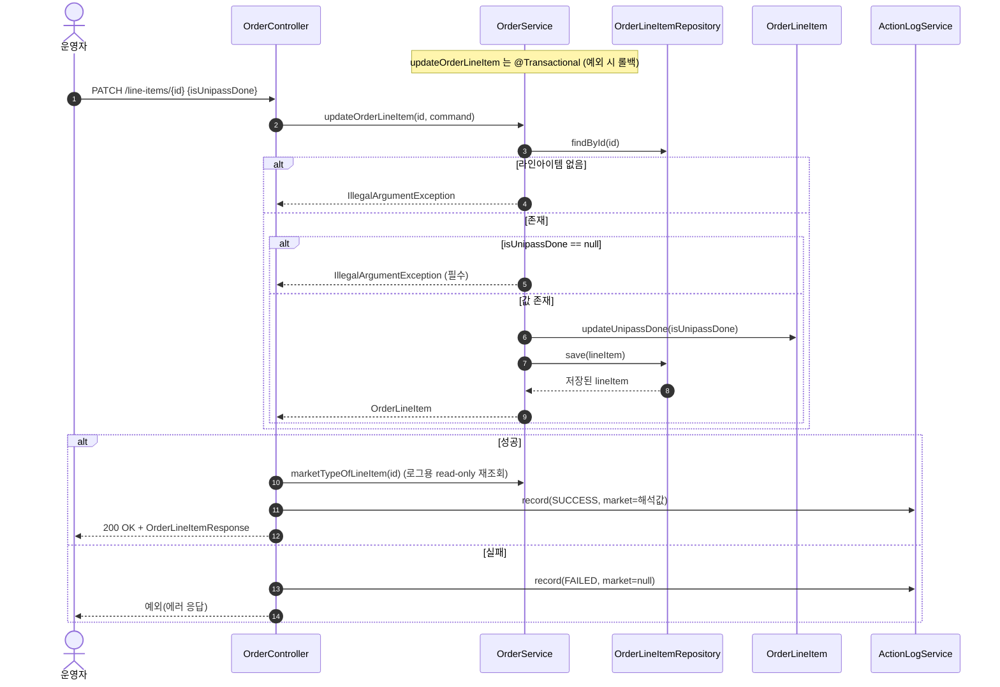

# PATCH /orders/line-items/{lineItemId} — 유니패스 완료여부 수정

## 1. 개요

| 항목 | 내용 |
|------|------|
| **Method / URL** | `PATCH /api/v1/orders/line-items/{lineItemId}` (바디 `OrderLineItemUpdateRequest`) |
| **목적** | 라인아이템의 유니패스(통관 신고) 완료여부(`isUnipassDone`)를 관리용으로 수정한다. 배송상태와 무관하게 언제든 수정 가능. |
| **핵심 상태전이** | 없음 (배송상태 전이 없음 — `isUnipassDone` 불리언 플래그만 변경) |
| **부수효과** | 없음 (마켓 전송 없음). 라인아이템 저장만. |
| **응답** | `200 OK` + `OrderLineItemResponse` |

## 2. 호출 체인

```
OrderController.updateOrderLineItem()                  api/.../controller/OrderController.java:211-230  (try/catch 로그)
  └─ OrderLineItemUpdateRequest.toCommand()            api/.../dto/OrderLineItemUpdateRequest.java:11-15
       └─ OrderLineItemUpdateCommand{isUnipassDone}    core/.../order/dto/OrderLineItemUpdateCommand.java:8-10
  └─ OrderService.updateOrderLineItem(id, command)     core/.../order/service/OrderService.java:255-272  @Transactional
       ├─ orderLineItemRepository.findById() → 없으면 IllegalArgumentException   :258-259
       ├─ command.getIsUnipassDone() == null → IllegalArgumentException(필수)    :264-266
       ├─ lineItem.updateUnipassDone(isUnipassDone)    :269 → OrderLineItem.java:108-110
       └─ orderLineItemRepository.save(lineItem)        :271
  └─ marketNameOfLineItem(lineItemId) → OrderService.marketTypeOfLineItem()   OrderController.java:65-67 → OrderService.java:545-551
  └─ ActionLogService.record(UNIPASS_UPDATE, market/null, SUCCESS/FAILED)   OrderController.java:222-227
  └─ OrderLineItemResponse.from(updated)               api/.../dto/OrderLineItemResponse.java:44-59
```

**요청 바디 (`OrderLineItemUpdateRequest`, `OrderLineItemUpdateRequest.java:7-16`)**

| 필드 | 타입 | 필수 | 비고 |
|------|------|------|------|
| `isUnipassDone` | Boolean | 필수 | null이면 서비스에서 400(IllegalArgumentException) — no-op을 성공 오인 방지(F-ORD-26) |

## 3. 유스케이스 다이어그램


## 4. 시퀀스 다이어그램



## 5. 순서도 (플로우차트)


## 6. 상태 전이표

**배송상태 전이 없음** — `isUnipassDone` 플래그만 변경하며 어떤 배송상태에서도 자유 수정을 허용한다(F-ORD-25 종결). 진입 상태별 부수효과 차이는 없다.

| 진입 라인상태 | 허용? | 결과 | 마켓 전송 | 비고 |
|-----------|:-----:|------|-----------|------|
| NEW / PREPARING / PURCHASED / SHIPPED / DELIVERED | ✅ | isUnipassDone 반영 | — | 배송상태 가드 없음(`OrderService.java:261` 주석) |
| CANCELED / RETURNED / EXCHANGED (종료) | ✅ | isUnipassDone 반영 | — | 종료상태도 관리용 수정 허용 |
| isUnipassDone == null | ❌ | 차단(IllegalArgument→400) | — | no-op 성공 오인 방지(`:264-266`) |

## 7. 🔎 발견사항

### ORDA-7 · 🔵 NOTE — 활동로그용 마켓 해석이 라인아이템·주문을 각각 재조회(추가 쿼리 2회)
- **근거:** `OrderController.java:222`가 성공 시 `marketNameOfLineItem(lineItemId)`를 호출하고, 이는 `OrderService.marketTypeOfLineItem()`(`OrderService.java:545-551`)에서 `orderLineItemRepository.findById()` → `orderRepository.findById()`로 이미 방금 다룬 라인아이템/주문을 다시 조회한다. 서비스 메서드는 이미 `updated` 엔티티(orderId 보유)를 반환하는데 컨트롤러는 그 정보를 쓰지 않고 lineItemId로 재해석한다.
- **영향:** 성공마다 로그 목적의 추가 조회 2회. 정합/기능 문제는 없으나 불필요한 왕복. read-only라 부수효과는 없음.
- **제안:** 반환된 `updated`의 `orderId`로 마켓을 해석하는 헬퍼를 두면 재조회를 줄일 수 있다. 우선순위 낮음.

### ORDA-8 · 🔵 NOTE — 요청 바디 자체가 없거나 파싱 실패 시 동작은 프레임워크 기본에 의존
- **근거:** `OrderController.java:215-216`은 `@RequestBody OrderLineItemUpdateRequest`로 바인딩하고, 빈 바디면 `isUnipassDone`이 null이 되어 서비스 가드(`OrderService.java:264-266`)로 400이 유도된다. 다만 완전 누락 바디/비 JSON 등은 Spring 메시지 컨버터 예외 경로로 빠진다.
- **영향:** 정상적으로 400으로 귀결되나, 그 경로가 서비스 가드가 아니라 프레임워크 예외라 활동로그 catch(`:226`)로 잡히지 않을 수 있다(로그 누락 가능성).
- **제안:** 계약상 필수 바디임을 명시하고, 필요 시 `required=true`/`@Valid`로 진입부 검증을 통일할지 검토.

## 8. 테스트 커버리지 메모

- `OrderServiceInputGuardTest`(`backend/core/.../order/service/OrderServiceInputGuardTest.java:115-121`): `updateOrderLineItem_withNullUnipassDone_blocked` — isUnipassDone null 시 차단(`OrderService.java:264-266`) 검증.
- `OrderServiceStateGuardTest`(`:62-89`): NEW 라인 유니패스 수정 성공, CANCELED(종료) 라인 유니패스 수정 성공 — 배송상태 가드 부재(F-ORD-25) 검증.
- `OrderControllerMarketTypeLogTest`(`backend/api/.../controller/OrderControllerMarketTypeLogTest.java:64-69`): 성공 시 활동로그 marketType이 라인아이템 마켓으로 채워짐을 검증.
- **검증되는 계약:** null 필수 가드, 상태 무관 자유 수정, 활동로그 마켓 해석.
- **비어있는 케이스:** ① 존재하지 않는 lineItemId → IllegalArgumentException, ② 실패 시 활동로그 marketType=null 경로(`OrderController.java:226`), ③ 성공 시 마켓 재조회 왕복(ORDA-7)은 기능이 아니라 성능 관찰 대상.

---
*생성: 2026-07-17 · 근거: 현재 워킹트리*
