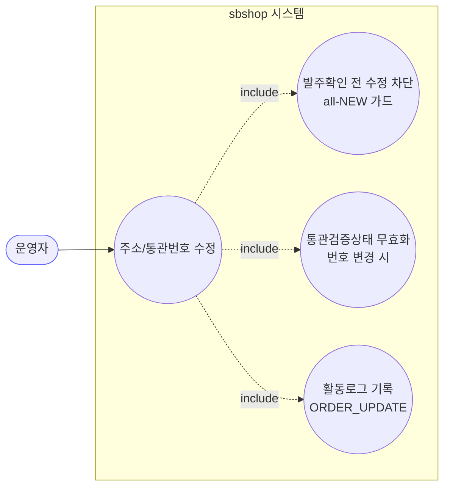
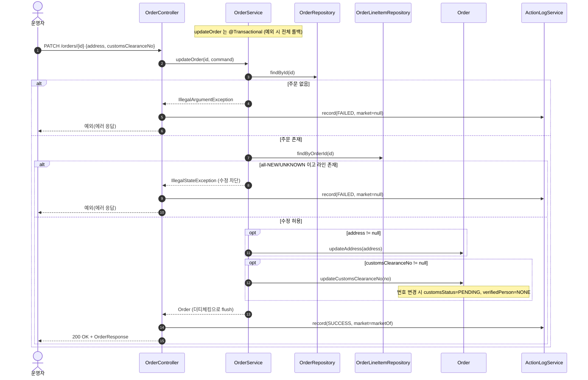
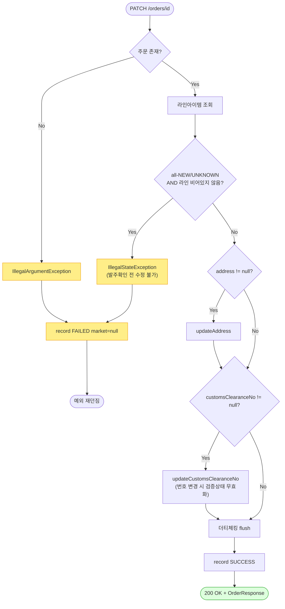

# PATCH /orders/{id} — 주소·통관번호 사용자 수정

## 1. 개요

| 항목 | 내용 |
|------|------|
| **Method / URL** | `PATCH /api/v1/orders/{id}` (바디 `OrderUpdateRequest`) |
| **목적** | 주문의 배송지 주소·개인통관고유부호를 사용자가 수정한다. 발주확인 전(all-NEW) 주문은 수정을 차단한다. |
| **핵심 상태전이** | 없음 (배송상태 전이 없음 — 주소/통관 필드만 변경) |
| **부수효과** | 통관번호가 실제로 바뀌면 통관검증상태를 `PENDING`/`NONE`으로 무효화(`Order.updateCustomsClearanceNo`). 마켓 전송 없음. |
| **응답** | `200 OK` + `OrderResponse` |

## 2. 호출 체인

```
OrderController.updateOrder()                          api/.../controller/OrderController.java:189-208  (try/catch 로그)
  └─ OrderUpdateRequest.toCommand()                    api/.../dto/OrderUpdateRequest.java:12-17
       └─ OrderUpdateCommand{address, customsClearanceNo}   core/.../order/dto/OrderUpdateCommand.java:8-11
  └─ OrderService.updateOrder(id, command)             core/.../order/service/OrderService.java:221-251  @Transactional
       ├─ orderRepository.findById() → 없으면 IllegalArgumentException   :225-227
       ├─ orderLineItemRepository.findByOrderId()      :230
       ├─ all-NEW/UNKNOWN 가드 (라인 비어있지 않을 때만 차단)   :231-238
       ├─ command.getAddress() != null → order.updateAddress()    :241-243 → Order.java:117-119
       └─ command.getCustomsClearanceNo() != null → order.updateCustomsClearanceNo()   :246-248 → Order.java:125-133
  └─ ActionLogService.record(ORDER_UPDATE, marketOf(updated)/null, SUCCESS/FAILED)   OrderController.java:200-205
  └─ OrderResponse.from(updated)                       api/.../dto/OrderResponse.java:52-74
```

**요청 바디 (`OrderUpdateRequest`, `OrderUpdateRequest.java:7-18`)**

| 필드 | 타입 | 필수 | 비고 |
|------|------|------|------|
| `address` | String | 선택 | null이면 미변경. 빈 문자열("")은 클리어로 취급(가드 통과 시 실제 반영) |
| `customsClearanceNo` | String | 선택 | null이면 미변경. 값 변경 시 검증상태 PENDING/NONE 초기화 |

## 3. 유스케이스 다이어그램



## 4. 시퀀스 다이어그램



## 5. 순서도 (플로우차트)



## 6. 상태 전이표

배송상태 자체는 전이하지 않으나, 진입 라인상태에 따라 **수정 허용/차단**이 갈린다.

| 진입 라인상태 | 허용? | 결과 | 마켓 전송 | 비고 |
|-----------|:-----:|------|-----------|------|
| 라인 전부 NEW 또는 UNKNOWN (라인 존재) | ❌ | 차단(IllegalState) | — | 발주확인 전 수정 불가(`OrderService.java:236-238`) |
| 라인 중 하나라도 PREPARING 이상/종료 | ✅ | 주소/통관 반영 | — | isProgressed 라인 존재 시 허용 |
| **라인아이템이 하나도 없는 주문** | ✅ | 주소/통관 반영 | — | `isAllNew`=true이나 `!lineItems.isEmpty()`=false라 가드 미적용(ORDA-4) |
| 통관번호 실제 변경 | — | customsStatus=PENDING, verifiedPerson=NONE | — | 같은 번호 재하달 시 검증상태 유지(D-073) |

## 7. 🔎 발견사항

### ORDA-4 · 🟠 GAP — 라인아이템이 없는 주문은 all-NEW 수정 가드를 통과해 발주확인 전에도 수정 가능
- **근거:** `OrderService.java:231-238`. `isAllNew`는 `stream().allMatch(...)`로 빈 리스트에서 `true`가 되지만, 차단 조건이 `if (isAllNew && !lineItems.isEmpty())`이다. 라인이 0건이면 `!lineItems.isEmpty()`=false라 가드가 적용되지 않아 곧바로 주소/통관 수정이 반영된다.
- **영향:** 라인아이템 없는(비정상/미완성) 주문에 대해 주소·통관번호를 자유 수정할 수 있다. 발주확인(`confirmOrder`, `OrderService.java:76-78`)은 라인 0건을 명시 차단하는데 수정 경로는 비대칭. 데이터 정합 위험은 낮으나 가드 의도와 어긋남.
- **제안:** 라인 0건일 때의 정책을 명확히 — 차단하려면 `if (lineItems.isEmpty() || isAllNew)` 등으로 보정, 허용이 의도면 주석으로 명시.

### ORDA-5 · 🟡 SMELL — 실패 활동로그의 marketType이 항상 null (성공 경로와 비대칭)
- **근거:** `OrderController.java:204`의 catch에서 `record(ORDER_UPDATE, null, FAILED, ...)`로 marketType을 null 고정한다. 같은 컨트롤러의 confirm/cancel 실패 경로는 `marketNameOfOrder(id)`로 주문을 재조회해 마켓을 채운다(`OrderController.java:109`,`:155`).
- **영향:** 주소/통관 수정 실패 시 활동로그에서 어느 마켓 주문이었는지 마켓 필드로 식별 불가(메시지엔 주문ID만 존재). 로그 필터/집계 일관성이 떨어짐.
- **제안:** 실패 경로도 `marketNameOfOrder(id)` 재조회로 마켓을 채워 confirm/cancel과 정합화(성공 경로는 이미 `marketOf(updated)` 사용).

### ORDA-6 · 🔵 NOTE — 주소 빈 문자열("") 클리어와 미변경(null)의 구분은 되나, 트림/유효성 검증은 없음
- **근거:** `OrderService.java:241-243`는 `command.getAddress() != null`만 확인하고 `order.updateAddress(address)`(`Order.java:117-119`)는 값을 그대로 대입한다. 공백만 있는 주소, 길이 초과(컬럼 length=500) 등 입력 검증이 서비스/도메인에 없다.
- **영향:** " " 같은 무의미 주소로 덮어써질 수 있고, 500자 초과 시 DB 계층에서야 실패한다(방어적 400 부재). 소싱 수정 경로가 진입부 음수검증(`validateSourcingAmounts`, `OrderController.java:242`)을 두는 것과 대조적.
- **제안:** 필요 시 주소/통관번호 형식·길이 검증을 진입부 또는 도메인에 추가할지 정책으로 확정.

## 8. 테스트 커버리지 메모

- `OrderServiceClearFieldsTest`(`backend/core/.../order/service/OrderServiceClearFieldsTest.java`): 통관번호 null→기존유지(:118-128), 빈문자열 클리어, 번호 변경 시 검증상태, all-NEW 상태에서 클리어 차단(:136-153)을 검증.
- **검증되는 계약:** 통관번호 변경/미변경 분기(D-073), all-NEW 주소보호 가드.
- **비어있는 케이스:** ① **라인 0건 주문 수정 허용(ORDA-4)** — 미검증, ② 존재하지 않는 주문 → IllegalArgumentException, ③ 실패 활동로그 marketType null(ORDA-5) — 컨트롤러 레벨 미검증, ④ 주소 유효성/길이(ORDA-6).
- ORDA-4는 Red 테스트로 정책을 먼저 고정할 것을 권장.

---
*생성: 2026-07-17 · 근거: 현재 워킹트리*
