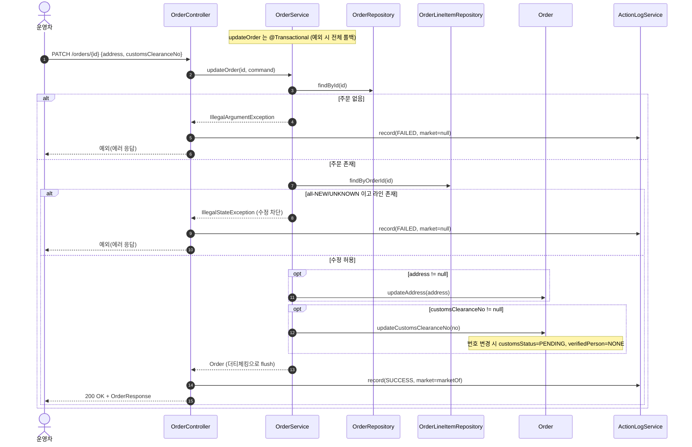

# PATCH /orders/{id} — 배송지 주소·통관번호 수정

## 1. 개요

이 기능은 **한 주문의 배송지 주소와 개인통관고유부호를 운영자가 직접 고치는 기능**입니다. 단, 아직 마켓에 "주문 접수했다"고 알리기 전(모든 상품 항목이 결제완료 상태인) 주문은 함부로 못 고치게 막습니다.

| 항목 | 내용 (쉬운 설명) |
|------|------|
| **어떻게 호출하나** | `PATCH /api/v1/orders/{id}` — 주소·통관번호를 담은 내용(`OrderUpdateRequest`)을 함께 보냅니다. |
| **무엇을 하나** | 주문의 배송지 주소와 통관번호를 수정합니다. 아직 발주확인 전(모든 항목이 NEW)인 주문은 수정을 막습니다. |
| **상태를 바꾸나** | 배송상태는 안 바꿉니다. 주소·통관번호 값만 바꿉니다. |
| **다른 곳에 영향 주나** | 통관번호가 실제로 바뀌면, 그 주문의 통관검증 상태를 "다시 확인 필요(PENDING/NONE)"로 되돌립니다(`Order.updateCustomsClearanceNo`). 마켓에 뭔가 보내지는 않습니다. |
| **무엇을 돌려주나** | `200 OK` 와 함께 수정된 주문 정보(`OrderResponse`) |

## 2. 호출 체인

아래는 요청이 들어와 처리될 때까지 **코드가 거쳐가는 순서**입니다. `파일명:줄번호`는 실제 코드 위치입니다.

```
OrderController.updateOrder()                          api/.../controller/OrderController.java:189-208  (try/catch 로그)
  └─ OrderUpdateRequest.toCommand()                    api/.../dto/OrderUpdateRequest.java:12-17
       └─ OrderUpdateCommand{address, customsClearanceNo}   core/.../order/dto/OrderUpdateCommand.java:8-11
  └─ OrderService.updateOrder(id, command)             core/.../order/service/OrderService.java:221-251  @Transactional
       ├─ orderRepository.findById() → 없으면 IllegalArgumentException   :225-227
       ├─ orderLineItemRepository.findByOrderId()      :230
       ├─ all-NEW/UNKNOWN 가드 (라인 비어있지 않을 때만 차단)   :231-238
       ├─ command.getAddress() != null → order.updateAddress()    :241-243 → Order.java:117-119
       └─ command.getCustomsClearanceNo() != null → order.updateCustomsClearanceNo()   :246-248 → Order.java:125-133
  └─ ActionLogService.record(ORDER_UPDATE, marketOf(updated)/null, SUCCESS/FAILED)   OrderController.java:200-205
  └─ OrderResponse.from(updated)                       api/.../dto/OrderResponse.java:52-74
```

**→ 쉽게 말하면 이런 순서입니다:**
1. 사용자가 보낸 주소·통관번호를 정리합니다(`updateOrder` → `OrderUpdateCommand`).
2. 저장을 바꾸는 작업이라 "하나라도 잘못되면 전부 되돌리기(`@Transactional`)" 묶음으로 처리합니다.
3. 먼저 그 주문이 실제로 있는지 찾습니다. 없으면 "그런 주문 없음" 오류를 냅니다.
4. 그 주문의 상품 항목들을 불러와, 아직 발주확인 전(모두 NEW)이면 수정을 막습니다. → 쉽게 말하면 "아직 시작도 안 한 주문은 함부로 손대지 마라"는 보호 장치.
5. 통과하면 주소가 들어왔으면 주소를, 통관번호가 들어왔으면 통관번호를 바꿉니다.
6. 마지막으로 "누가·어느 마켓 주문을·성공/실패로 바꿨다"를 활동로그에 남기고, 수정 결과를 돌려줍니다.

**보낼 수 있는 내용 (`OrderUpdateRequest`, `OrderUpdateRequest.java:7-18`)**

| 필드 | 타입 | 필수 | 쉬운 설명 |
|------|------|------|------|
| `address` | String | 선택 | 안 넣으면(null) 주소는 그대로 둡니다. 빈 값("")을 넣으면 "주소 지우기"로 봅니다(가드를 통과하면 실제로 비워짐). |
| `customsClearanceNo` | String | 선택 | 안 넣으면 통관번호는 그대로. 값이 실제로 바뀌면 통관검증 상태를 다시 확인 필요로 되돌립니다. |

## 3. 유스케이스 다이어그램

👉 이 그림은 **운영자가 "주소/통관번호 수정" 하나를 하면, 시스템이 함께 챙기는 일들**(수정 금지 검사, 통관검증 되돌리기, 활동로그 남기기)을 보여줍니다.


## 4. 시퀀스 다이어그램

👉 이 그림은 **요청이 들어왔을 때, 주문이 없거나 / 수정 금지 상태거나 / 정상 수정인 세 갈래로 나뉘어 처리되는 대화 순서**를 보여줍니다. 정상일 때만 값이 바뀌고 성공 로그가 남습니다.



## 5. 순서도 (플로우차트)

👉 이 그림은 **"주문 있나? → 수정 가능한 상태인가? → 주소/통관번호를 바꾼다"로 이어지는 판단의 갈림길**을 보여줍니다. 막히면 실패 로그를 남기고 예외를 던지고, 통과하면 성공 로그를 남깁니다.


## 6. 상태 전이표

배송상태 자체는 바뀌지 않지만, **들어올 때 주문 항목이 어떤 상태냐에 따라 수정이 허용되기도, 막히기도** 합니다.

| 들어올 때 항목 상태 | 수정 허용? | 결과 | 마켓 전송 | 쉬운 설명 |
|-----------|:-----:|------|-----------|------|
| 항목이 전부 NEW 또는 UNKNOWN (항목은 있음) | ❌ | 막힘(IllegalState) | — | 아직 발주확인 전이라 수정 금지(`OrderService.java:236-238`). |
| 항목 중 하나라도 준비중(PREPARING) 이상이거나 종료됨 | ✅ | 주소·통관번호 반영 | — | 이미 진행된 항목이 있으면 수정 허용. |
| **상품 항목이 하나도 없는 주문** | ✅ | 주소·통관번호 반영 | — | "모두 NEW"는 참이지만 "항목이 있음"이 거짓이라 보호가 안 걸림 → 그냥 수정됨(ORDA-4). |
| 통관번호가 실제로 바뀜 | — | 통관검증 상태를 다시 확인 필요로 되돌림 | — | 같은 번호를 다시 넣으면 검증상태는 그대로 유지(D-073). |

## 7. 🔎 발견사항

### ORDA-4 · 🟠 GAP — 상품 항목이 하나도 없는 주문은 "발주확인 전 수정 금지" 보호를 빠져나가 자유롭게 수정됨
- **무엇이 문제인가:** "아직 발주확인 전(모든 항목이 NEW)인 주문은 수정 금지"라는 보호가 있는데, 이 보호는 "모든 항목이 NEW **이고** 항목이 비어있지 않을 때"만 작동하도록 짜여 있습니다. 문제는 항목이 아예 0개인 주문입니다. 이런 주문은 "모든 항목이 NEW다"라는 검사를 (대상이 없으니) 자동으로 통과하는데, "항목이 비어있지 않다"는 조건에서 걸려 보호가 안 걸립니다. 결국 항목이 하나도 없는 주문은 그냥 수정이 됩니다.
- **근거:** `OrderService.java:231-238`. `isAllNew`는 `stream().allMatch(...)`로 빈 리스트에서 `true`가 되지만, 차단 조건이 `if (isAllNew && !lineItems.isEmpty())`이다. 라인이 0건이면 `!lineItems.isEmpty()`=false라 가드가 적용되지 않아 곧바로 주소/통관 수정이 반영된다.
- **왜 문제인가:** 항목이 없는(비정상·미완성) 주문의 주소·통관번호를 마음대로 바꿀 수 있습니다. 참고로 발주확인 쪽(`confirmOrder`, `OrderService.java:76-78`)은 항목 0건을 확실히 막는데, 이 수정 경로만 비대칭입니다. 데이터가 깨질 위험은 낮지만, 원래 보호 의도와 어긋납니다.
- **어떻게 고치면 되나:** 항목이 0건일 때 어떻게 할지 정책을 정합니다. 막으려면 조건을 `if (lineItems.isEmpty() || isAllNew)` 처럼 "항목이 비었거나 또는 모두 NEW이면 막기"로 보정하고, 허용이 의도라면 주석으로 명시합니다.

### ORDA-5 · 🟡 SMELL — 주소/통관 수정이 실패했을 때 활동로그에 어느 마켓 주문인지가 항상 비어(null) 남음
- **무엇이 문제인가:** 주소·통관번호 수정이 성공하면 활동로그에 마켓을 채워 넣는데, 실패하면 마켓 칸이 늘 비어(null) 있습니다. 같은 컨트롤러의 발주확인·취소 실패 경로는 주문을 다시 조회해 마켓을 채워 넣는데, 이 경로만 다릅니다.
- **근거:** `OrderController.java:204`의 catch에서 `record(ORDER_UPDATE, null, FAILED, ...)`로 marketType을 null 고정한다. 같은 컨트롤러의 confirm/cancel 실패 경로는 `marketNameOfOrder(id)`로 주문을 재조회해 마켓을 채운다(`OrderController.java:109`, `:155`).
- **왜 문제인가:** 주소/통관 수정 실패 로그의 마켓 칸만 봐서는 어느 마켓 주문이었는지 알 수 없습니다(메시지엔 주문 ID만 있음). 로그를 마켓별로 걸러 보거나 집계하는 일관성이 떨어집니다.
- **어떻게 고치면 되나:** 실패 경로에서도 주문 ID로 마켓을 다시 조회(`marketNameOfOrder(id)`)해 채워 넣어 발주확인·취소와 맞춥니다(성공 경로는 이미 `marketOf(updated)`를 씁니다).

### ORDA-6 · 🔵 NOTE — 주소가 공백뿐이거나 너무 길어도 걸러내지 못해, DB 단계에서야 실패함
- **무엇이 문제인가:** 주소 수정은 "값이 null이 아닌지"만 보고 들어온 값을 그대로 저장합니다. 공백만 있는 주소나, 컬럼이 허용하는 길이(500자)를 넘는 값에 대한 검증이 서비스·도메인 어디에도 없습니다.
- **근거:** `OrderService.java:241-243`는 `command.getAddress() != null`만 확인하고 `order.updateAddress(address)`(`Order.java:117-119`)는 값을 그대로 대입한다. 공백만 있는 주소, 길이 초과(컬럼 length=500) 등 입력 검증이 서비스/도메인에 없다.
- **왜 문제인가:** " "(공백) 같은 의미 없는 주소로 덮어써질 수 있고, 500자를 넘으면 DB 계층까지 가서야 실패합니다(미리 400으로 막는 방어가 없음). 소싱 수정 경로는 입구에서 음수 검증을 하는데, 이 경로는 그런 방어가 없어 대조적입니다.
- **어떻게 고치면 되나:** 필요하면 주소·통관번호의 형식·길이 검증을 입구나 도메인에 추가할지 정책으로 정합니다.

## 8. 테스트 커버리지 메모

- `OrderServiceClearFieldsTest`(`backend/core/.../order/service/OrderServiceClearFieldsTest.java`): 통관번호를 안 넣으면 기존 값 유지(:118-128), 빈 문자열로 지우기, 번호가 바뀌면 검증상태 되돌림, 모두 NEW인 상태에서 값 지우기 막기(:136-153)를 검사합니다.
- **지금 보장되는 약속:** 통관번호 변경/미변경 분기(D-073), 발주확인 전 주소 보호.
- **아직 검사 안 하는 경우들:**
  - ① **항목 0건 주문의 수정이 허용되는 문제(ORDA-4)** — 미검증,
  - ② 존재하지 않는 주문 → "그런 주문 없음" 오류,
  - ③ 실패 시 활동로그 마켓이 null인 경로(ORDA-5) — 컨트롤러 레벨 미검증,
  - ④ 주소 형식·길이 검증(ORDA-6).
- ORDA-4는 먼저 실패하는 테스트(Red)를 만들어 "항목 0건일 때 어떻게 할지" 정책을 확정하길 권장합니다.

---
*(쉬운 설명판 · 2026-07-17 재작성)*
*생성: 2026-07-17 · 근거: 현재 워킹트리*
