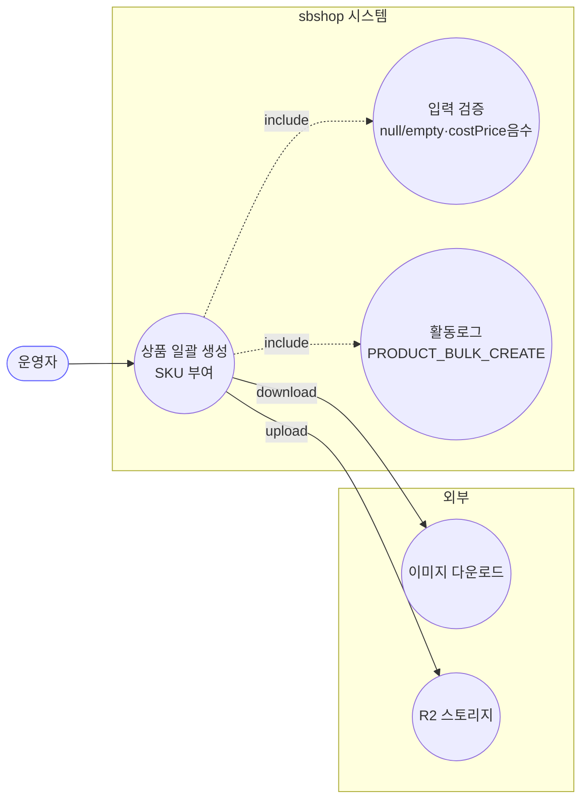

# POST /api/v1/products/bulk — 상품 일괄 등록

## 1. 개요

| 항목 | 내용 |
|------|------|
| **Method / URL** | `POST /api/v1/products/bulk` (바디 `List<ProductSaveRequest>`) |
| **목적** | 소싱한 상품들을 SKU(sbCode) 부여·이미지 R2 호스팅과 함께 대량 생성하고, 성공/실패를 항목별로 집계 반환한다. |
| **핵심 상태전이** | (신규 생성) 없음 → `Product` 영속화. 실패 항목은 저장 대상에서 제외. |
| **부수효과** | 이미지 다운로드·R2 업로드(트랜잭션 밖) + DB saveAll(짧은 트랜잭션, `ProductPersistTxService`) + 활동로그(`PRODUCT_BULK_CREATE`) 1건. |
| **응답** | `200 OK` + `BulkProductCreateResponse`(succeeded[] / failed[]). |

## 2. 호출 체인

```
ProductSourcingController.saveProductsBulk(List<ProductSaveRequest>)  api/.../controller/ProductSourcingController.java:104-134
  ├─ null/empty 가드 → IllegalArgumentException(400)                   :109-111
  ├─ costPrice &lt; 0 가드 → IllegalArgumentException(400)              :113-117
  ├─ requests.map(ProductSaveRequest::toCommand)                       :118-120 → dto/product/ProductSaveRequest.java:27-32
  ├─ productCreateUseCase.createBulk(commands)                         :123
  │    └─ ProductCreateUseCase.createBulk()                            core/.../product/ProductCreateUseCase.java:43-86  (트랜잭션 없음)
  │         ├─ prefix = yyMMdd + "IHB"                                 :44-45
  │         ├─ productReader.getNextSbCodeSequence(prefix) 1회         :51 (도메인 컴포넌트)
  │         ├─ for each command:                                       :55-72
  │         │    ├─ sbCode = prefix + %03d(seq++)                      :58-59
  │         │    ├─ enrichWithHostedImages(command)                   :61 → :88-107
  │         │    │    ├─ imageDownloadClient.downloadAndConvert()      :93 (외부 I/O)
  │         │    │    ├─ imageStorageClient.uploadImages()             :94 (R2 업로드)
  │         │    │    └─ (Exception) → log.warn, 원본 이미지로 진행     :103-106
  │         │    ├─ Product.create(sbCode, enriched)                  :63 (도메인 팩토리)
  │         │    ├─ succeeded.add(Success(i, product))                :65
  │         │    └─ (Exception) → failed.add(Failure(i, name, msg))   :67-71
  │         └─ if !products.isEmpty():                                :75-84
  │              └─ productPersistTxService.saveAll(products)         :77 → ProductPersistTxService.java:30-35  @Transactional
  │                   └─ productWriter.saveAll(products)              :32
  │              (RuntimeException) → log.error[복구필요] + rethrow    :78-83
  ├─ BulkProductCreateResponse.from(result)                           :124 → dto/product/BulkProductCreateResponse.java:20-28
  └─ actionLogService.record(PRODUCT_BULK_CREATE, SUCCESS "성공 N, 실패 M")  :125-127
      catch(Exception) → record(FAILED) + rethrow                     :129-132
```

**요청 바디 (`ProductSaveRequest`, `ProductSaveRequest.java:9-25`)** — sourceUrl·costPrice·baseName·brand·images·vendor 등 소싱 상품 필드.

## 3. 유스케이스 다이어그램



## 4. 시퀀스 다이어그램

```mermaid
sequenceDiagram
    autonumber
    actor U as 운영자
    participant C as ProductSourcingController
    participant UC as ProductCreateUseCase
    participant IMG as ImageDownload/StorageClient
    participant TX as ProductPersistTxService
    participant W as ProductWriter
    participant L as ActionLogService
    Note over UC: createBulk 자체는 트랜잭션 없음(F-PSRC-8)
    Note over IMG: 이미지 I/O는 트랜잭션 밖
    Note over TX,W: saveAll 만 @Transactional (짧은 커밋)

    U->>C: POST /products/bulk [requests]
    alt null/empty 또는 costPrice&lt;0
        C-->>U: 400 (IllegalArgumentException)
    else 정상
        C->>UC: createBulk(commands)
        loop 각 command
            UC->>IMG: download + upload (트랜잭션 밖)
            alt 이미지 실패
                IMG-->>UC: 예외 → log.warn, 원본이미지로 진행
            end
            alt Product.create 성공
                UC->>UC: succeeded += product
            else 예외
                UC->>UC: failed += (index, name, reason)
            end
        end
        opt products 비어있지 않음
            UC->>TX: saveAll(products) @Transactional
            TX->>W: saveAll
            alt DB 저장 실패
                W-->>TX: RuntimeException
                TX-->>UC: rethrow
                Note over UC: log.error[복구필요]<br/>R2 고아 이미지 가능 → rethrow
                UC-->>C: 예외
                C->>L: record(FAILED)
                C-->>U: 400/500
            end
        end
        UC-->>C: BulkProductCreateResult(succeeded, failed)
        C->>L: record(SUCCESS "성공 N, 실패 M")
        C-->>U: 200 OK + BulkProductCreateResponse
    end
```

## 5. 순서도 (플로우차트)


## 6. 상태 전이표

신규 생성이므로 진입 상태 없음. 항목별 처리 결과:

| 진입 항목 | 결과 | 저장 | 응답 위치 | 비고 |
|-----------|------|:----:|-----------|------|
| 정상 command | `Product` 생성 | ✅ saveAll | succeeded[] | sbCode 부여 |
| 이미지 다운/업로드 실패 | 원본 이미지로 진행 | ✅ | succeeded[] | log.warn만, 실패 아님(:103-106) |
| `Product.create` 등 예외 | 스킵 | ❌ | failed[] | index+사유 표면화(:67-71) |
| 전체 saveAll 실패 | 전건 롤백 | ❌ | 예외 전파 | R2 고아 이미지 위험 로그(:78-83) |
| costPrice 음수 / null·empty 목록 | — | ❌ | 400 | 진입 가드 |

## 7. 🔎 발견사항

### PSRC-4 · 🟠 GAP — 개별 항목이 `succeeded` 에 담겼어도 saveAll 전건 실패 시 전부 롤백되어 응답의 succeeded 와 실제 DB 상태가 어긋남
- **근거:** `ProductCreateUseCase.java:75-84` — 성공 항목들은 `products` 리스트에 모아 **한 번의** `productPersistTxService.saveAll` 로 커밋한다(`ProductPersistTxService.java:30-35` 단일 `@Transactional`). saveAll 이 RuntimeException 이면 `:82` 에서 rethrow → 컨트롤러 `:129-132` catch → `record(FAILED)` + rethrow. 이 경우 예외가 응답을 대체하므로 `BulkProductCreateResponse` 자체가 나가지 못한다.
- **영향:** "일부만 저장" 이 불가능 — saveAll 이 하나라도 제약 위반(예: sbCode 유니크 충돌)나면 정상 항목까지 전부 롤백. 반대로 정상 경로에서 반환된 `succeeded` 는 saveAll 성공을 전제로 하므로, 개별 항목 단위 부분 커밋은 지원되지 않는다. R2 에는 이미 이미지가 올라간 상태라 고아 이미지가 남는다(코드도 이를 `:80-81` 로그로 인지).
- **제안:** saveAll 을 `saveAll` 단건 실패 격리(배치 분할/건별 저장)로 전환하거나, 최소한 전건 롤백 시 응답 계약(부분 성공 불가)을 문서·UI에 명시. R2 고아 정리 복구 절차 연결.

### PSRC-5 · 🟡 SMELL — 이미지 호스팅 실패를 "정상 진행" 으로 삼켜 hostedImages 없는 상품이 생성될 수 있음(게시 단계에서야 실패)
- **근거:** `ProductCreateUseCase.java:103-106` — `enrichWithHostedImages` 가 다운로드/업로드 예외를 catch 하고 `log.warn` 후 **원본 command(hostedImages 미설정)** 로 진행한다. `ProductSaveRequest.toCommand()`(`ProductSaveRequest.java:27-32`)는 hostedImages 를 `null` 로 넘기므로, 이미지 호스팅이 실패하면 그 상품은 hostedImages 없이 생성·저장되어 succeeded[] 에 포함된다.
- **영향:** 생성은 "성공" 으로 집계되지만, 이후 마켓 게시(`ProductValidator.validateForPublish`, `ProductValidator.java:27-29`)에서 "호스팅된 이미지가 없습니다" 로 반드시 실패한다. 실패 시점이 생성에서 게시로 미뤄져 원인 추적이 어렵다.
- **제안:** 이미지 호스팅 필수 여부를 정책으로 확정 — 필수라면 생성 단계에서 실패(failed[])로 분류, 선택이라면 succeeded 응답에 "이미지 미호스팅" 플래그를 실어 후속 단계가 인지하게.

### PSRC-6 · 🔵 NOTE — 음수 검증은 costPrice 만 하고 marginRate·weight·capacity·bundleQuantity 등 다른 수치 필드는 무검증
- **근거:** 컨트롤러 `ProductSourcingController.java:113-117` 은 `costPrice` 음수만 400 으로 거른다. `ProductSaveRequest`(`ProductSaveRequest.java:9-25`)의 `weight`/`capacity`/`marginRate`/`bundleQuantity` 는 음수·비정상값 검증이 없다.
- **영향:** 음수 marginRate/weight 등 오염 데이터가 그대로 생성될 수 있다(도메인 `Product.create` 가 별도로 막지 않는 한). 단, 이는 소싱 파이프라인이 값을 정제한다는 전제일 수 있어 조건부.
- **제안:** 필드별 유효범위 정책을 정하고 필요한 것만 진입 가드에 추가(과검증 지양).

## 8. 테스트 커버리지 메모

- 존재: `ProductSourcingBulkTest`(api 컨트롤러), `ProductCreateBulkSbCodeTest`·`ProductCreateBulkPartialFailureTest`·`ProductCreateTxBoundaryTest`·`ProductCreateUseCaseTest`(core) — sbCode 시퀀스, 부분 실패 집계(F-PSRC-6), 트랜잭션 경계(F-PSRC-8) 검증.
- **비어있는 케이스:** ① saveAll 전건 롤백 시 응답 succeeded 와 DB 불일치(PSRC-4), ② 이미지 호스팅 실패 후 hostedImages 없는 상품이 succeeded 로 나가는 경로(PSRC-5), ③ costPrice 외 수치 필드 음수(PSRC-6).

---
*생성: 2026-07-17 · 근거: 현재 워킹트리*
