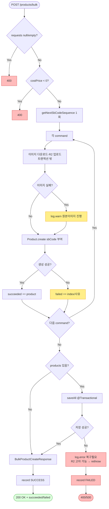

# POST /api/v1/products/bulk — 상품 여러 개 한꺼번에 등록

## 1. 개요

이 기능은 소싱(수집)해 온 상품들을 한 번에 여러 개 만들어 저장합니다. 각 상품에는 우리만의 관리번호(SKU, 여기서는 sbCode)를 붙이고, 상품 이미지는 우리 저장소(R2)로 옮겨 담아 호스팅합니다. 처리 결과는 상품 하나하나별로 "성공"과 "실패"로 나눠 돌려줍니다.

| 항목 | 쉬운 설명 |
|------|------|
| **부르는 방법 / 주소** | `POST /api/v1/products/bulk` — 요청 몸통에 상품 정보 목록(`List<ProductSaveRequest>`)을 담아 보냅니다. |
| **하는 일** | 소싱한 상품들에 관리번호(sbCode)를 붙이고 이미지를 우리 저장소로 옮긴 뒤, 여러 개를 한꺼번에 만들어 저장하고 성공/실패를 상품별로 정리해 돌려줍니다. |
| **상태 변화** | (새로 만드는 것이라 이전 상태 없음) → `Product`로 저장됩니다. 만들다 실패한 상품은 저장 대상에서 뺍니다. |
| **부수적으로 생기는 일** | 이미지 내려받기·R2 저장소 올리기(저장 묶음 밖에서 진행) + DB 저장(saveAll, 짧은 저장 묶음 `ProductPersistTxService`) + 활동로그(`PRODUCT_BULK_CREATE`) 1건. |
| **돌려주는 값** | `200 OK` + `BulkProductCreateResponse`(성공 목록 succeeded[] / 실패 목록 failed[]). |

## 2. 호출 체인

아래는 요청이 처리되는 코드 흐름입니다. 각 단계 아래에 "쉽게 말하면" 설명을 붙였습니다.

```
ProductSourcingController.saveProductsBulk(List<ProductSaveRequest>)  api/.../controller/ProductSourcingController.java:104-134
  ├─ null/empty 가드 → IllegalArgumentException(400)                   :109-111
  ├─ costPrice &lt; 0 가드 → IllegalArgumentException(400)              :113-117
  ├─ requests.map(ProductSaveRequest::toCommand)                       :118-120 → dto/product/ProductSaveRequest.java:27-32
  ├─ productCreateUseCase.createBulk(commands)                         :123
  │    └─ ProductCreateUseCase.createBulk()                            core/.../product/ProductCreateUseCase.java:43-86  (트랜잭션 없음)
  │         ├─ prefix = yyMMdd + "IHB"                                 :44-45
  │         ├─ productReader.getNextSbCodeSequence(prefix) 1회         :51 (도메인 컴포넌트)
  │         ├─ for each command:                                       :55-72
  │         │    ├─ sbCode = prefix + %03d(seq++)                      :58-59
  │         │    ├─ enrichWithHostedImages(command)                   :61 → :88-107
  │         │    │    ├─ imageDownloadClient.downloadAndConvert()      :93 (외부 I/O)
  │         │    │    ├─ imageStorageClient.uploadImages()             :94 (R2 업로드)
  │         │    │    └─ (Exception) → log.warn, 원본 이미지로 진행     :103-106
  │         │    ├─ Product.create(sbCode, enriched)                  :63 (도메인 팩토리)
  │         │    ├─ succeeded.add(Success(i, product))                :65
  │         │    └─ (Exception) → failed.add(Failure(i, name, msg))   :67-71
  │         └─ if !products.isEmpty():                                :75-84
  │              └─ productPersistTxService.saveAll(products)         :77 → ProductPersistTxService.java:30-35  @Transactional
  │                   └─ productWriter.saveAll(products)              :32
  │              (RuntimeException) → log.error[복구필요] + rethrow    :78-83
  ├─ BulkProductCreateResponse.from(result)                           :124 → dto/product/BulkProductCreateResponse.java:20-28
  └─ actionLogService.record(PRODUCT_BULK_CREATE, SUCCESS "성공 N, 실패 M")  :125-127
      catch(Exception) → record(FAILED) + rethrow                     :129-132
```

→ 쉽게 말하면 이런 순서입니다.
1. **입구에서 막기:** 상품 목록이 비었거나, 원가(costPrice)가 음수면 곧바로 400(잘못된 요청)으로 돌려보냅니다.
2. **관리번호 씨앗 뽑기:** 오늘 날짜(yyMMdd) + "IHB"를 앞머리로 삼고, 이어 붙일 번호의 시작값을 한 번 가져옵니다.
3. **상품 하나씩 준비:** 각 상품에 관리번호(sbCode)를 붙이고, 이미지를 내려받아 우리 저장소(R2)로 올립니다. 이미지 옮기기가 실패하면 오류로 멈추지 않고 경고만 남긴 뒤 **원본 이미지 그대로** 진행합니다. 상품 객체 만들기까지 잘 되면 성공 목록에, 도중에 오류가 나면 실패 목록에 "몇 번째·이름·사유"와 함께 담습니다.
4. **모아서 한 번에 저장:** 성공한 상품들을 모아 한 번에 DB에 저장합니다(saveAll, 짧은 저장 묶음). 이 저장이 실패하면 "복구 필요" 오류를 남기고 오류를 위로 다시 던집니다.
5. **결과 돌려주고 기록:** 성공/실패를 정리해 돌려주고, 활동로그에 "성공 N건, 실패 M건"을 남깁니다. 도중에 오류가 나면 "실패"로 기록하고 오류를 다시 던집니다.

**요청 몸통 (`ProductSaveRequest`, `ProductSaveRequest.java:9-25`)** — 소싱한 상품의 정보(원본주소 sourceUrl·원가 costPrice·기본이름 baseName·브랜드 brand·이미지 images·공급처 vendor 등)를 담습니다.

## 3. 유스케이스 다이어그램

👉 이 그림은 운영자가 상품 일괄 등록을 쓸 때 시스템이 함께 하는 일(입력 검사·활동로그)과, 이미지 내려받기·R2 저장소 같은 외부와의 연결을 한눈에 보여줍니다.


## 4. 시퀀스 다이어그램

👉 이 그림은 요청이 들어온 뒤 각 부품(컨트롤러·생성 로직·이미지 처리·저장 서비스·활동로그)이 시간 순서대로 무엇을 주고받는지, 특히 이미지 처리는 저장 묶음 밖에서·저장(saveAll)만 짧은 묶음 안에서 일어나는 점을 보여줍니다.

```mermaid
sequenceDiagram
    autonumber
    actor U as 운영자
    participant C as ProductSourcingController
    participant UC as ProductCreateUseCase
    participant IMG as ImageDownload/StorageClient
    participant TX as ProductPersistTxService
    participant W as ProductWriter
    participant L as ActionLogService
    Note over UC: createBulk 자체는 트랜잭션 없음(F-PSRC-8)
    Note over IMG: 이미지 I/O는 트랜잭션 밖
    Note over TX,W: saveAll 만 @Transactional (짧은 커밋)

    U->>C: POST /products/bulk [requests]
    alt null/empty 또는 costPrice&lt;0
        C-->>U: 400 (IllegalArgumentException)
    else 정상
        C->>UC: createBulk(commands)
        loop 각 command
            UC->>IMG: download + upload (트랜잭션 밖)
            alt 이미지 실패
                IMG-->>UC: 예외 → log.warn, 원본이미지로 진행
            end
            alt Product.create 성공
                UC->>UC: succeeded += product
            else 예외
                UC->>UC: failed += (index, name, reason)
            end
        end
        opt products 비어있지 않음
            UC->>TX: saveAll(products) @Transactional
            TX->>W: saveAll
            alt DB 저장 실패
                W-->>TX: RuntimeException
                TX-->>UC: rethrow
                Note over UC: log.error[복구필요]<br/>R2 고아 이미지 가능 → rethrow
                UC-->>C: 예외
                C->>L: record(FAILED)
                C-->>U: 400/500
            end
        end
        UC-->>C: BulkProductCreateResult(succeeded, failed)
        C->>L: record(SUCCESS "성공 N, 실패 M")
        C-->>U: 200 OK + BulkProductCreateResponse
    end
```

## 5. 순서도 (플로우차트)

👉 이 그림은 요청이 조건에 따라 어디로 갈라져 흘러가는지(입력 검사 → 상품별 처리 → 한 번에 저장 → 성공 200 / 실패 400·500)를 시작부터 끝까지 따라가며 보여줍니다.



## 6. 상태 전이표

새로 만드는 것이라 "들어올 때의 상태"는 없습니다. 아래는 상품 하나하나가 어떻게 처리되는지 보여줍니다.

| 어떤 상품인가 | 어떻게 되나 | 저장 | 어디에 담기나 | 쉬운 설명 |
|-----------|------|:----:|-----------|------|
| 정상적인 상품 | `Product`로 만들어짐 | ✅ saveAll로 저장 | succeeded[] | 관리번호(sbCode) 붙음 |
| 이미지 옮기기 실패 | 원본 이미지로 그냥 진행 | ✅ | succeeded[] | 경고 로그만 남기고 실패로 안 침(:103-106) |
| `Product.create` 등에서 오류 | 건너뜀 | ❌ | failed[] | 몇 번째·사유를 드러냄(:67-71) |
| 모아서 저장(saveAll)이 통째로 실패 | 전부 되돌림 | ❌ | 오류가 응답을 대체 | R2에 남은 이미지가 미아가 될 위험 로그(:78-83) |
| 원가가 음수 / 목록이 비었거나 없음 | — | ❌ | 400 | 입구 검사에서 막힘 |

## 7. 🔎 발견사항

### PSRC-4 · 🟠 GAP — 각 상품을 성공(succeeded)으로 담았어도, 한 번에 저장하다 전부 실패하면 모두 되돌아가서 응답의 "성공"과 실제 DB 상태가 어긋남
- **무엇이 문제인가:** 성공한 상품들을 모아 **딱 한 번의** 저장(saveAll)으로 한꺼번에 커밋합니다(`ProductPersistTxService.java:30-35`의 하나짜리 `@Transactional`). 이 저장이 오류(RuntimeException)를 내면 `:82`에서 오류를 위로 다시 던지고, 컨트롤러(`:129-132`)가 이를 받아 "실패"로 기록한 뒤 또 던집니다. 이 경우 오류가 응답 자리를 대신 차지하므로, 성공/실패를 정리한 `BulkProductCreateResponse` 자체가 나가지 못합니다.
- **근거:** `ProductCreateUseCase.java:75-84`, `ProductPersistTxService.java:30-35`
- **왜 문제인가:** "일부만 저장"이 불가능합니다 — 저장 중 상품 하나라도 규칙을 어기면(예: 관리번호가 겹침) 멀쩡한 상품까지 전부 되돌아갑니다. 반대로 정상적으로 돌려주는 "성공 목록"은 저장이 다 잘 됐다는 전제 위에서만 맞는 값이라, 상품 단위로 부분만 저장하는 건 지원되지 않습니다. 게다가 이미 R2 저장소에는 이미지가 올라가 있어서, 저장이 되돌아가면 주인 없는 이미지(고아 이미지)가 남습니다(코드도 `:80-81` 로그로 이를 알고 있습니다).
- **어떻게 고치면 되나:** 저장을 상품별로 나눠(또는 작은 묶음으로 쪼개) 한 건 실패가 다른 건에 번지지 않게 하거나, 최소한 "전부 되돌아감(부분 저장 불가)"이라는 응답 규칙을 문서·화면에 분명히 적습니다. 남은 고아 이미지를 정리하는 복구 절차도 연결합니다.

### PSRC-5 · 🟡 SMELL — 이미지 옮기기 실패를 "정상 진행"으로 넘겨버려서, 호스팅된 이미지가 없는 상품이 만들어질 수 있음(마켓에 올릴 때가 돼서야 실패)
- **무엇이 문제인가:** 이미지 옮기기(`enrichWithHostedImages`)가 실패하면, 코드는 오류를 잡아 경고만 남기고(`log.warn`) **원본 정보 그대로**(호스팅 이미지가 안 채워진 상태로) 진행합니다(`:103-106`). 그리고 요청을 명령으로 바꾸는 부분(`ProductSaveRequest.toCommand()`, `ProductSaveRequest.java:27-32`)이 호스팅 이미지 칸을 빈 값(null)으로 넘기기 때문에, 이미지 옮기기가 실패한 상품은 호스팅 이미지 없이 만들어져 저장되고, 그런데도 성공 목록(succeeded[])에 들어갑니다.
- **근거:** `ProductCreateUseCase.java:103-106`, `ProductSaveRequest.java:27-32`
- **왜 문제인가:** 만들기는 "성공"으로 집계되지만, 나중에 그 상품을 마켓에 올릴 때(`ProductValidator.validateForPublish`, `ProductValidator.java:27-29`) "호스팅된 이미지가 없습니다"로 반드시 실패합니다. 실패가 만드는 단계가 아니라 게시 단계로 미뤄져, 원인을 찾기가 더 어려워집니다.
- **어떻게 고치면 되나:** 이미지 호스팅이 꼭 필요한지 아닌지를 정책으로 정합니다. 꼭 필요하다면 만드는 단계에서 실패(failed[])로 분류하고, 선택이라면 성공 응답에 "이미지 미호스팅" 표시를 실어 다음 단계가 알아채게 합니다.

### PSRC-6 · 🔵 NOTE — 음수 검사를 원가(costPrice)에만 하고, 마진율·무게·용량·묶음수량 같은 다른 숫자 항목은 검사하지 않음
- **무엇이 문제인가:** 컨트롤러(`ProductSourcingController.java:113-117`)는 원가(costPrice)가 음수인 경우만 400으로 막습니다. 반면 요청 정보(`ProductSaveRequest`, `ProductSaveRequest.java:9-25`)에 있는 무게(weight)·용량(capacity)·마진율(marginRate)·묶음수량(bundleQuantity)에는 음수·비정상값 검사가 없습니다.
- **근거:** `ProductSourcingController.java:113-117`, `ProductSaveRequest.java:9-25`
- **왜 문제인가:** 마진율이나 무게 등에 음수처럼 잘못된 값이 그대로 상품으로 만들어질 수 있습니다(도메인 `Product.create`가 따로 막지 않는 한). 다만 소싱 과정에서 값을 이미 다듬어 준다는 전제라면 문제가 안 될 수도 있어 조건부입니다.
- **어떻게 고치면 되나:** 항목별로 허용 범위를 정하고, 필요한 것만 입구 검사에 더합니다(지나친 과잉 검사는 피합니다).

## 8. 테스트 커버리지 메모

- 있는 것: `ProductSourcingBulkTest`(api 컨트롤러), `ProductCreateBulkSbCodeTest`·`ProductCreateBulkPartialFailureTest`·`ProductCreateTxBoundaryTest`·`ProductCreateUseCaseTest`(core) — 관리번호 순번, 일부 실패 집계(F-PSRC-6), 저장 묶음 경계(F-PSRC-8)를 검증합니다.
- **아직 테스트가 없는 부분:** ① 한 번에 저장하다 전부 되돌아갈 때 응답의 성공 목록과 실제 DB가 어긋나는 경우(PSRC-4), ② 이미지 옮기기가 실패해 호스팅 이미지 없는 상품이 성공으로 나가는 경로(PSRC-5), ③ 원가 외 다른 숫자 항목의 음수 값(PSRC-6).

---
*(쉬운 설명판 · 2026-07-17 재작성)*
*생성: 2026-07-17 · 근거: 현재 워킹트리*
