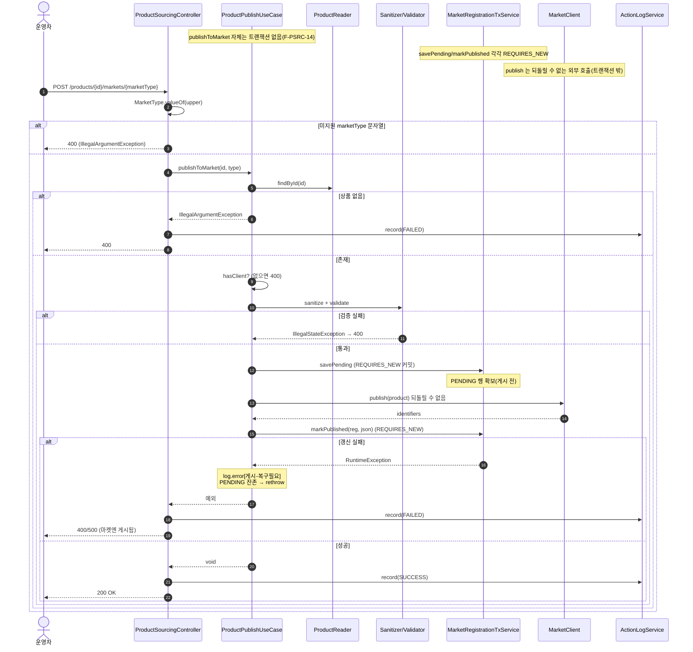

# POST /api/v1/products/{id}/markets/{marketType} — 상품을 마켓에 올리기(게시)

## 1. 개요

이 기능은 우리 시스템에 있는 상품 하나를, 지정한 마켓(쿠팡·스마트스토어 등)에 올려(등록)줍니다. 올리기 전에 상품 정보를 다듬고(정제) 문제없는지 검사한 뒤, "등록 준비 중(PENDING)"으로 먼저 기록해 두고 → 실제로 마켓에 올리고 → 마켓이 돌려준 식별자(등록번호)를 채우며 "등록 완료(SYNCED)"로 바꾸는 순서로 진행합니다.

| 항목 | 쉬운 설명 |
|------|------|
| **부르는 방법 / 주소** | `POST /api/v1/products/{id}/markets/{marketType}` — 주소에 상품 번호(id)와 마켓 종류(marketType)를 담습니다. |
| **하는 일** | 특정 상품을 지정한 마켓에 올립니다. 정제·검사 → "등록 준비 중" 먼저 저장 → 마켓에 올리기 → 등록번호와 함께 "등록 완료"로 갱신. |
| **상태 변화** | `MarketRegistration`(마켓 등록 기록): (없음) → 등록 준비 중 PENDING(isSynced=false) → 등록 완료 SYNCED(isSynced=true). |
| **부수적으로 생기는 일** | 되돌릴 수 없는 외부 올리기(`client.publish()`) 1번 + DB 쓰기 2단계(각각 독립된 저장 묶음 `REQUIRES_NEW`) + 활동로그(`PRODUCT_PUBLISH`) 1건. |
| **돌려주는 값** | `200 OK` (몸통 없음, `ResponseEntity<Void>`). |

## 2. 호출 체인

아래는 요청이 처리되는 코드 흐름입니다. 각 단계 아래에 "쉽게 말하면" 설명을 붙였습니다.

```
ProductSourcingController.publishToMarket(Long id, String marketType)  api/.../controller/ProductSourcingController.java:136-154
  ├─ MarketType.valueOf(marketType.toUpperCase())                       :142 (미지원 문자열 → IllegalArgumentException 400)
  ├─ productPublishUseCase.publishToMarket(id, type)                    :145
  │    └─ ProductPublishUseCase.publishToMarket()                       core/.../product/ProductPublishUseCase.java:45-78  (트랜잭션 없음)
  │         ├─ productReader.findById(productId).orElseThrow            :46-47 (없으면 IllegalArgumentException)
  │         ├─ marketClientRouter.hasClient(marketType)                 :49-51 (없으면 IllegalArgumentException)
  │         │    └─ MarketClientRouter.hasClient()                     core/.../market/client/MarketClientRouter.java:27-29
  │         ├─ productSanitizer.sanitizeForPublish(product)            :53 → ProductSanitizer.java:9-29
  │         ├─ productValidator.validateForPublish(product)            :54 → ProductValidator.java:11-40 (실패 → IllegalStateException)
  │         ├─ marketClientRouter.getClient(marketType)                :56 → MarketClientRouter.java:19-25
  │         ├─ registrationTxService.savePending(...)                  :59-60 → MarketRegistrationTxService.java:41-64  @Transactional(REQUIRES_NEW)
  │         │    └─ findByProductIdAndMarketType or insertPending      :43-45 (멱등: 기존 행 재사용, 유니크 충돌 시 재조회)
  │         ├─ client.publish(product)                                 :63 (외부 게시 — 트랜잭션 밖, 되돌릴 수 없음)
  │         ├─ toJson(identifiers)                                     :64 → :80-86
  │         └─ registrationTxService.markPublished(reg, json)          :70 → MarketRegistrationTxService.java:71-76  @Transactional(REQUIRES_NEW)
  │              (RuntimeException) → log.error[게시-복구필요] + rethrow  :71-75
  └─ actionLogService.record(PRODUCT_PUBLISH, type.name(), SUCCESS)    :146-147
      catch(Exception) → record(FAILED) + rethrow                      :149-152
```

→ 쉽게 말하면 이런 순서입니다.
1. **마켓 종류 확인:** 주소로 받은 마켓 종류 글자가 우리가 아는 마켓인지 확인합니다. 모르는 글자면 400(잘못된 요청).
2. **상품 있는지 확인:** 그 상품 번호가 실제로 있는지 찾습니다. 없으면 오류로 막습니다.
3. **마켓 담당 있는지 확인:** 그 마켓에 올릴 수 있는 담당(클라이언트)이 있는지 봅니다. 없으면 막습니다.
4. **다듬고 검사:** 상품 정보를 게시용으로 다듬고(sanitize), 게시해도 되는지 검사(validate)합니다. 검사에 걸리면 400.
5. **"등록 준비 중" 먼저 저장:** 실제로 마켓에 올리기 전에, 등록 기록을 "준비 중(PENDING)"으로 먼저 DB에 남겨 둡니다(독립된 저장 묶음). 이미 기록이 있으면 그 기록을 다시 씁니다(멱등).
6. **마켓에 올리기:** 실제로 마켓에 상품을 올립니다. **이 단계는 되돌릴 수 없습니다** — 한 번 올라가면 취소가 자동으로 안 됩니다.
7. **등록번호 채우고 "완료"로:** 마켓이 돌려준 등록번호(식별자)를 채우며 기록을 "등록 완료(SYNCED)"로 바꿉니다(또 다른 독립 저장 묶음). 이 갱신이 실패하면 "게시-복구필요" 오류를 남기고 오류를 위로 다시 던집니다.
8. **기록:** 성공하면 활동로그에 "게시 성공"을, 도중에 오류가 나면 "실패"를 남기고 오류를 다시 던집니다.

## 3. 유스케이스 다이어그램

👉 이 그림은 운영자가 상품 게시를 쓸 때 시스템이 함께 하는 일들(정제·검사, "준비 중" 저장, 등록번호 갱신, 활동로그)과, 외부 마켓에 실제로 올리는 연결을 한눈에 보여줍니다.


## 4. 시퀀스 다이어그램

👉 이 그림은 요청이 들어온 뒤 각 부품(컨트롤러·게시 로직·상품 조회·정제/검사·등록 저장 서비스·마켓)이 시간 순서대로 무엇을 주고받는지, 특히 "준비 중 저장"과 "완료 갱신"이 각각 따로 커밋되고 마켓 올리기는 되돌릴 수 없다는 점을 보여줍니다.



## 5. 순서도 (플로우차트)

👉 이 그림은 요청이 조건에 따라 어디로 갈라지는지(마켓 종류·상품 존재·담당 존재·검사 통과 → "준비 중" 저장 → 마켓 올리기 → 완료 갱신)를 시작부터 끝(성공 200 / 실패 400·500)까지 따라가며 보여줍니다.


## 6. 상태 전이표

대상: `MarketRegistration`(상품 product_id + 마켓 market_type 조합이 유일해야 함).

| 들어올 때의 상태 | 조건 | 끝날 때의 상태 | 마켓에 전송? | 쉬운 설명 |
|-----------|------|-----------|:---------:|------|
| 등록 기록 없음 | 검사 통과 | PENDING → SYNCED | 올림(publish) | 정상적인 게시 흐름 |
| 등록 기록 없음 | 마켓에 올린 뒤 완료 갱신이 실패 | PENDING(그대로 남음) | 올림(이미 끝남) | "복구 필요" 로그(:71-75), 마켓엔 이미 올라가 있음 |
| 등록 기록 이미 있음(재게시) | "준비 중 저장"이 기존 기록을 다시 씀 | PENDING→SYNCED | 올림 | 멱등(F-PSRC-13)이지만 마켓 올리기는 또 호출됨 |
| 상품 없음 / 모르는 마켓 / 검사 실패 | — | 변화 없음 | — | 400, "준비 중 저장" 전에 막힘 |

## 7. 🔎 발견사항

### PSRC-7 · 🟠 GAP — 다시 게시할 때, 이미 "등록 완료(SYNCED)"인 기록에도 마켓 올리기(`client.publish()`)를 무조건 다시 호출함(멱등 아님, 마켓에 중복 등록될 위험)
- **무엇이 문제인가:** "준비 중 저장"(`savePending`)은 기존 기록이 있으면 그것을 다시 쓰는 방식(멱등)입니다(`MarketRegistrationTxService.java:43-45`). 그런데 그 바로 다음의 마켓 올리기(`client.publish(product)`, `:63`)는 **등록 상태와 상관없이 항상** 호출됩니다. 즉 이미 "등록 완료(SYNCED, 등록번호까지 가진)" 상품을 다시 게시하면 마켓에 신규 등록이 또 나갈 수 있습니다. 클래스 주석(`ProductPublishUseCase.java:30-31`)에도 "F-PSRC-13 재게시 중복 등록 방지·멱등성은 이번 범위 밖"이라고 적혀 있습니다.
- **근거:** `ProductPublishUseCase.java:59-63`, `MarketRegistrationTxService.java:43-45`
- **왜 문제인가:** 같은 상품이 마켓에 두 번 등록되거나(마켓 담당 로직이 중복을 막지 않으면), 등록번호가 덮어써질 수 있습니다. DB에 "등록 완료" 상태가 있어도 그게 재게시를 막는 잠금 역할을 하지 못합니다.
- **어떻게 고치면 되나:** 이미 "등록 완료"인 경우엔 올리기(publish) 대신 수정(update) 경로로 가게 하거나, "강제로 다시 게시" 표시를 요구하게 합니다. 최소한 "등록 완료 상품을 다시 게시하면 어떻게 되는지" 정책을 문서로 남깁니다.

### PSRC-8 · 🟡 SMELL — "담당 있는지 확인"(hasClient)과 "담당 가져오기"(getClient)가 같은 검사(모르는 마켓 거르기)를 두 번 함(중복)
- **무엇이 문제인가:** `ProductPublishUseCase.java:49-51`에서 `hasClient`로 모르는 마켓이면 오류를 던집니다. 그런데 이후 `:56`의 `getClient`도 내부적으로(`MarketClientRouter.java:19-25`) 담당이 없으면 다시 같은 오류를 던집니다. 같은 조건을 두 번 검사하는 셈입니다.
- **근거:** `ProductPublishUseCase.java:49-51`, `MarketClientRouter.java:19-25`
- **왜 문제인가:** 기능상 문제는 없지만, 라우터(getClient)가 스스로 모르는 마켓을 막아 주므로 앞의 hasClient 검사는 중복 방어입니다. 두 곳의 오류 문구("지원하지 않는 마켓입니다")도 똑같이 두 파일에 있습니다.
- **어떻게 고치면 되나:** `getClient` 하나로 합치거나, 다듬기·검사보다 먼저 마켓 지원 여부를 거르려는 의도라면 그 순서 의도를 주석으로 남깁니다.

### PSRC-9 · 🔵 NOTE — 없는 상품일 때 404가 아니라 400을 돌려줌(다른 조회 API가 404를 쓰는 것과 어긋남)
- **무엇이 문제인가:** `ProductPublishUseCase.java:46-47`은 상품이 없으면 `IllegalArgumentException("상품을 찾을 수 없습니다")`를 던지고, 예외 처리기(`GlobalExceptionHandler.java:44-50`)가 이를 400으로 바꿉니다. 반면 이 처리기의 주석(`GlobalExceptionHandler.java:27`)은 "없는 리소스는 404"를 위해 `ResourceNotFoundException`(`:28-34`)을 따로 두고 있습니다.
- **근거:** `ProductPublishUseCase.java:46-47`, `GlobalExceptionHandler.java:44-50`
- **왜 문제인가:** 없는 상품 번호로 게시를 요청하면 클라이언트가 400(입력 오류)을 받아, "리소스가 없음"과 "입력이 잘못됨"을 구분하기 어렵습니다. REST 규약상 이 경우는 404가 더 정확합니다.
- **어떻게 고치면 되나:** 없는 상품은 `ResourceNotFoundException`으로 던져 404로 통일합니다(다른 상품 조회 경로와 맞춤).

### PSRC-10 · 🔵 NOTE — 게시가 "실패"로 끝나도 마켓엔 이미 상품이 올라간 상태인데, 활동로그엔 "실패"만 남아 게시가 성공했다는 사실이 로그에서 사라짐
- **무엇이 문제인가:** 마켓 올리기(`:63`)가 성공한 뒤 완료 갱신(`markPublished`, `:70`)이 실패하면 `:74`에서 오류를 위로 다시 던지고, 컨트롤러(`:149-152`)가 이를 받아 활동로그에 "실패(FAILED)"를 남깁니다. 게시 로직은 `:72-73`에서 등록번호를 오류 로그로 남기긴 하지만, **운영자가 보는 활동로그**에는 그냥 "마켓 게시 실패"로만 적힙니다.
- **근거:** `ProductPublishUseCase.java:63`, `:70`, `:149-152`
- **왜 문제인가:** 운영자가 활동로그만 보면 게시가 실패한 줄 알고 다시 게시할 수 있는데(그러면 PSRC-7의 중복 등록을 부름), 실제로는 마켓 등록은 성공했고 DB 갱신만 실패한 "복구 필요" 상태입니다.
- **어떻게 고치면 되나:** "마켓 게시는 성공, DB 갱신은 실패"를 구분하는 별도 상태(예: PARTIAL·복구필요)를 활동로그에 드러냅니다.

## 8. 테스트 커버리지 메모

- 있는 것: `ProductPublishOrphanPreventionTest`(미아 방지 흐름, F-PSRC-14), `ProductManageRepublishMarketCodeTest`(재게시 마켓코드), `BadEnumBodyAlreadyBadRequestTest`·`GlobalExceptionHandlerTest`(잘못된 enum·예외 매핑) 등이 있습니다.
- **아직 테스트가 없는 부분:** ① 이미 "등록 완료"인 상품을 다시 게시할 때 마켓 올리기가 또 불리는지(PSRC-7), ② 완료 갱신 실패 후 "준비 중" 기록이 남고 활동로그에 드러나는지(PSRC-10), ③ 없는 상품일 때의 상태코드 규약(PSRC-9 — 지금은 400).

---
*(쉬운 설명판 · 2026-07-17 재작성)*
*생성: 2026-07-17 · 근거: 현재 워킹트리*
