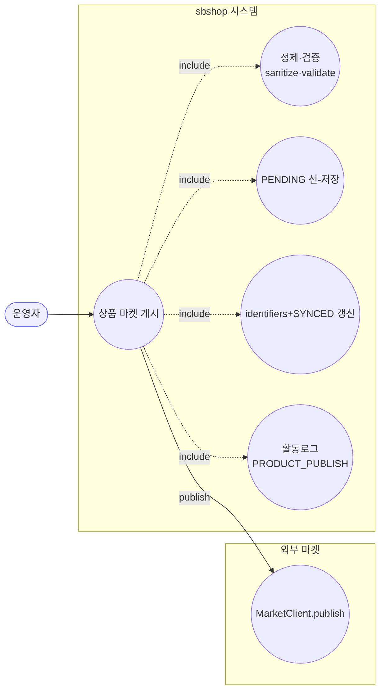
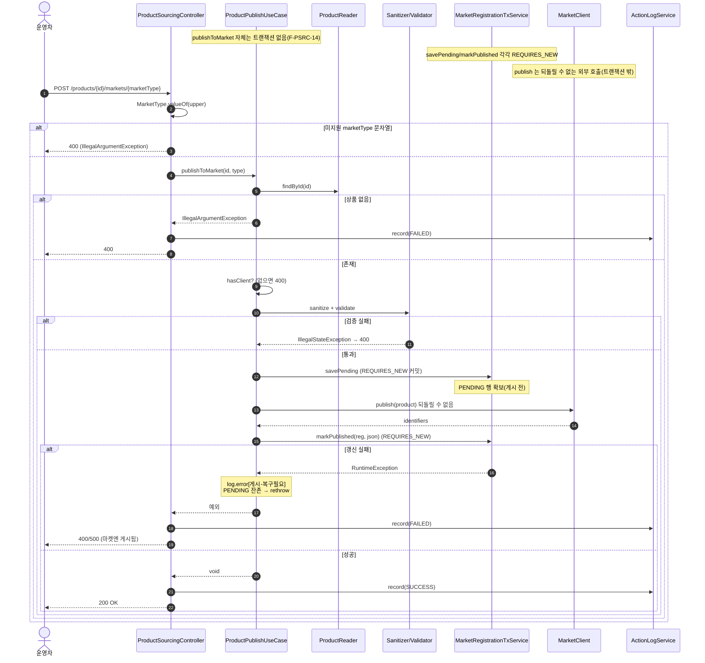
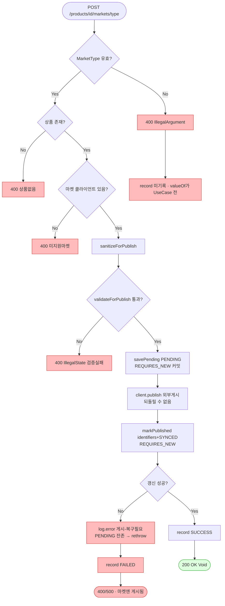

# POST /api/v1/products/{id}/markets/{marketType} — 상품 마켓 게시

## 1. 개요

| 항목 | 내용 |
|------|------|
| **Method / URL** | `POST /api/v1/products/{id}/markets/{marketType}` (경로변수 id·marketType) |
| **목적** | 특정 상품을 지정 마켓에 게시(등록)한다. 게시 전 정제·검증 후, PENDING 선-저장 → 외부 게시 → identifiers+SYNCED 갱신 순으로 처리. |
| **핵심 상태전이** | `MarketRegistration`: (없음)→PENDING(isSynced=false) → SYNCED(isSynced=true). |
| **부수효과** | 되돌릴 수 없는 외부 `client.publish()` + DB 쓰기 2단계(각 `REQUIRES_NEW` 독립 트랜잭션) + 활동로그(`PRODUCT_PUBLISH`) 1건. |
| **응답** | `200 OK` (본문 없음, `ResponseEntity<Void>`). |

## 2. 호출 체인

```
ProductSourcingController.publishToMarket(Long id, String marketType)  api/.../controller/ProductSourcingController.java:136-154
  ├─ MarketType.valueOf(marketType.toUpperCase())                       :142 (미지원 문자열 → IllegalArgumentException 400)
  ├─ productPublishUseCase.publishToMarket(id, type)                    :145
  │    └─ ProductPublishUseCase.publishToMarket()                       core/.../product/ProductPublishUseCase.java:45-78  (트랜잭션 없음)
  │         ├─ productReader.findById(productId).orElseThrow            :46-47 (없으면 IllegalArgumentException)
  │         ├─ marketClientRouter.hasClient(marketType)                 :49-51 (없으면 IllegalArgumentException)
  │         │    └─ MarketClientRouter.hasClient()                     core/.../market/client/MarketClientRouter.java:27-29
  │         ├─ productSanitizer.sanitizeForPublish(product)            :53 → ProductSanitizer.java:9-29
  │         ├─ productValidator.validateForPublish(product)            :54 → ProductValidator.java:11-40 (실패 → IllegalStateException)
  │         ├─ marketClientRouter.getClient(marketType)                :56 → MarketClientRouter.java:19-25
  │         ├─ registrationTxService.savePending(...)                  :59-60 → MarketRegistrationTxService.java:41-64  @Transactional(REQUIRES_NEW)
  │         │    └─ findByProductIdAndMarketType or insertPending      :43-45 (멱등: 기존 행 재사용, 유니크 충돌 시 재조회)
  │         ├─ client.publish(product)                                 :63 (외부 게시 — 트랜잭션 밖, 되돌릴 수 없음)
  │         ├─ toJson(identifiers)                                     :64 → :80-86
  │         └─ registrationTxService.markPublished(reg, json)          :70 → MarketRegistrationTxService.java:71-76  @Transactional(REQUIRES_NEW)
  │              (RuntimeException) → log.error[게시-복구필요] + rethrow  :71-75
  └─ actionLogService.record(PRODUCT_PUBLISH, type.name(), SUCCESS)    :146-147
      catch(Exception) → record(FAILED) + rethrow                      :149-152
```

## 3. 유스케이스 다이어그램



## 4. 시퀀스 다이어그램



## 5. 순서도 (플로우차트)



## 6. 상태 전이표

대상: `MarketRegistration`(product_id, market_type 유니크).

| 진입 상태 | 조건 | 결과 상태 | 마켓 전송 | 비고 |
|-----------|------|-----------|:---------:|------|
| 등록행 없음 | 검증 통과 | PENDING → SYNCED | publish | 정상 게시 흐름 |
| 등록행 없음 | publish 후 markPublished 실패 | PENDING(잔존) | publish(완료됨) | 복구 필요 로그(:71-75), 마켓엔 게시됨 |
| 등록행 존재(재게시) | savePending 이 기존 행 재사용 | PENDING→SYNCED | publish | 멱등(F-PSRC-13), publish 는 재호출됨 |
| 상품 없음 / 미지원 마켓 / 검증 실패 | — | 미변경 | — | 400, savePending 이전 차단 |

## 7. 🔎 발견사항

### PSRC-7 · 🟠 GAP — 재게시 시 이미 SYNCED 인 등록행에도 `client.publish()` 를 무조건 재호출(멱등 아님, 마켓 중복 등록 위험)
- **근거:** `ProductPublishUseCase.java:59-63` — `savePending` 은 기존 행을 재사용(멱등)하지만(`MarketRegistrationTxService.java:43-45`), 그 직후 `client.publish(product)`(`:63`)를 **등록 상태와 무관하게 항상 호출**한다. 이미 SYNCED(isSynced=true, identifiers 보유)인 상품을 다시 게시하면 마켓에 신규 등록이 또 나갈 수 있다. 클래스 주석(`ProductPublishUseCase.java:30-31`)도 "F-PSRC-13 재게시 중복 등록 방지/멱등성은 이번 범위 밖" 이라고 명시.
- **영향:** 동일 상품이 마켓에 중복 등록되거나(어댑터가 멱등하지 않으면), identifiers 가 덮어써질 수 있다. DB의 SYNCED 상태가 재게시를 막는 가드로 쓰이지 않는다.
- **제안:** 이미 SYNCED 인 경우 publish 대신 update(수정) 경로로 분기하거나, "강제 재게시" 플래그를 요구. 최소한 SYNCED 상품 재게시 정책을 문서화.

### PSRC-8 · 🟡 SMELL — `hasClient` 확인과 `getClient` 가 라우터 미지원 마켓 검증을 이중으로 수행(중복 가드)
- **근거:** `ProductPublishUseCase.java:49-51` 에서 `marketClientRouter.hasClient(marketType)` 로 미지원이면 예외를 던지고, 이후 `:56` `getClient(marketType)` 는 내부적으로(`MarketClientRouter.java:19-25`) 어댑터가 null 이면 다시 `IllegalArgumentException` 을 던진다. 같은 조건을 두 번 검사.
- **영향:** 기능상 문제는 없으나, 라우터가 미지원 마켓을 스스로 방어하므로 UseCase 의 사전 `hasClient` 체크는 방어 코드 중복이다. 두 곳의 예외 메시지("지원하지 않는 마켓입니다")도 동일 문구가 두 파일에 존재.
- **제안:** `getClient` 하나로 통합하거나, sanitize/validate 이전에 마켓 지원 여부를 먼저 거를 의도라면 그 순서 의도를 주석으로 명시.

### PSRC-9 · 🔵 NOTE — 미존재 상품이 404 가 아닌 400 으로 반환됨(다른 조회 엔드포인트의 404 규약과 비대칭)
- **근거:** `ProductPublishUseCase.java:46-47` 은 상품 미존재 시 `IllegalArgumentException("상품을 찾을 수 없습니다")` 를 던지고, `GlobalExceptionHandler.java:44-50` 이 이를 400 으로 매핑한다. 반면 핸들러 주석(`GlobalExceptionHandler.java:27`)은 "미존재 리소스는 404" 를 위해 `ResourceNotFoundException`(`:28-34`)을 별도로 두었다.
- **영향:** 없는 상품 id 로 게시 요청 시 클라이언트는 400(입력오류)을 받아 "존재하지 않는 리소스" 와 "잘못된 입력" 을 구분하기 어렵다. REST 규약상 404 가 더 정확.
- **제안:** 미존재 상품을 `ResourceNotFoundException` 으로 던져 404 로 통일(다른 상품 조회 경로와 정합).

### PSRC-10 · 🔵 NOTE — 게시 실패(markPublished 실패)여도 마켓엔 이미 상품이 올라간 상태 — 활동로그는 FAILED 만 남아 게시 성공 사실이 로그에서 유실
- **근거:** `ProductPublishUseCase.java:63` 게시 성공 후 `:70` markPublished 가 실패하면 `:74` rethrow → 컨트롤러 `:149-152` catch 가 `record(FAILED)` 를 남긴다. UseCase 는 `:72-73` 에서 identifiers 를 ERROR 로그로 남기지만, **활동로그(운영자용)** 에는 "마켓 게시 실패" 로만 기록된다.
- **영향:** 운영자가 활동로그만 보면 게시가 실패한 것으로 오인해 재게시(PSRC-7 중복 등록 유발)할 수 있다. 실제로는 마켓 등록이 성공했고 DB 갱신만 실패한 "복구 필요" 상태.
- **제안:** 게시 성공/DB갱신 실패를 구분하는 별도 상태(예: PARTIAL·복구필요)를 활동로그에 표면화.

## 8. 테스트 커버리지 메모

- 존재: `ProductPublishOrphanPreventionTest`(고아 방지 흐름, F-PSRC-14), `ProductManageRepublishMarketCodeTest`(재게시 마켓코드), `BadEnumBodyAlreadyBadRequestTest`·`GlobalExceptionHandlerTest`(잘못된 enum/예외 매핑) 존재.
- **비어있는 케이스:** ① 이미 SYNCED 상품 재게시 시 publish 재호출 여부(PSRC-7), ② markPublished 실패 후 PENDING 잔존·활동로그 표면화(PSRC-10), ③ 미존재 상품의 상태코드 규약(PSRC-9 — 현재 400).

---
*생성: 2026-07-17 · 근거: 현재 워킹트리*
