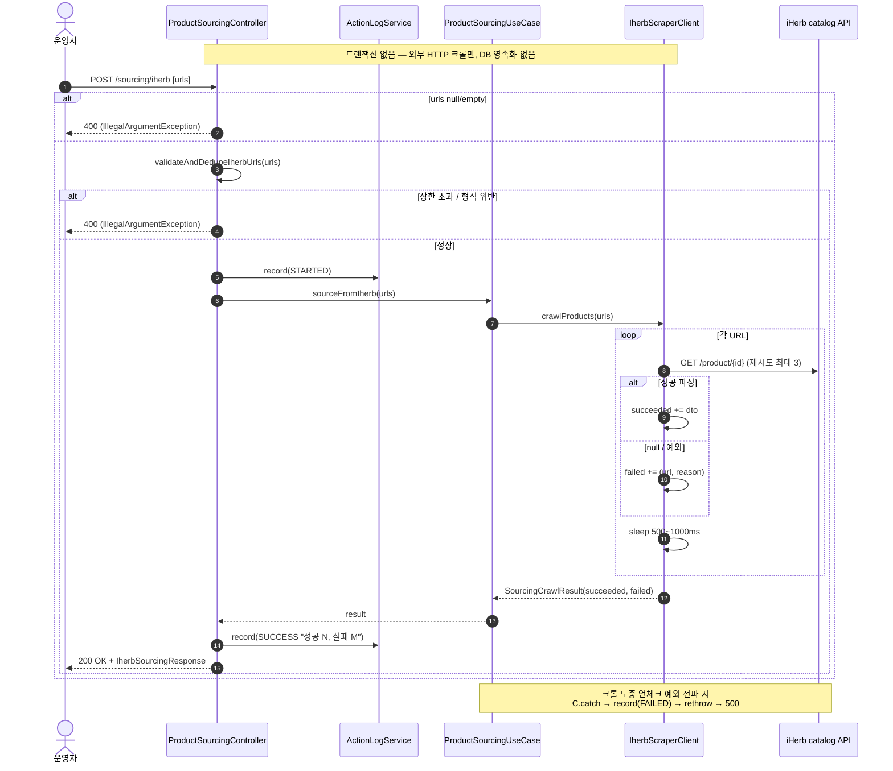

# POST /api/v1/sourcing/iherb — iHerb 상품 주소로 정보 긁어오기(소싱)

## 1. 개요

이 기능은 iHerb 상품 페이지 주소(URL)를 여러 개 받아서, 각 주소의 웹페이지를 실제로 방문(외부 인터넷 호출)해 상품 정보(이름·가격·이미지 등)를 뽑아 오는 일을 합니다. 그렇게 뽑아 온 상품들은 "성공한 것"과 "실패한 것"으로 나눠 한꺼번에 돌려줍니다. 이 과정에서 우리 데이터베이스에는 아무것도 저장하지 않습니다(단순 조회·수집).

| 항목 | 쉬운 설명 |
|------|------|
| **부르는 방법 / 주소** | `POST /api/v1/sourcing/iherb` — 요청 몸통에 상품 주소 문자열 목록(`List<String> urls`)을 담아 보냅니다. |
| **하는 일** | iHerb 상품 주소 목록을 받아 각 주소를 방문(외부 HTTP)해 상품 정보(`ScrapedProductDto`)를 뽑아내고, 성공·실패를 함께 담아 돌려줍니다. |
| **상태 변화** | 상태를 바꾸는 일은 없습니다(밖에서 정보만 긁어오고, DB에 저장하지 않음). 활동로그(`PRODUCT_SOURCING`)에 "시작(STARTED) → 성공(SUCCESS) 또는 실패(FAILED)"만 남깁니다. |
| **부수적으로 생기는 일** | 주소 하나당 외부 인터넷 왕복 1번(잘 안 되면 최대 3번까지 다시 시도), 주소와 주소 사이에 0.5~1초씩 쉬어 감. 활동로그 2건 남김. DB에 쓰는 것은 없음. |
| **돌려주는 값** | `200 OK` + `IherbSourcingResponse`(성공 목록 succeeded[] / 실패 목록 failed[]). 전부 실패해도 200(정상 응답)으로 돌려줍니다. |

## 2. 호출 체인

아래는 요청이 들어와서 처리되는 코드의 흐름입니다. 각 단계 아래에 "쉽게 말하면" 설명을 붙였습니다.

```
ProductSourcingController.sourceFromIherb(List<String> urls)      api/.../controller/ProductSourcingController.java:55-83
  ├─ null/empty 가드 → IllegalArgumentException(400)                :60-62
  ├─ validateAndDedupeIherbUrls(urls)                               :65 → :87-102
  │    ├─ LinkedHashSet 중복 제거                                    :88
  │    ├─ size &gt; MAX_IHERB_URLS(100) → IllegalArgumentException   :89-92
  │    └─ 각 URL: blank / IHERB_URL_PATTERN 불일치 → IllegalArgumentException  :93-100
  ├─ actionLogService.record(PRODUCT_SOURCING, STARTED)             :68-69
  ├─ productSourcingUseCase.sourceFromIherb(urls)                   :71
  │    └─ ProductSourcingUseCase.sourceFromIherb()                  core/.../sourcing/ProductSourcingUseCase.java:17-23
  │         └─ productInfoCrawlerPort.crawlProducts(urls)           :19 (포트)
  │              └─ IherbScraperClient.crawlProducts(List)          infrastructure/.../client/sourcing/IherbScraperClient.java:226-248
  │                   └─ for each url: crawlProductInfoAsDto(url)    :229-231 → :219-223
  │                        ├─ crawlProductInfo(url)                 :184-217 (HTTP, 재시도 최대 3)
  │                        │    └─ extractProductId(url)            :170-182 (/product/{id} 또는 /pr/../{id})
  │                        │    └─ parseProductInfo(body, url)      :274-329
  │                        ├─ dto != null → succeeded.add           :232-233
  │                        ├─ dto == null → failed.add("크롤 결과 없음")  :235-236
  │                        ├─ Thread.sleep(500~1000)                :238
  │                        └─ (Exception) → failed.add(e.message)   :242-245
  │                   └─ return SourcingCrawlResult(succeeded, failed)  :247
  ├─ IherbSourcingResponse.from(result)                             :72 → api/.../dto/product/IherbSourcingResponse.java:18-26
  └─ actionLogService.record(SUCCESS "성공 N건, 실패 M건")           :74-76
      catch(Exception) → record(FAILED) + rethrow                   :78-82
```

→ 쉽게 말하면 이런 순서입니다.
1. **입구에서 막기:** 주소 목록이 비었으면 곧바로 400(잘못된 요청)으로 돌려보냅니다.
2. **주소 정리·검사:** 똑같은 주소는 하나로 합치고(중복 제거), 100개를 넘으면 막고, 각 주소가 iHerb 상품 주소 형식에 맞는지 확인합니다. 하나라도 형식이 틀리면 400으로 돌려보냅니다.
3. **"작업 시작" 기록:** 활동로그에 "소싱 시작"을 남깁니다.
4. **실제로 긁어오기:** 주소를 하나씩 방문해 상품 정보를 뽑아냅니다. 잘 뽑히면 성공 목록에, 안 뽑히면 실패 목록에 사유와 함께 담습니다. 주소 사이마다 잠깐(0.5~1초) 쉽니다(상대 서버에 무리가 안 가도록).
5. **결과 돌려주고 기록:** 성공/실패를 정리해 돌려주고, 활동로그에 "성공 N건, 실패 M건"을 남깁니다. 도중에 예상 못 한 오류가 나면 "실패"로 기록하고 오류를 위로 다시 던집니다(500).

**요청 몸통 (`List<String>`)** — 별도의 요청 서식 없이, 상품 주소 문자열들을 배열로 그대로 받습니다.

**돌려주는 값 (`IherbSourcingResponse`, `IherbSourcingResponse.java:11-26`)**

| 칸 | 종류 | 쉬운 설명 |
|------|------|------|
| `succeeded` | List\<ProductSourcingResponse\> | 정보를 잘 뽑아 온 상품들 |
| `failed` | List\<Failure(url, reason)\> | 실패한 주소 + 실패한 이유 |

## 3. 유스케이스 다이어그램

👉 이 그림은 운영자가 이 기능을 쓸 때, 시스템 안에서 어떤 일(주소 검사·활동로그 기록)이 함께 일어나고, 밖의 iHerb 서버와 어떻게 주고받는지를 한눈에 보여줍니다.


## 4. 시퀀스 다이어그램

👉 이 그림은 요청이 들어온 순간부터 응답이 나갈 때까지, 각 부품(컨트롤러·활동로그·크롤러·iHerb 서버)이 시간 순서대로 서로 무엇을 주고받는지를 보여줍니다.



## 5. 순서도 (플로우차트)

👉 이 그림은 "이 조건이면 이쪽, 저 조건이면 저쪽"으로 갈라지는 처리 갈림길을, 시작부터 끝(성공 200 / 실패 400·500)까지 따라가며 보여줍니다.


## 6. 상태 전이표

이 기능은 밖에서 정보만 긁어오므로 무언가의 "상태"를 바꾸지 않고, DB에도 저장하지 않습니다. 눈에 남는 흔적은 활동로그 2건과 외부 인터넷 호출뿐입니다.

| 어떤 상황으로 들어왔나 | 어떻게 끝나나 | 활동로그 | 쉬운 설명 |
|------|------|---------|------|
| 정상적인 주소 목록 | 성공/실패 목록을 돌려줌 | STARTED→SUCCESS | 전부 실패해도 응답은 정상(200) |
| 목록이 비었거나·형식이 틀렸거나·100개 초과 | 400(잘못된 요청) | STARTED 안 남김 | 입구 검사에서 바로 막힘 |
| 긁어오는 도중 예상 못 한 오류 | 500(서버 오류) | STARTED→FAILED | "실패" 기록 후 오류를 위로 다시 던짐 |

## 7. 🔎 발견사항

### PSRC-1 · 🟠 GAP — 주소를 긁어오는 도중 작업이 강제 중단(InterruptedException)되면, 아직 처리 못 한 나머지 주소가 조용히 사라짐(실패 목록에도 안 담김)
- **무엇이 문제인가:** 주소를 하나씩 처리하는 반복문 안에서 주소와 주소 사이에 잠깐 쉬는 부분(`Thread.sleep`, 238)이 강제로 깨어나면(인터럽트), 코드는 "지금 스레드가 중단 요청을 받았다"고 표시(`Thread.currentThread().interrupt()`)한 뒤 반복문을 즉시 빠져나옵니다(`break`). 그 결과 그때까지 처리한 주소만 성공/실패 목록에 담기고, **아직 손도 못 댄 나머지 주소는 성공 목록에도 실패 목록에도 들어가지 않습니다.**
- **근거:** `IherbScraperClient.java:239-241`
- **왜 문제인가:** 돌려주는 응답에서 "성공 개수 + 실패 개수"가 원래 요청한 주소 개수보다 적어질 수 있고, 활동로그의 "성공 N건, 실패 M건" 합계도 요청 개수와 어긋납니다. 운영자는 어떤 주소가 아예 처리되지 않았는지 알 길이 없습니다. (이런 강제 중단은 배포나 서버 종료 같은 상황에서 실제로 일어날 수 있습니다.)
- **어떻게 고치면 되나:** 중단으로 빠져나갈 때 남은 주소들을 실패 목록에 "인터럽트로 미처리" 사유로 채워, 요청한 개수와 결과 개수의 합이 항상 맞도록 합니다. 아니면 컨트롤러에서 "요청 개수와 응답 총량이 다르다"를 감지해 로그로 드러냅니다.

### PSRC-2 · 🟡 SMELL — 주소가 올바른지 판단하는 규칙이 두 곳(컨트롤러·크롤러)에 따로 적혀 있어, 한쪽만 바뀌면 서로 어긋날 위험이 있음
- **무엇이 문제인가:** 컨트롤러(`ProductSourcingController.java:51-53`)에 있는 주소 검사 규칙은 `/product/숫자` 또는 `/pr/무언가/숫자` 형식을 요구합니다. 그런데 실제로 상품 번호를 뽑아내는 크롤러(`IherbScraperClient.java:170-182`의 `extractProductId`)도 사실상 똑같은 두 형식으로 번호를 뽑습니다. 즉 같은 규칙이 서로 다른 파일·서로 다른 모듈(api / infrastructure)에 두 번 적혀 있습니다.
- **근거:** `ProductSourcingController.java:51-53`, `IherbScraperClient.java:170-182`
- **왜 문제인가:** iHerb의 주소 형식이 바뀌면 두 곳을 동시에 고쳐야 합니다. 한쪽만 고치면, 컨트롤러 검사는 통과했는데 크롤러가 상품 번호를 못 뽑아 "크롤 결과 없음"으로 조용히 실패할 수 있습니다. 규칙을 누가 관리하는지가 흩어져 있어 실수 나기 쉽습니다.
- **어떻게 고치면 되나:** 주소 검사·번호 추출 규칙을 한 곳(도메인 유틸)에 모아 두고 양쪽이 그것을 함께 쓰도록 합칩니다.

### PSRC-3 · 🔵 NOTE — 긁어오기 실패 사유가 전부 "크롤 결과를 가져오지 못했습니다"로 뭉뚱그려져, 진짜 원인을 구분할 수 없음
- **무엇이 문제인가:** 상품 정보를 뽑는 함수(`crawlProductInfoAsDto`)가 빈 값(null)을 돌려주면, 실패 사유를 무조건 "크롤 결과를 가져오지 못했습니다"로 적습니다. 그런데 빈 값이 나오는 원인은 여러 가지입니다 — 주소에서 상품 번호를 못 뽑았거나(`:186-188`), 상대가 접근을 막았거나(403), 상품이 없거나(404), 정보 해석에 실패했거나(`:207-216`/`:325-328`). 이 모두가 똑같은 문구로 수렴합니다.
- **근거:** `IherbScraperClient.java:235-236`
- **왜 문제인가:** 실패 사유만 봐서는 이게 차단(403)인지, 없는 상품(404)인지, 해석 문제인지 알 수 없어, 다시 시도할지 다른 조치를 할지 판단하기 어렵습니다. (예외로 실패하는 경로 `:244`는 오류 메시지를 그대로 남겨 그나마 구체적입니다.)
- **어떻게 고치면 되나:** 실패 함수가 실패 사유를 구분해서(구조화해) 전달하도록 개선합니다(선택 사항).

## 8. 테스트 커버리지 메모

- `ProductSourcingUseCasePartialFailureTest`(core)가 있습니다 — 일부만 실패했을 때 성공/실패가 잘 나뉘는지(F-PSRC-2)를 검증합니다.
- 컨트롤러 입구 검사(빈 목록·개수 초과·형식 위반, F-PSRC-1/5)가 400을 제대로 돌려주는지 직접 확인하는 테스트는 찾지 못했습니다(컨트롤러 단위 테스트가 없습니다).
- **아직 테스트가 없는 부분:** ① 작업이 강제 중단됐을 때 요청 개수와 결과 개수의 합이 맞는지(PSRC-1), ② 주소 형식의 경계 사례(포트·쿼리스트링·서브도메인 등)가 컨트롤러 검사와 크롤러 추출에서 똑같이 동작하는지(PSRC-2), ③ 실패 사유가 원인별로 구분되는지(PSRC-3).

---
*(쉬운 설명판 · 2026-07-17 재작성)*
*생성: 2026-07-17 · 근거: 현재 워킹트리*
