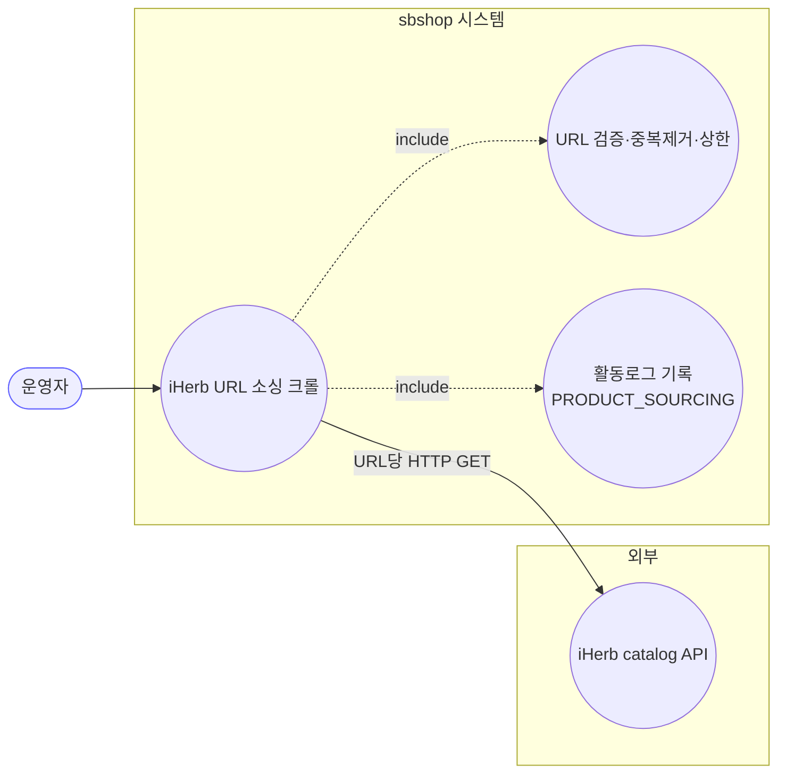
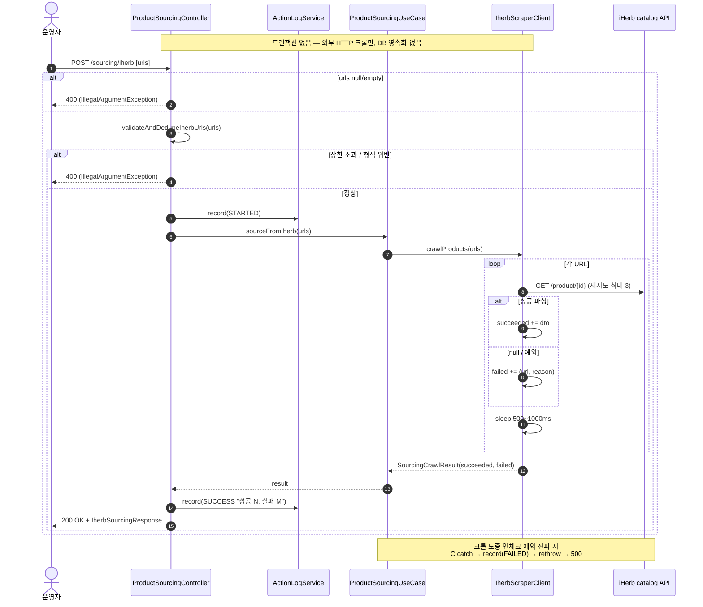
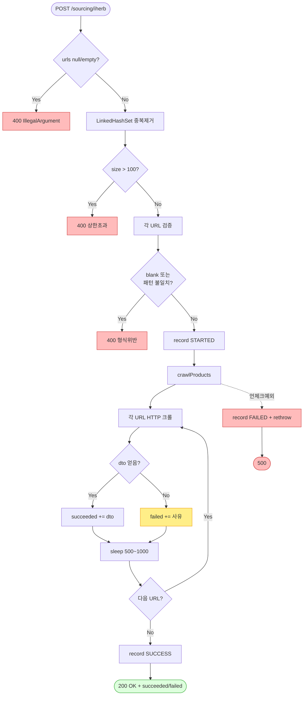

# POST /api/v1/sourcing/iherb — iHerb URL 소싱 크롤

## 1. 개요

| 항목 | 내용 |
|------|------|
| **Method / URL** | `POST /api/v1/sourcing/iherb` (바디 `List<String> urls`) |
| **목적** | iHerb 상품 URL 목록을 받아 각 URL을 크롤(외부 HTTP)하여 상품 정보(`ScrapedProductDto`)를 추출하고, 성공/실패를 함께 담아 반환한다. |
| **핵심 상태전이** | 상태 전이 없음(외부 크롤·조회, DB 영속화 없음). 활동로그(`PRODUCT_SOURCING`)만 STARTED→SUCCESS/FAILED 기록. |
| **부수효과** | URL당 외부 HTTP 왕복(재시도 최대 3회, URL 간 500~1000ms sleep) + 활동로그 2건. DB 쓰기 없음. |
| **응답** | `200 OK` + `IherbSourcingResponse`(succeeded[] / failed[]). 전건 실패도 200. |

## 2. 호출 체인

```
ProductSourcingController.sourceFromIherb(List<String> urls)      api/.../controller/ProductSourcingController.java:55-83
  ├─ null/empty 가드 → IllegalArgumentException(400)                :60-62
  ├─ validateAndDedupeIherbUrls(urls)                               :65 → :87-102
  │    ├─ LinkedHashSet 중복 제거                                    :88
  │    ├─ size &gt; MAX_IHERB_URLS(100) → IllegalArgumentException   :89-92
  │    └─ 각 URL: blank / IHERB_URL_PATTERN 불일치 → IllegalArgumentException  :93-100
  ├─ actionLogService.record(PRODUCT_SOURCING, STARTED)             :68-69
  ├─ productSourcingUseCase.sourceFromIherb(urls)                   :71
  │    └─ ProductSourcingUseCase.sourceFromIherb()                  core/.../sourcing/ProductSourcingUseCase.java:17-23
  │         └─ productInfoCrawlerPort.crawlProducts(urls)           :19 (포트)
  │              └─ IherbScraperClient.crawlProducts(List)          infrastructure/.../client/sourcing/IherbScraperClient.java:226-248
  │                   └─ for each url: crawlProductInfoAsDto(url)    :229-231 → :219-223
  │                        ├─ crawlProductInfo(url)                 :184-217 (HTTP, 재시도 최대 3)
  │                        │    └─ extractProductId(url)            :170-182 (/product/{id} 또는 /pr/../{id})
  │                        │    └─ parseProductInfo(body, url)      :274-329
  │                        ├─ dto != null → succeeded.add           :232-233
  │                        ├─ dto == null → failed.add("크롤 결과 없음")  :235-236
  │                        ├─ Thread.sleep(500~1000)                :238
  │                        └─ (Exception) → failed.add(e.message)   :242-245
  │                   └─ return SourcingCrawlResult(succeeded, failed)  :247
  ├─ IherbSourcingResponse.from(result)                             :72 → api/.../dto/product/IherbSourcingResponse.java:18-26
  └─ actionLogService.record(SUCCESS "성공 N건, 실패 M건")           :74-76
      catch(Exception) → record(FAILED) + rethrow                   :78-82
```

**요청 바디 (`List<String>`)** — DTO 없이 문자열 URL 배열을 직접 수신.

**응답 (`IherbSourcingResponse`, `IherbSourcingResponse.java:11-26`)**

| 필드 | 타입 | 비고 |
|------|------|------|
| `succeeded` | List\<ProductSourcingResponse\> | 크롤 성공 상품 |
| `failed` | List\<Failure(url, reason)\> | 실패 URL + 사유 |

## 3. 유스케이스 다이어그램



## 4. 시퀀스 다이어그램



## 5. 순서도 (플로우차트)



## 6. 상태 전이표

상태 전이 없음(외부 크롤·조회). DB 영속화 없음. 부수효과는 활동로그 2건과 외부 HTTP 호출뿐.

| 진입 | 결과 | 활동로그 | 비고 |
|------|------|---------|------|
| 정상 URL 목록 | succeeded/failed 반환 | STARTED→SUCCESS | 전건 실패도 200 |
| null/empty·형식위반·상한초과 | 400 | STARTED 미기록 | 진입부 가드에서 차단 |
| 크롤 도중 언체크 예외 | 500 | STARTED→FAILED | catch 후 rethrow |

## 7. 🔎 발견사항

### PSRC-1 · 🟠 GAP — `crawlProducts` 도중 `InterruptedException` 시 남은 URL이 조용히 누락됨(failed에도 안 담김)
- **근거:** `IherbScraperClient.java:239-241` — 루프 내 `Thread.sleep`(238)이 인터럽트되면 `Thread.currentThread().interrupt()` 후 `break` 로 즉시 종료한다. 이미 처리한 URL만 succeeded/failed 에 담기고, **아직 처리하지 않은 나머지 URL은 succeeded 에도 failed 에도 들어가지 않는다.**
- **영향:** 응답의 `succeeded.size() + failed.size()` 가 요청 URL 수보다 작아질 수 있고, 활동로그의 "성공 N건, 실패 M건" 합계도 요청 건수와 불일치. 운영자는 어떤 URL이 미처리됐는지 알 수 없다. (인터럽트는 배포/셧다운 등에서 발생 가능.)
- **제안:** break 시 남은 URL을 `failed`("인터럽트로 미처리")로 채워 요청↔결과 총량 정합을 보장하거나, 컨트롤러에서 요청 수와 응답 총량 불일치를 감지해 로그로 표면화.

### PSRC-2 · 🟡 SMELL — 컨트롤러의 `IHERB_URL_PATTERN` 과 크롤러의 `extractProductId` 가 URL 규칙을 이중 정의(중복·표류 위험)
- **근거:** 컨트롤러 `ProductSourcingController.java:51-53` 정규식이 `/product/\d+` 또는 `/pr/[^/]+/\d+` 를 요구하고, 크롤러 `IherbScraperClient.java:170-182` `extractProductId` 가 사실상 같은 두 패턴으로 ID를 추출한다. 두 규칙이 별개 파일·별개 모듈(api / infrastructure)에 중복 정의돼 있다.
- **영향:** iHerb URL 형식이 바뀌면 두 곳을 동시에 고쳐야 하며, 한쪽만 갱신되면 컨트롤러 통과 후 크롤러에서 ID 추출 실패("크롤 결과 없음")로 조용히 실패한다. 규칙 소유권이 분산.
- **제안:** URL 검증/ID 추출 규칙을 한 곳(도메인 유틸)에 두고 양쪽이 공유하도록 통합.

### PSRC-3 · 🔵 NOTE — 크롤 실패 사유가 "크롤 결과를 가져오지 못했습니다" 로 뭉뚱그려짐(원인 구분 불가)
- **근거:** `IherbScraperClient.java:235-236` — `crawlProductInfoAsDto` 가 null 을 반환하면(ID 추출 실패·403 차단·404·파싱 실패 모두 null로 수렴, `:186-188`/`:207-216`/`:325-328`) 일괄 "크롤 결과를 가져오지 못했습니다" 로 기록된다.
- **영향:** failed reason 만 보고는 차단(403)인지, 없는 상품(404)인지, 파싱 문제인지 구분할 수 없어 재시도/조치 판단이 어렵다. (예외 경로 `:244` 는 e.message 를 남기므로 그나마 구체적.)
- **제안:** `crawlProductInfoAsDto` 또는 `crawlProductInfo` 가 실패 사유를 구조화해 전달하도록 개선(선택).

## 8. 테스트 커버리지 메모

- `ProductSourcingUseCasePartialFailureTest`(core) 존재 — 부분 실패(succeeded/failed 분리, F-PSRC-2) 계약 검증.
- 컨트롤러 진입 가드(null/empty·상한·형식위반, F-PSRC-1/5)의 400 응답을 직접 검증하는 테스트는 검색되지 않음(컨트롤러 슬라이스 테스트 부재).
- **비어있는 케이스:** ① `InterruptedException` 중단 시 총량 정합(PSRC-1), ② URL 패턴 경계값(포트·쿼리스트링·서브도메인)이 컨트롤러 정규식과 크롤러 추출에서 일관되게 동작하는지(PSRC-2), ③ 실패 사유 분류(PSRC-3).

---
*생성: 2026-07-17 · 근거: 현재 워킹트리*
