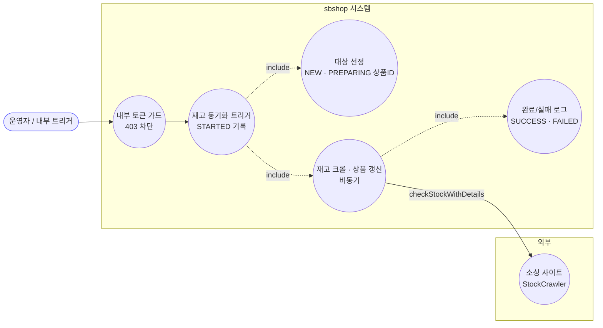
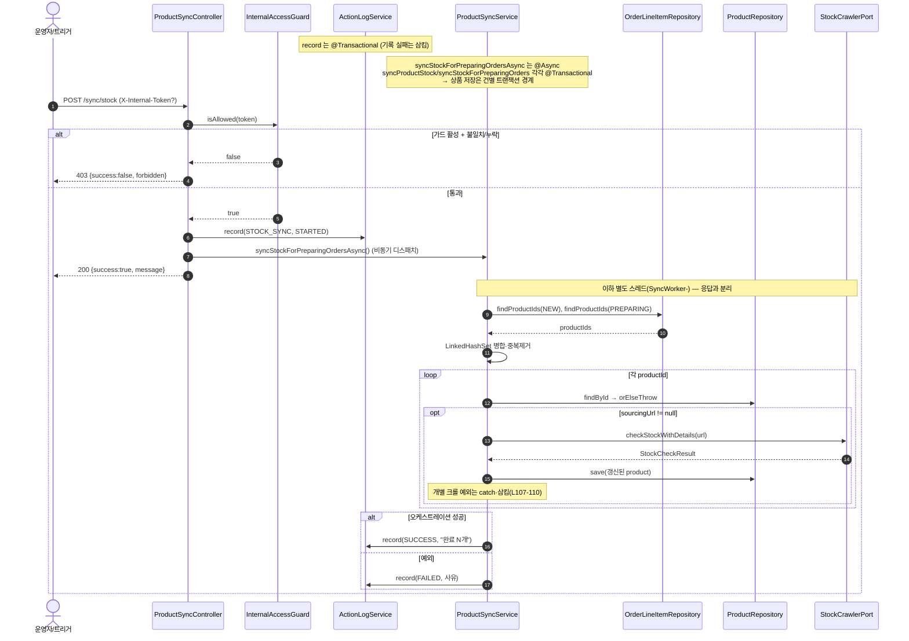
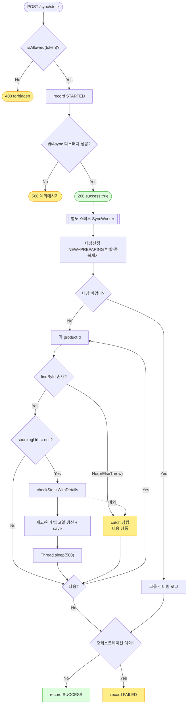

# POST /products/sync/stock — 재고 동기화 트리거

## 1. 개요

| 항목 | 내용 |
|------|------|
| **Method / URL** | `POST /api/v1/products/sync/stock` (바디 없음, 헤더 `X-Internal-Token` 옵션) |
| **목적** | NEW·PREPARING 상태 주문에 연결된 상품의 재고/원가/입고예정일을 소싱 URL 크롤로 갱신하는 백그라운드 작업을 비동기로 트리거한다. |
| **핵심 상태전이** | 상품 도메인: `StockStatus`/`costPrice`/`restockDate` 갱신(크롤 결과 반영, 비동기·응답과 분리) |
| **부수효과** | ① 내부 토큰 가드(403 차단), ② ActionLog `STOCK_SYNC` STARTED 기록, ③ `@Async` 디스패치(크롤은 별도 스레드풀 `syncTaskExecutor`), ④ 완료/실패 시 ActionLog SUCCESS/FAILED. |
| **응답** | `200 OK` `{success:true, message:"NEW/PREPARING …"}` · `403` `{success:false, "forbidden…"}` · `500` `{success:false, <예외메시지>}` (디스패치 예외 시) |

## 2. 호출 체인

```
ProductSyncController.syncAllProductStock(internalToken)   api/.../controller/ProductSyncController.java:31-55
  ├─ InternalAccessGuard.isAllowed(internalToken)           core/.../config/InternalAccessGuard.java:44-49
  │    └─ 토큰 미설정 → true(무파손), 설정 시 정확일치만 true
  │    └─ 불일치/누락 → 403 body {success:false, "forbidden…"}   ProductSyncController.java:35-38
  ├─ ActionLogService.record(STOCK_SYNC, null, STARTED, "재고 동기화 요청")  ProductSyncController.java:40-41
  │    └─ ActionLogService.record()                         core/.../actionlog/ActionLogService.java:27-41  @Transactional
  └─ ProductSyncService.syncStockForPreparingOrdersAsync()  core/.../product/ProductSyncService.java:43-68  @Async("syncTaskExecutor")
       ├─ orderLineItemRepository.findProductIdsByShippingStatus(NEW)       :47-48
       ├─ orderLineItemRepository.findProductIdsByShippingStatus(PREPARING) :49-50
       │    └─ (구현) QueryDSL distinct productId join order  infrastructure/.../order/OrderLineItemRepositoryImpl.java:22-32
       ├─ LinkedHashSet 병합·중복제거                        :52-53
       ├─ syncStockForPreparingOrders(mergedIds)            ProductSyncService.java:114-140  @Transactional
       │    └─ for each productId: syncProductStock(id) + Thread.sleep(500)  :124-137
       │         └─ syncProductStock(Long)                  ProductSyncService.java:70-112  @Transactional
       │              ├─ productRepository.findById() → orElseThrow          :73-74
       │              ├─ if sourcingUrl != null:                              :77
       │              ├─ productStockCrawlerPort.checkStockWithDetails(url)   :81-82
       │              │    (port) core/.../product/port/ProductStockCrawlerPort.java:9
       │              ├─ updateStockStatus / updateCostPrice / updateSourcingStock  :85-91
       │              ├─ restockDate: IN_STOCK 또는 restockDate!=null 일 때만 반영(D-065)  :97-99
       │              ├─ productRepository.save(product)                      :102
       │              └─ catch Exception → log.error(삼킴)                    :107-110
       ├─ (성공) ActionLogService.record(STOCK_SYNC, SUCCESS, "완료 N개")  :59-61
       └─ (실패) catch → log.error + record(STOCK_SYNC, FAILED, 사유)      :62-67
```

**동시성 설정 (`AsyncConfig.java:15-24`)** — `syncTaskExecutor`: core 2 / max 5 / queue 50 / prefix `SyncWorker-`. 거부정책 미지정(기본 AbortPolicy).

## 3. 유스케이스 다이어그램



## 4. 시퀀스 다이어그램



## 5. 순서도 (플로우차트)



## 6. 상태 전이표

| 진입 (상품 대상 조건) | 허용? | 결과 | 마켓/외부 | 비고 |
|-----------------------|:-----:|------|-----------|------|
| 가드 활성 + 토큰 불일치/누락 | ❌ | 미실행 | — | 403, ActionLog 기록도 없음(L35-38) |
| 대상 상품 없음(NEW·PREPARING 0건) | — | 미변경 | — | `syncStockForPreparingOrders` early return(L116-119), 이후 SUCCESS "0개" |
| 상품 존재 + `sourcingUrl == null` | — | 미변경 | — | 크롤 스킵(L77 조건 미충족) |
| 상품 존재 + 크롤 성공 | ✅ | `StockStatus`/costPrice/sourcingStock 갱신, restockDate 조건부 갱신 | 소싱 사이트 GET | D-065: OUT_OF_STOCK+restockDate=null 이면 기존 재입고일 유지 |
| 상품 존재 + 크롤 예외 | ✅(삼킴) | 미변경 | 시도됨 | catch→log.error, 다음 상품 진행(L107-110) |
| `findById` 미존재(orElseThrow) | — | 미변경 | — | 루프 catch 로 흡수, 다음 상품(L134-136) |

## 7. 🔎 발견사항

### MISCA-7 · 🟠 GAP — 트리거 중복 실행 방지(멱등/락) 없음
- **근거:** `ProductSyncController.java:35-45` 는 가드 통과 즉시 STARTED 기록 후 `@Async` 디스패치할 뿐, 이미 진행 중인 동기화가 있는지 확인하지 않는다. `syncTaskExecutor`(`AsyncConfig.java:15-24`)는 core 2/queue 50 이라 연타 시 최대 여러 크롤이 동시/대기로 쌓인다.
- **영향:** 버튼 연타·중복 트리거 시 동일 상품군을 여러 스레드가 중복 크롤(소싱 사이트 rate-limit 위반 위험)하거나 큐가 쌓여 지연. 진행 중 여부를 응답으로 알 수 없다.
- **제안:** advisory lock 또는 진행 상태 플래그(예: 마지막 STARTED 후 SUCCESS/FAILED 미도래면 409)로 멱등 트리거화 검토. (프로젝트 관례상 프로세스 간 공유상태는 DB+advisory lock)

### MISCA-8 · 🟡 SMELL — 크롤 실패를 상품 단위로 삼켜 부분 실패가 집계되지 않음
- **근거:** `syncProductStock` 내부 `catch(Exception)` 이 `log.error` 만 하고 삼킨다(`ProductSyncService.java:107-110`). 상위 루프도 상품별 실패를 `log.error` 로 삼킨다(L134-136). 최종 SUCCESS 로그 메시지는 "대상 N개" 로 **시도 대상 수**만 담고(L61), 실제 성공/실패 건수를 구분하지 않는다.
- **영향:** 일부 상품 크롤이 계속 실패해도 ActionLog 는 SUCCESS 로 남아, 운영자가 부분 실패(예: 특정 소싱 URL 파싱 깨짐)를 인지하기 어렵다. `syncStockForPreparingOrders` 는 `syncedCount` 를 집계하지만(L123,139) 이 값은 로컬 로그로만 남고 ActionLog·응답엔 반영되지 않는다.
- **제안:** 성공/실패 건수를 SUCCESS 메시지에 포함하거나, 실패 건수 > 0 이면 상태를 분기(부분성공). `syncStockForPreparingOrders` 의 `syncedCount` 를 반환해 상위에서 사용.

### MISCA-9 · 🟠 GAP — 이중 `@Transactional` 경계로 대상 전체가 하나의 긴 트랜잭션·자기호출 함정 가능성
- **근거:** `syncStockForPreparingOrders`(L114 `@Transactional`)가 루프 안에서 같은 빈의 `syncProductStock`(L70 `@Transactional`)를 **자기호출**한다(L126). Spring 프록시 특성상 내부 자기호출은 새 트랜잭션이 열리지 않아 `syncProductStock` 의 트랜잭션 경계가 무시되고, 바깥 `syncStockForPreparingOrders` 의 단일 트랜잭션에 병합된다. 그 안에서 `Thread.sleep(500)` × 상품수 만큼 트랜잭션이 장시간 열려 있다.
- **영향:** 대상 상품이 많으면 DB 커넥션을 sleep 포함 장시간 점유(커넥션 고갈 위험). 또한 "상품별 트랜잭션 격리" 의도가 자기호출로 인해 실제로는 성립하지 않는다(하나라도 롤백 유발 예외가 catch 밖으로 새면 전체 롤백).
- **제안:** `@Async` 진입점에서 대상 목록만 만들고, 상품별 `syncProductStock` 는 별도 빈/셀프-프록시 주입으로 호출해 진짜 건별 트랜잭션 격리. sleep 은 트랜잭션 밖으로 이동.

### MISCA-10 · 🔵 NOTE — 트리거 시 STARTED 는 항상 기록되나 대상 0건이어도 SUCCESS "0개"
- **근거:** 가드 통과 시 무조건 STARTED 기록(L40-41) 후, 대상이 0건이면 크롤 없이 SUCCESS "완료 (대상 0개)" 기록(`ProductSyncService.java:59-61`).
- **영향:** 실질 작업이 없어도 STARTED→SUCCESS 로그 페어가 남는다(무해하나 로그 노이즈).
- **제안:** 대상 0건 시 메시지를 "대상 없음" 으로 구분해 로그 가독성 향상(선택).

## 8. 테스트 커버리지 메모

- `ProductSyncControllerContractTest.java` — 200 성공 바디 트리, 403 가드 차단 바디, 500 디스패치 실패 바디 3케이스(응답 계약) 검증.
- `ProductSyncControllerGuardTest.java` — 가드 활성/헤더누락→403·미실행, 활성/불일치→403·미실행, 활성/일치→200·실행, 비활성/무헤더→200·실행 4케이스.
- `ProductSyncServiceAsyncTest.java` — 대상선정(NEW·PREPARING 중복제거), 성공 시 ActionLog SUCCESS, 오케스트레이션 예외 시 FAILED 기록 3케이스.
- `ProductSyncServiceRestockDateTest.java` — D-065 restockDate 조건부 갱신(L97-99) 커버.
- **비어있는 케이스:** ① 중복 트리거 멱등(MISCA-7), ② 부분 실패 집계·성공/실패 건수(MISCA-8), ③ 자기호출 트랜잭션 경계/커넥션 점유(MISCA-9), ④ `sourcingUrl == null` 상품 스킵 경로. MISCA-8/9 는 실제 크롤·트랜잭션 동작이라 통합 테스트 성격.

---
*생성: 2026-07-17 · 근거: 현재 워킹트리*
