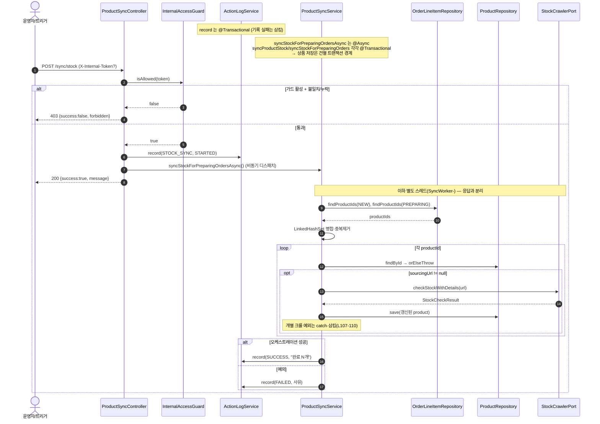

# POST /products/sync/stock — 재고 동기화 시작하기

## 1. 개요

이 기능은 "아직 발송 전(신규·준비중)인 주문에 걸린 상품들"의 **재고 수량·원가·입고 예정일**을, 소싱 사이트(상품을 떼 오는 사이트)를 자동으로 훑어서(크롤링) 최신 값으로 갱신하는 작업을 **뒤에서 따로 돌려 주는** 기능입니다. 요청하면 곧바로 "시작했다"고 답하고, 실제 갱신 작업은 백그라운드에서 진행됩니다.

| 항목 | 내용 (쉬운 설명) |
|------|------|
| **Method / URL** | `POST /api/v1/products/sync/stock` — 본문 없이 이 주소를 호출하면 재고 갱신 작업이 시작됩니다. 내부용 열쇠(`X-Internal-Token`) 헤더를 붙일 수 있습니다. |
| **목적** | 발송 전(NEW·PREPARING) 주문에 연결된 상품들의 재고·원가·입고예정일을 소싱 사이트에서 긁어와 갱신하는 작업을 **뒤에서(비동기로)** 시작합니다. |
| **핵심 상태전이** | 상품 정보가 바뀜: 재고상태(`StockStatus`)·원가(`costPrice`)·입고예정일(`restockDate`)이 크롤 결과대로 갱신됩니다(백그라운드에서 진행되며 응답과는 분리). |
| **부수효과** | ① 내부 열쇠 확인(안 맞으면 403으로 막음), ② "재고 동기화 시작"을 활동기록(ActionLog)에 STARTED로 남김, ③ 실제 크롤 작업을 별도 작업 공간(`syncTaskExecutor`)에 던짐, ④ 다 끝나면 성공/실패를 SUCCESS/FAILED로 기록. |
| **응답** | 정상: `200 OK` `{success:true, message:"NEW/PREPARING …"}` · 열쇠 안 맞음: `403` `{success:false, "forbidden…"}` · 작업 던지다 오류: `500` `{success:false, <오류메시지>}`. |

## 2. 호출 체인

아래는 요청이 들어와 작업을 시작하고, 백그라운드에서 상품을 하나씩 갱신하기까지의 순서입니다. 오른쪽은 실제 파일·줄 번호입니다.

```
ProductSyncController.syncAllProductStock(internalToken)   api/.../controller/ProductSyncController.java:31-55
  ├─ InternalAccessGuard.isAllowed(internalToken)           core/.../config/InternalAccessGuard.java:44-49
  │    └─ 토큰 미설정 → true(무파손), 설정 시 정확일치만 true
  │    └─ 불일치/누락 → 403 body {success:false, "forbidden…"}   ProductSyncController.java:35-38
  ├─ ActionLogService.record(STOCK_SYNC, null, STARTED, "재고 동기화 요청")  ProductSyncController.java:40-41
  │    └─ ActionLogService.record()                         core/.../actionlog/ActionLogService.java:27-41  @Transactional
  └─ ProductSyncService.syncStockForPreparingOrdersAsync()  core/.../product/ProductSyncService.java:43-68  @Async("syncTaskExecutor")
       ├─ orderLineItemRepository.findProductIdsByShippingStatus(NEW)       :47-48
       ├─ orderLineItemRepository.findProductIdsByShippingStatus(PREPARING) :49-50
       │    └─ (구현) QueryDSL distinct productId join order  infrastructure/.../order/OrderLineItemRepositoryImpl.java:22-32
       ├─ LinkedHashSet 병합·중복제거                        :52-53
       ├─ syncStockForPreparingOrders(mergedIds)            ProductSyncService.java:114-140  @Transactional
       │    └─ for each productId: syncProductStock(id) + Thread.sleep(500)  :124-137
       │         └─ syncProductStock(Long)                  ProductSyncService.java:70-112  @Transactional
       │              ├─ productRepository.findById() → orElseThrow          :73-74
       │              ├─ if sourcingUrl != null:                              :77
       │              ├─ productStockCrawlerPort.checkStockWithDetails(url)   :81-82
       │              │    (port) core/.../product/port/ProductStockCrawlerPort.java:9
       │              ├─ updateStockStatus / updateCostPrice / updateSourcingStock  :85-91
       │              ├─ restockDate: IN_STOCK 또는 restockDate!=null 일 때만 반영(D-065)  :97-99
       │              ├─ productRepository.save(product)                      :102
       │              └─ catch Exception → log.error(삼킴)                    :107-110
       ├─ (성공) ActionLogService.record(STOCK_SYNC, SUCCESS, "완료 N개")  :59-61
       └─ (실패) catch → log.error + record(STOCK_SYNC, FAILED, 사유)      :62-67
```

→ 쉽게 말하면:
1. 입구(컨트롤러)가 먼저 **내부 열쇠를 확인**합니다. 열쇠를 설정해 뒀는데 안 맞거나 없으면 403으로 막습니다(열쇠를 아예 안 걸어 뒀으면 그냥 통과).
2. 통과하면 "재고 동기화 시작(STARTED)"을 활동기록에 남기고, **실제 갱신 작업은 백그라운드로 던진 뒤** 사용자에겐 곧바로 "시작했다"고 응답합니다.
3. 백그라운드 작업은 발송 전(NEW·PREPARING) 주문에 걸린 **상품 ID들을 모아 중복을 제거**하고,
4. 상품을 하나씩 꺼내 소싱 URL이 있으면 그 사이트를 훑어(크롤) **재고·원가·입고예정일을 갱신**하고 저장합니다. 상품 하나가 실패해도 그 오류는 조용히 삼키고 다음 상품으로 넘어갑니다.
5. 모두 끝나면 성공(SUCCESS "완료 N개") 또는 실패(FAILED + 사유)를 활동기록에 남깁니다.

**동시에 몇 개까지 도는지(`AsyncConfig.java:15-24`)** — 작업 공간 `syncTaskExecutor`는 기본 2개, 최대 5개까지 동시 진행하고 대기줄은 50까지 받습니다(`SyncWorker-`로 이름 붙음). 대기줄이 넘칠 때의 처리는 따로 안 정해 기본값(넘치면 거부)입니다.

## 3. 유스케이스 다이어그램

👉 이 그림은 "열쇠 확인 → 시작 기록 → 대상 상품 선정 → 크롤로 갱신 → 성공/실패 기록"이라는 전체 큰 흐름과, 갱신할 때 외부 소싱 사이트를 훑는다는 걸 보여줍니다.


## 4. 시퀀스 다이어그램

👉 이 그림은 요청 직후 곧바로 "200 시작함"을 응답하고, 그 뒤 별도 스레드에서 상품을 하나씩 크롤·저장하며 마지막에 성공/실패를 기록하는 시간 순서를 보여줍니다.



## 5. 순서도 (플로우차트)

👉 이 그림은 열쇠 확인·작업 던지기 성공 여부의 갈림길과, 백그라운드에서 상품마다 "URL 있으면 크롤해서 갱신, 실패하면 삼키고 다음"으로 도는 반복 흐름을 보여줍니다.


## 6. 상태 전이표

아래 표는 "상품이 어떤 조건일 때, 재고 갱신이 되는지 / 안 되는지"를 경우별로 정리한 것입니다.

| 진입 (상품 대상 조건) | 허용? | 결과 | 마켓/외부 | 비고 (쉬운 설명) |
|-----------------------|:-----:|------|-----------|------|
| 열쇠 걸려 있는데 토큰이 틀리거나 없음 | ❌ | 아무 것도 안 함 | — | 403으로 막고, 활동기록도 안 남김(L35-38) |
| 대상 상품이 하나도 없음(NEW·PREPARING 0건) | — | 변경 없음 | — | 크롤 없이 바로 끝냄(L116-119), 그 뒤 SUCCESS "0개" 기록 |
| 상품은 있지만 소싱 URL이 없음 | — | 변경 없음 | — | 훑을 주소가 없어 크롤 건너뜀(L77 조건 미충족) |
| 상품 있고 크롤 성공 | ✅ | 재고상태·원가·소싱재고 갱신, 입고예정일은 조건부 갱신 | 소싱 사이트 GET | D-065: 품절(OUT_OF_STOCK)인데 입고예정일이 비어 오면 기존 입고예정일을 그대로 둠 |
| 상품 있고 크롤 중 오류 | ✅(삼킴) | 변경 없음 | 시도는 함 | 오류를 조용히 기록만 하고 다음 상품으로 진행(L107-110) |
| 상품을 못 찾음(`findById` 실패) | — | 변경 없음 | — | 반복문 안에서 오류를 흡수하고 다음 상품으로(L134-136) |

## 7. 🔎 발견사항

### MISCA-7 · 🟠 GAP — 같은 작업을 겹쳐서 여러 번 시작하는 걸 막지 못함
- **무엇이 문제인가:** 열쇠 확인만 통과하면 곧바로 "시작"을 기록하고 작업을 던질 뿐, **이미 재고 동기화가 돌고 있는지는 확인하지 않습니다.** 작업 공간이 동시 2개·대기 50개까지 받으므로, 버튼을 연달아 누르면 여러 크롤이 한꺼번에 돌거나 대기줄에 쌓입니다.
- **근거:** `ProductSyncController.java:35-45` 는 가드 통과 즉시 STARTED 기록 후 `@Async` 디스패치할 뿐, 이미 진행 중인 동기화가 있는지 확인하지 않는다. `syncTaskExecutor`(`AsyncConfig.java:15-24`)는 core 2/queue 50 이라 연타 시 최대 여러 크롤이 동시/대기로 쌓인다.
- **왜 문제인가:** 같은 상품들을 여러 스레드가 동시에 훑으면 소싱 사이트가 "너무 자주 요청한다"며 차단할 위험이 있고, 대기줄이 밀려 처리도 늦어집니다. 게다가 지금 작업이 돌고 있는지 응답만 봐서는 알 수 없습니다.
- **어떻게 고치면 되나:** DB 잠금이나 진행 중 표시(예: 마지막 STARTED 뒤 아직 SUCCESS/FAILED가 안 왔으면 409로 거절)를 두어 "겹쳐 시작"을 막는 걸 검토합니다. (이 프로젝트는 프로세스 간 공유 상태를 DB+advisory lock으로 다루는 관례가 있습니다.)

### MISCA-8 · 🟡 SMELL — 상품별 크롤 실패를 조용히 삼켜, "몇 개 실패했는지"가 안 남음
- **무엇이 문제인가:** 상품 하나를 크롤하다 오류가 나면 오류를 기록만 하고 넘어갑니다. 마지막 성공 로그도 "대상 N개"라고 **시도한 개수**만 적을 뿐, 실제로 몇 개가 성공하고 몇 개가 실패했는지는 구분하지 않습니다.
- **근거:** `syncProductStock` 내부 `catch(Exception)` 이 `log.error` 만 하고 삼킨다(`ProductSyncService.java:107-110`). 상위 루프도 상품별 실패를 `log.error` 로 삼킨다(L134-136). 최종 SUCCESS 로그 메시지는 "대상 N개" 로 **시도 대상 수**만 담고(L61), 실제 성공/실패 건수를 구분하지 않는다.
- **왜 문제인가:** 일부 상품 크롤이 계속 실패해도 활동기록은 "성공(SUCCESS)"으로만 남아, 운영자가 부분 실패(예: 특정 소싱 URL의 화면 구조가 바뀌어 파싱이 깨짐)를 알아채기 어렵습니다. 안쪽에서 성공 개수를 세긴 하지만 그 값은 내부 로그에만 남고 활동기록·응답에는 안 실립니다.
- **어떻게 고치면 되나:** 성공/실패 개수를 성공 메시지에 함께 적거나, 실패가 하나라도 있으면 상태를 "부분 성공"으로 나눕니다. 안에서 센 성공 개수를 바깥으로 돌려주어 활용합니다.

### MISCA-9 · 🟠 GAP — 트랜잭션이 하나로 길게 묶여, 상품별로 나뉘려던 의도가 실제로는 안 먹힘
- **무엇이 문제인가:** 바깥 함수(`syncStockForPreparingOrders`)가 반복문 안에서 **같은 객체 안의** 상품 갱신 함수(`syncProductStock`)를 부릅니다. 스프링 구조상 이렇게 자기 자신 안의 메서드를 부르면 새 트랜잭션이 안 열려서, "상품마다 따로 저장 단위를 두려던" 의도가 무시되고 **전부가 하나의 긴 트랜잭션으로 합쳐집니다.** 게다가 그 안에서 상품 하나당 0.5초씩 쉬는(sleep) 시간까지 트랜잭션이 열린 채 유지됩니다.
- **근거:** `syncStockForPreparingOrders`(L114 `@Transactional`)가 루프 안에서 같은 빈의 `syncProductStock`(L70 `@Transactional`)를 **자기호출**한다(L126). Spring 프록시 특성상 내부 자기호출은 새 트랜잭션이 열리지 않아 `syncProductStock` 의 트랜잭션 경계가 무시되고, 바깥 `syncStockForPreparingOrders` 의 단일 트랜잭션에 병합된다. 그 안에서 `Thread.sleep(500)` × 상품수 만큼 트랜잭션이 장시간 열려 있다.
- **왜 문제인가:** 대상 상품이 많으면 DB 연결을 (쉬는 시간까지 포함해) 아주 오래 붙잡아 연결이 바닥날 위험이 있습니다. 또 "상품별로 격리한다"던 의도가 실제로는 성립하지 않아, 되돌림을 유발하는 오류가 하나라도 삼켜지지 않고 새어 나오면 전체가 함께 되돌려질 수 있습니다.
- **어떻게 고치면 되나:** 백그라운드 진입점에서는 대상 목록만 뽑고, 상품별 갱신은 별도 객체(또는 자기 자신을 프록시로 주입)로 호출해 **진짜 상품별 트랜잭션**이 되게 합니다. 쉬는 시간(sleep)은 트랜잭션 밖으로 뺍니다.

### MISCA-10 · 🔵 NOTE — 대상이 0개여도 "시작(STARTED)"과 "성공 0개"가 항상 기록됨
- **무엇이 문제인가:** 열쇠만 통과하면 무조건 "시작"을 기록하는데, 갱신할 상품이 0개면 크롤도 없이 곧바로 "완료(대상 0개)"로 기록합니다.
- **근거:** 가드 통과 시 무조건 STARTED 기록(L40-41) 후, 대상이 0건이면 크롤 없이 SUCCESS "완료 (대상 0개)" 기록(`ProductSyncService.java:59-61`).
- **왜 문제인가:** 실제로 한 일이 없어도 "시작 → 성공" 기록 한 쌍이 남습니다(문제는 아니지만 로그가 지저분해짐).
- **어떻게 고치면 되나:** 대상이 0개일 때는 메시지를 "대상 없음"으로 구분해 로그를 더 읽기 좋게 만드는 걸 선택적으로 검토합니다.

## 8. 테스트 커버리지 메모

- `ProductSyncControllerContractTest.java` — 200 성공 응답, 403 열쇠 차단 응답, 작업 던지다 실패 시 500 응답, 이렇게 응답 형식 3가지를 확인.
- `ProductSyncControllerGuardTest.java` — 열쇠 걸림+헤더 없음→403·미실행, 열쇠 걸림+불일치→403·미실행, 열쇠 걸림+일치→200·실행, 열쇠 안 걸림+헤더 없음→200·실행, 이렇게 열쇠 확인 4가지를 확인.
- `ProductSyncServiceAsyncTest.java` — 대상 상품 선정(NEW·PREPARING 중복 제거), 성공 시 활동기록 SUCCESS, 작업 중 오류 시 FAILED 기록, 3가지를 확인.
- `ProductSyncServiceRestockDateTest.java` — D-065 입고예정일 조건부 갱신(L97-99)을 확인.
- **아직 안 보는 경우:** ① 겹쳐 시작 방지(MISCA-7), ② 부분 실패 집계·성공/실패 개수(MISCA-8), ③ 자기호출로 인한 트랜잭션 경계·연결 오래 점유(MISCA-9), ④ 소싱 URL이 없는 상품을 건너뛰는 경로. MISCA-8/9는 실제 크롤·트랜잭션 동작이라 통합 테스트로 다뤄야 할 성격입니다.

---
*(쉬운 설명판 · 2026-07-17 재작성)*
*생성: 2026-07-17 · 근거: 현재 워킹트리*
