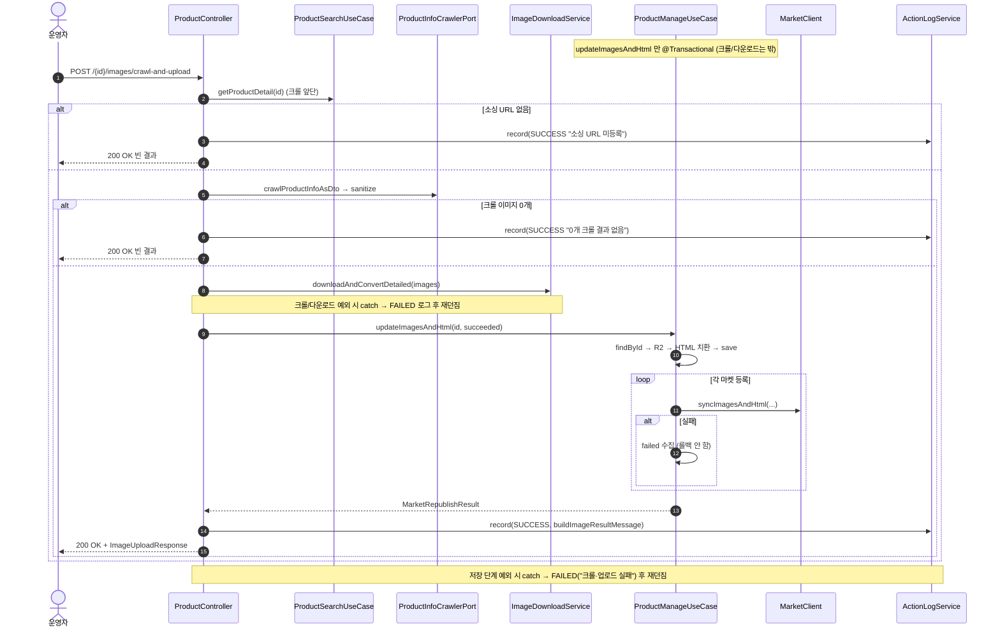
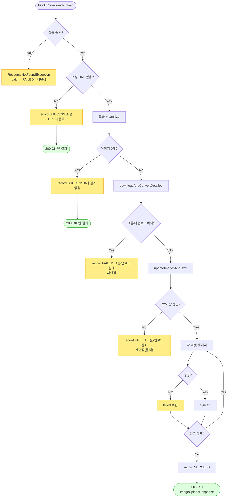

# POST /{id}/images/crawl-and-upload — 소스이미지 크롤 후 업로드/재게시

## 1. 개요

| 항목 | 내용 |
|------|------|
| **Method / URL** | `POST /api/v1/products/{id}/images/crawl-and-upload` |
| **목적** | 상품 소싱 URL을 크롤해 소스이미지를 다운로드·변환→R2 저장하고 HTML 치환 후 연동 마켓에 재게시한다(크롤+업로드 결합). |
| **핵심 상태전이** | 상태 전이 없음(이미지/HTML 필드 갱신 + 마켓 반영) |
| **부수효과** | 크롤(`ProductInfoCrawlerPort`)→다운로드(개별 실패 집계)→R2→HTML 치환→마켓별 `syncImagesAndHtml`. 활동로그(`SOURCE_IMAGE_CRAWL`). |
| **응답** | `200 OK` + `ImageUploadResponse`. 소싱 URL 미등록/크롤 0개면 빈 결과. |

## 2. 호출 체인

```
ProductController.crawlAndUpload()                               api/.../controller/ProductController.java:186-222
  ├─ crawlSourceImageUrls(id)                                    ProductController.java:196 → 255-265
  │    ├─ productSearchUseCase.getProductDetail(id)              :256 (없으면 ResourceNotFoundException)
  │    ├─ 소싱 URL null/empty → CrawlResult(noSourcingUrl=true)  :257-260
  │    └─ crawlProductInfoAsDto → sourceImages → sanitize(≤30)   :261-264
  ├─ noSourcingUrl → record(SUCCESS "소싱 URL 미등록") + 빈 응답  ProductController.java:197-202
  ├─ images.isEmpty() → record(SUCCESS "0개 크롤 결과 없음") + 빈 응답  ProductController.java:204-209
  ├─ imageDownloadClient.downloadAndConvertDetailed(images)      ProductController.java:212
  │    └─ infra/.../cloudflare/ImageDownloadService.java:43-77 (개별 실패 집계)
  ├─ (크롤/다운로드 예외) record(SOURCE_IMAGE_CRAWL FAILED "크롤·업로드 실패") 후 재던짐  ProductController.java:213-218
  └─ uploadPreparedImages(id, downloaded, SOURCE_IMAGE_CRAWL, "...크롤·업로드", "크롤·업로드 실패")  ProductController.java:220-221 → 233-248
       ├─ ProductManageUseCase.updateImagesAndHtml(id, uploadFiles)  core/.../product/ProductManageUseCase.java:83-105  @Transactional
       │    ├─ findById → R2 uploadImages → replaceImagesBySku → save  :85-99
       │    └─ republishToMarkets(id, hostedImages, newHtml)     :104 → :115-155
       ├─ record(SOURCE_IMAGE_CRAWL, SUCCESS, buildImageResultMessage)  ProductController.java:240-241
       └─ (예외) record(SOURCE_IMAGE_CRAWL FAILED "크롤·업로드 실패") 후 재던짐  ProductController.java:243-247
```

## 3. 유스케이스 다이어그램


## 4. 시퀀스 다이어그램



## 5. 순서도 (플로우차트)



## 6. 상태 전이표

상태 전이 없음(이미지/HTML 필드 및 마켓 등록정보 갱신). 결과 분류:

| 조건 | 응답 | 활동로그(SOURCE_IMAGE_CRAWL) |
|------|------|------------------------------|
| 상품 미존재 | 재던짐(404) | FAILED "크롤·업로드 실패" |
| 소싱 URL 미등록 | 200 빈 결과 | SUCCESS "소싱 URL 미등록" |
| 크롤 이미지 0개 | 200 빈 결과 | SUCCESS "0개 크롤 결과 없음" |
| 크롤/다운로드 예외 | 재던짐(5xx) | FAILED "크롤·업로드 실패" |
| 저장(R2)/마켓 진입 후 예외 | 재던짐(5xx, 롤백) | FAILED "크롤·업로드 실패" |
| 정상 | 200 + 재게시 결과 | SUCCESS(마켓 failed 유무 무관) |

## 7. 🔎 발견사항

### PRODB-12 · 🟠 GAP — 빈-결과 조기반환이 `ImageUploadResponse.storageUpdated=true`로 응답해 "저장됨" 오해 소지
- **근거:** 소싱 URL 미등록(`ProductController.java:200-201`)·크롤 0개(:207-208) 경로가 `ImageUploadResponse.from(new MarketRepublishResult(List.of(), List.of(), Map.of()))`로 응답한다. `ImageUploadResponse.from(...)`(api/.../dto/product/ImageUploadResponse.java:40-42, 49-62)는 `storageUpdated`를 **항상 true**로 고정한다. 그러나 이 두 경로는 실제로 R2 저장·DB 갱신을 전혀 하지 않았다.
- **영향:** 프론트가 `storageUpdated=true`를 "자사 저장 성공"으로 해석하는 계약(같은 DTO 주석 :12-14)과 어긋난다 — 실제로 아무것도 저장하지 않은 빈-결과 응답도 storageUpdated=true, imagesSucceeded=0으로 내려간다. UI가 "저장 완료"로 오표시할 수 있다.
- **제안:** 빈-결과 조기반환에 대해 storageUpdated=false 또는 별도 상태(예: `skipped`) 응답을 두어 저장 여부를 정직하게 표면화. DTO 팩토리에 storageUpdated 파라미터화 검토.

### PRODB-13 · 🔵 NOTE — 크롤+다운로드+저장이 서로 다른 트랜잭션/무-트랜잭션 경계를 가로질러 실패 로그가 프리픽스로만 구분됨
- **근거:** `crawlAndUpload`는 크롤/다운로드 예외(`ProductController.java:213-218`)와 저장 단계 예외(`uploadPreparedImages` 내부 catch, :243-247)를 각각 잡아 동일 `SOURCE_IMAGE_CRAWL` 타입에 같은 프리픽스("크롤·업로드 실패")로 FAILED 기록한다. 크롤/다운로드는 트랜잭션 밖, 저장(`updateImagesAndHtml`)은 `@Transactional`(ProductManageUseCase.java:83)로 경계가 다르다.
- **영향:** 의도된 설계(주석 :190-191 "실패 로그를 정확히 한 번만")이나, 실패가 크롤 단계인지 저장 단계인지 로그 타입·프리픽스만으로는 구분되지 않아 원인 분석 시 예외 메시지에 의존해야 한다.
- **제안:** 단계별 실패 프리픽스 세분화(크롤 실패 / 다운로드 실패 / 저장 실패) 검토. 현행 유지 시 이 결합을 문서로 남겨둠.

### PRODB-14 · 🟡 SMELL — 마켓 부분 실패가 있어도 활동로그 status는 항상 SUCCESS
- **근거:** `uploadPreparedImages`(`ProductController.java:240-241`) — `updateImagesAndHtml`이 정상 반환하면 마켓 failed 유무와 무관하게 SUCCESS로 기록. PRODB-2/6/9와 동일 근원(3경로 공통 헬퍼).
- **영향:** 마켓 재게시 전부 실패해도 SOURCE_IMAGE_CRAWL 로그 status는 SUCCESS.
- **제안:** 공통 헬퍼에서 `result.failed()` 기준 status 분기 통일.

## 8. 테스트 커버리지 메모

- `ProductControllerCrawlUploadTest`(api) — 정상 경로(크롤→downloadAndConvertDetailed→updateImagesAndHtml)·소싱 URL 없음·크롤 0개 시 updateImagesAndHtml 미호출/200 반환 검증(:64-105).
- **비어있는 케이스:** ① 빈-결과 응답의 `storageUpdated` 계약(PRODB-12), ② 크롤 예외 vs 저장 예외 FAILED 로그 구분(PRODB-13), ③ 마켓 전부 실패 시 로그 status(PRODB-14), ④ 크롤 30개 초과 절단 후 업로드 경로.

---
*생성: 2026-07-17 · 근거: 현재 워킹트리*
