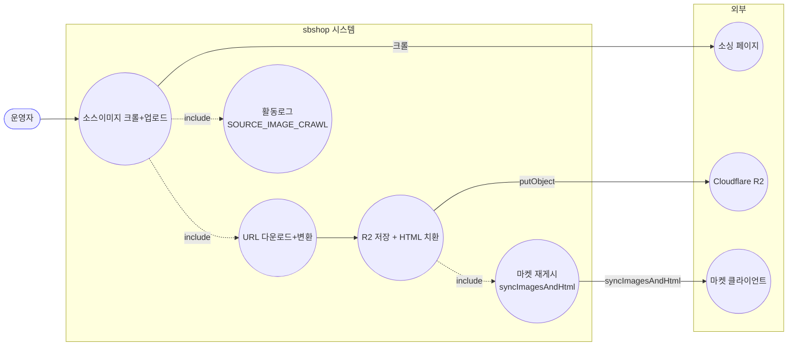
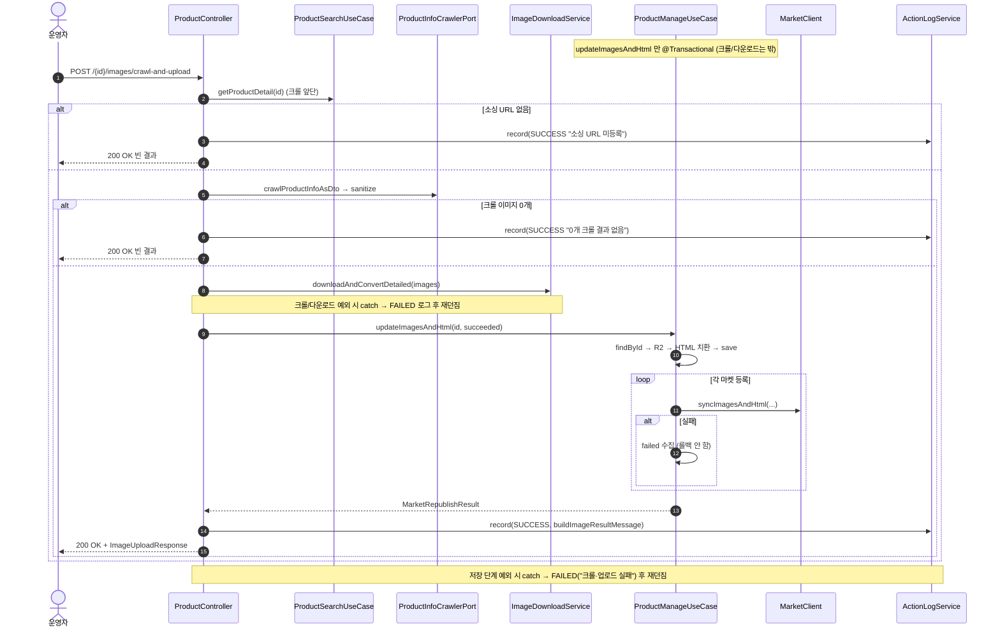

# POST /{id}/images/crawl-and-upload — 소스이미지 크롤 후 업로드/재게시

> 앞의 "크롤(미리보기)"과 "이미지 업로드"를 한 번에 묶은 기능입니다. 상품의 소싱(구매처) 페이지를 훑어 이미지를 찾아내고, 그 이미지를 내려받아 크기 조정 후 저장소(R2)에 올리고, 상세설명(HTML)의 이미지를 바꿔 끼운 뒤, 각 마켓에 다시 게시까지 한 번에 처리합니다.

## 1. 개요

| 항목 | 내용 |
|------|------|
| **Method / URL** | `POST /api/v1/products/{id}/images/crawl-and-upload` |
| **목적** | 상품 소싱 주소를 크롤해 이미지를 내려받아 크기 조정→R2 저장하고, HTML 교체 후 연동 마켓에 다시 게시한다(크롤+업로드를 한 번에). |
| **핵심 상태전이** | 없음(이미지·상세설명 필드 갱신 + 마켓 반영) |
| **부수효과** | 크롤(`ProductInfoCrawlerPort`)→다운로드(개별 실패는 모아둠)→R2→HTML 교체→마켓마다 `syncImagesAndHtml`. 활동로그(`SOURCE_IMAGE_CRAWL`) 남김. |
| **응답** | `200 OK` + `ImageUploadResponse`. 소싱 주소가 없거나 크롤 결과가 0개면 빈 결과. |

## 2. 호출 체인

아래는 요청 후 코드가 불려 가는 순서입니다.

```
ProductController.crawlAndUpload()                               api/.../controller/ProductController.java:186-222
  ├─ crawlSourceImageUrls(id)                                    ProductController.java:196 → 255-265
  │    │                                                         → 쉽게 말하면: 소싱 페이지를 훑어 이미지 주소를 뽑음(크롤 경로와 공용)
  │    ├─ productSearchUseCase.getProductDetail(id)              :256 (없으면 ResourceNotFoundException)  → 상품 없으면 404
  │    ├─ 소싱 URL null/empty → CrawlResult(noSourcingUrl=true)  :257-260  → 소싱 주소 없으면 여기서 끝
  │    └─ crawlProductInfoAsDto → sourceImages → sanitize(≤30)   :261-264  → 크롤→이미지 뽑기→정리(최대 30개)
  ├─ noSourcingUrl → record(SUCCESS "소싱 URL 미등록") + 빈 응답  ProductController.java:197-202  → 소싱 주소 없음 로그 + 빈 결과
  ├─ images.isEmpty() → record(SUCCESS "0개 크롤 결과 없음") + 빈 응답  ProductController.java:204-209  → 이미지 0개면 여기서 끝
  ├─ imageDownloadClient.downloadAndConvertDetailed(images)      ProductController.java:212  → 뽑은 이미지를 실제로 내려받아 크기 조정
  │    └─ infra/.../cloudflare/ImageDownloadService.java:43-77 (개별 실패 집계)  → 개별 실패는 모아둠
  ├─ (크롤/다운로드 예외) record(SOURCE_IMAGE_CRAWL FAILED "크롤·업로드 실패") 후 재던짐  ProductController.java:213-218  → 크롤/다운로드 오류면 실패 기록 후 전달
  └─ uploadPreparedImages(id, downloaded, SOURCE_IMAGE_CRAWL, "...크롤·업로드", "크롤·업로드 실패")  ProductController.java:220-221 → 233-248
       │                                                         → 준비된 이미지로 저장·마켓반영·로그 처리(3경로 공용 헬퍼)
       ├─ ProductManageUseCase.updateImagesAndHtml(id, uploadFiles)  core/.../product/ProductManageUseCase.java:83-105  @Transactional
       │    ├─ findById → R2 uploadImages → replaceImagesBySku → save  :85-99  → 상품 조회→R2 저장→HTML 교체→저장
       │    └─ republishToMarkets(id, hostedImages, newHtml)     :104 → :115-155  → 각 마켓에 다시 게시
       ├─ record(SOURCE_IMAGE_CRAWL, SUCCESS, buildImageResultMessage)  ProductController.java:240-241  → 성공 로그
       └─ (예외) record(SOURCE_IMAGE_CRAWL FAILED "크롤·업로드 실패") 후 재던짐  ProductController.java:243-247  → 저장 도중 오류면 실패 기록 후 전달
```

## 3. 유스케이스 다이어그램

👉 이 그림은 소싱 페이지 크롤 → 이미지 다운로드 → 저장소 저장·HTML 교체 → 마켓 재게시 → 로그 기록으로 이어지는 흐름과, 소싱 페이지·R2·마켓이라는 외부와의 연결을 보여줍니다.



## 4. 시퀀스 다이어그램

👉 이 그림은 각 코드가 시간 순서로 주고받는 대화입니다. 위 메모처럼 "크롤·다운로드는 저장 묶음 밖에서, 저장(updateImagesAndHtml)만 하나의 묶음(트랜잭션) 안에서" 일어난다는 점을 눈여겨보세요.



## 5. 순서도 (플로우차트)

👉 이 그림은 "상품 있음? → 소싱 주소 있음? → 크롤 이미지 0개? → 다운로드 오류? → R2/저장 성공? → 마켓마다 성공/실패"의 갈림길을 따라 결과가 어떻게 갈리는지 보여줍니다.


## 6. 상태 전이표

이 기능은 상품 상태를 바꾸지 않습니다(이미지·상세설명 필드와 마켓 등록정보만 갱신). 아래는 상황별 응답과 활동로그입니다.

| 조건 | 응답 | 활동로그(SOURCE_IMAGE_CRAWL) |
|------|------|------------------------------|
| 상품 없음 | 오류 전달(404) | 실패 "크롤·업로드 실패" |
| 소싱 주소 등록 안 됨 | 200 빈 결과 | 성공 "소싱 URL 미등록" |
| 크롤 이미지 0개 | 200 빈 결과 | 성공 "0개 크롤 결과 없음" |
| 크롤/다운로드 중 오류 | 오류 전달(5xx) | 실패 "크롤·업로드 실패" |
| 저장(R2)/마켓 진입 후 오류 | 오류 전달(5xx, 되돌림) | 실패 "크롤·업로드 실패" |
| 정상 | 200 + 재게시 결과 | 성공(마켓 실패 유무와 무관) |

## 7. 🔎 발견사항

### PRODB-12 · 🟠 GAP — 아무것도 안 했는데도 응답이 `storageUpdated=true`("저장됨")로 나가 오해를 부를 수 있음
- **무엇이 문제인가:** 소싱 주소가 없거나 크롤 이미지가 0개여서 "빈 결과"로 일찍 끝내는 경로가, 응답의 `storageUpdated`(저장됨 표시)를 항상 true로 채워 돌려줍니다. 그런데 이 두 경로는 실제로 저장소나 DB에 아무것도 바꾸지 않았습니다.
- **근거:** 소싱 URL 미등록(`ProductController.java:200-201`)·크롤 0개(:207-208) 경로가 `ImageUploadResponse.from(new MarketRepublishResult(List.of(), List.of(), Map.of()))`로 응답한다. `ImageUploadResponse.from(...)`(api/.../dto/product/ImageUploadResponse.java:40-42, 49-62)는 `storageUpdated`를 **항상 true**로 고정한다. 그러나 이 두 경로는 실제로 R2 저장·DB 갱신을 전혀 하지 않았다.
- **왜 문제인가:** 화면(프론트)은 `storageUpdated=true`를 "우리 저장이 성공했다"는 뜻으로 해석하는데(같은 DTO 주석에 그렇게 약속됨), 실제로는 아무것도 저장하지 않은 빈 결과도 이 값이 true·저장 이미지 수 0으로 내려갑니다. 그래서 UI가 "저장 완료"라고 잘못 표시할 수 있습니다.
- **어떻게 고치면 되나:** 빈 결과로 일찍 끝내는 경우엔 `storageUpdated=false`로 하거나, "건너뜀(skipped)" 같은 별도 상태로 저장 여부를 정직하게 표시합니다. 응답을 만드는 팩토리에 `storageUpdated`를 인자로 받게 하는 방안도 검토합니다.

### PRODB-13 · 🔵 NOTE — 크롤·다운로드·저장이 각기 다른 (묶음/비-묶음) 경계를 넘나들어, 실패 로그가 앞 문구로만 구분됨
- **무엇이 문제인가:** 크롤/다운로드에서 난 오류와, 저장 단계에서 난 오류를 각각 따로 잡아서 처리하는데, 둘 다 같은 로그 종류에 같은 앞 문구("크롤·업로드 실패")로 실패를 기록합니다. 크롤/다운로드는 저장 묶음 밖에서, 저장은 묶음(트랜잭션) 안에서 일어나 경계가 다릅니다.
- **근거:** `crawlAndUpload`는 크롤/다운로드 예외(`ProductController.java:213-218`)와 저장 단계 예외(`uploadPreparedImages` 내부 catch, :243-247)를 각각 잡아 동일 `SOURCE_IMAGE_CRAWL` 타입에 같은 프리픽스("크롤·업로드 실패")로 FAILED 기록한다. 크롤/다운로드는 트랜잭션 밖, 저장(`updateImagesAndHtml`)은 `@Transactional`(ProductManageUseCase.java:83)로 경계가 다르다.
- **왜 문제인가:** "실패 로그를 정확히 한 번만" 남기려는 의도된 설계이긴 하지만, 실패가 크롤 단계에서 난 건지 저장 단계에서 난 건지가 로그 종류·앞 문구만으로는 구분되지 않아, 원인을 볼 때 오류 메시지 본문에 의존해야 합니다.
- **어떻게 고치면 되나:** 단계별로 앞 문구를 세분화(크롤 실패 / 다운로드 실패 / 저장 실패)하는 것을 검토합니다. 지금대로 둔다면 이 결합 구조를 문서로 남겨둡니다.

### PRODB-14 · 🟡 SMELL — 마켓 일부 실패가 있어도 활동로그 상태는 항상 "성공(SUCCESS)"
- **무엇이 문제인가:** 저장 단계가 오류 없이 반환되기만 하면, 마켓 실패가 있든 없든 활동로그 상태를 "성공"으로 남깁니다. PRODB-2/6/9와 뿌리가 같은 문제(3경로가 함께 쓰는 공통 헬퍼 때문)입니다.
- **근거:** `uploadPreparedImages`(`ProductController.java:240-241`) — `updateImagesAndHtml`이 정상 반환하면 마켓 failed 유무와 무관하게 SUCCESS로 기록. PRODB-2/6/9와 동일 근원(3경로 공통 헬퍼).
- **왜 문제인가:** 마켓 재게시가 전부 실패해도 SOURCE_IMAGE_CRAWL 로그 상태는 "성공"이라, 상태값 기준 모니터링에서 부분 실패가 드러나지 않습니다.
- **어떻게 고치면 되나:** 공통 헬퍼에서 실패한 마켓 유무를 기준으로 상태를 나누도록 통일합니다.

## 8. 테스트 커버리지 메모

- `ProductControllerCrawlUploadTest`(api) — 정상 경로(크롤→다운로드→저장)와, 소싱 주소 없음·크롤 0개일 때 저장 로직을 안 부르고 200을 돌려주는지 검증(:64-105).
- **비어있는 케이스:** ① 빈 결과 응답의 `storageUpdated` 표시(PRODB-12), ② 크롤 오류와 저장 오류의 실패 로그 구분(PRODB-13), ③ 마켓 전부 실패 시 로그 상태(PRODB-14), ④ 크롤 30개 초과로 자른 뒤 업로드하는 경로.

---
*(쉬운 설명판 · 2026-07-17 재작성)*
*생성: 2026-07-17 · 근거: 현재 워킹트리*
