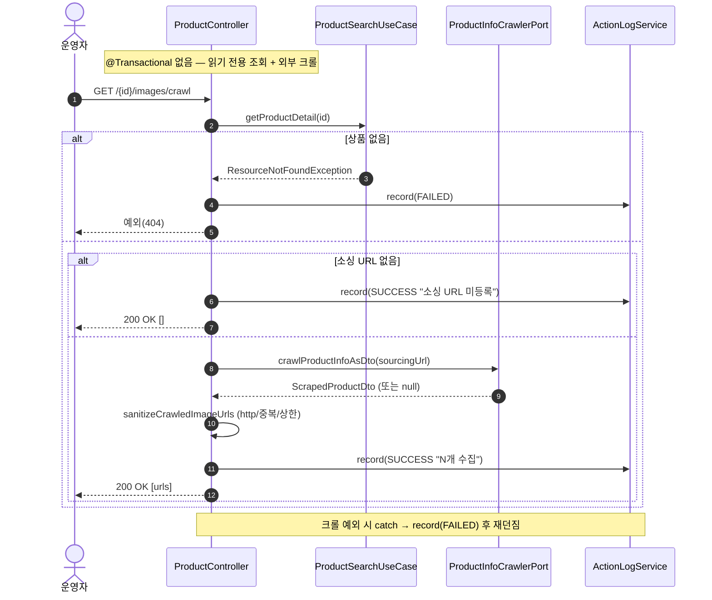

# GET /{id}/images/crawl — 소스이미지 URL 크롤(조회)

## 1. 개요

| 항목 | 내용 |
|------|------|
| **Method / URL** | `GET /api/v1/products/{id}/images/crawl` |
| **목적** | 상품의 소싱 URL을 크롤해 소스 페이지 이미지 URL 목록을 정제(http(s)만·중복제거·상한 절단)해 반환한다. 저장은 하지 않음(미리보기용). |
| **핵심 상태전이** | 상태 전이 없음(조회) |
| **부수효과** | 외부 소싱 페이지 크롤(`ProductInfoCrawlerPort`). 활동로그(`SOURCE_IMAGE_CRAWL`)만 기록. DB/마켓 변경 없음. |
| **응답** | `200 OK` + `List<String>`(정제된 이미지 URL). 소싱 URL 미등록/결과 없음이면 빈 배열. |

## 2. 호출 체인

```
ProductController.crawlSourceImages()                            api/.../controller/ProductController.java:161-184
  ├─ crawlSourceImageUrls(id)                                    ProductController.java:168 → 255-265
  │    ├─ productSearchUseCase.getProductDetail(id)              :256 → core/.../product/ProductSearchUseCase.java:32-35
  │    │    └─ productReader.findById → 없으면 ResourceNotFoundException
  │    ├─ product.getSourcingUrl() null/empty → CrawlResult(noSourcingUrl=true)  :257-260
  │    ├─ productInfoCrawlerPort.crawlProductInfoAsDto(sourcingUrl)  :261
  │    │    └─ infra/.../sourcing/IherbScraperClient.java:220-223 → toScrapedDto(...).sourceImages
  │    ├─ scraped/sourceImages null → 빈 목록                     :262-263
  │    └─ sanitizeCrawledImageUrls(id, rawImages)                :264 → 272-290
  │         ├─ http(s) 형식만 통과 + LinkedHashSet 중복제거        :274-282
  │         └─ MAX_CRAWL_IMAGES(30) 초과 시 절단 + log.warn        :284-288 (상수 :62)
  ├─ noSourcingUrl → record(SUCCESS "소싱 URL 미등록") + 빈 배열   ProductController.java:169-173
  ├─ 정상 → record(SUCCESS "N개 수집") + images 반환              ProductController.java:174-178
  └─ (예외) record(FAILED "크롤 실패") 후 재던짐                  ProductController.java:179-183
```

## 3. 유스케이스 다이어그램


## 4. 시퀀스 다이어그램



## 5. 순서도 (플로우차트)


## 6. 상태 전이표

상태 전이 없음(조회). 저장/마켓 반영 없음 — 크롤 미리보기 전용. 결과 분류만:

| 조건 | 응답 | 활동로그 |
|------|------|----------|
| 상품 미존재 | 404 | SOURCE_IMAGE_CRAWL FAILED |
| 소싱 URL 미등록 | 200 `[]` | SUCCESS "소싱 URL 미등록" |
| 크롤 결과 null/빈 | 200 `[]` | SUCCESS "0개 수집" |
| 정상(≤30) | 200 URL목록 | SUCCESS "N개 수집" |
| 정상(>30) | 200 30개 | SUCCESS "30개 수집" + log.warn 절단 |
| 크롤 예외 | 재던짐(5xx) | FAILED |

## 7. 🔎 발견사항

### PRODB-10 · 🔵 NOTE — 크롤 결과 0개(소싱 URL은 있으나 이미지 없음)와 정상 N개가 동일 로그 타입·status로 기록됨
- **근거:** `ProductController.java:174-178`는 `images.size()==0`인 경우도 `SUCCESS "소스이미지 크롤 0개 수집"`으로 기록한다(별도 분기 없음). 소싱 URL 미등록만 별도 메시지(:169-173). crawl-and-upload 경로는 0개를 별도 메시지("크롤 결과 없음")로 구분한다(ProductController.java:204-209).
- **영향:** 기능 결함은 아니나, GET 크롤에서 "왜 0개인지"(정제 후 전부 탈락 vs 소스 페이지에 이미지 없음)가 로그로 구분되지 않아 진단성이 낮다.
- **제안:** 0개 케이스에 대해 crawl-and-upload와 동일한 세분화 메시지 적용 검토(정합화).

### PRODB-11 · 🔵 NOTE — `crawlProductInfoAsDto`가 null 반환(크롤 차단/파싱 실패)해도 SUCCESS로 기록됨
- **근거:** `crawlSourceImageUrls`(`ProductController.java:262-263`)는 `scraped==null`이면 빈 목록으로 처리하고, 호출부(:174-178)는 이를 "0개 수집 SUCCESS"로 기록한다. `IherbScraperClient.crawlProductInfoAsDto`(:220-223)는 크롤 실패 시 null을 반환하며(`crawlProducts`(:234-236)는 이 null을 "크롤 결과를 가져오지 못했습니다" 실패로 취급), 여기서는 성공과 구분되지 않는다.
- **영향:** 소스 페이지 차단·파싱 실패로 크롤이 실질 실패했는데도 사용자·로그에는 "이미지 없음(0개)"으로 보여 오진 가능. 던져진 예외만 FAILED로 기록됨(null 반환은 예외 아님).
- **제안:** `crawlProductInfoAsDto`가 null이면(소싱 URL은 존재) "크롤 실패/결과 없음"을 구분해 로그·응답에 표면화 검토. `crawlProducts`가 null을 실패로 취급하는 계약과 정합화.

## 8. 테스트 커버리지 메모

- `ProductControllerActionLogDetailTest`(api) — 크롤 성공 시 SOURCE_IMAGE_CRAWL SUCCESS 로그·소싱 URL 없음 시 결과 없음 로그 검증(:143-161).
- **비어있는 케이스:** ① URL 정제(http(s) 필터·중복제거·30개 상한 절단)의 단위 검증, ② `crawlProductInfoAsDto` null 반환 시 처리(PRODB-11), ③ 0개 vs 미등록 로그 구분(PRODB-10), ④ 크롤 예외 시 FAILED 로그.
- `sanitizeCrawledImageUrls`(private)를 직접 검증하는 테스트는 검색되지 않음.

---
*생성: 2026-07-17 · 근거: 현재 워킹트리*
