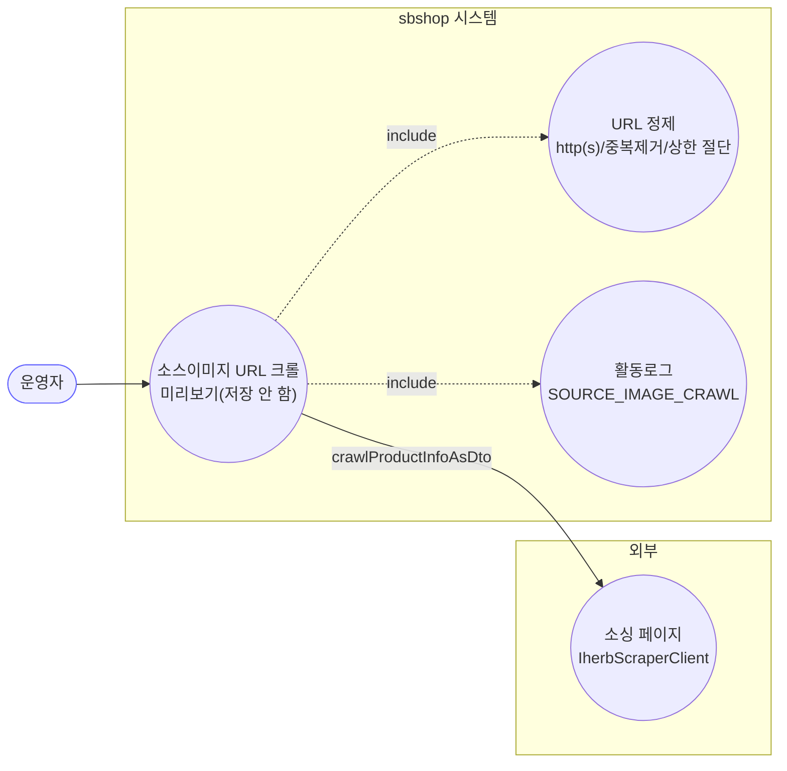
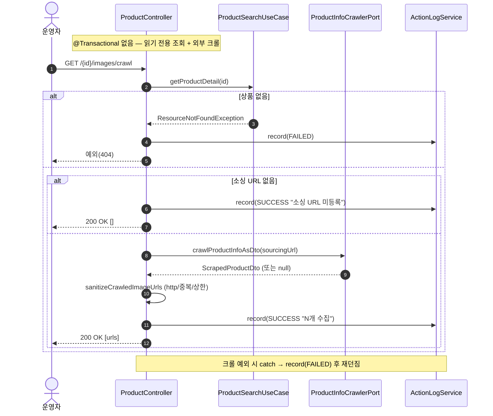
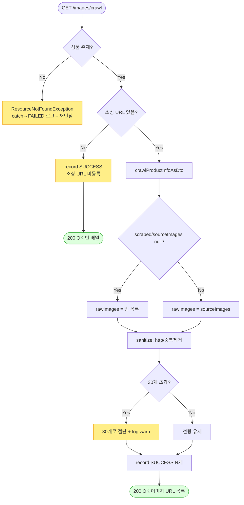

# GET /{id}/images/crawl — 소스이미지 URL 크롤(조회)

> 상품의 소싱(구매처) 페이지를 자동으로 훑어서(크롤) 그 페이지에 있는 이미지 주소들을 뽑아 정리한 뒤 목록으로 돌려주는 기능입니다. 저장은 하지 않고 "미리보기"만 합니다. 운영자가 "이 소싱 페이지에 어떤 이미지들이 있는지 먼저 보고 싶을 때" 씁니다.

## 1. 개요

| 항목 | 내용 |
|------|------|
| **Method / URL** | `GET /api/v1/products/{id}/images/crawl` |
| **목적** | 상품의 소싱 주소를 크롤해, 그 페이지의 이미지 주소들을 정리(http(s) 형식만 남기고·중복 제거하고·최대 개수로 자름)해 돌려준다. 저장은 하지 않음(미리보기용). |
| **핵심 상태전이** | 없음(조회만 함) |
| **부수효과** | 외부 소싱 페이지 크롤(`ProductInfoCrawlerPort`). 활동로그(`SOURCE_IMAGE_CRAWL`)만 남김. DB·마켓은 아무것도 안 바꿈. |
| **응답** | `200 OK` + `List<String>`(정리된 이미지 주소들). 소싱 주소가 없거나 결과가 없으면 빈 목록. |

## 2. 호출 체인

아래는 요청 후 코드가 불려 가는 순서입니다.

```
ProductController.crawlSourceImages()                            api/.../controller/ProductController.java:161-184
  ├─ crawlSourceImageUrls(id)                                    ProductController.java:168 → 255-265
  │    │                                                         → 쉽게 말하면: 소싱 페이지를 훑어 이미지 주소를 뽑는 핵심 로직
  │    ├─ productSearchUseCase.getProductDetail(id)              :256 → core/.../product/ProductSearchUseCase.java:32-35
  │    │    └─ productReader.findById → 없으면 ResourceNotFoundException  → 상품 없으면 404
  │    ├─ product.getSourcingUrl() null/empty → CrawlResult(noSourcingUrl=true)  :257-260  → 소싱 주소가 없으면 여기서 끝(빈 목록)
  │    ├─ productInfoCrawlerPort.crawlProductInfoAsDto(sourcingUrl)  :261  → 소싱 페이지를 실제로 크롤
  │    │    └─ infra/.../sourcing/IherbScraperClient.java:220-223 → toScrapedDto(...).sourceImages
  │    ├─ scraped/sourceImages null → 빈 목록                     :262-263  → 크롤 결과가 없으면 빈 목록으로 처리
  │    └─ sanitizeCrawledImageUrls(id, rawImages)                :264 → 272-290  → 뽑은 주소들을 정리
  │         ├─ http(s) 형식만 통과 + LinkedHashSet 중복제거        :274-282  → 올바른 형식만 남기고 중복 제거
  │         └─ MAX_CRAWL_IMAGES(30) 초과 시 절단 + log.warn        :284-288 (상수 :62)  → 30개 넘으면 30개로 자름
  ├─ noSourcingUrl → record(SUCCESS "소싱 URL 미등록") + 빈 배열   ProductController.java:169-173  → 소싱 주소 없음 로그 + 빈 목록
  ├─ 정상 → record(SUCCESS "N개 수집") + images 반환              ProductController.java:174-178  → 성공 로그 + 목록 반환
  └─ (예외) record(FAILED "크롤 실패") 후 재던짐                  ProductController.java:179-183  → 크롤 도중 오류면 실패 기록 후 오류 전달
```

## 3. 유스케이스 다이어그램

👉 이 그림은 소싱 페이지 크롤 → 주소 정리 → 로그 기록으로 이어지는 흐름과, 외부 소싱 페이지와 어디서 연결되는지를 보여줍니다.



## 4. 시퀀스 다이어그램

👉 이 그림은 각 코드가 시간 순서로 주고받는 대화입니다. 위 메모처럼 저장 묶음(트랜잭션) 없이 "읽기 전용 조회 + 외부 크롤"만 한다는 점을 눈여겨보세요.



## 5. 순서도 (플로우차트)

👉 이 그림은 "상품 있음? → 소싱 주소 있음? → 크롤 결과 있음? → 30개 넘나?"의 갈림길을 따라 어떤 결과로 이어지는지 보여줍니다.



## 6. 상태 전이표

이 기능은 조회만 하고 저장·마켓 반영을 하지 않습니다(크롤 미리보기 전용). 아래는 상황별 응답과 활동로그만 정리한 것입니다.

| 조건 | 응답 | 활동로그 |
|------|------|----------|
| 상품 없음 | 404 | SOURCE_IMAGE_CRAWL 실패(FAILED) |
| 소싱 주소가 등록 안 됨 | 200 `[]` | 성공 "소싱 URL 미등록" |
| 크롤 결과가 없거나 비어 있음 | 200 `[]` | 성공 "0개 수집" |
| 정상(30개 이하) | 200 주소 목록 | 성공 "N개 수집" |
| 정상(30개 초과) | 200 30개만 | 성공 "30개 수집" + 자름 경고 로그 |
| 크롤 중 오류 | 오류 전달(5xx) | 실패(FAILED) |

## 7. 🔎 발견사항

### PRODB-10 · 🔵 NOTE — "크롤 결과 0개"(소싱 주소는 있는데 이미지 없음)와 "정상 N개"가 같은 로그 종류·상태로 기록됨
- **무엇이 문제인가:** 결과가 0개일 때도 "성공 - 0개 수집"으로 기록할 뿐, 별도 구분이 없습니다(소싱 주소 자체가 없을 때만 별도 메시지가 있음). 반면 크롤+업로드 경로는 0개를 "크롤 결과 없음"이라는 별도 메시지로 구분합니다.
- **근거:** `ProductController.java:174-178`는 `images.size()==0`인 경우도 `SUCCESS "소스이미지 크롤 0개 수집"`으로 기록한다(별도 분기 없음). 소싱 URL 미등록만 별도 메시지(:169-173). crawl-and-upload 경로는 0개를 별도 메시지("크롤 결과 없음")로 구분한다(ProductController.java:204-209).
- **왜 문제인가:** 기능이 잘못되는 건 아니지만, "왜 0개인지"(정리 과정에서 전부 걸러졌는지, 원래 소스 페이지에 이미지가 없었는지)가 로그로 구분되지 않아 원인을 파악하기 어렵습니다.
- **어떻게 고치면 되나:** 0개인 경우에 크롤+업로드 경로와 같은 세분화 메시지를 붙이는 것을 검토합니다(방식 통일).

### PRODB-11 · 🔵 NOTE — 크롤이 실질 실패해(차단·파싱 실패로 빈 결과 반환) 돌아와도 "성공(SUCCESS)"으로 기록됨
- **무엇이 문제인가:** 크롤 함수가 실패해 "빈 결과(null)"를 돌려주면, 이 경로는 그것을 그냥 "이미지 0개"로 처리하고 "성공"으로 기록합니다. 예외를 던진 경우만 실패로 잡히고, 이렇게 조용히 빈 결과로 돌아온 실패는 성공과 구분되지 않습니다.
- **근거:** `crawlSourceImageUrls`(`ProductController.java:262-263`)는 `scraped==null`이면 빈 목록으로 처리하고, 호출부(:174-178)는 이를 "0개 수집 SUCCESS"로 기록한다. `IherbScraperClient.crawlProductInfoAsDto`(:220-223)는 크롤 실패 시 null을 반환하며(`crawlProducts`(:234-236)는 이 null을 "크롤 결과를 가져오지 못했습니다" 실패로 취급), 여기서는 성공과 구분되지 않는다.
- **왜 문제인가:** 소스 페이지가 접속을 막거나 파싱에 실패해 사실상 크롤이 실패했는데도, 사용자와 로그에는 "이미지 없음(0개)"으로 보여 오판할 수 있습니다. (같은 null을 다른 곳에서는 "실패"로 취급하는데, 여기만 성공처럼 다룹니다.)
- **어떻게 고치면 되나:** 소싱 주소는 있는데 크롤이 빈 결과(null)를 돌려주면 "크롤 실패/결과 없음"으로 구분해 로그·응답에 드러내는 것을 검토합니다. `crawlProducts`가 이 null을 실패로 보는 방식과 맞춥니다.

## 8. 테스트 커버리지 메모

- `ProductControllerActionLogDetailTest`(api) — 크롤 성공 시 SOURCE_IMAGE_CRAWL 성공 로그가 남는지, 소싱 주소 없을 때 결과 없음 로그가 남는지 검증(:143-161).
- **비어있는 케이스:** ① 주소 정리(http(s) 필터·중복 제거·30개 자르기)의 단위 검증, ② 크롤이 빈 결과(null)를 돌려줄 때의 처리(PRODB-11), ③ 0개와 미등록 로그 구분(PRODB-10), ④ 크롤 오류 시 FAILED 로그.
- `sanitizeCrawledImageUrls`(내부 전용 함수)를 직접 검증하는 테스트는 찾지 못함.

---
*(쉬운 설명판 · 2026-07-17 재작성)*
*생성: 2026-07-17 · 근거: 현재 워킹트리*
