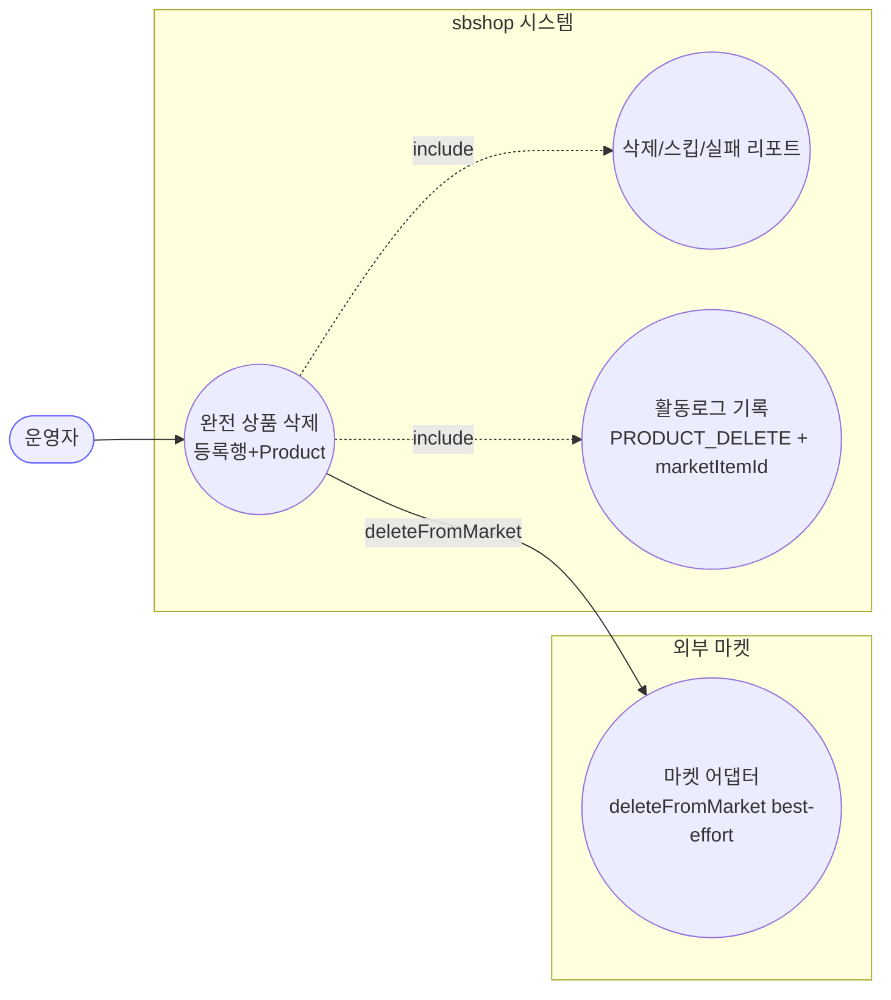
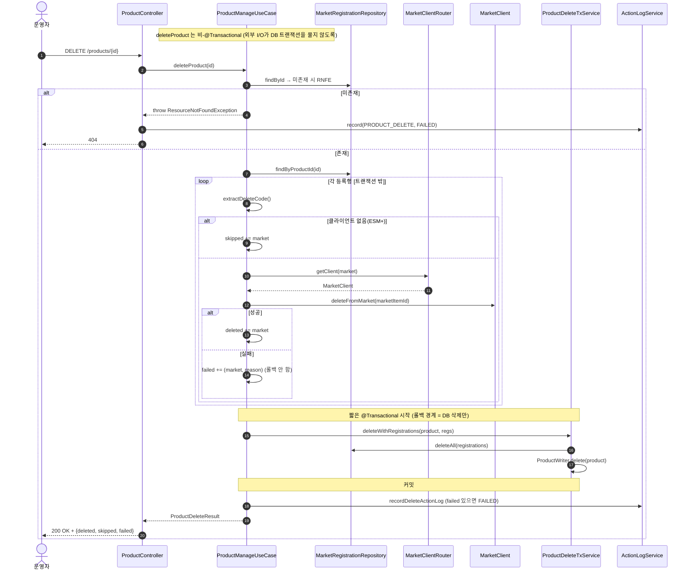

# DELETE /api/v1/products/{id} — 완전 상품 삭제 (마켓 API 연동)

## 1. 개요

| 항목 | 내용 |
|------|------|
| **Method / URL** | `DELETE /api/v1/products/{id}` |
| **목적** | 연동된 각 외부 마켓의 상품 페이지를 "가능한 만큼" 지운 뒤, 자사 등록 정보와 상품(`Product`)까지 완전히 지우고, "지움/건너뜀/실패" 결과표를 돌려준다. |
| **핵심 상태전이** | `Product` 있음 → 삭제(사라짐). 마켓 상품도 삭제 시도(성공/건너뜀/실패). |
| **부수효과** | **[저장 묶음 밖]** 마켓에 실제 삭제 요청(`deleteFromMarket`, 되돌릴 수 없는 파괴적 작업) + **[짧은 저장 묶음]** 등록 정보·상품 삭제 + 활동로그(`PRODUCT_DELETE`) |
| **응답** | `200 OK` + 결과표(`ProductDeleteResult`: 지움/건너뜀/실패) — 되도록 지우는 방식이라 일부 마켓 실패가 있어도 항상 200 / 상품 없으면 `404` |

## 2. 호출 체인

아래는 삭제 요청이 처리되는 길입니다. 각 단계 옆에 "쉽게 말하면"을 붙였습니다.

```
ProductController.deleteProduct(id)                        api/.../controller/ProductController.java:317-332
  └─ ProductManageUseCase.deleteProduct(id)                core/.../product/ProductManageUseCase.java:192-236  (비-@Transactional)
       ├─ ProductReader.findById → orElseThrow(RNFE)       :193-194  (→ 404, 컨트롤러 catch→ActionLog FAILED→재던짐 :327-331)
       ├─ MarketRegistrationRepository.findByProductId(id) :196
       ├─ [트랜잭션 밖] for each 등록행:                    :203-225
       │    ├─ reg.extractDeleteCode()                     :206 → MarketRegistration.java:191-205 (쿠팡=sellerProductId, 그외=extractMarketCode)
       │    ├─ marketItemId 있으면 marketItemIds 기록       :207-209
       │    ├─ !router.hasClient → skipped + continue      :210-214 (GMARKET/AUCTION=ESM+ 항상 스킵)
       │    └─ router.getClient(m).deleteFromMarket(id)    :216 → MarketClient.deleteFromMarket  core/.../market/client/MarketClient.java:41-44
       │         └─ (성공→deleted / 예외→failed 수집, 롤백 안 함)  :217-224
       ├─ [짧은 @Transactional] ProductDeleteTxService.deleteWithRegistrations(product, regs)
       │                                                    :228 → core/.../product/ProductDeleteTxService.java:38-45
       │    ├─ MarketRegistrationRepository.deleteAll(regs) :40-42
       │    └─ ProductWriter.delete(product)               :43 → ProductWriterImpl.delete  infra/.../ProductWriterImpl.java:26-29
       └─ recordDeleteActionLog(...)                        :231 / 242-258  (실패 있으면 FAILED, 없으면 SUCCESS)
  └─ (컨트롤러) 진입 전 실패(404 등)만 여기서 ActionLog FAILED  :327-331
```

쉽게 말하면 이렇게 흐릅니다:
- **입구(Controller)** 가 삭제할 상품을 찾습니다(없으면 404 + 실패 로그).
- **findByProductId** 로 이 상품이 어느 마켓들에 올라가 있는지 등록 목록을 가져옵니다.
- **[저장 묶음 밖] 등록 하나씩 돌기:** 이 부분은 일부러 저장 묶음(트랜잭션) 밖에서 실행합니다. → 쉽게 말하면 "외부 마켓과 통신하는 느린 작업이 DB 저장을 붙잡고 있지 않게 하려는 것".
  - 삭제에 쓸 마켓 코드를 꺼냅니다(쿠팡은 판매자상품ID, 나머지는 마켓코드).
  - G마켓/옥션(ESM+)처럼 삭제를 처리할 연결(client)이 없는 마켓은 그냥 "건너뜀"으로 표시하고 넘어갑니다.
  - 나머지는 마켓에 실제 삭제 요청을 보냅니다. 성공하면 "지움", 실패하면 "실패(사유)"에 담아 두되 되돌리지는 않습니다. → 쉽게 말하면 "되는 마켓은 지우고, 안 되는 마켓은 실패로 기록만 하고 계속 진행".
- **[짧은 저장 묶음]** 마켓 처리가 끝나면, 자사 DB의 등록 정보와 상품을 함께 지웁니다. 이 짧은 구간만 하나의 저장 묶음입니다.
- 마지막에 **활동로그** 를 남깁니다(실패한 마켓이 하나라도 있으면 FAILED, 없으면 SUCCESS).

**경로 변수**

| 변수 | 타입 | 필수 | 비고 |
|------|------|------|------|
| `id` | Long | 필수 | 숫자가 아니면 400(형식 오류) / 상품 없으면 404 |

**마켓별 삭제 지원 현황(`deleteFromMarket` 구현):** 쿠팡·스마트스토어·11번가·Cafe24 는 삭제 기능이 구현돼 있음. **G마켓/옥션(ESM+)은 삭제 연결이 없어서** 항상 "건너뜀" 처리됨(`ProductManageUseCase.java:210-214`).

## 3. 유스케이스 다이어그램

👉 이 그림은 운영자가 "완전 상품 삭제"를 요청하면, 시스템이 외부 마켓에 삭제 요청을 되도록 보내고(best-effort), 그 안에서 "결과표 만들기"와 "활동로그 남기기"까지 함께 처리한다는 것을 보여줍니다.



## 4. 시퀀스 다이어그램

👉 이 그림은 상품 찾기 → 등록 목록마다 마켓 삭제(건너뜀/성공/실패) → 짧은 저장 묶음으로 DB 삭제 → 활동로그로 이어지는 시간 순서를 보여줍니다. 마켓 삭제가 DB 삭제보다 먼저 일어난다는 점이 핵심입니다.



## 5. 순서도 (플로우차트)

👉 이 그림은 상품이 있는지 확인한 뒤, 등록된 마켓을 하나씩 돌며 "삭제 연결이 있나? → 삭제 성공했나?"를 따져 지움/건너뜀/실패로 나눈 다음, DB에서 지우고 활동로그를 남기는 전체 흐름을 보여줍니다. 마켓 삭제가 실패해도 DB 삭제는 그대로 진행된다는 점이 핵심입니다.


## 6. 상태 전이표

각 칸은 "이런 상황이면 어떻게 되나"를 정리한 것입니다.

| 진입 | 마켓 삭제 결과 | Product/등록행 | 응답 | ActionLog |
|------|------|------|------|------|
| 상품 있음 + 모든 마켓 삭제 성공 | deleted=모든 마켓 | **삭제됨** | 200, failed={} | SUCCESS |
| 상품 있음 + 일부 마켓 실패 | 성공/실패 섞임 | **어쨌든 삭제됨(best-effort)** | 200, failed={마켓:사유} | **FAILED** |
| 상품 있음 + ESM+(삭제 연결 없음) | skipped(건너뜀) | **삭제됨** | 200, skipped=[마켓] | SUCCESS(건너뜀만 있음) |
| 상품 있음 + 삭제 코드 없음(비쿠팡) | `deleteFromMarket(null)` 시도 → 성공/실패는 마켓이 판단 | **삭제됨** | 200 | 마켓 결과에 따름 |
| 상품 없음 | — | 안 바뀜 | 404 | FAILED(컨트롤러에서 잡음) |

> "되도록 지우기(best-effort)" 방식이라: 마켓 삭제가 실패해도 자사 등록 정보와 상품은 언제나 삭제됩니다. 그래서 삭제가 끝나면, 실패한 마켓 페이지를 다시 찾아낼 유일한 단서는 응답의 `failed` 목록과 활동로그에 남긴 marketItemId 뿐입니다.

## 7. 🔎 발견사항

### PRODA-6 · 🟠 GAP — 마켓 리스팅 삭제 실패해도 등록행이 즉시 삭제돼, `failed` 응답을 놓치면 고아 리스팅을 되찾을 근거가 사라진다
- **무엇이 문제인가:** 마켓 삭제가 실패한 건은 "실패 목록"에만 담아 두는데, 바로 다음 단계에서 자사 등록 정보를 (실패한 마켓 것까지 포함해) 전부 지워 버립니다. 즉 마켓에는 상품이 남아 있는데 우리 쪽 연결 정보는 사라집니다.
- **근거:** `ProductManageUseCase.deleteProduct` 는 마켓 삭제 실패를 `failed` 로만 수집하고(:220-224), 그 직후 `ProductDeleteTxService.deleteWithRegistrations`(:228)가 **등록행 전부를 무조건 삭제**한다(`ProductDeleteTxService.java:40-42`). 실패한 마켓의 등록행도 함께 지워진다.
- **왜 문제인가:** 이건 설계상 일부러 그렇게 한 "되도록 지우기" 방식이긴 합니다(주석 :186-189에 명시). 하지만 프론트나 네트워크 문제로 200 응답 속 `failed` 목록을 놓치면, 마켓엔 상품이 남고 우리 쪽엔 연결 정보가 없어 다시 지우거나 짝지을 수 없는 "고아 상품"이 됩니다. 이때 유일한 방어선은 활동로그(:242-258)에 남긴 marketItemId 뿐입니다.
- **어떻게 고치면 되나:** 실패한 마켓의 등록 정보는 지우지 말고 남겨서(부분 삭제) 나중에 다시 시도할 수 있게 하거나, 실패분을 별도의 "정리 대기" 목록/상태로 옮기는 방안을 검토합니다. 최소한 실패가 있을 때 응답에 명확한 재시도 안내를 담게 합니다.

### PRODA-7 · 🟠 GAP — 삭제 식별자(`extractDeleteCode`)가 null 이어도 `deleteFromMarket(null)` 을 그대로 호출한다
- **무엇이 문제인가:** 삭제에 쓸 마켓 코드가 없는데도(빈 값인데도), 삭제 연결만 있으면 그 빈 값 그대로 마켓에 삭제 요청을 보냅니다. 마켓 재등록 경로는 코드가 없으면 "마켓 상품코드 없음" 오류로 확실히 막는데, 삭제 경로는 그렇게 막지 않습니다.
- **근거:** `ProductManageUseCase.java:206-216` — `extractDeleteCode()` 가 null 이면(코드 키 부재 등) `marketItemIds` 에 기록하지 않지만(:207-209), `hasClient` 만 통과하면 `getClient(m).deleteFromMarket(marketItemId)` 를 **null 인 채로 호출**한다(:216). `republishToMarkets` 경로는 코드 null 시 `IllegalStateException("마켓 상품코드 없음")` 으로 명시 차단(`ProductManageUseCase.java:130-132`)하는 것과 대조적.
- **왜 문제인가:** 이러면 결과가 마켓의 `deleteFromMarket(null)` 처리 방식에 달리게 됩니다 — 마켓에 따라 엉뚱한 삭제 요청이 되거나, 전체 상품에 영향을 주거나, 모호한 오류가 날 수 있습니다. 게다가 코드가 안 남았으니 활동로그에도 어떤 상품이었는지 단서가 남지 않습니다.
- **어떻게 고치면 되나:** 삭제 코드가 없으면 마켓 호출을 건너뛰고 "실패(사유=삭제 식별자 없음)"로 분명히 기록합니다. 마켓 재등록 경로의 코드-없음 차단과 방식을 맞춥니다.

### PRODA-8 · 🟡 SMELL — 마켓 리스팅 삭제 성공/스킵/실패 순회 로직이 `republishToMarkets` 와 형태가 거의 동일(수집 구조 중복)
- **무엇이 문제인가:** 이 삭제 로직과 "마켓 재등록" 로직이 거의 똑같은 모양을 하고 있습니다. 둘 다 "등록을 하나씩 돌며 → 연결 없으면 건너뛰고 → 마켓 호출 시도 → 지움/건너뜀/실패 세 통에 나눠 담고 → 로그 남김" 구조입니다. 결과 메시지 조립까지 비슷합니다.
- **근거:** `deleteProduct`(:203-225)와 `republishToMarkets`(`ProductManageUseCase.java:115-155`)는 "등록행 순회 → hasClient 스킵 → try 마켓 호출 → deleted/synced·skipped·failed 3버킷 수집 → 로그" 구조가 동일. 결과 리포트 조립(`recordDeleteActionLog` vs `buildMarketResultMessage`)도 유사.
- **왜 문제인가:** 지금 동작은 정상이지만, 같은 패턴이 최소 두 곳(그리고 ProductMarketSyncService까지)에 복사돼 있어, 나중에 정책을 바꿀 때 한 곳만 고치고 다른 곳을 빠뜨리기 쉽습니다.
- **어떻게 고치면 되나:** "등록을 하나씩 돌며 되도록 처리하고 세 통에 나눠 담는" 공통 부품(헬퍼/템플릿)으로 뽑아내는 것을 검토합니다(동작은 그대로 두는 정리).

### PRODA-9 · 🔵 NOTE — 실패 마켓이 하나라도 있으면 항상 HTTP 200 이라, 클라이언트가 상태코드만으로는 부분 실패를 알 수 없다
- **무엇이 문제인가:** 일부 마켓 삭제가 실패해도 응답 상태코드는 늘 200(성공)입니다. 실패 여부는 오직 응답 본문의 `failed` 목록을 열어 봐야 알 수 있습니다.
- **근거:** `ProductController.java:325-326` 은 예외가 없으면 항상 `ResponseEntity.ok(result)`. 부분 실패(`failed` 비어있지 않음)여도 200. ActionLog 만 FAILED(`ProductManageUseCase.java:256`).
- **왜 문제인가:** "되도록 지우기" 계약상 일부러 그렇게 둔 것이지만, 상태코드(200/오류)만 보고 성공·실패를 판단하는 프론트는 실패를 못 알아챌 수 있습니다. 부분 실패를 알아채려면 반드시 본문의 `failed` 를 읽어야 합니다.
- **어떻게 고치면 되나:** 지금 방식을 유지한다면, 프론트가 `failed` 를 반드시 화면에 드러내도록 문서로 못 박습니다(또는 부분 실패 시 207 Multi-Status 같은 상태코드 사용 검토 — 응답 형태 변경 사안).

## 8. 테스트 커버리지 메모

- `ProductManageUseCaseDeleteTest.java` — 모든 마켓 성공(:96-98), 일부 실패해도 DB 삭제는 유지(:120-122), 삭제 연결 없는 마켓 건너뜀(:145-147), **마켓 삭제가 DB 삭제보다 먼저 일어남(순서 검증)**(:162-164), 활동로그에 실패 마켓과 marketItemId 기록(:178-180), 없는 상품 404(:197-199) — 핵심 계약을 잘 덮음.
- `ProductNotFoundExceptionTest.java:95` — 없는 상품 삭제 시 404 나는지 회귀 확인.
- **아직 테스트가 없는 경우:** ① 삭제 코드가 없을 때 `deleteFromMarket(null)` 을 부르는지(PRODA-7), ② 실패한 마켓의 등록 정보도 함께 지워진다는 점(PRODA-6)을 명시 검증, ③ 부분 실패일 때 HTTP 200이 유지되는지(PRODA-9) 확인.

---
*(쉬운 설명판 · 2026-07-17 재작성)*
*생성: 2026-07-17 · 근거: 현재 워킹트리*
