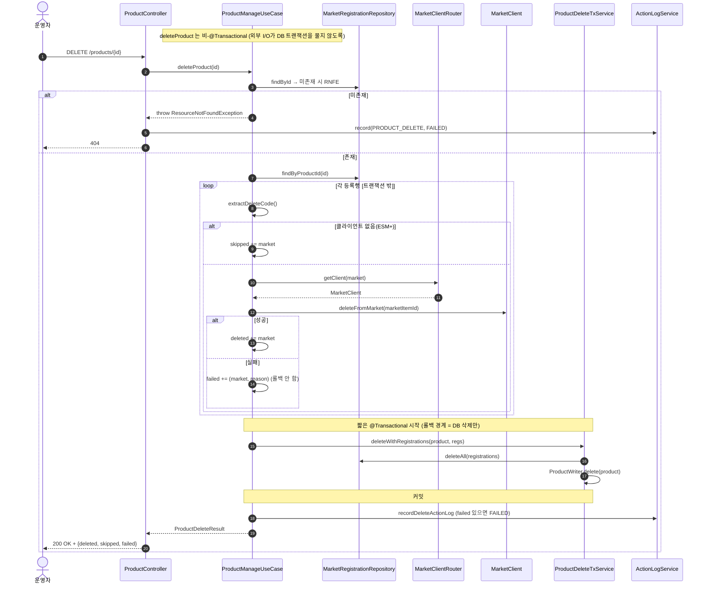
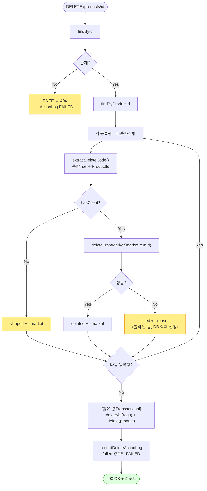

# DELETE /api/v1/products/{id} — 완전 상품 삭제 (마켓 API 연동)

## 1. 개요

| 항목 | 내용 |
|------|------|
| **Method / URL** | `DELETE /api/v1/products/{id}` |
| **목적** | 연동된 각 외부 마켓 리스팅을 삭제(best-effort)한 뒤 등록행·`Product` 를 완전 삭제하고, 삭제/스킵/실패 리포트를 반환한다. |
| **핵심 상태전이** | `Product` 존재 → 삭제(제거). 마켓 리스팅 삭제(성공/스킵/실패) |
| **부수효과** | **[트랜잭션 밖]** 마켓 `deleteFromMarket` 파괴적 호출 + **[짧은 @Transactional]** 등록행·Product DELETE + 활동로그(`PRODUCT_DELETE`) |
| **응답** | `200 OK` + `ProductDeleteResult`(deleted/skipped/failed) — best-effort라 일부 마켓 실패도 항상 200 / 미존재 `404` |

## 2. 호출 체인

```
ProductController.deleteProduct(id)                        api/.../controller/ProductController.java:317-332
  └─ ProductManageUseCase.deleteProduct(id)                core/.../product/ProductManageUseCase.java:192-236  (비-@Transactional)
       ├─ ProductReader.findById → orElseThrow(RNFE)       :193-194  (→ 404, 컨트롤러 catch→ActionLog FAILED→재던짐 :327-331)
       ├─ MarketRegistrationRepository.findByProductId(id) :196
       ├─ [트랜잭션 밖] for each 등록행:                    :203-225
       │    ├─ reg.extractDeleteCode()                     :206 → MarketRegistration.java:191-205 (쿠팡=sellerProductId, 그외=extractMarketCode)
       │    ├─ marketItemId 있으면 marketItemIds 기록       :207-209
       │    ├─ !router.hasClient → skipped + continue      :210-214 (GMARKET/AUCTION=ESM+ 항상 스킵)
       │    └─ router.getClient(m).deleteFromMarket(id)    :216 → MarketClient.deleteFromMarket  core/.../market/client/MarketClient.java:41-44
       │         └─ (성공→deleted / 예외→failed 수집, 롤백 안 함)  :217-224
       ├─ [짧은 @Transactional] ProductDeleteTxService.deleteWithRegistrations(product, regs)
       │                                                    :228 → core/.../product/ProductDeleteTxService.java:38-45
       │    ├─ MarketRegistrationRepository.deleteAll(regs) :40-42
       │    └─ ProductWriter.delete(product)               :43 → ProductWriterImpl.delete  infra/.../ProductWriterImpl.java:26-29
       └─ recordDeleteActionLog(...)                        :231 / 242-258  (실패 있으면 FAILED, 없으면 SUCCESS)
  └─ (컨트롤러) 진입 전 실패(404 등)만 여기서 ActionLog FAILED  :327-331
```

**경로 변수**

| 변수 | 타입 | 필수 | 비고 |
|------|------|------|------|
| `id` | Long | 필수 | 비-숫자 → 400(TypeMismatch) / 미존재 → 404(RNFE) |

**어댑터 구현 현황(`deleteFromMarket` override):** COUPANG·SMART_STORE·ELEVEN_STREET·CAFE24 는 override. **GMARKET/AUCTION(ESM+)은 MarketClient 미등록** → `hasClient=false` → 항상 skipped(`ProductManageUseCase.java:210-214`).

## 3. 유스케이스 다이어그램


## 4. 시퀀스 다이어그램



## 5. 순서도 (플로우차트)



## 6. 상태 전이표

| 진입 | 마켓 삭제 결과 | Product/등록행 | 응답 | ActionLog |
|------|------|------|------|------|
| 존재 + 전 마켓 삭제 성공 | deleted=전마켓 | **삭제됨** | 200, failed={} | SUCCESS |
| 존재 + 일부 마켓 실패 | 성공/실패 혼합 | **삭제됨(best-effort)** | 200, failed={m:reason} | **FAILED** |
| 존재 + ESM+(클라이언트 없음) | skipped | **삭제됨** | 200, skipped=[m] | SUCCESS(스킵만) |
| 존재 + 코드 없음(비쿠팡) | `deleteFromMarket(null)` 시도 → 성공/실패는 어댑터 판단 | **삭제됨** | 200 | 어댑터 결과 따름 |
| 미존재 | — | 미변경 | 404 | FAILED(컨트롤러 catch) |

> best-effort(C): 마켓 삭제 실패해도 등록행·Product 는 항상 삭제되므로, 삭제 후에는 실패 마켓 리스팅을 추적할 유일한 근거가 응답 `failed` 와 ActionLog 의 marketItemId 뿐이다.

## 7. 🔎 발견사항

### PRODA-6 · 🟠 GAP — 마켓 리스팅 삭제 실패해도 등록행이 즉시 삭제돼, `failed` 응답을 놓치면 고아 리스팅을 되찾을 근거가 사라진다
- **근거:** `ProductManageUseCase.deleteProduct` 는 마켓 삭제 실패를 `failed` 로만 수집하고(:220-224), 그 직후 `ProductDeleteTxService.deleteWithRegistrations`(:228)가 **등록행 전부를 무조건 삭제**한다(`ProductDeleteTxService.java:40-42`). 실패한 마켓의 등록행도 함께 지워진다.
- **영향:** 설계상 의도된 best-effort지만(주석 :186-189 명시), 클라이언트가 200 응답의 `failed` 를 무시/유실하면(네트워크·프론트 버그·비동기) 마켓엔 리스팅이 남고 자사엔 등록행이 없어 재삭제·매핑이 불가능한 고아가 된다. ActionLog(:242-258)에 marketItemId 를 남기는 게 유일한 방어선.
- **제안:** 실패 마켓의 등록행은 삭제하지 않고 남겨(부분 삭제) 재시도 가능하게 하거나, 실패분을 별도 "정리 대기" 테이블/상태로 이관하는 옵션 검토. 최소한 failed 발생 시 응답이 명확한 재시도 가이드를 포함하도록.

### PRODA-7 · 🟠 GAP — 삭제 식별자(`extractDeleteCode`)가 null 이어도 `deleteFromMarket(null)` 을 그대로 호출한다
- **근거:** `ProductManageUseCase.java:206-216` — `extractDeleteCode()` 가 null 이면(코드 키 부재 등) `marketItemIds` 에 기록하지 않지만(:207-209), `hasClient` 만 통과하면 `getClient(m).deleteFromMarket(marketItemId)` 를 **null 인 채로 호출**한다(:216). `republishToMarkets` 경로는 코드 null 시 `IllegalStateException("마켓 상품코드 없음")` 으로 명시 차단(`ProductManageUseCase.java:130-132`)하는 것과 대조적.
- **영향:** 어댑터의 `deleteFromMarket(null)` 동작에 의존 — 마켓에 따라 잘못된 삭제 요청/전상품 영향/모호한 오류가 될 수 있고, marketItemId 미기록이라 ActionLog 에도 어떤 리스팅이었는지 근거가 남지 않는다.
- **제안:** 삭제 코드 null 이면 마켓 호출을 건너뛰고 `failed`(사유="삭제 식별자 없음")로 명시 수집. republish 경로의 코드-null 가드와 정합화.

### PRODA-8 · 🟡 SMELL — 마켓 리스팅 삭제 성공/스킵/실패 순회 로직이 `republishToMarkets` 와 형태가 거의 동일(수집 구조 중복)
- **근거:** `deleteProduct`(:203-225)와 `republishToMarkets`(`ProductManageUseCase.java:115-155`)는 "등록행 순회 → hasClient 스킵 → try 마켓 호출 → deleted/synced·skipped·failed 3버킷 수집 → 로그" 구조가 동일. 결과 리포트 조립(`recordDeleteActionLog` vs `buildMarketResultMessage`)도 유사.
- **영향:** 동작은 정상이나, 마켓 순회+3버킷 수집 패턴이 최소 2곳(+ ProductMarketSyncService)에 중복돼 있어 정책 변경 시 누락 위험.
- **제안:** "등록행 순회 + best-effort 3버킷 수집" 을 공통 헬퍼/템플릿으로 추출 검토(동작 보존 리팩토링).

### PRODA-9 · 🔵 NOTE — 실패 마켓이 하나라도 있으면 항상 HTTP 200 이라, 클라이언트가 상태코드만으로는 부분 실패를 알 수 없다
- **근거:** `ProductController.java:325-326` 은 예외가 없으면 항상 `ResponseEntity.ok(result)`. 부분 실패(`failed` 비어있지 않음)여도 200. ActionLog 만 FAILED(`ProductManageUseCase.java:256`).
- **영향:** best-effort 계약상 의도된 설계지만, 상태코드로 성공/부분실패를 구분하는 클라이언트는 오탐. 부분 실패 인지는 응답 바디 `failed` 파싱에 전적으로 의존.
- **제안:** 계약 유지 시 프론트가 `failed` 를 반드시 표면화하도록 문서화. (또는 부분 실패 시 207 Multi-Status 등 검토 — 계약 변경 소관.)

## 8. 테스트 커버리지 메모

- `ProductManageUseCaseDeleteTest.java` — 전 마켓 성공(:96-98), 일부 실패 best-effort DB 삭제 유지(:120-122), 클라이언트 없는 마켓 스킵(:145-147), **마켓 삭제가 DB 삭제 이전(InOrder)**(:162-164), ActionLog 에 실패 마켓+marketItemId 기록(:178-180), 미존재 404(:197-199) — 핵심 계약 잘 커버.
- `ProductNotFoundExceptionTest.java:95` — `deleteProduct: 미존재 → 404` 회귀.
- **비어있는 케이스:** ① 삭제 코드 null 시 `deleteFromMarket(null)` 호출 여부(PRODA-7), ② 실패 마켓 등록행이 함께 삭제됨을 명시 검증(PRODA-6), ③ 부분 실패 시 HTTP 200 유지 계약(PRODA-9) 통합검증.

---
*생성: 2026-07-17 · 근거: 현재 워킹트리*
