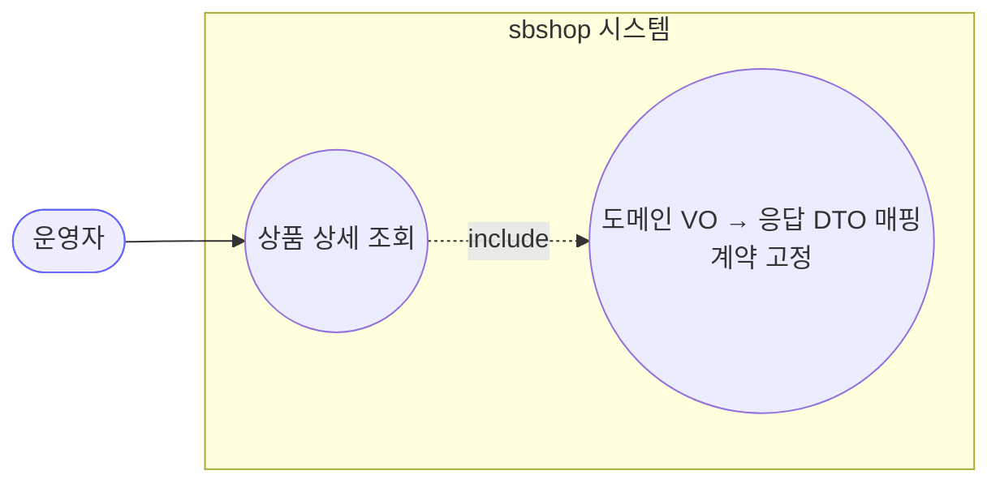
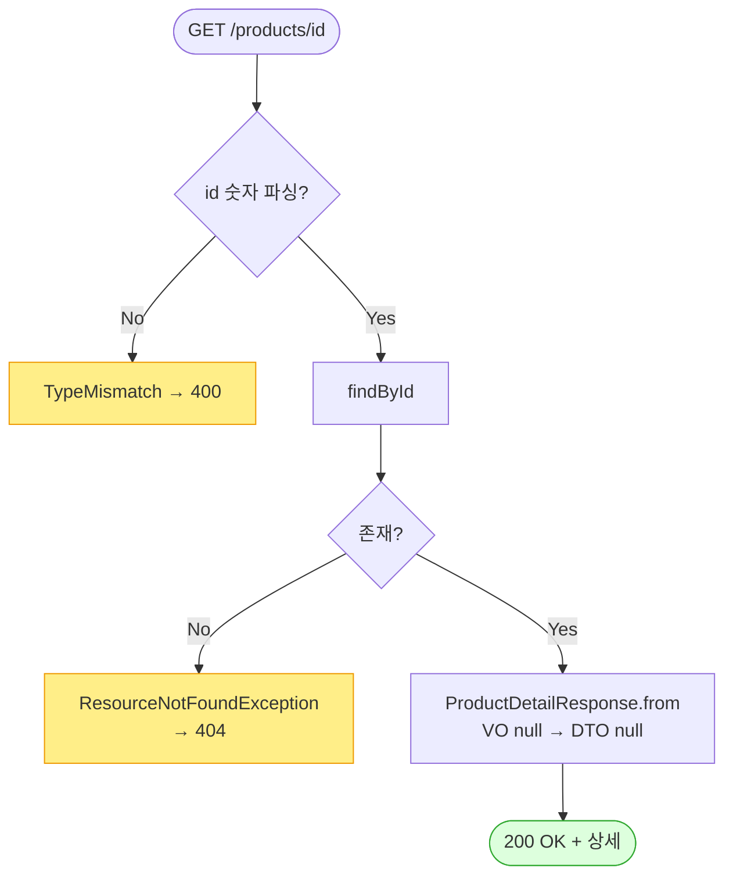

# GET /api/v1/products/{id} — 상품 상세 조회

## 1. 개요

| 항목 | 내용 |
|------|------|
| **Method / URL** | `GET /api/v1/products/{id}` |
| **목적** | 상품 하나를 찾아, 내부에서 쓰는 데이터 모양을 API가 돌려주기로 약속한 응답 형태(`ProductDetailResponse`)로 감싸서 내보낸다. |
| **핵심 상태전이** | 없음(그냥 조회만 함) |
| **부수효과** | 없음(읽기만 함). 활동로그·마켓 호출·저장 되돌림 없음. 상품이 없으면 404. |
| **응답** | `200 OK` + 상품 상세(`ProductDetailResponse`) / 상품 없으면 `404` |

## 2. 호출 체인

아래는 요청이 응답으로 이어지기까지 코드가 지나는 길입니다. 각 단계 옆에 "쉽게 말하면"을 붙였습니다.

```
ProductController.getProduct(id)                       api/.../controller/ProductController.java:99-104
  └─ ProductSearchUseCase.getProductDetail(id)         core/.../product/ProductSearchUseCase.java:32-35
       └─ ProductReader.findById(id)                   core/.../product/component/ProductReader.java:11
       │    └─ ProductReaderImpl.findById → ProductRepository.findById  infra/.../repository/product/ProductReaderImpl.java:20-23
       └─ .orElseThrow(ResourceNotFoundException)      ProductSearchUseCase.java:33-34  (→ 404, GlobalExceptionHandler:28-34)
  └─ ProductDetailResponse.from(product)               api/.../dto/product/ProductDetailResponse.java:112-133
       └─ PriceInfoDto/LogisticsInfoDto/ProductSpecDto/SourcingInfoDto.from(vo)  (VO null → DTO null)  :50-109
```

쉽게 말하면 이렇게 흐릅니다:
- **입구(Controller)** 가 상품 id로 상세 조회를 부탁합니다.
- **findById** 로 상품을 찾습니다. → 쉽게 말하면 "그 번호의 상품이 DB에 있나 확인". 없으면 곧바로 404(찾을 수 없음)로 끝냅니다.
- 상품이 있으면 **from(product)** 이 내부 데이터를 응답 형태로 바꿔 줍니다. → 쉽게 말하면 "가격정보·물류정보·규격·소싱 같은 하위 정보를 하나씩 응답 칸에 담는 것"이며, 원래 값이 비어 있으면 그 칸도 비운 채(null) 안전하게 담습니다.

**경로 변수**

| 변수 | 타입 | 필수 | 비고 |
|------|------|------|------|
| `id` | Long | 필수 | 숫자가 아니면 → 형식 오류로 400(`GlobalExceptionHandler:19-25`) |

## 3. 유스케이스 다이어그램

👉 이 그림은 운영자가 "상품 상세 조회"를 요청하면, 시스템이 그 안에서 "내부 데이터를 약속된 응답 형태로 바꾸기"까지 함께 처리한다는 것을 보여줍니다.



## 4. 시퀀스 다이어그램

👉 이 그림은 상품을 찾아보고, 없으면 404로, 있으면 응답 형태로 바꿔 200으로 돌려주는 시간 순서를 보여줍니다.

```mermaid
sequenceDiagram
    autonumber
    actor U as 운영자
    participant C as ProductController
    participant S as ProductSearchUseCase
    participant R as ProductReader
    participant D as ProductDetailResponse
    Note over C: 조회 전용 — @Transactional 없음, 롤백 경계 없음

    U->>C: GET /products/{id}
    C->>S: getProductDetail(id)
    S->>R: findById(id)
    R-->>S: Optional&lt;Product&gt;
    alt 미존재
        S-->>C: throw ResourceNotFoundException
        C-->>U: 404
    else 존재
        S-->>C: Product
        C->>D: from(product) (VO→중첩 DTO)
        C-->>U: 200 OK + ProductDetailResponse
    end
```

## 5. 순서도 (플로우차트)

👉 이 그림은 "id가 숫자로 읽히나? → 그 상품이 있나?"를 차례로 따져, 아니면 400/404로 빠지고 맞으면 상세를 돌려주는 갈림길을 보여줍니다.



## 6. 상태 전이표

상태가 바뀌는 일이 없습니다(조회이기 때문). 상품을 읽어서 돌려주기만 하고 상태를 바꾸지 않습니다. 갈리는 지점은 "상품이 있느냐 없느냐"(200이냐 404냐)뿐인데, 이건 상태가 바뀌는 게 아니라 그 상품이 존재하는지 여부입니다.

## 7. 🔎 발견사항

발견사항 없음. 단순한 단건 조회라서 "상품 없음(404)"과 "id가 숫자가 아님(400)" 처리가 분명하고, 내부 데이터를 응답 형태로 바꾸는 과정도 값이 비어 있으면 그 칸을 그대로 비워(null) 안전하게 처리합니다.

## 8. 테스트 커버리지 메모

- `ProductNotFoundExceptionTest.java:63-64` — 없는 id로 상세 조회하면 404가 나는지 검증.
- **아직 테스트가 없는 경우:** ① 가격정보·물류정보 등 하위 값이 비어 있는 상품을 응답으로 만들 때의 결과 형태 검증, ② 숫자가 아닌 `{id}` → 400 처리 확인. 조회라서 위험은 낮습니다.

---
*(쉬운 설명판 · 2026-07-17 재작성)*
*생성: 2026-07-17 · 근거: 현재 워킹트리*
