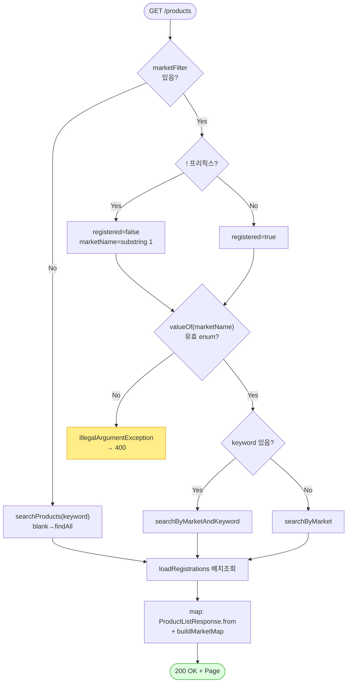

# GET /api/v1/products — 상품 목록 조회

## 1. 개요

| 항목 | 내용 |
|------|------|
| **Method / URL** | `GET /api/v1/products` (검색어 `keyword`, 마켓필터 `marketFilter`, 페이지 정보 `Pageable`) |
| **목적** | 검색어와 "특정 마켓에 등록됐는지" 조건으로 상품을 한 페이지씩 보여주고, 각 상품이 어느 마켓에 어떤 코드로 올라가 있는지 목록을 함께 붙여 돌려준다. |
| **핵심 상태전이** | 없음(그냥 조회만 함) |
| **부수효과** | 없음(읽기만 함). 활동로그도 안 남기고, 마켓에 아무것도 보내지 않으며, 저장을 되돌릴 일(트랜잭션)도 없다. |
| **응답** | `200 OK` + 상품 목록 한 페이지(`Page<ProductListResponse>`) |

## 2. 호출 체인

아래는 요청이 들어와서 응답이 나갈 때까지 코드가 거쳐 가는 길입니다. 각 단계 옆에 "쉽게 말하면"을 붙였습니다.

```
ProductController.getProducts()                            api/.../controller/ProductController.java:72-97
  ├─ marketFilter 파싱(!prefix=미등록, valueOf 대문자)      :82-85
  │    └─ MarketType.valueOf(...)  (잘못된 이름 → IAE→400)  :85
  ├─ 분기 A: marketFilter + keyword                         :87-89
  │    └─ ProductSearchUseCase.searchByMarketAndKeyword()   core/.../product/ProductSearchUseCase.java:27-30
  │         └─ ProductReader.findByMarketRegistrationAndKeyword()  core/.../product/component/ProductReader.java:20-21
  │              └─ ProductReaderImpl → ProductRepository.findRegisteredByMarketAndKeyword() / findUnregisteredByMarketAndKeyword()
  │                                                          infra/.../repository/product/ProductReaderImpl.java:46-53
  ├─ 분기 B: marketFilter 단독                              :89
  │    └─ ProductSearchUseCase.searchByMarket()             ProductSearchUseCase.java:22-24
  │         └─ ProductReader.findByMarketRegistration()     ProductReaderImpl.java:38-44
  ├─ 분기 C: marketFilter 없음                              :91
  │    └─ ProductSearchUseCase.searchProducts()             ProductSearchUseCase.java:18-20
  │         └─ ProductReader.search() (keyword blank → findAll)  ProductReaderImpl.java:30-36
  ├─ loadRegistrations(page.content) — 배치 조회(N+1 제거)   ProductController.java:94 / 366-373
  │    └─ MarketRegistrationRepository.findByProductIdIn(ids) → groupingBy(productId)
  └─ page.map(p -> ProductListResponse.from(p, buildMarketMap(regs)))  :95-96 / 417-432
       └─ MarketRegistration.extractMarketCode() (코드 없으면 productId 폴백)  MarketRegistration.java:141-181
```

쉽게 말하면 이렇게 흐릅니다:
- **입구(Controller)** 가 먼저 `marketFilter` 값을 읽습니다. 앞에 `!` 가 붙어 있으면 "그 마켓에 아직 안 올라간 상품", 안 붙어 있으면 "이미 올라간 상품"을 뜻합니다. → 마켓 이름이 알 수 없는 값이면 여기서 곧바로 400 오류로 막습니다.
- **세 갈래로 나뉩니다.** 마켓필터와 검색어를 둘 다 주면(A), 마켓필터만 주면(B), 아무 필터 없이 검색어만 주거나 그마저 없으면(C) 각각 맞는 조회 방법을 골라 부릅니다. → 쉽게 말하면 "무슨 조건으로 찾을지 상황에 맞게 고르는 것".
- **loadRegistrations** 단계는 조회된 상품들의 마켓 등록 정보를 한 번에 몰아서 가져옵니다. → 쉽게 말하면 상품 하나하나마다 따로 DB에 묻지 않고(그러면 느림) 한 방에 모아 오는 것.
- 마지막으로 각 상품에 "어느 마켓에 어떤 코드로 올라갔는지" 지도(map)를 붙여 응답으로 만듭니다. 이때 마켓 코드가 없으면 대신 자사 상품 id를 임시로 채워 넣습니다.

**쿼리 파라미터**

| 파라미터 | 타입 | 필수 | 비고 |
|------|------|------|------|
| `keyword` | String | 선택 | 비어 있으면 무시(전체 조회 또는 마켓필터만으로 조회) |
| `marketFilter` | String | 선택 | `"COUPANG"`=쿠팡에 등록된 상품, `"!COUPANG"`=쿠팡에 아직 안 올라간 상품 |
| `pageable` | Pageable | 선택 | 한 페이지 기본 50개(`@PageableDefault(size=50)`) |

## 3. 유스케이스 다이어그램

👉 이 그림은 운영자가 "상품 목록 조회"를 요청하면, 시스템이 그 안에서 "각 상품에 마켓 등록코드 지도 붙이기"까지 함께 처리한다는 것을 보여줍니다.


## 4. 시퀀스 다이어그램

👉 이 그림은 요청이 들어온 순간부터, 조건에 따라 조회 방법을 고르고(마켓필터 유무·검색어 유무), 마켓 등록 정보를 한 번에 붙여 응답으로 돌려주기까지의 시간 순서를 보여줍니다.

```mermaid
sequenceDiagram
    autonumber
    actor U as 운영자
    participant C as ProductController
    participant S as ProductSearchUseCase
    participant R as ProductReader
    participant RG as MarketRegistrationRepository
    participant D as ProductListResponse
    Note over C: 조회 전용 — @Transactional 없음, 롤백 경계 없음

    U->>C: GET /products?keyword&marketFilter
    alt marketFilter 지정
        C->>C: valueOf(market) (잘못된 이름 → IAE→400)
        alt keyword 있음
            C->>S: searchByMarketAndKeyword
        else keyword 없음
            C->>S: searchByMarket
        end
    else marketFilter 없음
        C->>S: searchProducts(keyword)
    end
    S->>R: 해당 조회 위임
    R-->>S: Page&lt;Product&gt;
    S-->>C: Page&lt;Product&gt;
    C->>RG: findByProductIdIn(page ids) (배치)
    RG-->>C: List&lt;MarketRegistration&gt;
    C->>D: from(p, buildMarketMap)
    C-->>U: 200 OK + Page&lt;ProductListResponse&gt;
```

## 5. 순서도 (플로우차트)

👉 이 그림은 "마켓필터가 있나? → `!`가 붙었나? → 마켓 이름이 올바른가? → 검색어가 있나?"를 차례로 따져 가며 어떤 조회를 할지 결정하는 갈림길을 보여줍니다. 마켓 이름이 잘못되면 400으로 빠집니다.



## 6. 상태 전이표

상태가 바뀌는 일이 없습니다(조회이기 때문). 어떤 상황에서 불러도 상품 데이터를 그냥 읽어서 돌려주기만 하고, 상품의 상태를 바꾸지 않습니다.

## 7. 🔎 발견사항

### PRODA-1 · 🔵 NOTE — 잘못된 `marketFilter` enum 이름은 `IllegalArgumentException`으로 400 매핑되지만, 조회 경로엔 진입 검증·로그가 없다
- **무엇이 문제인가:** 마켓필터에 알 수 없는 마켓 이름을 넣거나(또는 `marketFilter="!"` 처럼 `!` 만 남아 이름이 빈 문자열이 되면), 코드가 그 값을 마켓 종류로 바꾸려다 오류를 냅니다. 다행히 이 오류는 400(잘못된 요청)으로 깔끔하게 처리되어 서버가 뻗는 500까지 가지는 않습니다.
- **근거:** `ProductController.java:85` `MarketType.valueOf(marketName.toUpperCase())` 는 알 수 없는 마켓명(또는 `marketFilter="!"` → substring 후 빈 문자열)에서 `IllegalArgumentException` 을 던진다. `GlobalExceptionHandler.java:44-50` 이 이를 400으로 매핑하므로 500은 아니다.
- **왜 문제인가:** 기능상은 안전합니다(400으로 잘 막힘). 다만 조회 경로에는 활동로그가 남지 않아서(상품을 바꾸는 3개 경로와 달리), 누가 어떤 이상한 필터 값을 넣었는지 흔적이 안 남습니다. 심각도는 낮습니다.
- **어떻게 고치면 되나:** 필요하면 마켓 이름 해석을 별도 함수로 감싸 "지원하지 않는 마켓 필터입니다" 같은 통일된 메시지를 주도록 합니다. 지금 동작 자체는 정상입니다.

### PRODA-2 · 🔵 NOTE — `buildMarketMap` 은 코드 없는 등록행에 `productId` 를 폴백으로 넣어, 마켓 실제코드와 자사 id가 응답에서 구분되지 않는다
- **무엇이 문제인가:** 상품에 마켓 등록 정보를 붙일 때, 아직 마켓 상품코드가 없는 등록 건에는 마켓코드 자리에 대신 자사 상품 id를 임시로 넣습니다. 그래서 응답만 봐서는 "진짜 마켓 코드"인지 "임시로 채운 자사 id"인지 구분이 안 됩니다.
- **근거:** `ProductController.java:425-428` 에서 `extractMarketCode()` 가 null/empty 이면 `String.valueOf(reg.getProductId())` 를 마켓코드 자리에 넣는다.
- **왜 문제인가:** 화면 목록에서 "마켓에 등록됨(코드=자사 productId)"처럼 보일 수 있어서, 실제로는 아직 마켓 코드가 없는(등록 진행중이거나 실패한) 상태와 헷갈릴 수 있습니다. 목록 표시용 값이라 실제 오작동은 아닙니다.
- **어떻게 고치면 되나:** 임시로 채우는 값을 자사 id 대신 `"미확인"` 같은 명확한 표식(상세 조회의 D-052 폴백과 같은 방식)으로 바꿔 오해를 막습니다. 다만 응답 형태가 바뀌므로 프론트와 합의가 필요합니다.

## 8. 테스트 커버리지 메모

- `ProductControllerR6QueryTest.java:76-118` — 마켓필터+검색어를 함께 준 경우(등록/미등록)와 마켓필터만 준 경우까지 3가지 상황을 검증(지금 코드의 약속을 잘 덮음).
- `ProductControllerMarketMapTest.java` — 마켓 등록 정보를 한 번에 몰아 가져오는 부분(`buildMarketMap`/`loadRegistrations`)과 코드 없을 때 임시값 채우는 부분을 검증.
- **아직 테스트가 없는 경우:** ① 잘못된 마켓필터 이름 → 400으로 처리되는지(PRODA-1)를 실제로 확인, ② `marketFilter="!"` 만 준(마켓 이름이 빈) 경계 상황, ③ 조회 결과가 빈 페이지일 때 마켓 정보 조회를 곧바로 건너뛰는지(:368-369).

---
*(쉬운 설명판 · 2026-07-17 재작성)*
*생성: 2026-07-17 · 근거: 현재 워킹트리*
