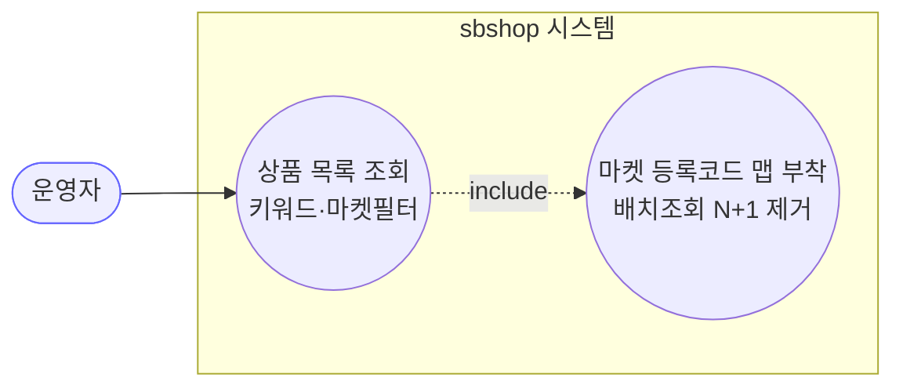
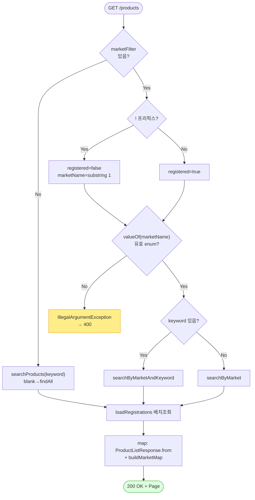

# GET /api/v1/products — 상품 목록 조회

## 1. 개요

| 항목 | 내용 |
|------|------|
| **Method / URL** | `GET /api/v1/products` (쿼리 `keyword`, `marketFilter`, `Pageable`) |
| **목적** | 키워드/마켓 등록여부 필터로 상품을 페이지 조회하고, 각 상품의 마켓 등록코드 맵을 붙여 반환한다. |
| **핵심 상태전이** | 없음(조회 전용) |
| **부수효과** | 없음(읽기만). 활동로그·마켓호출·트랜잭션 경계 없음. |
| **응답** | `200 OK` + `Page<ProductListResponse>` |

## 2. 호출 체인

```
ProductController.getProducts()                            api/.../controller/ProductController.java:72-97
  ├─ marketFilter 파싱(!prefix=미등록, valueOf 대문자)      :82-85
  │    └─ MarketType.valueOf(...)  (잘못된 이름 → IAE→400)  :85
  ├─ 분기 A: marketFilter + keyword                         :87-89
  │    └─ ProductSearchUseCase.searchByMarketAndKeyword()   core/.../product/ProductSearchUseCase.java:27-30
  │         └─ ProductReader.findByMarketRegistrationAndKeyword()  core/.../product/component/ProductReader.java:20-21
  │              └─ ProductReaderImpl → ProductRepository.findRegisteredByMarketAndKeyword() / findUnregisteredByMarketAndKeyword()
  │                                                          infra/.../repository/product/ProductReaderImpl.java:46-53
  ├─ 분기 B: marketFilter 단독                              :89
  │    └─ ProductSearchUseCase.searchByMarket()             ProductSearchUseCase.java:22-24
  │         └─ ProductReader.findByMarketRegistration()     ProductReaderImpl.java:38-44
  ├─ 분기 C: marketFilter 없음                              :91
  │    └─ ProductSearchUseCase.searchProducts()             ProductSearchUseCase.java:18-20
  │         └─ ProductReader.search() (keyword blank → findAll)  ProductReaderImpl.java:30-36
  ├─ loadRegistrations(page.content) — 배치 조회(N+1 제거)   ProductController.java:94 / 366-373
  │    └─ MarketRegistrationRepository.findByProductIdIn(ids) → groupingBy(productId)
  └─ page.map(p -> ProductListResponse.from(p, buildMarketMap(regs)))  :95-96 / 417-432
       └─ MarketRegistration.extractMarketCode() (코드 없으면 productId 폴백)  MarketRegistration.java:141-181
```

**쿼리 파라미터**

| 파라미터 | 타입 | 필수 | 비고 |
|------|------|------|------|
| `keyword` | String | 선택 | null/blank 이면 무시(전체 조회 또는 마켓필터 단독) |
| `marketFilter` | String | 선택 | `"COUPANG"`=등록, `"!COUPANG"`=미등록. `valueOf` 대상 |
| `pageable` | Pageable | 선택 | `@PageableDefault(size=50)` |

## 3. 유스케이스 다이어그램



## 4. 시퀀스 다이어그램

```mermaid
sequenceDiagram
    autonumber
    actor U as 운영자
    participant C as ProductController
    participant S as ProductSearchUseCase
    participant R as ProductReader
    participant RG as MarketRegistrationRepository
    participant D as ProductListResponse
    Note over C: 조회 전용 — @Transactional 없음, 롤백 경계 없음

    U->>C: GET /products?keyword&marketFilter
    alt marketFilter 지정
        C->>C: valueOf(market) (잘못된 이름 → IAE→400)
        alt keyword 있음
            C->>S: searchByMarketAndKeyword
        else keyword 없음
            C->>S: searchByMarket
        end
    else marketFilter 없음
        C->>S: searchProducts(keyword)
    end
    S->>R: 해당 조회 위임
    R-->>S: Page&lt;Product&gt;
    S-->>C: Page&lt;Product&gt;
    C->>RG: findByProductIdIn(page ids) (배치)
    RG-->>C: List&lt;MarketRegistration&gt;
    C->>D: from(p, buildMarketMap)
    C-->>U: 200 OK + Page&lt;ProductListResponse&gt;
```

## 5. 순서도 (플로우차트)



## 6. 상태 전이표

상태 전이 없음(조회). 진입 상태와 무관하게 상품 데이터를 읽어 반환만 하며 도메인 상태를 변경하지 않는다.

## 7. 🔎 발견사항

### PRODA-1 · 🔵 NOTE — 잘못된 `marketFilter` enum 이름은 `IllegalArgumentException`으로 400 매핑되지만, 조회 경로엔 진입 검증·로그가 없다
- **근거:** `ProductController.java:85` `MarketType.valueOf(marketName.toUpperCase())` 는 알 수 없는 마켓명(또는 `marketFilter="!"` → substring 후 빈 문자열)에서 `IllegalArgumentException` 을 던진다. `GlobalExceptionHandler.java:44-50` 이 이를 400으로 매핑하므로 500은 아니다.
- **영향:** 기능상 안전(400 반환). 다만 조회 경로에는 활동로그가 없어(쓰기 3경로와 대조) 어떤 잘못된 필터가 유입됐는지 관측 흔적이 없다. 심각도 낮음.
- **제안:** 필요 시 `valueOf` 를 명시적 파싱 헬퍼로 감싸 "지원하지 않는 마켓 필터" 메시지를 통일. 현재 동작은 정상.

### PRODA-2 · 🔵 NOTE — `buildMarketMap` 은 코드 없는 등록행에 `productId` 를 폴백으로 넣어, 마켓 실제코드와 자사 id가 응답에서 구분되지 않는다
- **근거:** `ProductController.java:425-428` 에서 `extractMarketCode()` 가 null/empty 이면 `String.valueOf(reg.getProductId())` 를 마켓코드 자리에 넣는다.
- **영향:** 프론트 목록에서 "마켓 등록됨(코드=자사 productId)" 처럼 보일 수 있어, 실제 마켓 상품코드가 아직 없는(등록 진행중/실패) 상태와 구분이 모호. 목록 표시용이라 오작동은 아님.
- **제안:** 폴백을 명시 표식(예: `"미확인"`, 상세 응답의 D-052 폴백과 통일)으로 바꿔 자사 id 오인 방지. 계약 변경이므로 프론트 합의 필요.

## 8. 테스트 커버리지 메모

- `ProductControllerR6QueryTest.java:76-118` — marketFilter+keyword AND 결합(등록/미등록), marketFilter 단독 3케이스 검증(현재 코드 계약 커버).
- `ProductControllerMarketMapTest.java` — `buildMarketMap`/`loadRegistrations` 배치조회·코드 폴백 관련 검증 존재.
- **비어있는 케이스:** ① 잘못된 `marketFilter` enum → 400 매핑(PRODA-1) 통합검증, ② `marketFilter="!"` 단독(빈 marketName) 경계, ③ 빈 페이지에서 `loadRegistrations` early-return(:368-369).

---
*생성: 2026-07-17 · 근거: 현재 워킹트리*
