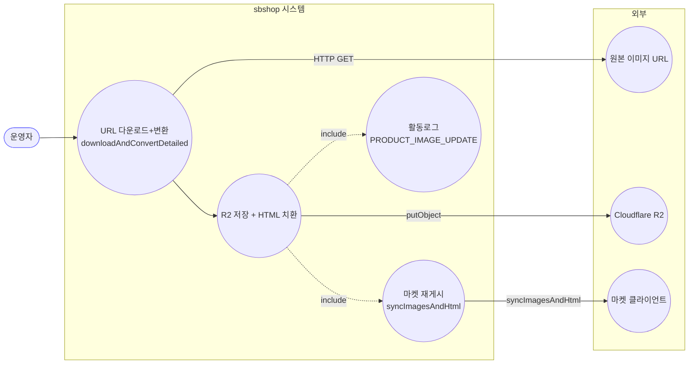
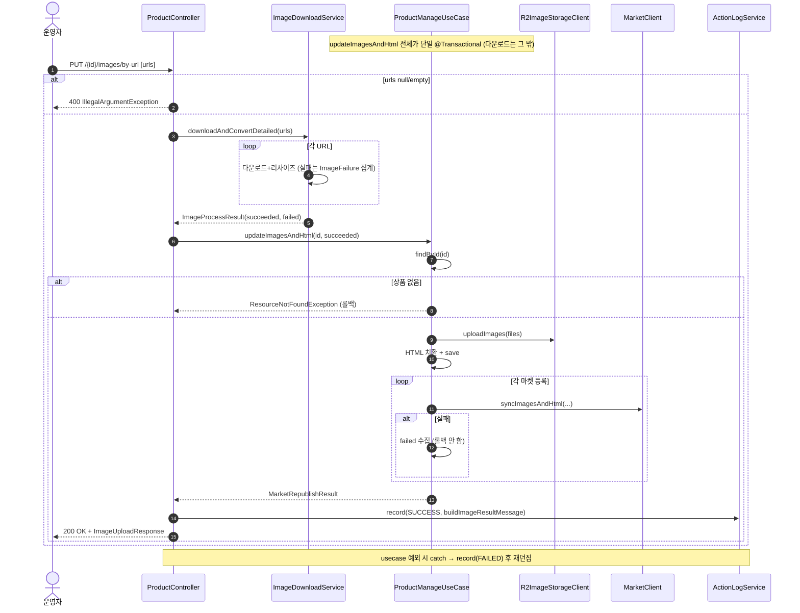

# PUT /{id}/images/by-url — URL 이미지 다운로드 업로드 + HTML/마켓 재게시

## 1. 개요

| 항목 | 내용 |
|------|------|
| **Method / URL** | `PUT /api/v1/products/{id}/images/by-url` (바디 `List<String>` imageUrls) |
| **목적** | 이미지 URL 목록을 다운로드·변환(리사이즈)해 R2 저장하고, HTML 치환 후 연동 마켓에 이미지/HTML을 재게시한다. |
| **핵심 상태전이** | 상태 전이 없음(이미지/HTML 필드 갱신 + 마켓 반영) |
| **부수효과** | URL 다운로드→변환(개별 실패 집계)→R2→HTML 치환→마켓별 `syncImagesAndHtml`. 활동로그(`PRODUCT_IMAGE_UPDATE`). |
| **응답** | `200 OK` + `ImageUploadResponse`(마켓 synced/skipped/failed + 이미지 succeeded/failed) |

## 2. 호출 체인

```
ProductController.uploadImagesByUrl()                            api/.../controller/ProductController.java:145-159
  ├─ 빈/누락 URL 가드 → IllegalArgumentException(400)            ProductController.java:152-154
  ├─ imageDownloadClient.downloadAndConvertDetailed(imageUrls)   ProductController.java:156
  │    └─ infra/.../cloudflare/ImageDownloadService.java:43-77
  │         └─ for each url:                                     :47-74
  │              ├─ downloadImage(url) → Thumbnails 1000x1000 jpg :50-67
  │              ├─ 성공 → ImageUploadFile("crawled-image-i.jpg") :63-67
  │              └─ 실패 → log.error + ImageFailure(url, 사유)     :70-73
  │         └─ ImageProcessResult.of(results, failures)          :76
  └─ uploadPreparedImages(id, downloaded, PRODUCT_IMAGE_UPDATE, ...) ProductController.java:157-158 → 233-248
       ├─ ProductManageUseCase.updateImagesAndHtml(id, uploadFiles)  core/.../product/ProductManageUseCase.java:83-105  @Transactional
       │    ├─ findById → R2 uploadImages → replaceImagesBySku → save  :85-99
       │    └─ republishToMarkets(id, hostedImages, newHtml)     :104 → :115-155
       ├─ ActionLogService.record(PRODUCT_IMAGE_UPDATE, SUCCESS)  ProductController.java:240-241
       └─ (예외) record(FAILED, "이미지 수정 실패") 후 재던짐       ProductController.java:243-247
```

**요청 바디** — `List<String>` (JSON 배열). null 또는 빈 목록이면 400.

## 3. 유스케이스 다이어그램



## 4. 시퀀스 다이어그램



## 5. 순서도 (플로우차트)


## 6. 상태 전이표

상태 전이 없음(상품 이미지/HTML 필드 및 마켓 등록정보 갱신). 결과 분류:

| 조건 | 결과 | 부수효과 |
|------|------|----------|
| urls null/empty | 400 | DB/R2 미변경 |
| 일부 URL 다운로드 실패 | 성공분만 진행 | `imagesFailed`에 실패 URL·사유 집계 |
| 전체 URL 다운로드 실패(성공 0장) | 진행(빈 업로드) | PRODB-4와 동일 우려(빈 목록 진입) |
| R2 업로드 실패 | 500 | 전체 롤백 |
| 마켓 클라이언트 없음 | skipped | — |
| 마켓 전송 실패 | failed(수집) | 나머지 유지 |
| 상품 미존재 | 404 | R2 미호출 |

## 7. 🔎 발견사항

### PRODB-7 · 🟠 GAP — 진입부는 빈 URL 목록을 거부하나, 전량 다운로드 실패(성공 0장)는 빈 업로드로 진행됨
- **근거:** `ProductController.java:152-154`는 `imageUrls` null/empty만 400으로 거부한다. `downloadAndConvertDetailed`(`ImageDownloadService.java:43-77`)가 모든 URL 다운로드에 실패하면 `succeeded=[]`인 결과를 반환하고, `uploadPreparedImages`→`updateImagesAndHtml`(`ProductManageUseCase.java:88`)이 빈 리스트로 R2/HTML 치환을 진행한다. `downloadAndConvert`(비-detailed, :30-36)는 전량 실패 시 예외를 던지지만, 이 경로가 쓰는 `downloadAndConvertDetailed`에는 그 가드가 없다.
- **영향:** 유효 URL을 N개 넣었으나 모두 다운로드 실패(404/타임아웃 등)한 경우에도 200 OK가 반환되고, HTML 이미지가 빈 목록으로 치환되어 detailHtml SKU 이미지가 유실될 수 있다. PRODB-4(multipart)와 동일한 근원(빈 업로드 진입).
- **제안:** 공통 헬퍼 `uploadPreparedImages`(ProductController.java:233) 또는 `updateImagesAndHtml` 진입부에 "succeeded 비어있고 failed 존재 → 422 거부" 가드 추가.

### PRODB-8 · 🟡 SMELL — 다운로드된 파일명이 순번 기반(`crawled-image-i.jpg`)으로 고정되어 URL별 추적성이 낮음
- **근거:** `ImageDownloadService.java:61` `String filename = "crawled-image-" + (i + 1) + ".jpg"`. 원본 URL과 무관하게 순번으로 파일명을 생성한다. by-url 경로와 크롤 경로가 같은 메서드를 공유한다.
- **영향:** R2 저장 파일명·응답의 이미지 식별에서 어떤 원본 URL에서 온 파일인지 파악이 어렵다(실패 항목만 `ImageFailure.ref=url`로 원본 유지). 기능 결함은 아니나 진단성 저하.
- **제안:** by-url 경로에 한해 원본 URL 기반 파일명 파생 검토(download() 메서드의 `extractFilenameFromUrl` 활용 가능).

### PRODB-9 · 🟡 SMELL — 마켓 부분 실패가 있어도 활동로그 status는 항상 SUCCESS
- **근거:** `uploadPreparedImages`(`ProductController.java:240-241`) — `updateImagesAndHtml`이 정상 반환하면 마켓 failed 유무와 무관하게 SUCCESS. PRODB-6과 동일 패턴이나 by-url 엔드포인트에도 동일하게 적용됨.
- **영향:** 마켓 재게시 전부 실패해도 로그 status SUCCESS.
- **제안:** 3경로 공통 헬퍼에서 `result.failed()` 기준 status 분기.

## 8. 테스트 커버리지 메모

- `ProductControllerInputValidationTest`(api) — null/빈 URL 목록 400 거부, 유효 목록 정상 경로 검증(:89-108).
- `ProductControllerImagePartialFailureTest`(api) — by-url 3장 중 1장 다운로드 실패 표면화·전량 성공 시 빈 failed 검증(:70-91).
- `ProductControllerImageUploadTest`(api) — by-url 마켓 부분 실패가 응답 failed에 실림 검증(:63-64).
- `ProductControllerActionLogDetailTest`(api) — by-url 활동로그 마켓별 상세 검증(:127-128).
- **비어있는 케이스:** ① 전량 다운로드 실패(성공 0장) 시 동작(PRODB-7), ② 마켓 전부 실패 시 로그 status(PRODB-9).

---
*생성: 2026-07-17 · 근거: 현재 워킹트리*
