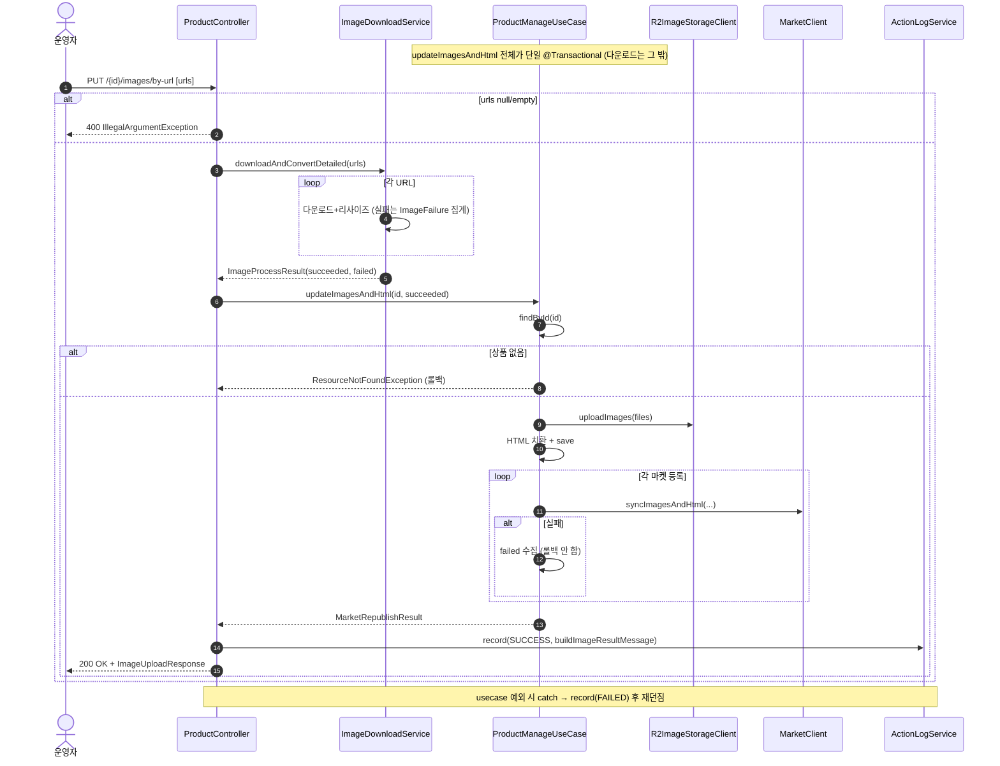
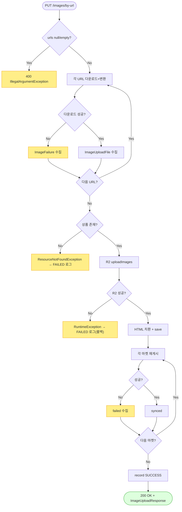

# PUT /{id}/images/by-url — URL 이미지 다운로드 업로드 + HTML/마켓 재게시

> 운영자가 이미지 파일을 직접 올리는 대신 "이미지 주소(URL) 목록"을 넣으면, 시스템이 그 주소에서 이미지를 내려받아 크기를 조정하고 저장소(R2)에 올린 뒤, 상세설명(HTML)의 이미지를 바꿔 끼우고 각 마켓에 다시 게시하는 기능입니다. (앞의 파일 업로드 경로와 목적은 같고, 이미지를 "URL로 받아온다"는 점만 다릅니다.)

## 1. 개요

| 항목 | 내용 |
|------|------|
| **Method / URL** | `PUT /api/v1/products/{id}/images/by-url` (바디 `List<String>` — 이미지 주소 목록) |
| **목적** | 이미지 주소 목록을 내려받아 크기 조정 후 R2에 저장하고, HTML 이미지를 교체한 뒤 연동 마켓에 이미지/HTML을 다시 게시한다. |
| **핵심 상태전이** | 없음(이미지·상세설명 필드 갱신 + 마켓 반영) |
| **부수효과** | URL 다운로드→크기조정(개별 실패는 모아둠)→R2→HTML 교체→마켓마다 `syncImagesAndHtml`. 활동로그(`PRODUCT_IMAGE_UPDATE`) 남김. |
| **응답** | `200 OK` + `ImageUploadResponse`(마켓별 반영됨/건너뜀/실패 + 이미지별 성공/실패) |

## 2. 호출 체인

아래는 요청 후 코드가 불려 가는 순서입니다.

```
ProductController.uploadImagesByUrl()                            api/.../controller/ProductController.java:145-159
  ├─ 빈/누락 URL 가드 → IllegalArgumentException(400)            ProductController.java:152-154
  │                                                             → 주소 목록이 비었거나 없으면 여기서 바로 거절
  ├─ imageDownloadClient.downloadAndConvertDetailed(imageUrls)   ProductController.java:156
  │    │                                                        → 쉽게 말하면: 주소마다 이미지를 내려받아 크기 조정
  │    └─ infra/.../cloudflare/ImageDownloadService.java:43-77
  │         └─ for each url:                                     :47-74  → 주소마다:
  │              ├─ downloadImage(url) → Thumbnails 1000x1000 jpg :50-67  → 내려받아 1000x1000 jpg로 조정
  │              ├─ 성공 → ImageUploadFile("crawled-image-i.jpg") :63-67  → 성공하면 순번 이름으로 담고
  │              └─ 실패 → log.error + ImageFailure(url, 사유)     :70-73  → 실패하면 주소·사유를 실패 목록에 담음
  │         └─ ImageProcessResult.of(results, failures)          :76  → 성공/실패로 나눈 결과
  └─ uploadPreparedImages(id, downloaded, PRODUCT_IMAGE_UPDATE, ...) ProductController.java:157-158 → 233-248
       │                                                        → 준비된 이미지로 저장·마켓반영·로그를 처리하는 공통 헬퍼(3경로 공용)
       ├─ ProductManageUseCase.updateImagesAndHtml(id, uploadFiles)  core/.../product/ProductManageUseCase.java:83-105  @Transactional
       │    ├─ findById → R2 uploadImages → replaceImagesBySku → save  :85-99  → 상품 조회→R2 저장→HTML 교체→저장
       │    └─ republishToMarkets(id, hostedImages, newHtml)     :104 → :115-155  → 각 마켓에 다시 게시
       ├─ ActionLogService.record(PRODUCT_IMAGE_UPDATE, SUCCESS)  ProductController.java:240-241  → 활동로그 남김
       └─ (예외) record(FAILED, "이미지 수정 실패") 후 재던짐       ProductController.java:243-247  → 도중 오류면 실패 기록 후 오류 전달
```

**요청 바디** — `List<String>` (JSON 배열, 주소 목록). 비었거나(null) 목록이 텅 비면 400으로 거절.

## 3. 유스케이스 다이어그램

👉 이 그림은 URL에서 이미지 내려받기 → 저장소 저장·HTML 교체 → 마켓 재게시 → 로그 기록으로 이어지는 흐름과, 원본 이미지 주소·R2·마켓이라는 외부와 어디서 연결되는지를 보여줍니다.


## 4. 시퀀스 다이어그램

👉 이 그림은 각 코드가 시간 순서로 주고받는 대화입니다. 위 메모처럼 "이미지 다운로드는 저장 묶음 밖에서, 저장·교체·마켓 재게시는 하나의 묶음(트랜잭션) 안에서" 일어난다는 점을 눈여겨보세요.



## 5. 순서도 (플로우차트)

👉 이 그림은 "주소 목록이 비었나? → 주소마다 내려받기 성공? → 상품 있음? → R2 저장 성공? → 마켓마다 성공/실패"의 갈림길을 따라 결과가 어떻게 갈리는지 보여줍니다.



## 6. 상태 전이표

이 기능은 상품 상태를 바꾸지 않습니다(이미지·상세설명 필드와 마켓 등록정보만 갱신). 아래는 상황별 결과와 부수효과입니다.

| 조건 | 결과 | 부수효과 |
|------|------|----------|
| 주소 목록이 비었거나 없음 | 400 | DB·R2 아무것도 안 바꿈 |
| 일부 주소만 다운로드 실패 | 성공한 것만 진행 | `imagesFailed`에 실패한 주소·사유를 모아둠 |
| 모든 주소 다운로드 실패(성공 0장) | 그냥 진행(빈 업로드) | PRODB-4와 같은 우려(빈 목록으로 진입) |
| R2 업로드 실패 | 500 | 전체 되돌림(롤백) |
| 연동 방법 없는 마켓 | 건너뜀(skipped) | — |
| 마켓 전송 실패 | 실패(모아둠) | 나머지 유지 |
| 상품 없음 | 404 | R2 호출 안 함 |

## 7. 🔎 발견사항

### PRODB-7 · 🟠 GAP — 입구에서 "빈 주소 목록"은 막지만, 모든 주소가 다운로드 실패하면(성공 0장) 그냥 빈 업로드로 진행됨
- **무엇이 문제인가:** 입구 검사는 "주소 목록 자체가 비었을 때"만 막습니다. 주소는 여러 개 들어왔는데 전부 다운로드에 실패한 경우는 "성공 목록이 텅 빈" 상태로 통과해, 그대로 저장·HTML 교체까지 진행합니다. 참고로 비슷한 다운로드 함수(비-detailed 버전)는 전부 실패하면 오류를 내는데, 이 경로가 쓰는 detailed 버전에는 그 방어가 없습니다.
- **근거:** `ProductController.java:152-154`는 `imageUrls` null/empty만 400으로 거부한다. `downloadAndConvertDetailed`(`ImageDownloadService.java:43-77`)가 모든 URL 다운로드에 실패하면 `succeeded=[]`인 결과를 반환하고, `uploadPreparedImages`→`updateImagesAndHtml`(`ProductManageUseCase.java:88`)이 빈 리스트로 R2/HTML 치환을 진행한다. `downloadAndConvert`(비-detailed, :30-36)는 전량 실패 시 예외를 던지지만, 이 경로가 쓰는 `downloadAndConvertDetailed`에는 그 가드가 없다.
- **왜 문제인가:** 유효한 주소를 여러 개 넣었는데 전부 다운로드에 실패(404·시간초과 등)해도 응답은 "200 성공"으로 나가고, HTML 이미지가 빈 목록으로 교체되어 상세설명의 SKU 이미지가 사라질 수 있습니다. 파일 업로드 경로의 PRODB-4와 뿌리가 같은 문제(빈 업로드 진입)입니다.
- **어떻게 고치면 되나:** 3경로 공통 헬퍼 `uploadPreparedImages`(ProductController.java:233)나 `updateImagesAndHtml` 입구에서 "성공 0장인데 실패는 있음 → 422로 거절" 가드를 추가합니다.

### PRODB-8 · 🟡 SMELL — 내려받은 파일 이름이 순번(`crawled-image-i.jpg`)으로만 붙어, 어떤 원본 주소에서 왔는지 추적이 어려움
- **무엇이 문제인가:** 다운로드한 파일 이름을 원본 주소와 무관하게 그냥 순번(`crawled-image-1.jpg`, `-2.jpg`…)으로 붙입니다. by-url 경로와 크롤 경로가 같은 함수를 공유해 이렇게 됩니다.
- **근거:** `ImageDownloadService.java:61` `String filename = "crawled-image-" + (i + 1) + ".jpg"`. 원본 URL과 무관하게 순번으로 파일명을 생성한다. by-url 경로와 크롤 경로가 같은 메서드를 공유한다.
- **왜 문제인가:** R2에 저장된 파일 이름이나 응답만 봐서는 그 파일이 어느 원본 주소에서 온 것인지 알기 어렵습니다(실패한 항목만 원본 주소가 남습니다). 기능이 잘못되는 건 아니지만 문제를 추적할 때 불편합니다.
- **어떻게 고치면 되나:** by-url 경로에 한해 원본 주소를 바탕으로 파일 이름을 만드는 방안을 검토합니다(다른 다운로드 메서드의 `extractFilenameFromUrl`을 활용할 수 있음).

### PRODB-9 · 🟡 SMELL — 마켓 일부 실패가 있어도 활동로그 상태는 항상 "성공(SUCCESS)"
- **무엇이 문제인가:** 저장 단계가 오류 없이 반환되기만 하면, 마켓 실패가 있든 없든 활동로그 상태를 "성공"으로 남깁니다. PRODB-6과 같은 패턴이며 이 by-url 엔드포인트에도 똑같이 나타납니다.
- **근거:** `uploadPreparedImages`(`ProductController.java:240-241`) — `updateImagesAndHtml`이 정상 반환하면 마켓 failed 유무와 무관하게 SUCCESS. PRODB-6과 동일 패턴이나 by-url 엔드포인트에도 동일하게 적용됨.
- **왜 문제인가:** 마켓 재게시가 전부 실패해도 로그 상태는 "성공"이라 상태값 기준 모니터링에서 부분 실패가 드러나지 않습니다.
- **어떻게 고치면 되나:** 3경로 공통 헬퍼에서 실패한 마켓 유무를 기준으로 상태를 나누도록 통일합니다.

## 8. 테스트 커버리지 메모

- `ProductControllerInputValidationTest`(api) — 비었거나 없는 주소 목록은 400으로 거절하고, 유효한 목록은 정상 진행하는지 검증(:89-108).
- `ProductControllerImagePartialFailureTest`(api) — 3장 중 1장 다운로드 실패가 드러나는지, 전부 성공하면 실패 목록이 비는지 검증(:70-91).
- `ProductControllerImageUploadTest`(api) — 마켓 부분 실패가 응답의 failed에 실리는지 검증(:63-64).
- `ProductControllerActionLogDetailTest`(api) — by-url 활동로그의 마켓별 상세를 검증(:127-128).
- **비어있는 케이스:** ① 전부 다운로드 실패(성공 0장) 시 동작(PRODB-7), ② 마켓 전부 실패 시 로그 상태(PRODB-9).

---
*(쉬운 설명판 · 2026-07-17 재작성)*
*생성: 2026-07-17 · 근거: 현재 워킹트리*
