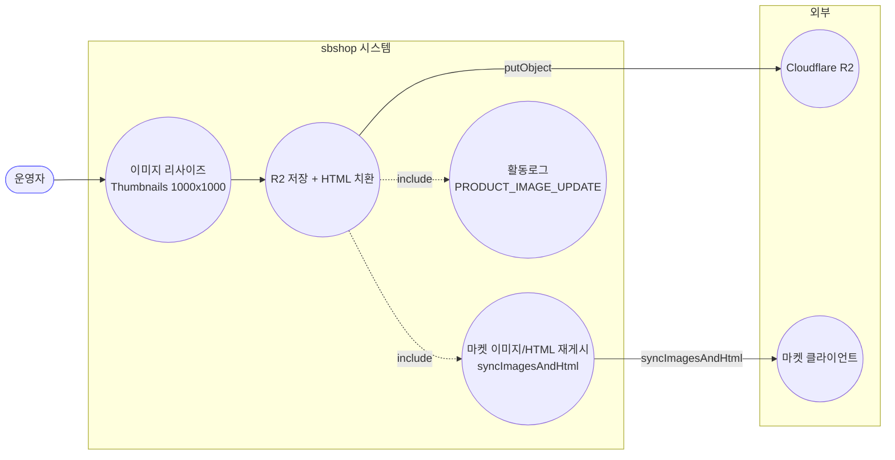
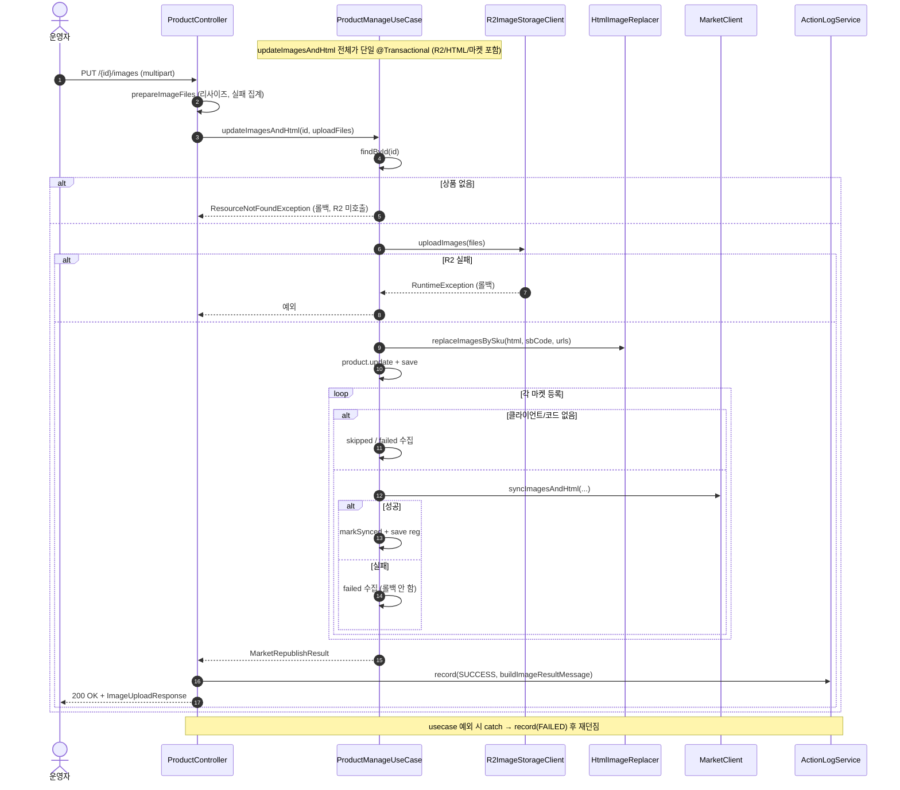

# PUT /{id}/images — 이미지 업로드(multipart) + HTML/마켓 재게시

> 운영자가 상품 이미지 파일을 직접 올리면, 크기를 표준(1000x1000)으로 줄여 저장소(R2)에 올리고, 상품 상세설명(HTML) 안의 이미지를 새 이미지로 바꿔 끼운 뒤, 연결된 각 마켓에 이미지와 상세설명을 다시 게시하는 기능입니다.

## 1. 개요

아래 표는 이 기능이 무엇을 하는지 한눈에 정리한 것입니다.

| 항목 | 내용 |
|------|------|
| **Method / URL** | `PUT /api/v1/products/{id}/images` (여러 이미지 파일 `images`를 파일 첨부 형태로 보냄) |
| **목적** | 올린 이미지 파일을 크기 조정→저장소(R2)에 저장하고, 상품 상세설명 HTML의 SKU 이미지 자리를 새 이미지로 바꾼 뒤, 연동 마켓에 이미지/HTML을 다시 게시한다. |
| **핵심 상태전이** | 없음(상품의 이미지·상세설명 필드를 갱신하고 마켓에 반영만 함) |
| **부수효과** | 이미지 크기 조정 → R2 업로드 → HTML 이미지 교체 → 마켓마다 `syncImagesAndHtml`. 크기조정·마켓 반영은 일부 실패해도 나머지는 진행하고 실패만 모아둠. 활동로그(`PRODUCT_IMAGE_UPDATE`) 남김. |
| **응답** | `200 OK` + `ImageUploadResponse`(마켓별 반영됨/건너뜀/실패 + 이미지별 성공/실패) |

## 2. 호출 체인

아래는 요청이 들어온 순간부터 어떤 코드가 순서대로 불려 가는지입니다. `파일.java:줄번호`는 실제 코드 위치입니다.

```
ProductController.uploadImages()                                 api/.../controller/ProductController.java:132-143
  ├─ prepareImageFiles(images)                                   ProductController.java:438-465
  │    │                                                         → 쉽게 말하면: 올라온 파일들을 하나씩 크기 조정하며 준비
  │    └─ for each MultipartFile:                                :441-463  → 파일마다:
  │         ├─ Thumbnails 1000x1000 jpg q0.8 리사이즈             :445-450  → 1000x1000 jpg로 크기 조정
  │         ├─ 성공 → ImageUploadFile 수집                        :452-456  → 성공한 파일은 "성공 목록"에 담고
  │         └─ 실패 → log.error + ImageFailure 수집               :457-462  → 실패한 파일은 "실패 목록"에 담음
  │    └─ ImageProcessResult.of(succeeded, failures)             :464 / dto/ImageProcessResult.java:20-22  → 성공/실패로 나눈 결과
  └─ uploadPreparedImages(id, prepared, PRODUCT_IMAGE_UPDATE, ...) ProductController.java:141-142 → 233-248
       │                                                         → 준비된 이미지로 저장·마켓반영·로그를 처리하는 공통 헬퍼(3개 경로가 함께 씀)
       ├─ ProductManageUseCase.updateImagesAndHtml(id, uploadFiles)  core/.../product/ProductManageUseCase.java:83-105  @Transactional
       │    │                                                    → 여기서부터 하나의 저장 묶음(트랜잭션)으로 처리
       │    ├─ productReader.findById() → 없으면 ResourceNotFoundException  :85-86  → 상품 없으면 404
       │    ├─ imageStorageClient.uploadImages(files)            :88 → infra/.../R2ImageStorageClient.java:29-59  → R2 저장소에 올림
       │    ├─ htmlImageReplacer.replaceImagesBySku(...)         :91-92  → 상세설명 HTML 안 이미지 자리를 새 URL로 교체
       │    ├─ product.update(hostedImages, detailHtml) + save   :94-99  → 바뀐 상품을 저장
       │    └─ republishToMarkets(id, hostedImages, newHtml)     :104 → :115-155  → 각 마켓에 다시 게시
       │         └─ for each 등록:                                :121-150  → 등록된 마켓마다:
       │              ├─ router.hasClient=false → skipped         :123-127  → 연동 방법 없으면 "건너뜀"
       │              ├─ extractMarketCode 없으면 throw→failed     :129-132/145-149  → 마켓 상품코드 없으면 "실패"
       │              └─ client.syncImagesAndHtml(...) 성공→synced :135-144  → 성공하면 "반영됨"
       ├─ ActionLogService.record(PRODUCT_IMAGE_UPDATE, SUCCESS)  ProductController.java:240-241  → 활동로그 남김
       │    └─ buildImageResultMessage(...)                      ProductController.java:471-479  → 로그 메시지 조립
       └─ (예외) record(FAILED, "이미지 수정 실패") 후 재던짐       ProductController.java:243-247  → 도중 오류면 실패로 기록 후 오류 전달
```

## 3. 유스케이스 다이어그램

👉 이 그림은 이미지 크기 조정 → 저장소 저장·HTML 교체 → 마켓 재게시 → 로그 기록이 어떻게 이어지고, 외부(R2 저장소·마켓)와 어디서 연결되는지를 보여줍니다.



## 4. 시퀀스 다이어그램

👉 이 그림은 요청 후 각 코드가 시간 순서로 주고받는 대화를 보여줍니다. 위 메모처럼 "저장소 업로드·HTML 교체·마켓 재게시까지 하나의 저장 묶음(트랜잭션) 안에서" 일어난다는 점을 눈여겨보세요.



## 5. 순서도 (플로우차트)

👉 이 그림은 "파일 크기조정 성공? → 상품 있음? → R2 저장 성공? → 마켓마다 성공/실패"처럼 갈림길을 따라 어떤 결과로 이어지는지를 보여줍니다.


## 6. 상태 전이표

이 기능은 상품 상태를 바꾸지 않습니다(이미지·상세설명 필드와 마켓 등록정보만 갱신). 아래 표는 상황별로 어떤 결과와 부수효과가 생기는지 정리한 것입니다.

| 조건 | 결과 | 부수효과 |
|------|------|----------|
| 크기조정 성공 파일이 0장이고 실패만 있음 | 그냥 진행(빈 업로드) | R2에 빈 목록을 올려 빈 결과, HTML 교체는 사실상 없음 |
| R2 업로드 실패 | 500(오류) | 전체 되돌림(롤백), 마켓엔 안 보냄 |
| 연동 방법 없는 마켓(G마켓/옥션) | 건너뜀(skipped) | — |
| 마켓 상품코드 없음/전송 실패 | 실패(모아둠) | 나머지 마켓·우리 DB는 유지 |
| 상품 없음 | 404 | R2 호출 안 함 |

## 7. 🔎 발견사항

### PRODB-4 · 🟠 GAP — 올린 이미지가 전부 크기조정에 실패해도(성공 0장) 오류 없이 "빈 업로드"로 그냥 진행됨
- **무엇이 문제인가:** 이미지 준비 단계에서 파일이 전부 실패하면 "성공 목록이 텅 빈" 결과가 나오는데, 그 텅 빈 목록을 그대로 다음 단계로 넘겨 저장·HTML 교체까지 진행합니다. URL로 이미지를 넣는 경로(by-url)는 빈 목록이면 400으로 막는데, 이 파일 업로드 경로는 그렇지 않아 서로 다릅니다.
- **근거:** `prepareImageFiles`(`ProductController.java:438-465`)는 전부 실패하면 `succeeded=[]`인 `ImageProcessResult`를 반환하고, `uploadPreparedImages`(:233-248)는 빈 `uploadFiles`로 `updateImagesAndHtml`을 그대로 호출한다. `updateImagesAndHtml`(`ProductManageUseCase.java:88`)은 빈 리스트로 `imageStorageClient.uploadImages([])` → 빈 `hostedImages` → `replaceImagesBySku(html, sbCode, [])`로 진행하며, URL-경로(`by-url`, ProductController.java:152-154)가 빈 목록을 400으로 거부하는 것과 비대칭.
- **왜 문제인가:** 사용자가 이미지 여러 장을 올렸는데 전부 크기조정에 실패한 경우에도 응답은 "200 성공"으로 나가고, HTML의 이미지 자리가 빈 목록으로 교체되어 상세설명의 SKU 이미지가 사라질 수 있습니다. 실패는 응답의 `imagesFailed`에만 표시되고 상태코드는 성공이라, 문제를 놓치기 쉽습니다.
- **어떻게 고치면 되나:** "성공 0장 + 실패 있음"이면 400/422로 거절하거나, 성공 이미지가 없을 때는 HTML 교체를 건너뛰는 가드를 넣습니다. by-url 경로의 "빈 목록 거절"과 방식을 맞춥니다.

### PRODB-5 · 🔵 NOTE — R2 업로드·HTML 교체·마켓 재게시가 모두 하나의 저장 묶음(`@Transactional`) 안에서 실행됨
- **무엇이 문제인가:** 저장소 업로드부터 상세설명 교체, 마켓 재게시까지 전부가 하나의 저장 묶음(트랜잭션) 안에서 일어납니다. 즉 외부(R2·마켓)와 통신하는 동안 DB 저장 묶음이 계속 열려 있습니다.
- **근거:** `ProductManageUseCase.java:83` `@Transactional`이 `imageStorageClient.uploadImages`(:88, R2 PUT), `syncImagesAndHtml`(:136, 마켓 HTTP)를 포함한 전 구간을 감싼다.
- **왜 문제인가:** 외부 통신이 오가는 동안 DB 연결을 오래 붙잡습니다. R2 업로드가 실패하면 DB는 전부 되돌아가 정합은 유지되지만, 이미 R2에 올라간 파일은 되돌려지지 않아(외부 저장소라서) 쓸모없는 고아 파일이 남을 수 있습니다.
- **어떻게 고치면 되나:** R2 저장·DB 확정과 마켓 재게시의 묶음을 분리하는 방안을 검토합니다. 최소한 R2에 일부만 올라간 뒤 되돌릴 때 고아 파일을 정리하는 정책을 문서로 남깁니다.

### PRODB-6 · 🟡 SMELL — 마켓 일부 실패가 있어도 활동로그 상태는 항상 "성공(SUCCESS)"
- **무엇이 문제인가:** 오류 없이 반환되기만 하면(마켓 실패는 결과에 모아두는 방식이라 오류로 안 잡힘) 활동로그 상태를 무조건 "성공"으로 남깁니다. 실패는 메시지 본문에만 덧붙습니다. 가격/재고 경로의 PRODB-2와 같은 패턴입니다.
- **근거:** `uploadPreparedImages`(`ProductController.java:240-241`)는 `updateImagesAndHtml`이 예외 없이 반환하면(마켓 실패는 result에 수집됨) 무조건 `ActionStatus.SUCCESS`로 기록한다. `buildImageResultMessage`(:471-479)는 실패를 메시지 본문에만 덧붙인다. PRODB-2(가격재고)와 동일 패턴.
- **왜 문제인가:** 마켓 재게시가 전부 실패해도 로그 상태는 "성공"이라, 상태값 기준 모니터링에서 부분 실패가 드러나지 않습니다.
- **어떻게 고치면 되나:** 실패한 마켓이 있으면 상태를 나누는 정책을 3개 이미지 경로가 함께 쓰는 공통 헬퍼 `uploadPreparedImages`에서 통일합니다.

## 8. 테스트 커버리지 메모

아래는 이 기능을 검증하는 테스트와, 아직 없는(비어있는) 부분입니다.

- `ProductManageUseCaseRepublishTest`(core) — 마켓마다 재게시가 불리는지, 연동 방법 없는 마켓은 건너뛰는지, 부분 실패를 모으는지 검증(:90-123).
- `ProductManageRepublishMarketCodeTest`(core) — 마켓별 상품코드(originProductNo/prdNo/product_no)를 제대로 넘기는지, 코드 없으면 실패로 모으는지 검증(:94-142).
- `ProductControllerImageUploadTest`(api) — 파일 업로드 재게시 결과가 응답 본문에 실리는지 검증(:89-90).
- `ProductControllerImagePartialFailureTest`(api) — 3장 중 1장 크기조정 실패가 결과에 드러나는지 검증(:107-108).
- **비어있는 케이스:** ① 전부 크기조정 실패했을 때 동작(PRODB-4), ② R2 실패 후 되돌림·고아 파일(PRODB-5), ③ 마켓 전부 실패 시 로그 상태(PRODB-6).

---
*(쉬운 설명판 · 2026-07-17 재작성)*
*생성: 2026-07-17 · 근거: 현재 워킹트리*
