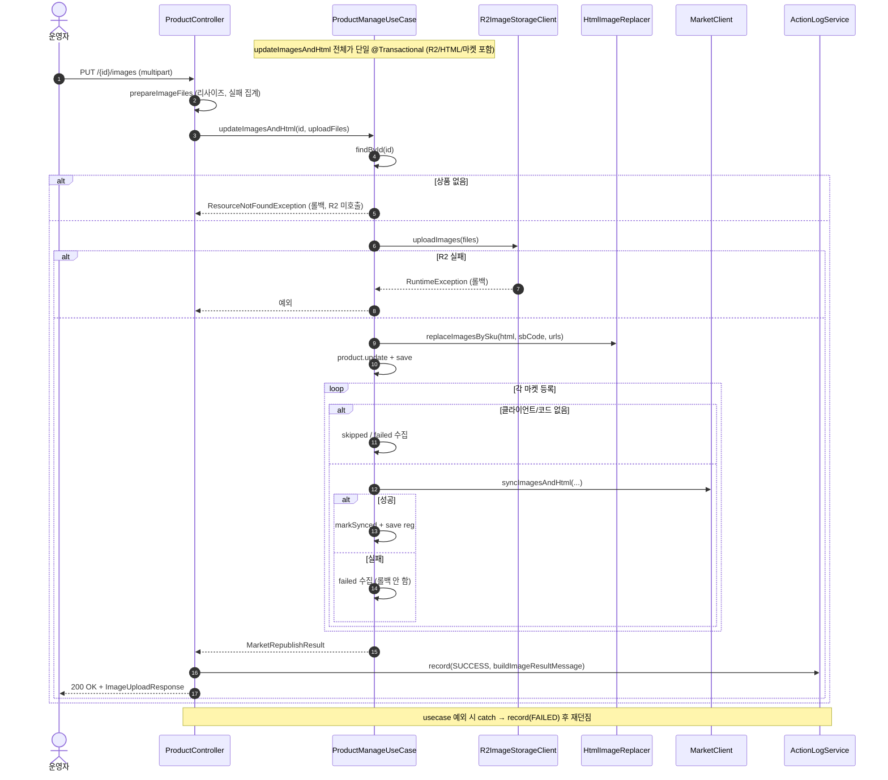
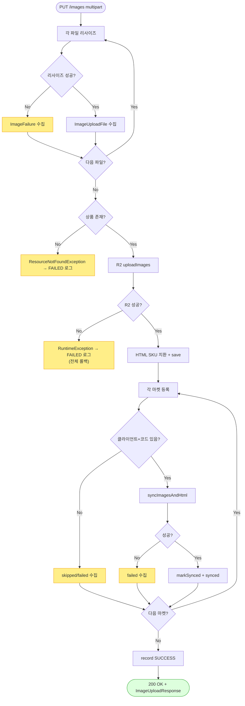

# PUT /{id}/images — 이미지 업로드(multipart) + HTML/마켓 재게시

## 1. 개요

| 항목 | 내용 |
|------|------|
| **Method / URL** | `PUT /api/v1/products/{id}/images` (multipart `images`: `List<MultipartFile>`) |
| **목적** | 업로드된 이미지 파일을 리사이즈→R2 저장하고, 상품 detailHtml의 SKU 이미지 치환 후 연동 마켓에 이미지/HTML을 재게시한다. |
| **핵심 상태전이** | 상태 전이 없음(상품 이미지/HTML 필드 갱신 + 마켓 반영) |
| **부수효과** | Thumbnails 리사이즈 → R2 업로드 → HTML 치환 → 마켓별 `syncImagesAndHtml`. 개별 리사이즈/마켓 부분 실패 집계. 활동로그(`PRODUCT_IMAGE_UPDATE`). |
| **응답** | `200 OK` + `ImageUploadResponse`(마켓 synced/skipped/failed + 이미지 succeeded/failed) |

## 2. 호출 체인

```
ProductController.uploadImages()                                 api/.../controller/ProductController.java:132-143
  ├─ prepareImageFiles(images)                                   ProductController.java:438-465
  │    └─ for each MultipartFile:                                :441-463
  │         ├─ Thumbnails 1000x1000 jpg q0.8 리사이즈             :445-450
  │         ├─ 성공 → ImageUploadFile 수집                        :452-456
  │         └─ 실패 → log.error + ImageFailure 수집               :457-462
  │    └─ ImageProcessResult.of(succeeded, failures)             :464 / dto/ImageProcessResult.java:20-22
  └─ uploadPreparedImages(id, prepared, PRODUCT_IMAGE_UPDATE, ...) ProductController.java:141-142 → 233-248
       ├─ ProductManageUseCase.updateImagesAndHtml(id, uploadFiles)  core/.../product/ProductManageUseCase.java:83-105  @Transactional
       │    ├─ productReader.findById() → 없으면 ResourceNotFoundException  :85-86
       │    ├─ imageStorageClient.uploadImages(files)            :88 → infra/.../R2ImageStorageClient.java:29-59
       │    ├─ htmlImageReplacer.replaceImagesBySku(...)         :91-92
       │    ├─ product.update(hostedImages, detailHtml) + save   :94-99
       │    └─ republishToMarkets(id, hostedImages, newHtml)     :104 → :115-155
       │         └─ for each 등록:                                :121-150
       │              ├─ router.hasClient=false → skipped         :123-127
       │              ├─ extractMarketCode 없으면 throw→failed     :129-132/145-149
       │              └─ client.syncImagesAndHtml(...) 성공→synced :135-144
       ├─ ActionLogService.record(PRODUCT_IMAGE_UPDATE, SUCCESS)  ProductController.java:240-241
       │    └─ buildImageResultMessage(...)                      ProductController.java:471-479
       └─ (예외) record(FAILED, "이미지 수정 실패") 후 재던짐       ProductController.java:243-247
```

## 3. 유스케이스 다이어그램


## 4. 시퀀스 다이어그램



## 5. 순서도 (플로우차트)



## 6. 상태 전이표

상태 전이 없음(상품 이미지/HTML 필드 및 마켓 등록정보 갱신). 마켓 반영 결과만 분류:

| 조건 | 결과 | 부수효과 |
|------|------|----------|
| 리사이즈 성공 파일 0장 + 실패만 존재 | 계속 진행(빈 업로드) | R2 uploadImages([]) → 빈 map, HTML 치환 없음 |
| R2 업로드 실패 | 500(RuntimeException) | 전체 롤백, 마켓 미전송 |
| 마켓 클라이언트 없음(GMARKET/AUCTION) | skipped | — |
| 마켓 코드 부재/전송 실패 | failed(수집) | 나머지 마켓·자사 DB 유지 |
| 상품 미존재 | 404 | R2 미호출 |

## 7. 🔎 발견사항

### PRODB-4 · 🟠 GAP — 모든 이미지 리사이즈가 실패해도(성공 0장) 예외 없이 빈 업로드로 진행됨
- **근거:** `prepareImageFiles`(`ProductController.java:438-465`)는 전부 실패하면 `succeeded=[]`인 `ImageProcessResult`를 반환하고, `uploadPreparedImages`(:233-248)는 빈 `uploadFiles`로 `updateImagesAndHtml`을 그대로 호출한다. `updateImagesAndHtml`(`ProductManageUseCase.java:88`)은 빈 리스트로 `imageStorageClient.uploadImages([])` → 빈 `hostedImages` → `replaceImagesBySku(html, sbCode, [])`로 진행하며, URL-경로(`by-url`, ProductController.java:152-154)가 빈 목록을 400으로 거부하는 것과 비대칭.
- **영향:** 사용자가 이미지 N장을 올렸으나 전부 리사이즈 실패한 경우에도 200 OK가 반환되고, HTML 이미지가 빈 목록으로 치환되어 detailHtml의 SKU 이미지가 사라질 수 있다(HtmlImageReplacer 동작에 따라). 실패는 응답 `imagesFailed`로만 표면화되고 상태코드는 성공.
- **제안:** `succeeded`가 비어있고 `failed`가 있으면 400/422로 거부하거나, HTML 치환을 빈 목록일 때 스킵하는 가드 추가. by-url 경로의 빈 목록 거부와 정합화.

### PRODB-5 · 🔵 NOTE — R2 업로드·HTML 치환·마켓 재게시가 모두 하나의 `@Transactional` 안에서 실행됨
- **근거:** `ProductManageUseCase.java:83` `@Transactional`이 `imageStorageClient.uploadImages`(:88, R2 PUT), `syncImagesAndHtml`(:136, 마켓 HTTP)를 포함한 전 구간을 감싼다.
- **영향:** R2·마켓 외부 I/O 동안 상품 row 트랜잭션이 열려 있어 커넥션 점유가 길어진다. R2 업로드는 실패 시 `RuntimeException`(R2ImageStorageClient.java:55)으로 전체 롤백되므로 DB 정합은 유지되나, 이미 성공적으로 R2에 올라간 파일은 롤백되지 않아(외부 스토리지) 고아 객체가 남을 수 있다.
- **제안:** R2 저장·DB 커밋과 마켓 재게시의 트랜잭션 분리 검토. 최소한 R2 부분 업로드 후 롤백 시 고아 객체 정리 정책 문서화.

### PRODB-6 · 🟡 SMELL — 마켓 부분 실패가 있어도 활동로그 status는 항상 SUCCESS
- **근거:** `uploadPreparedImages`(`ProductController.java:240-241`)는 `updateImagesAndHtml`이 예외 없이 반환하면(마켓 실패는 result에 수집됨) 무조건 `ActionStatus.SUCCESS`로 기록한다. `buildImageResultMessage`(:471-479)는 실패를 메시지 본문에만 덧붙인다. PRODB-2(가격재고)와 동일 패턴.
- **영향:** 마켓 재게시가 전부 실패해도 로그 status가 SUCCESS로 남아 status 기준 모니터링에서 부분 실패가 드러나지 않음.
- **제안:** `result.failed()` 존재 시 status 분기 정책 통일(3경로 공통 헬퍼 `uploadPreparedImages`에서 처리).

## 8. 테스트 커버리지 메모

- `ProductManageUseCaseRepublishTest`(core) — 마켓별 syncImagesAndHtml 호출·클라이언트 없는 마켓 스킵·부분 실패 수집 검증(:90-123).
- `ProductManageRepublishMarketCodeTest`(core) — 마켓별 상품코드(originProductNo/prdNo/product_no) 전달·코드 부재 시 failed 수집 검증(:94-142).
- `ProductControllerImageUploadTest`(api) — multipart 재게시 결과가 응답 본문에 실림 검증(:89-90).
- `ProductControllerImagePartialFailureTest`(api) — multipart 3장 중 1장 리사이즈 실패 표면화 검증(:107-108).
- **비어있는 케이스:** ① 전량 리사이즈 실패 시 동작(PRODB-4), ② R2 실패 후 롤백·고아 객체(PRODB-5), ③ 마켓 전부 실패 시 로그 status(PRODB-6).

---
*생성: 2026-07-17 · 근거: 현재 워킹트리*
