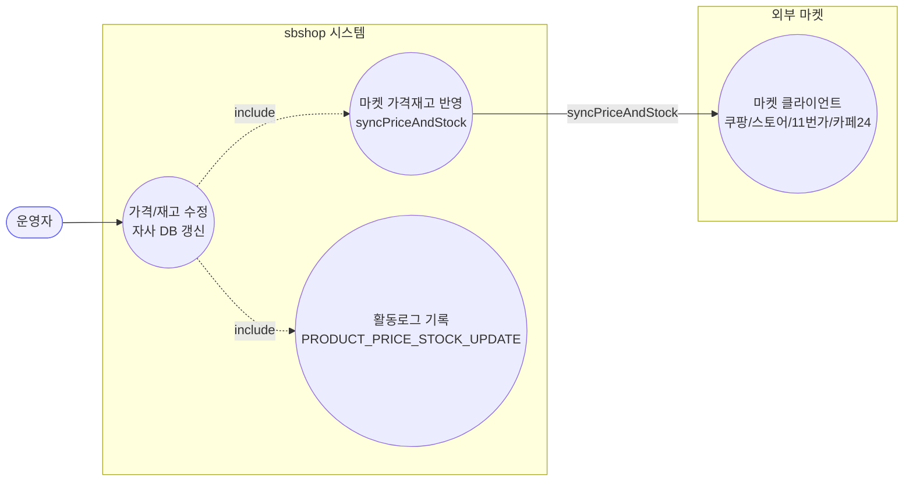

# PUT /{id}/price-stock — 가격/재고 수정 + 마켓 반영

## 1. 개요

| 항목 | 내용 |
|------|------|
| **Method / URL** | `PUT /api/v1/products/{id}/price-stock` (바디 `PriceStockUpdateRequest`) |
| **목적** | 자사 DB의 상품 가격·재고상태를 갱신하고, 연동된 각 마켓에 가격/재고를 반영한다. |
| **핵심 상태전이** | `soldOut=true` → `OUT_OF_STOCK`, `false` → `IN_STOCK`, `null` → 재고상태 미변경(현 상태 유지·전파) |
| **부수효과** | DB 저장 + 마켓별 `syncPriceAndStock` 호출(마켓별 try — 부분 실패 수집). 활동로그(`PRODUCT_PRICE_STOCK_UPDATE`) 기록. |
| **응답** | `200 OK` + `MarketRepublishResult`(synced/skipped/failed) |

## 2. 호출 체인

```
ProductController.updatePriceStock()                              api/.../controller/ProductController.java:106-130
  ├─ PriceStockUpdateRequest.price()/soldOut()                    api/.../dto/product/PriceStockUpdateRequest.java:5-8
  ├─ 음수 가격 가드 → IllegalArgumentException(400)               ProductController.java:115-117
  ├─ ProductManageUseCase.updatePriceStock(id, price, soldOut)    core/.../product/ProductManageUseCase.java:57-81  @Transactional
  │    ├─ productReader.findById() → 없으면 ResourceNotFoundException  :59-60
  │    ├─ product.update(ProductUpdateCommand{salePrice})         :63-66
  │    ├─ soldOut 분기 → stockStatus 결정/updateStockStatus       :68-74
  │    ├─ productWriter.save(product)                             :75
  │    └─ ProductMarketSyncService.syncPriceStock(id, priceInt, stockStatus)  :80
  │         └─ syncPriceStock(.., changed=true)                   core/.../product/ProductMarketSyncService.java:34-37
  │              └─ syncInternal(id, price, quantity, soldOut, changed)  :50-101
  │                   ├─ marketRegistrationRepository.findByProductId()  :52
  │                   └─ for each 등록:                            :57-96
  │                        ├─ Cafe24 변경없음 스킵(changed=true라 미적용)  :60-64
  │                        ├─ router.hasClient=false → skipped     :65-69
  │                        ├─ extractMarketCode 없으면 failed      :71-74
  │                        ├─ client.syncPriceAndStock(...)        :77-79 (MarketClient)
  │                        ├─ 성공: markSynced + save + synced      :81-87
  │                        └─ 실패: markSyncFailed + save + failed  :88-95
  └─ ActionLogService.record(PRODUCT_PRICE_STOCK_UPDATE, SUCCESS/FAILED)  ProductController.java:122-128
       └─ buildMarketResultMessage(id, "DB 저장 완료", result)     ProductController.java:381-403
```

**요청 바디 (`PriceStockUpdateRequest.java:5-8`)**

| 필드 | 타입 | 필수 | 비고 |
|------|------|:----:|------|
| `price` | BigDecimal | 아니오 | null이면 가격 미변경. 음수는 400 |
| `soldOut` | Boolean | 아니오 | null이면 재고상태 미변경(현 상태 유지·전파) |

## 3. 유스케이스 다이어그램



## 4. 시퀀스 다이어그램

```mermaid
sequenceDiagram
    autonumber
    actor U as 운영자
    participant C as ProductController
    participant M as ProductManageUseCase
    participant PR as ProductReader/Writer
    participant S as ProductMarketSyncService
    participant K as MarketClient
    participant L as ActionLogService
    Note over M: updatePriceStock 전체가 단일 @Transactional (외부 마켓 호출 포함)

    U->>C: PUT /{id}/price-stock {price, soldOut}
    alt price &lt; 0
        C-->>U: 400 IllegalArgumentException
    else
        C->>M: updatePriceStock(id, price, soldOut)
        M->>PR: findById(id)
        alt 상품 없음
            M-->>C: ResourceNotFoundException (롤백)
        else
            M->>PR: save(product) (가격/재고상태 갱신)
            M->>S: syncPriceStock(id, price, stockStatus)
            loop 각 마켓 등록
                alt 클라이언트 없음/코드 없음
                    S->>S: skipped / failed 수집
                else
                    S->>K: syncPriceAndStock(...)
                    alt 성공
                        S->>PR: markSynced + save reg
                    else 실패
                        S->>PR: markSyncFailed + save reg (롤백 안 함)
                    end
                end
            end
            S-->>M: MarketRepublishResult
            M-->>C: MarketRepublishResult
            C->>L: record(SUCCESS, buildMarketResultMessage)
            C-->>U: 200 OK + result
        end
    end
    Note over C,L: usecase 예외 시 catch → record(FAILED) 후 재던짐
```

## 5. 순서도 (플로우차트)


## 6. 상태 전이표

| 진입 상태 | 입력 | 허용? | 결과 재고상태 | 마켓 전송 | 비고 |
|-----------|------|:-----:|-----------|-----------|------|
| 임의 | `soldOut=null` | ✅ | 미변경(현 상태) | 현 상태 전파 | 가격만 변경 의도 보존(F-PROD-7) |
| 임의 | `soldOut=true` | ✅ | `OUT_OF_STOCK` | 품절 전파(quantity=1) | |
| 임의 | `soldOut=false` | ✅ | `IN_STOCK` | 판매중 전파(DEFAULT_IN_STOCK_QUANTITY) | |
| 임의 | `price<0` | ❌ | — | — | 400, DB/마켓 미변경 |
| 상품 미존재 | — | ❌ | — | — | 404(ResourceNotFoundException) |
| 마켓 클라이언트 없음(GMARKET/AUCTION) | — | — | — | skipped | DB는 갱신됨 |
| 마켓 코드 부재/전송 실패 | — | — | — | failed(수집) | DB는 갱신됨, reg markSyncFailed |

## 7. 🔎 발견사항

### PRODB-1 · 🔵 NOTE — 마켓 반영(외부 I/O)이 `@Transactional` 트랜잭션 경계 안에서 실행됨
- **근거:** `ProductManageUseCase.java:57` `@Transactional`이 `updatePriceStock` 전체를 감싸고, 그 안에서 `productMarketSyncService.syncPriceStock`(:80)이 각 마켓 클라이언트의 `syncPriceAndStock` 외부 HTTP 호출(`ProductMarketSyncService.java:77-79`)을 실행한다. 완전삭제 경로(`deleteProduct`, ProductManageUseCase.java:190-236)는 파괴적 외부 호출을 트랜잭션 밖으로 뺀 것과 대조적.
- **영향:** N개 마켓의 순차 HTTP 호출 동안 상품 row 트랜잭션이 열린 채 유지되어 DB 커넥션/락 점유 시간이 마켓 응답 지연에 비례해 늘어난다. 마켓 sync 내부는 try/catch로 부분 실패를 삼키므로 롤백 유발은 없지만, 트랜잭션 장기화·커넥션 고갈 위험.
- **제안:** DB 저장(가격/재고) 커밋과 마켓 반영을 분리(짧은 트랜잭션 + 트랜잭션 밖 sync)하는 방안 검토. 완전삭제 경로의 `F-PSRC-8 패턴`과 정합화.

### PRODB-2 · 🟡 SMELL — 성공 시 활동로그 메시지 프리픽스가 "DB 저장 완료"로 고정되어 마켓 전파 실패를 프리픽스에서 알 수 없음
- **근거:** `ProductController.java:122-123` 는 마켓 반영 결과(`result`)에 실패 마켓이 있어도 항상 `ActionStatus.SUCCESS`로 기록한다. 실패 상세는 `buildMarketResultMessage`(:381-403)가 메시지 본문에 "…실패(사유)"로 덧붙이지만, 로그 status는 SUCCESS다.
- **영향:** 마켓 전파가 전부 실패해도 활동로그 status는 SUCCESS로 남아, status 기준 필터/모니터링에서 부분 실패가 드러나지 않는다. 이미지 3경로도 동일 패턴이나 응답 본문(failed)로는 표면화됨.
- **제안:** `result.failed()`가 비어있지 않으면 status를 분기(예: 전부 실패 시 FAILED, 일부 실패 시 별도 표기)하는 정책 검토. 응답 본문에는 이미 failed가 실리므로 로그 status만 정합화하면 됨.

### PRODB-3 · 🔵 NOTE — 재고 수량이 판매중/품절 이분법으로 고정되어 실제 재고 수량이 마켓에 반영되지 않음
- **근거:** `ProductMarketSyncService.java:45-47` `quantity = soldOut ? 1 : Product.DEFAULT_IN_STOCK_QUANTITY`. `updatePriceStock`은 DB 수량을 건드리지 않고(`ProductManageUseCase.java:62` 주석) 재고상태만 다룬다.
- **영향:** 실제 재고 수량 개념이 이 경로에는 존재하지 않는다(판매중=기본수량, 품절=1). 의도된 설계이나, "재고 수정" API 명칭과 실제 동작(재고상태 토글) 간 간극이 있어 문서화 필요.
- **제안:** 의도된 설계면 API/필드 명세에 "재고상태 토글(수량 미반영)"을 명시.

## 8. 테스트 커버리지 메모

- `ProductManageUseCasePriceStockTest`(core) — soldOut null/true/false 3분기 재고상태 갱신·마켓 전파 검증(:72-101).
- `ProductManageUpdatePriceStockSoldOutTest`(core) — soldOut true/false 시 `syncPriceStock(StockStatus)` 호출 검증(:64-77).
- `ProductControllerInputValidationTest`(api) — 음수 price 400 거부·usecase 미호출, null/0 이상 정상 처리(:64-89).
- `ProductControllerActionLogDetailTest`(api) — 마켓별 상세 메시지·실패사유 50자 절단 로그 검증(:88-126).
- **비어있는 케이스:** ① 마켓 전부 실패 시 로그 status(PRODB-2), ② 상품 미존재(404) 경로의 FAILED 로그 기록, ③ 트랜잭션 경계/외부 호출 지연(PRODB-1)은 단위 테스트 대상 아님.

---
*생성: 2026-07-17 · 근거: 현재 워킹트리*
