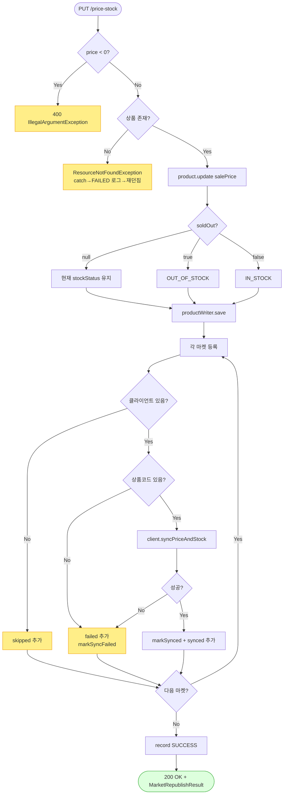

# PUT /{id}/price-stock — 가격/재고 수정 + 마켓 반영

> 상품의 판매가와 "판매중/품절" 상태를 우리 DB에서 바꾸고, 그 변경을 연결된 각 온라인 마켓(쿠팡·스토어·11번가·카페24)에도 똑같이 반영하는 기능입니다.

## 1. 개요

아래 표는 이 기능이 "무엇을, 어떤 조건으로, 어떤 결과로" 하는지를 한눈에 정리한 것입니다.

| 항목 | 내용 |
|------|------|
| **Method / URL** | `PUT /api/v1/products/{id}/price-stock` (바디 `PriceStockUpdateRequest`) — 쉽게 말하면 "이 상품의 가격/재고를 이렇게 바꿔줘"라고 서버에 보내는 주소 |
| **목적** | 우리 DB의 상품 가격과 재고상태를 바꾸고, 연결된 각 마켓에도 그 가격/재고를 반영한다. |
| **핵심 상태전이** | `soldOut=true`면 → `OUT_OF_STOCK`(품절), `false`면 → `IN_STOCK`(판매중), `null`이면 재고상태를 건드리지 않고 지금 상태 그대로 둠(그리고 그 상태를 마켓에 전파) |
| **부수효과** | DB 저장 + 마켓마다 `syncPriceAndStock` 호출(마켓별로 따로 시도 — 일부가 실패해도 나머지는 진행하고 실패만 모아둠). 활동로그(`PRODUCT_PRICE_STOCK_UPDATE`) 남김. → 쉽게 말하면 "우리 DB도 바꾸고 각 마켓에도 알리고, 무슨 일을 했는지 기록도 남긴다". |
| **응답** | `200 OK` + `MarketRepublishResult`(마켓별로 반영됨/건너뜀/실패로 나눈 결과) |

## 2. 호출 체인

아래는 요청이 들어온 순간부터 어떤 코드들이 순서대로 불려 가는지를 보여줍니다. 각 줄 옆의 `파일.java:줄번호`는 실제 코드 위치이고, 화살표 설명은 "쉽게 말하면 무슨 일을 하는지"입니다.

```
ProductController.updatePriceStock()                              api/.../controller/ProductController.java:106-130
  ├─ PriceStockUpdateRequest.price()/soldOut()                    api/.../dto/product/PriceStockUpdateRequest.java:5-8
  │                                                               → 쉽게 말하면: 요청에서 "가격"과 "품절 여부" 값을 꺼냄
  ├─ 음수 가격 가드 → IllegalArgumentException(400)               ProductController.java:115-117
  │                                                               → 가격이 마이너스면 여기서 바로 거절(잘못된 요청)
  ├─ ProductManageUseCase.updatePriceStock(id, price, soldOut)    core/.../product/ProductManageUseCase.java:57-81  @Transactional
  │    │                                                          → 여기서부터 "한 묶음(트랜잭션)"으로 저장 처리 시작
  │    ├─ productReader.findById() → 없으면 ResourceNotFoundException  :59-60  → 상품을 못 찾으면 404
  │    ├─ product.update(ProductUpdateCommand{salePrice})         :63-66  → 상품의 판매가를 새 값으로 바꿈
  │    ├─ soldOut 분기 → stockStatus 결정/updateStockStatus       :68-74  → 품절/판매중/그대로 중 하나로 재고상태 결정
  │    ├─ productWriter.save(product)                             :75     → 바뀐 상품을 DB에 저장
  │    └─ ProductMarketSyncService.syncPriceStock(id, priceInt, stockStatus)  :80  → 이제 각 마켓에 반영 시작
  │         └─ syncPriceStock(.., changed=true)                   core/.../product/ProductMarketSyncService.java:34-37
  │              └─ syncInternal(id, price, quantity, soldOut, changed)  :50-101
  │                   ├─ marketRegistrationRepository.findByProductId()  :52  → 이 상품이 어느 마켓들에 등록돼 있는지 목록을 가져옴
  │                   └─ for each 등록:                            :57-96  → 등록된 마켓을 하나씩 돌면서:
  │                        ├─ Cafe24 변경없음 스킵(changed=true라 미적용)  :60-64  → 카페24 특례(여기선 해당 없음)
  │                        ├─ router.hasClient=false → skipped     :65-69  → 그 마켓에 연동할 방법이 없으면 "건너뜀"
  │                        ├─ extractMarketCode 없으면 failed      :71-74  → 마켓 상품코드가 없으면 "실패"로 분류
  │                        ├─ client.syncPriceAndStock(...)        :77-79 (MarketClient)  → 마켓에 실제로 가격/재고 전송
  │                        ├─ 성공: markSynced + save + synced      :81-87  → 성공하면 "반영됨"으로 표시하고 저장
  │                        └─ 실패: markSyncFailed + save + failed  :88-95  → 실패하면 "실패"로 표시하고 저장(되돌리진 않음)
  └─ ActionLogService.record(PRODUCT_PRICE_STOCK_UPDATE, SUCCESS/FAILED)  ProductController.java:122-128
       │                                                          → 무슨 작업을 했고 성공/실패였는지 활동로그에 남김
       └─ buildMarketResultMessage(id, "DB 저장 완료", result)     ProductController.java:381-403  → 로그 메시지 문장을 조립
```

**요청 바디 (`PriceStockUpdateRequest.java:5-8`)** — 사용자가 보내는 값은 아래 두 개뿐입니다.

| 필드 | 타입 | 필수 | 비고 |
|------|------|:----:|------|
| `price` | BigDecimal | 아니오 | 비워두면(null) 가격은 그대로 둠. 마이너스면 거절(400) |
| `soldOut` | Boolean | 아니오 | 비워두면(null) 재고상태는 그대로 두고, 지금 상태를 마켓에 전파 |

## 3. 유스케이스 다이어그램

👉 이 그림은 운영자가 이 기능을 쓰면 시스템 안에서 어떤 일들(가격/재고 수정 → 마켓 반영 → 로그 기록)이 함께 일어나고, 그중 마켓 반영은 외부 마켓과 연결되는지를 보여줍니다.


## 4. 시퀀스 다이어그램

👉 이 그림은 요청이 들어온 뒤 각 코드 조각이 시간 순서대로 주고받는 대화를 보여줍니다. 특히 위쪽 메모처럼 "마켓에 보내는 외부 호출까지 하나의 저장 묶음(트랜잭션) 안에서" 일어난다는 점을 눈여겨보세요.

```mermaid
sequenceDiagram
    autonumber
    actor U as 운영자
    participant C as ProductController
    participant M as ProductManageUseCase
    participant PR as ProductReader/Writer
    participant S as ProductMarketSyncService
    participant K as MarketClient
    participant L as ActionLogService
    Note over M: updatePriceStock 전체가 단일 @Transactional (외부 마켓 호출 포함)

    U->>C: PUT /{id}/price-stock {price, soldOut}
    alt price &lt; 0
        C-->>U: 400 IllegalArgumentException
    else
        C->>M: updatePriceStock(id, price, soldOut)
        M->>PR: findById(id)
        alt 상품 없음
            M-->>C: ResourceNotFoundException (롤백)
        else
            M->>PR: save(product) (가격/재고상태 갱신)
            M->>S: syncPriceStock(id, price, stockStatus)
            loop 각 마켓 등록
                alt 클라이언트 없음/코드 없음
                    S->>S: skipped / failed 수집
                else
                    S->>K: syncPriceAndStock(...)
                    alt 성공
                        S->>PR: markSynced + save reg
                    else 실패
                        S->>PR: markSyncFailed + save reg (롤백 안 함)
                    end
                end
            end
            S-->>M: MarketRepublishResult
            M-->>C: MarketRepublishResult
            C->>L: record(SUCCESS, buildMarketResultMessage)
            C-->>U: 200 OK + result
        end
    end
    Note over C,L: usecase 예외 시 catch → record(FAILED) 후 재던짐
```

## 5. 순서도 (플로우차트)

👉 이 그림은 "가격이 마이너스인가? → 상품이 있는가? → 품절인가 판매중인가? → 마켓마다 성공했나 실패했나"처럼, 갈림길을 따라 어떤 결과로 이어지는지를 보여줍니다.



## 6. 상태 전이표

아래 표는 "어떤 값을 넣으면 → 허용되는지, 재고상태는 뭐가 되는지, 마켓엔 뭘 보내는지"를 경우별로 정리한 것입니다.

| 진입 상태 | 입력 | 허용? | 결과 재고상태 | 마켓 전송 | 비고 |
|-----------|------|:-----:|-----------|-----------|------|
| 아무 상태 | `soldOut=null` | ✅ | 그대로 둠(현 상태) | 현 상태 그대로 전파 | "가격만 바꾸려는" 의도를 지켜줌(F-PROD-7) |
| 아무 상태 | `soldOut=true` | ✅ | `OUT_OF_STOCK`(품절) | 품절로 전파(수량=1) | |
| 아무 상태 | `soldOut=false` | ✅ | `IN_STOCK`(판매중) | 판매중으로 전파(기본 재고수량) | |
| 아무 상태 | `price<0` | ❌ | — | — | 400으로 거절, DB·마켓 아무것도 안 바꿈 |
| 상품 없음 | — | ❌ | — | — | 404(상품을 못 찾음) |
| 연동할 방법 없는 마켓(G마켓/옥션) | — | — | — | 건너뜀(skipped) | 우리 DB는 바뀜 |
| 마켓 상품코드 없음/전송 실패 | — | — | — | 실패(failed로 모아둠) | 우리 DB는 바뀌고, 그 마켓 등록은 "실패" 표시 |

## 7. 🔎 발견사항

### PRODB-1 · 🔵 NOTE — 마켓 반영(외부 통신)이 저장 묶음(`@Transactional`) 안에서 실행됨
- **무엇이 문제인가:** 상품을 저장하는 "한 묶음(트랜잭션)" 안에서, 각 마켓에 가격/재고를 보내는 외부 통신까지 함께 일어납니다. 즉 마켓과 대화하는 동안 DB 저장 묶음이 계속 열려 있는 상태입니다. (참고: 상품 완전삭제 경로는 위험한 외부 호출을 이 묶음 밖으로 빼놨는데, 여기는 안에 넣어둔 점이 대조적입니다.)
- **근거:** `ProductManageUseCase.java:57` `@Transactional`이 `updatePriceStock` 전체를 감싸고, 그 안에서 `productMarketSyncService.syncPriceStock`(:80)이 각 마켓의 `syncPriceAndStock` 외부 HTTP 호출(`ProductMarketSyncService.java:77-79`)을 실행한다. 완전삭제 경로(`deleteProduct`, ProductManageUseCase.java:190-236)는 파괴적 외부 호출을 트랜잭션 밖으로 뺀 것과 대조적.
- **왜 문제인가:** 마켓이 여러 개면 하나씩 순서대로 통신하는데, 그동안 DB 연결을 계속 붙잡고 있습니다. 마켓 응답이 느릴수록 이 붙잡는 시간이 길어져, 동시 처리가 많을 때 DB 연결이 고갈될 위험이 있습니다. 다만 마켓 반영 실패는 안에서 조용히 처리(모아만 둠)하므로 저장이 통째로 되돌아가진 않습니다.
- **어떻게 고치면 되나:** DB에 가격/재고를 저장하는 짧은 묶음과, 마켓에 보내는 부분을 분리(짧게 저장 확정 후 마켓 반영은 묶음 밖에서)하는 방안을 검토합니다. 완전삭제 경로의 `F-PSRC-8 패턴`과 방식을 맞춥니다.

### PRODB-2 · 🟡 SMELL — 성공 로그 문구가 늘 "DB 저장 완료"로 시작해, 마켓 반영이 실패해도 성공처럼 보임
- **무엇이 문제인가:** 마켓 반영 결과에 실패한 마켓이 있어도, 활동로그의 상태값은 항상 "성공(SUCCESS)"으로 기록됩니다. 실패 상세는 메시지 본문에 "…실패(사유)"로 덧붙긴 하지만, 로그의 상태 칸 자체는 성공입니다.
- **근거:** `ProductController.java:122-123` 는 마켓 반영 결과(`result`)에 실패 마켓이 있어도 항상 `ActionStatus.SUCCESS`로 기록한다. 실패 상세는 `buildMarketResultMessage`(:381-403)가 메시지 본문에 "…실패(사유)"로 덧붙이지만, 로그 status는 SUCCESS다.
- **왜 문제인가:** 마켓 반영이 전부 실패했더라도 로그 상태는 "성공"이라, 상태값만 보고 걸러내는 모니터링에서는 이 부분 실패가 드러나지 않습니다. 운영자가 로그 상태만 훑으면 문제를 놓칠 수 있습니다. (이미지 3경로도 같은 패턴이지만, 그쪽은 응답 본문의 failed 항목으로는 드러납니다.)
- **어떻게 고치면 되나:** 실패한 마켓이 있으면 로그 상태를 나눠 기록(예: 전부 실패면 FAILED, 일부 실패면 별도 표기)하는 정책을 검토합니다. 응답 본문에는 이미 실패가 실리므로 로그 상태값만 맞추면 됩니다.

### PRODB-3 · 🔵 NOTE — 재고가 "판매중 아니면 품절" 둘 중 하나로만 관리돼, 실제 재고 수량은 마켓에 반영되지 않음
- **무엇이 문제인가:** 이 기능은 재고를 "판매중(기본수량)" 아니면 "품절(수량 1)" 두 가지로만 다룹니다. 실제 몇 개 남았는지 같은 수량 개념은 이 경로에 없습니다. DB의 수량 값도 건드리지 않고 재고상태만 켜고 끕니다.
- **근거:** `ProductMarketSyncService.java:45-47` `quantity = soldOut ? 1 : Product.DEFAULT_IN_STOCK_QUANTITY`. `updatePriceStock`은 DB 수량을 건드리지 않고(`ProductManageUseCase.java:62` 주석) 재고상태만 다룬다.
- **왜 문제인가:** 기능 이름은 "재고 수정"인데 실제로는 "판매중/품절 토글"만 하는 것이라, 이름과 동작 사이에 오해의 여지가 있습니다. 의도된 설계이긴 하지만 문서로 분명히 해두는 편이 좋습니다.
- **어떻게 고치면 되나:** 의도된 설계라면 API/필드 설명에 "재고상태 토글이며 실제 수량은 반영하지 않는다"고 명시합니다.

## 8. 테스트 커버리지 메모

아래는 이 기능을 검증하는 테스트와, 아직 테스트가 없는(비어있는) 부분입니다.

- `ProductManageUseCasePriceStockTest`(core) — soldOut이 비었을 때/품절/판매중 세 갈래로 재고상태가 바뀌고 마켓에 전파되는지 검증(:72-101).
- `ProductManageUpdatePriceStockSoldOutTest`(core) — soldOut이 품절/판매중일 때 `syncPriceStock(StockStatus)`가 제대로 불리는지 검증(:64-77).
- `ProductControllerInputValidationTest`(api) — 마이너스 가격은 400으로 거절하고 핵심 로직을 안 부르는지, 비었거나 0 이상이면 정상 처리되는지 검증(:64-89).
- `ProductControllerActionLogDetailTest`(api) — 마켓별 상세 메시지·실패사유 50자 자르기 로그 검증(:88-126).
- **비어있는 케이스:** ① 마켓이 전부 실패했을 때 로그 상태(PRODB-2), ② 상품이 없을 때(404) FAILED 로그가 남는지, ③ 저장 묶음 경계·외부 호출 지연(PRODB-1)은 단위 테스트로 확인하기 어려운 부분입니다.

---
*(쉬운 설명판 · 2026-07-17 재작성)*
*생성: 2026-07-17 · 근거: 현재 워킹트리*
