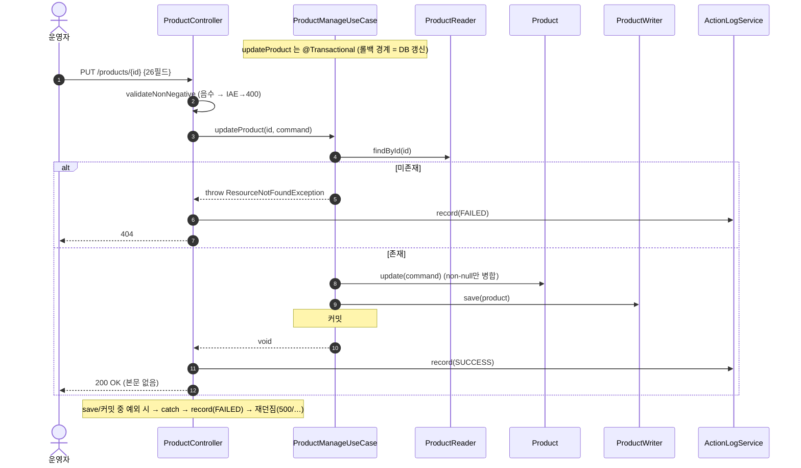
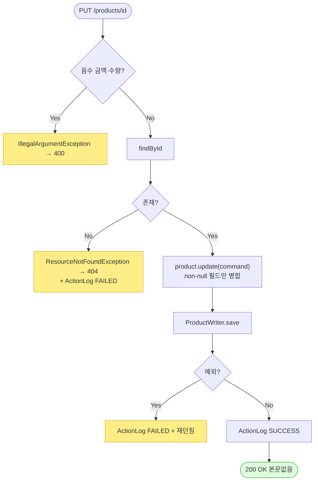

# PUT /api/v1/products/{id} — 상품 전체 정보 수정

## 1. 개요

| 항목 | 내용 |
|------|------|
| **Method / URL** | `PUT /api/v1/products/{id}` (바디 `ProductUpdateRequest`) |
| **목적** | 상품의 브랜드·가격·물류·규격·소싱·이미지 등 26필드를 부분 병합(non-null만) 갱신한다. |
| **핵심 상태전이** | 없음(자사 DB 필드 갱신). 재고상태·마켓 동기화 없음. |
| **부수효과** | 자사 DB `Product` 갱신 + 활동로그(`PRODUCT_UPDATE`). **마켓 재게시·재고상태 변경 없음.** |
| **응답** | `200 OK` (본문 없음, `Void`) / 음수 입력 `400` / 미존재 `404` |

## 2. 호출 체인

```
ProductController.updateProduct(id, request)           api/.../controller/ProductController.java:296-315
  ├─ validateNonNegative(request)                       :303 / 338-360  (음수 금액·수량 → IAE→400)
  │    └─ requireNonNegative(BigDecimal/Integer) ×9     :339-347
  ├─ request.toCommand()                                api/.../dto/product/ProductUpdateRequest.java:38-47
  ├─ ProductManageUseCase.updateProduct(id, command)    core/.../product/ProductManageUseCase.java:169-176  @Transactional
  │    ├─ ProductReader.findById → orElseThrow(RNFE)    :171-172  (→ 404)
  │    ├─ product.update(command)                       core/.../product/Product.java:168-191  (non-null 필드만 병합)
  │    │    └─ updatePriceInfo/Logistics/Spec/Sourcing/ImageInfo  Product.java:193-278
  │    └─ ProductWriter.save(product)                   :174 → ProductWriterImpl.save  infra/.../ProductWriterImpl.java:16-19
  └─ ActionLogService.record(PRODUCT_UPDATE, market=null, SUCCESS/FAILED)  :307-313
```

**요청 바디 (`ProductUpdateRequest`, `ProductUpdateRequest.java:10-36`)** — 26필드 record, 모두 nullable. null 필드는 미변경(병합). 검증 대상 음수 금지: `costPrice, exchangeRate, deliveryFee, marginRate, salePrice, weight, capacity, stock, bundleQuantity`.

## 3. 유스케이스 다이어그램


## 4. 시퀀스 다이어그램



## 5. 순서도 (플로우차트)



## 6. 상태 전이표

| 진입 | 허용? | 결과 | 마켓 전송 | 비고 |
|------|:-----:|------|-----------|------|
| 존재 상품 + 유효 바디 | ✅ | 필드 병합 갱신 | ❌ 없음 | 재고상태(`stockStatus`)·재입고일 미변경 |
| 음수 금액/수량 포함 | ⛔ | 미변경 | ❌ | 400(IAE), usecase 미호출 |
| 미존재 id | ⛔ | 미변경 | ❌ | 404(RNFE) + ActionLog FAILED |

> 도메인 상태 전이는 없음 — 값 필드 병합만. `stock` 을 수정해도 `stockStatus`(IN/OUT_OF_STOCK)는 재계산·전이하지 않는다.

## 7. 🔎 발견사항

### PRODA-3 · 🟠 GAP — 전체수정은 자사 DB만 갱신하고 연동 마켓에 전파하지 않는다(가격/이미지 경로와 비대칭)
- **근거:** `ProductManageUseCase.updateProduct`(`ProductManageUseCase.java:169-176`)는 `product.update` + `save` 만 하고 `republishToMarkets`/`syncPriceStock` 을 호출하지 않는다. 반면 `updatePriceStock`(:57-81)은 `productMarketSyncService.syncPriceStock`, `updateImagesAndHtml`(:83-105)은 `republishToMarkets` 로 연동 마켓에 반영한다.
- **영향:** 전체수정으로 `salePrice`·`name`·`detailHtml` 등을 바꿔도 이미 등록된 마켓 리스팅에는 반영되지 않아 자사 DB와 마켓 표시가 괴리된다. 특히 `salePrice` 를 이 경로로 바꾸면 마켓 가격은 그대로여서, 운영자가 "가격 수정했다" 고 오인할 수 있다.
- **제안:** 전체수정 후 마켓 재게시(또는 최소한 가격/이미지 변경 감지 시 동기화)를 트리거하거나, 이 경로가 "자사 DB 전용" 임을 응답/UI로 명시. 정책 결정 필요(의도적 분리일 수 있음 → 원장 등재 후 판단).

### PRODA-4 · 🟡 SMELL — `stock` 수정 시 `stockStatus`(품절/판매중)와의 정합이 갱신되지 않는다
- **근거:** `Product.update`(`Product.java:214-228`)는 `logisticsInfo.stock` 만 병합하고 `stockStatus`(:282-284)는 건드리지 않는다. `updatePriceStock` 은 명시적으로 `updateStockStatus` 를 호출(:73)하지만, 전체수정엔 그 연결이 없다.
- **영향:** 예: `stock=0` 으로 수정해도 `stockStatus` 는 IN_STOCK 그대로 남아 목록/마켓 재고표시와 어긋날 수 있다. 반대로 재고를 채워도 OUT_OF_STOCK 유지.
- **제안:** 전체수정에서 `stock` 변경 시 재고상태 재계산 정책을 명확히 하거나, 재고상태는 가격/재고 전용 경로에서만 다룬다는 책임 경계를 문서화.

### PRODA-5 · 🔵 NOTE — 성공 응답이 본문 없는 `200 OK(Void)` 라 클라이언트가 갱신 결과를 재조회해야 한다
- **근거:** `ProductController.java:309` `ResponseEntity.ok().build()`. 갱신된 상품 스냅샷이나 변경 필드를 반환하지 않는다.
- **영향:** 프론트가 낙관적 갱신을 하거나 별도 `GET /{id}` 재조회 필요. 기능 오류는 아님.
- **제안:** 필요 시 갱신 후 `ProductDetailResponse` 반환 검토(계약 변경).

## 8. 테스트 커버리지 메모

- `ProductControllerInputValidationTest.java:133-172` — 음수 `salePrice`/`stock`/`costPrice` 거부(usecase 미호출), 유효/ null 정상처리 검증.
- `ProductNotFoundExceptionTest.java:87-88` — `updateProduct: 미존재 id → 404` 검증.
- **비어있는 케이스:** ① non-null 부분병합 정확성(일부 필드만 변경 시 나머지 보존), ② **마켓 미전파(PRODA-3)** 계약 명세 테스트, ③ `stock`↔`stockStatus` 정합(PRODA-4), ④ save 예외 시 ActionLog FAILED 배선.

---
*생성: 2026-07-17 · 근거: 현재 워킹트리*
