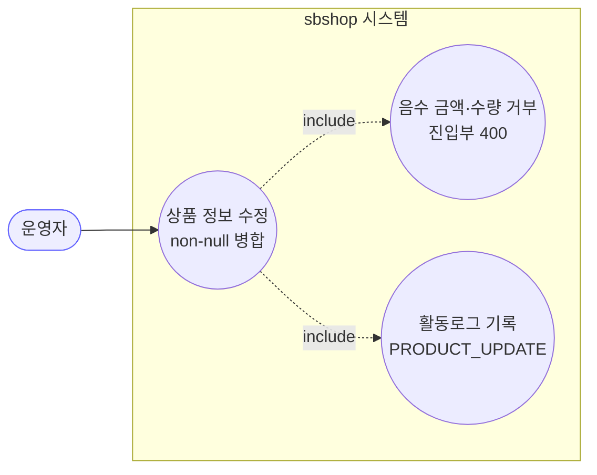
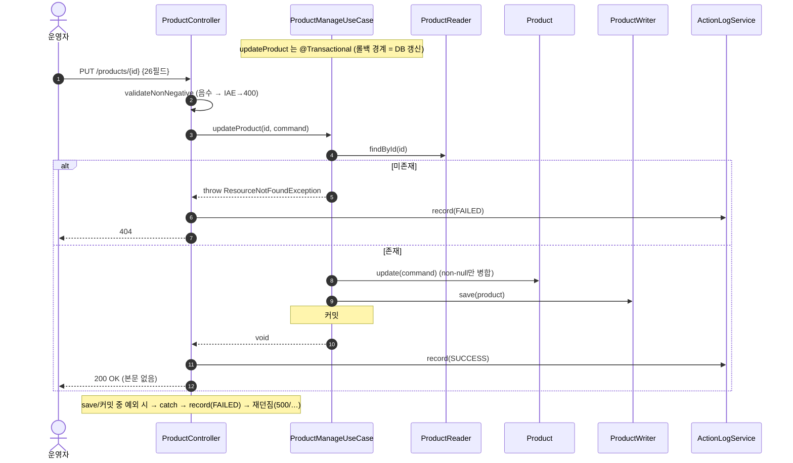

# PUT /api/v1/products/{id} — 상품 전체 정보 수정

## 1. 개요

| 항목 | 내용 |
|------|------|
| **Method / URL** | `PUT /api/v1/products/{id}` (요청 본문 `ProductUpdateRequest`) |
| **목적** | 상품의 브랜드·가격·물류·규격·소싱·이미지 등 26개 항목을 부분 수정한다. 값을 채워 보낸 항목만 바꾸고, 비워 둔 항목은 그대로 둔다. |
| **핵심 상태전이** | 없음(자사 DB의 값만 바꿈). 재고상태 다시 계산이나 마켓 반영은 안 함. |
| **부수효과** | 자사 DB의 상품(`Product`)을 수정하고 활동로그(`PRODUCT_UPDATE`)를 남긴다. **마켓에는 다시 올리지 않고, 재고상태도 바꾸지 않는다.** |
| **응답** | `200 OK` (돌려주는 내용 없음, `Void`) / 음수 값이 들어오면 `400` / 상품 없으면 `404` |

## 2. 호출 체인

아래는 요청이 처리되는 길입니다. 각 단계 옆에 "쉽게 말하면"을 붙였습니다.

```
ProductController.updateProduct(id, request)           api/.../controller/ProductController.java:296-315
  ├─ validateNonNegative(request)                       :303 / 338-360  (음수 금액·수량 → IAE→400)
  │    └─ requireNonNegative(BigDecimal/Integer) ×9     :339-347
  ├─ request.toCommand()                                api/.../dto/product/ProductUpdateRequest.java:38-47
  ├─ ProductManageUseCase.updateProduct(id, command)    core/.../product/ProductManageUseCase.java:169-176  @Transactional
  │    ├─ ProductReader.findById → orElseThrow(RNFE)    :171-172  (→ 404)
  │    ├─ product.update(command)                       core/.../product/Product.java:168-191  (non-null 필드만 병합)
  │    │    └─ updatePriceInfo/Logistics/Spec/Sourcing/ImageInfo  Product.java:193-278
  │    └─ ProductWriter.save(product)                   :174 → ProductWriterImpl.save  infra/.../ProductWriterImpl.java:16-19
  └─ ActionLogService.record(PRODUCT_UPDATE, market=null, SUCCESS/FAILED)  :307-313
```

쉽게 말하면 이렇게 흐릅니다:
- **입구(Controller)** 가 먼저 금액·수량 값 중 음수가 있는지 검사합니다. → 쉽게 말하면 "가격이나 재고가 마이너스면 아예 처리 전에 400으로 돌려보내는 것".
- 문제없으면 **updateProduct** 가 상품을 찾아(없으면 404), 값을 채워 보낸 항목만 골라 덮어씁니다(`product.update`). → 쉽게 말하면 "빈칸은 건드리지 않고, 채워 온 칸만 바꾸는 부분 수정".
- 바뀐 상품을 **save** 로 저장합니다. 이 구간은 "하나의 저장 묶음(@Transactional)"이라, 중간에 실패하면 통째로 되돌아갑니다.
- 마지막에 **활동로그** 를 남깁니다(성공이면 SUCCESS, 저장 도중 실패면 FAILED로 기록하고 오류를 다시 위로 던짐).

**요청 본문 (`ProductUpdateRequest`, `ProductUpdateRequest.java:10-36`)** — 26개 항목으로 이뤄져 있고 모두 비워 둘 수 있습니다. 비운 항목은 바꾸지 않습니다(기존 값 유지). 음수를 금지하는 항목: `costPrice, exchangeRate, deliveryFee, marginRate, salePrice, weight, capacity, stock, bundleQuantity`.

## 3. 유스케이스 다이어그램

👉 이 그림은 운영자가 "상품 정보 수정"을 요청하면, 시스템이 그 안에서 "음수 값 거르기"와 "활동로그 남기기"까지 함께 처리한다는 것을 보여줍니다.



## 4. 시퀀스 다이어그램

👉 이 그림은 음수 검사 → 상품 찾기 → (없으면 404·로그 FAILED, 있으면) 값 병합·저장·성공 로그로 이어지는 시간 순서와, 저장 중 오류가 나면 실패 로그를 남기고 오류를 다시 던지는 흐름을 보여줍니다.



## 5. 순서도 (플로우차트)

👉 이 그림은 "음수 값이 있나? → 상품이 있나? → 저장 중 오류가 나나?"를 차례로 따지며, 각 갈림길에서 400·404·실패로그로 빠지거나 정상 저장으로 이어지는 흐름을 보여줍니다.


## 6. 상태 전이표

각 칸은 "이런 상황이면 어떻게 되나"를 정리한 것입니다.

| 진입 | 허용? | 결과 | 마켓 전송 | 비고 |
|------|:-----:|------|-----------|------|
| 상품 있음 + 값 정상 | ✅ | 채워 온 항목만 수정 | ❌ 안 보냄 | 재고상태(`stockStatus`)·재입고일은 안 바뀜 |
| 음수 금액/수량 포함 | ⛔ | 아무것도 안 바뀜 | ❌ | 400으로 막힘, 핵심 로직까지 가지도 않음 |
| 없는 id | ⛔ | 아무것도 안 바뀜 | ❌ | 404 + 활동로그 FAILED |

> 도메인 상태가 바뀌는 일은 없습니다 — 값만 부분 수정할 뿐입니다. 재고(`stock`) 수를 바꿔도 "판매중/품절"(`stockStatus`)은 다시 계산하지 않습니다.

## 7. 🔎 발견사항

### PRODA-3 · 🟠 GAP — 전체수정은 자사 DB만 갱신하고 연동 마켓에 전파하지 않는다(가격/이미지 경로와 비대칭)
- **무엇이 문제인가:** 이 전체수정 기능은 자사 DB의 값만 바꾸고 끝냅니다. 이미 마켓에 올라가 있는 상품 페이지에는 아무것도 다시 보내지 않습니다. 반면 "가격/재고 수정" 경로와 "이미지/설명 수정" 경로는 바뀐 내용을 연동 마켓까지 반영해 줍니다.
- **근거:** `ProductManageUseCase.updateProduct`(`ProductManageUseCase.java:169-176`)는 `product.update` + `save` 만 하고 `republishToMarkets`/`syncPriceStock` 을 호출하지 않는다. 반면 `updatePriceStock`(:57-81)은 `productMarketSyncService.syncPriceStock`, `updateImagesAndHtml`(:83-105)은 `republishToMarkets` 로 연동 마켓에 반영한다.
- **왜 문제인가:** 전체수정으로 판매가·이름·상세설명 등을 바꿔도 이미 등록된 마켓 페이지에는 반영되지 않아, 자사 DB와 마켓 화면이 서로 달라집니다. 특히 이 경로로 판매가를 바꾸면 마켓 가격은 그대로여서, 운영자가 "가격을 고쳤다"고 착각할 수 있습니다.
- **어떻게 고치면 되나:** 전체수정 후 마켓에 다시 올리도록 하거나(또는 최소한 가격·이미지가 바뀐 걸 감지하면 그때 동기화), 아니면 이 경로가 "자사 DB 전용"임을 응답·화면에 분명히 알려 줍니다. 일부러 나눠 둔 설계일 수도 있으므로 정책 결정이 필요합니다(원장에 올려 판단).

### PRODA-4 · 🟡 SMELL — `stock` 수정 시 `stockStatus`(품절/판매중)와의 정합이 갱신되지 않는다
- **무엇이 문제인가:** 재고 수량(`stock`)을 바꿔도 "판매중/품절" 표시(`stockStatus`)는 함께 다시 계산되지 않습니다. 전체수정은 재고 숫자만 덮어쓰고 그 상태 값은 손대지 않습니다.
- **근거:** `Product.update`(`Product.java:214-228`)는 `logisticsInfo.stock` 만 병합하고 `stockStatus`(:282-284)는 건드리지 않는다. `updatePriceStock` 은 명시적으로 `updateStockStatus` 를 호출(:73)하지만, 전체수정엔 그 연결이 없다.
- **왜 문제인가:** 예를 들어 재고를 0으로 바꿔도 상태는 "판매중"으로 남아 목록·마켓 재고 표시와 어긋날 수 있습니다. 반대로 재고를 다시 채워도 "품절" 상태가 그대로 남을 수 있습니다.
- **어떻게 고치면 되나:** 전체수정에서 재고를 바꾸면 상태도 다시 계산하도록 정하거나, "재고 상태는 가격/재고 전용 경로에서만 다룬다"는 역할 경계를 문서로 분명히 합니다.

### PRODA-5 · 🔵 NOTE — 성공 응답이 본문 없는 `200 OK(Void)` 라 클라이언트가 갱신 결과를 재조회해야 한다
- **무엇이 문제인가:** 수정이 성공해도 응답에 아무 내용이 담겨 있지 않습니다(그냥 200만 옴). 바뀐 상품 정보나 어떤 항목이 바뀌었는지를 돌려주지 않습니다.
- **근거:** `ProductController.java:309` `ResponseEntity.ok().build()`. 갱신된 상품 스냅샷이나 변경 필드를 반환하지 않는다.
- **왜 문제인가:** 프론트가 화면을 갱신하려면 별도로 `GET /{id}` 로 다시 조회하거나 임의로 화면을 먼저 바꿔 둬야 합니다. 기능 오류는 아닙니다.
- **어떻게 고치면 되나:** 필요하면 수정 후 상품 상세(`ProductDetailResponse`)를 함께 돌려주도록 검토합니다(응답 형태 변경).

## 8. 테스트 커버리지 메모

- `ProductControllerInputValidationTest.java:133-172` — 음수 판매가·재고·원가를 거부하는지(핵심 로직까지 안 가는지), 정상값·빈값은 잘 처리되는지 검증.
- `ProductNotFoundExceptionTest.java:87-88` — 없는 id로 수정하면 404가 나는지 검증.
- **아직 테스트가 없는 경우:** ① 일부 항목만 바꿨을 때 나머지 항목이 보존되는지(부분 수정 정확성), ② 마켓에 반영되지 않는다는 점(PRODA-3)을 명세로 확인, ③ 재고↔재고상태 정합(PRODA-4), ④ 저장 실패 시 활동로그 FAILED가 제대로 남는지.

---
*(쉬운 설명판 · 2026-07-17 재작성)*
*생성: 2026-07-17 · 근거: 현재 워킹트리*
