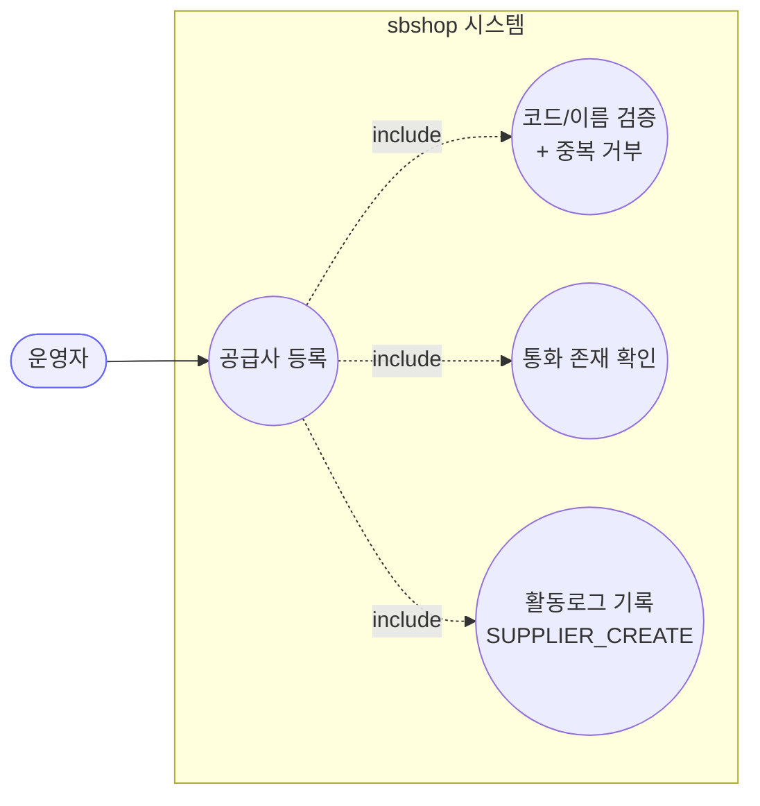
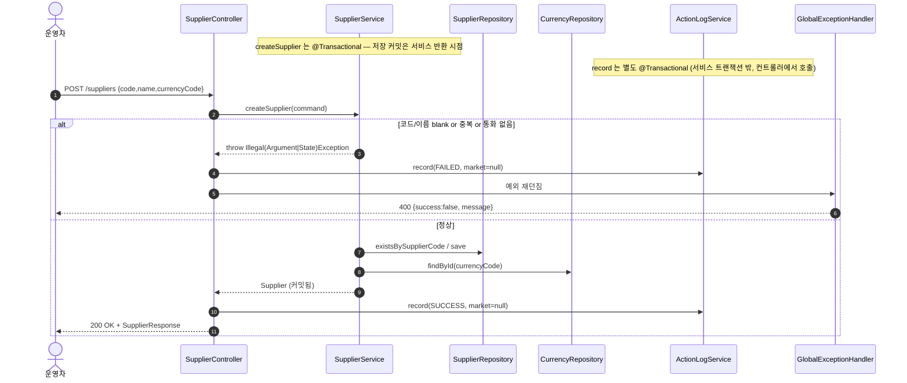

# POST /suppliers — 공급사 신규 등록

## 1. 개요

| 항목 | 내용 |
|------|------|
| **Method / URL** | `POST /api/v1/suppliers` (바디 `SupplierRequest`) |
| **목적** | 코드/이름 검증·중복 거부·통화 존재 확인 후 신규 `Supplier` 를 저장하고, 활동로그(SUPPLIER_CREATE)를 성공/실패로 기록한다. |
| **핵심 상태전이** | (신규 생성) → `Supplier(status=ACTIVE)` — BaseEntity 기본값 |
| **부수효과** | 공급사 1건 저장(`@Transactional`) + 활동로그 1건 기록(마켓 무관 → marketType=null) |
| **응답** | `200 OK` + `SupplierResponse` / 검증·중복 실패 시 `400`(GlobalExceptionHandler) |

## 2. 호출 체인

```
SupplierController.createSupplier(SupplierRequest)         api/.../controller/SupplierController.java:41-56
  ├─ SupplierRequest(supplierCode, supplierName, currencyCode)  api/.../controller/SupplierController.java:80  (@RequestBody, @Valid 없음)
  ├─ (try) SupplierService.createSupplier(CreateSupplierCommand)
  │        core/.../application/supplier/SupplierService.java:31-48   @Transactional (:31)
  │      ├─ supplierCode null/blank → IllegalArgumentException      :34-36
  │      ├─ supplierName null/blank → IllegalArgumentException      :37-39
  │      ├─ existsBySupplierCode → true → IllegalStateException     :41-43 (SupplierRepository.java:13)
  │      ├─ currencyRepository.findById(currencyCode) → empty → IllegalArgumentException  :44-45 (CurrencyRepository extends JpaRepository)
  │      └─ new Supplier(code,name,currency) → supplierRepository.save()  :46-47 (Supplier.java:30-34)
  ├─ ActionLogService.record(SUPPLIER_CREATE, null, SUCCESS, ...)  :48-49  (ActionLogService.java:27-41  @Transactional)
  ├─ SupplierResponse.from(supplier)                       :50 (SupplierResponse.java:19-27)
  └─ (catch Exception) record(SUPPLIER_CREATE, null, FAILED, ...) → throw  :51-55
       └─ GlobalExceptionHandler: IllegalArgument/IllegalState → 400  (GlobalExceptionHandler.java:36-50)
```

**요청 바디 (`SupplierRequest`, `SupplierController.java:80`)**

| 필드 | 타입 | 필수 | 검증 위치 |
|------|------|------|----------|
| `supplierCode` | String | 필수 | 서비스 :34-36 (null/blank 거부) + :41-43 (중복 거부) |
| `supplierName` | String | 필수 | 서비스 :37-39 (null/blank 거부) |
| `currencyCode` | String | 필수(존재해야 함) | 서비스 :44-45 (통화 미존재 시 거부) |

## 3. 유스케이스 다이어그램



## 4. 시퀀스 다이어그램



## 5. 순서도 (플로우차트)


## 6. 상태 전이표

| 진입 상태 | 조건 | 허용? | 결과 상태 | 부수효과 |
|-----------|------|:-----:|-----------|----------|
| (신규) | code/name 유효 + 미중복 + 통화 존재 | ✅ | `Supplier(ACTIVE)` 생성 | save + 활동로그 SUCCESS |
| (신규) | code/name blank | ❌ | 미생성 | 활동로그 FAILED, 400 |
| (신규) | 코드 중복 | ❌ | 미생성 | 활동로그 FAILED, 400 |
| (신규) | 통화 미존재 | ❌ | 미생성 | 활동로그 FAILED, 400 |

## 7. 🔎 발견사항

### SUP-2 · 🟠 GAP — 요청 바디 `@Valid`/`@NotNull` 부재로 null 바디 시 NPE 위험
- **근거:** `SupplierController.java:42-43` 은 `@RequestBody SupplierRequest request` 만 있고 `@Valid` 가 없다. 빈 JSON `{}` 이면 record 필드가 전부 null 로 바인딩되어 서비스가 null 을 blank 검증으로 거부하지만, **바디 자체가 없는** 요청은 `request` 가 null 이 되어 `request.supplierCode()`(:47) 접근에서 NPE → 500.
- **영향:** 바디 누락 요청이 400 대신 500(NPE)으로 응답. 또한 NPE 발생 시 catch 블록의 `request.supplierCode()`(:53)도 다시 NPE 를 던져 원 예외가 가려진다.
- **제안:** `@RequestBody(required = true)` 명시 또는 컨트롤러 진입부 null 가드. 필드 검증은 서비스가 담당하므로 바디 존재만 보장하면 충분.

### SUP-3 · 🟡 SMELL — 성공/실패 활동로그 try/catch 블록이 createCurrency 와 구조적으로 중복
- **근거:** `SupplierController.java:45-55`(createSupplier)와 `:67-77`(createCurrency)이 "try→서비스호출→record(SUCCESS)→return / catch→record(FAILED)→throw" 동일 패턴을 상수만 바꿔 반복한다.
- **영향:** 동작은 정상이나, 활동로그 기록 규약(마켓 null·성공/실패 메시지 포맷) 변경 시 두 곳을 동기 수정해야 한다.
- **제안:** 활동로그 데코레이션을 공통 헬퍼(또는 AOP/서비스 계층)로 추출해 컨트롤러 중복 제거.

### SUP-4 · 🔵 NOTE — 활동로그가 서비스 트랜잭션 밖(컨트롤러)에서 기록됨
- **근거:** `record(SUCCESS,...)`(`SupplierController.java:48`)는 `createSupplier` 반환(커밋) 이후 컨트롤러에서 호출되고, `ActionLogService.record`(`ActionLogService.java:27`)는 자체 `@Transactional`. 즉 공급사 저장과 활동로그는 별도 트랜잭션.
- **영향:** 저장은 커밋됐으나 활동로그 기록이 실패하면 로그만 누락(record 내부에서 예외를 삼킴, `ActionLogService.java:37-40`). 의도된 "본업 보호" 설계로 정합성 위험은 낮음.
- **제안:** 현행 유지 타당. 감사 추적이 강하게 요구되면 저장·로그를 동일 트랜잭션(서비스 내부 기록)으로 통합 검토.

## 8. 테스트 커버리지 메모

- **서비스 계층:** `SupplierServiceTest` 가 통화 해석 후 저장(`createSupplier_resolvesCurrency_andSaves` :98-109), 통화 미존재 거부(:113-120), code/name blank 거부(:124-142), 중복 코드 거부(:146-153)를 모두 커버.
- **비어있는 케이스:** ① 컨트롤러 계층의 활동로그 SUCCESS/FAILED 기록 검증(record 호출 여부·marketType=null) 없음, ② `@RequestBody` null 바디(SUP-2) 경로 테스트 없음, ③ 웹 슬라이스에서의 400 매핑(GlobalExceptionHandler) end-to-end 검증 없음.

---
*생성: 2026-07-17 · 근거: 현재 워킹트리*
